% Vulkan Tutorial
% Alexander Overvoorde
% October 2022

# 介绍

## 关于

本教程将教您使用 [Vulkan](https://www.khronos.org/vulkan/) 图形和计算 API 的基础知识。 Vulkan 是 [Khronos group](https://www.khronos.org/) 小组（以 [OpenGL](https://en.wikipedia.org/wiki/OpenGL) 闻名）的一个新 API， 
 它提供了更好的现代显卡抽象应用接口。与 [OpenGL](https://en.wikipedia.org/wiki/OpenGL) 和 [Direct3D](https://en.wikipedia.org/wiki/Direct3D) 等现有图形 API 相比，这个新接口允许您更好地描述您的应用程序打算做什么，这可以带来更好的性能和更少令人惊讶的驱动程序行为。优势，允许您同时为 Windows、Linux 和 Android 进行开发。 
Vulkan 背后的想法与 [Direct3D 12](https://en.wikipedia.org/wiki/Direct3D#Direct3D_12) 和 [Metal](https://en.wikipedia.org/wiki/Metal_(API)) 的想法相似，但 Vulkan 具有完全跨平台的优势，允许您同时为 Windows、Linux 和 Android 进行开发。

 

但是，您为这些好处付出的代价是您必须使用更加冗长的 API。 与图形 API 相关的每个细节都需要由您的应用程序从头开始设置，包括初始帧缓冲区创建和缓冲区和纹理图像等对象的内存管理（正文部分将对这些概念详细展开）。 图形驱动程序将减少很多手持操作，这意味着您必须在应用程序中做更多的工作以确保正确的行为。

Vulkan的特性并不适合所有人。 它针对的是对高性能计算机图形充满热情并愿意投入一些工作的程序员。如果您对游戏开发而不是计算机图形更感兴趣，那么您可能希望坚持使用 OpenGL （基于软件逻辑状态机设计的图像渲染接口，支持windows、linux、max、android，接口较为简单） 或 Direct3D （windows下图像渲染接口），这些技术不会很快被 Vulkan 弃用。 另一种选择是使用像 [Unreal Engine](https://en.wikipedia.org/wiki/Unreal_Engine#Unreal_Engine_4)这样的引擎，它们将能使用 Vulkan，同时向您提供更高级别的 API。

为减少学习障碍，让我们介绍一些学习本教程的先决条件：

* 一张计算机显卡以及支持Vulkan接口的显卡驱动程序 ([NVIDIA](https://developer.nvidia.com/vulkan-driver), [AMD](http://www.amd.com/en-us/innovations/software-technologies/technologies-gaming/vulkan), [Intel](https://software.intel.com/en-us/blogs/2016/03/14/new-intel-vulkan-beta-1540204404-graphics-driver-for-windows-78110-1540), [Apple Silicon (Or the Apple M1)](https://www.phoronix.com/scan.php?page=news_item&px=Apple-Silicon-Vulkan-MoltenVK))
* C++基础知识 (熟悉资源获取即初始化，初始化列表)
* 支持c++17特性的编译器 (Visual Studio 2017+, GCC 7+, 或 Clang 5+)
* 一些3D计算机图形学基础知识

本教程不要求您了解 OpenGL 或 Direct3D 概念，但要求您了解 3D 计算机图形学的基础知识。 例如，它不会解释透视投影背后的数学。 有关计算机图形学概念的精彩介绍，请参阅[相关在线书籍](https://paroj.github.io/gltut/)。 其他一些很棒的计算机图形资源教程是：
* [一周学会光线追踪](https://github.com/RayTracing/raytracing.github.io)
* [基于物理的真实环境渲染](http://www.pbr-book.org/)
* 基于Vulkan引擎的[雷神之锤](https://github.com/Novum/vkQuake)与[毁灭公爵3](https://github.com/DustinHLand/vkDOOM3)的开源游戏项目。

如果您愿意，您可以使用 C 而不是 C++，但您必须使用不同的线性代数库，并且您将在代码结构方面靠自己。我们将使用类和 RAII 等 C++ 特性来组织逻辑和资源生命周期。本教程还有一个可供 Rust 开发人员使用的[替代版本](https://github.com/bwasty/vulkan-tutorial-rs)。

为了让使用其他编程语言的开发人员更容易理解，并获得一些使用基本 API 的经验，我们将使用原始 C API 来使用 Vulkan。 但是，如果您使用 C++，您可能更喜欢使用较新的 [Vulkan-Hpp 封装](https://github.com/KhronosGroup/Vulkan-Hpp)，这些绑定抽象了一些冗余的工作并有助于防止某些类别的错误。

## 电子书

如果您更喜欢以电子书的形式阅读本教程，则可以在此处下载 EPUB 或 PDF 版本： 

* [EPUB](https://raw.githubusercontent.com/Overv/VulkanTutorial/master/ebook/Vulkan%20Tutorial%20ch.epub)
* [PDF](https://raw.githubusercontent.com/Overv/VulkanTutorial/master/ebook/Vulkan%20Tutorial%20ch.pdf)

## 教程概述

我们将通过一个实例概述 Vulkan 的工作原理。实例很简单，在屏幕画一个三角形。 在您了解了它们在整个绘画中的基本作用之后，所有较小步骤的目的将更有意义。 接下来，我们将使用 [Vulkan SDK](https://lunarg.com/vulkan-sdk/)、[GLM 库](http://glm.g-truc.net/) 设置开发环境用于线性代数运算，[GLFW](http://www.glfw.org/) 用于创建窗口。 本教程将介绍如何在 Windows 上使用 Visual Studio 和在 Ubuntu Linux 上使用 GCC 进行项目配置。 

之后，我们将实现 Vulkan 程序的所有基本组件来渲染第一个三角形。 每一章将大致遵循
以下结构： 
* 介绍一个新概念及其目的
* 使用相关概念的 API 调用将其集成到您的程序中
* 将抽象的组织逻辑用函数封装

尽管每一章都是作为前一章的后续内容编写的，但也可以将这些章节作为介绍某个 Vulkan 功能的独立文章阅读。 这意味着该站点也可用作参考。 所有 Vulkan 函数和类型都与规范相关联，因此您可以单击它们以了解更多信息。 Vulkan 是一个非常新的 API，因此规范本身可能存在一些不足之处。 我们鼓励您提交反馈到[Khronos组织](https://github.com/KhronosGroup/Vulkan-Docs)。 

如前所述，Vulkan API 有一个相当冗长的 API，其中包含许多参数，可让您最大限度地控制图形硬件。 这会导致诸如创建纹理之类的基本操作需要执行很多步骤，而这些步骤每次都必须重复。因此，我们将在整个教程中创建自己的简化函数集合。 

每章的结尾都将附有一个指向该点之前的完整代码列表的链接。如果您对代码的结构有任何疑问，或者您正在处理一个错误并想要进行比较，您可以参考它。所有代码文件都已在多家供应商的显卡上进行了测试，以验证其正确性。每章末尾还有一个评论部分，您可以在其中提出与特定主题相关的任何问题。请反馈您的平台、驱动程序版本、源代码、预期状态和实际状态以
便我们能帮助到你。 

本教程旨在为开源社区做出贡献。 Vulkan 仍然是一个非常新的 API，还没有真正建立最佳实践。 如果您对教程和网站本身有任何类型的反馈，请不要犹豫，向 [GitHub 存储库](https://github.com/Overv/VulkanTutorial) 提交问题或拉取请求。您可以 * 观看 * 存储库以收到教程更新的通知。 

在你完成了绘制你的第一个基于Vulkan的屏幕三角形，我们将开始扩展程序内容，包括线性变换、纹理和 3D 模型。 

如果您以前使用过图形 API，那么您应该知道在第一个几何图形出现在屏幕上之前可能需要执行很多步骤。 Vulkan 中有许多这样的初始步骤，但您会发现每个单独的步骤都很容易理解并且不会觉得多余。 同样重要的是要记住，一旦你有了那个看起来很无聊的三角形，绘制带有完整纹理的 3D 模型并不需要额外的工作，其中的每一步都更具有意义。

如果您在学习本教程时遇到任何问题，请先查看常见问题解答，看看您的问题及其解决方案是否已在此处列出。 如果您在那之后仍然卡住，请随时在最接近的相关章节的评论部分寻求帮助。

准备好深入了解高性能图形 API 的未来了吗？[开始吧!](#overview)


# 概述

本章将首先介绍 Vulkan 及其解决的问题。 之后，我们展示绘制一个三角形所需操作。 这个实例将为您了解后续章节提供一个宏观的介绍。我们还将总结 Vulkan API 结构及其一般的使用模式。 

## Vulkan的起源

就像之前的图形 API 一样，Vulkan 被设计为基于 [GPU] (https://en.wikipedia.org/wiki/Graphics_processing_unit) 的跨平台抽象接口。相比之下，之前的大多数图像 API 的问题在于，设计它们时所处的时代是基于图形硬件特色的，被限于可配置的固定功能。 程序员必须以标准格式提供顶点数据，并且在照明和着色选项方面受制于 GPU 制造商实际功能。

随着显卡架构的成熟，它们开始提供越来越多的可编程功能。所有这些新功能都必须以某种方式与现有 API 集成。这导致了不太理想的功能抽象和庞杂的图形驱动程序。这种情况下，程序员只能已猜测的方式将意图映射到现代图形架构上实现。这就是为什么会有如此多的驱动程序更新来提高游戏性能，有时甚至会带来明显的性能提升。然而，由于这些驱动程序的复杂性，应用程序开发人员还需要处理供应商之间的不一致问题，例如[着色器](https://en.wikipedia.org/wiki/Shader)所接受的语法。除了这些新功能外，过去十年还出现了大量具有强大图形硬件的移动设备。这些移动 GPU 根据其能量和空间要求具有不同的架构。为程序员提供更多可编程的控制能够有效改善GPU性能表现，例如[瓦片渲染](https://en.wikipedia.org/wiki/Tiled_rendering)。旧时代 API 的另一个问题是对的多线程支持程度有限，这可能导致 CPU 端出现瓶颈。

Vulkan 基于现代图形架构设计，从根本上解决了这些问题。 它通过允许程序员使用更详细的 API 清楚地指定他们的意图来减少驱动程序开销，并允许多个线程并行创建和提交命令。它通过使用单个编译器切换到标准化字节码格式来减少着色器编译造成的不一致问题。 最后，作为单一API，它整合了图形渲染与计算功能于一身，实现了现代显卡的通用处理能力。 


## 绘制三角形需要哪些操作

现在，我们将概述在 Vulkan 程序中渲染三角形所需的所有步骤。这里介绍的所有概念都将在接下来的章节中详细阐述。 这里的描述只是为给您一个展示各关联模块的宏观逻辑。 

### 步骤 1 - 实例和物理设备选择

Vulkan 应用程序首先通过 VkInstance 设置 Vulkan API。 通过描述应用程序和API 扩展来可以创建一个实例。 创建实例后，您可以查询 Vulkan 支持的硬件并选择一个或多个 VkPhysicalDevices 用于操作。 您可以查询 VRAM 大小或设备功能等属性，以选择所需的设备，例如使用专用独立显卡。

### 步骤 2 - 逻辑设备和队列族

选择要使用的正确硬件设备后，您需要创建一个 VkDevice（逻辑设备），在其中更具体地描述您将使用的 VkPhysicalDeviceFeatures，例如多视口渲染和 64 位浮点数。您还需要指定要使用的队列族。 大多数使用 Vulkan 执行的操作，例如绘制命令和内存操作，都是通过将它们提交到 VkQueue 来异步执行的。  Q队列是从队列族中分配的，其中每个队列族在其队列中支持一组特定的操作。  例如，图形、计算和内存传输操作可能有单独的队列族。队列族的可用性也可以用作物理设备选择中的一个关键因素。支持 Vulkan 的设备可能不提供任何图形功能，但是今天支持 Vulkan 的所有显卡一般都支持我们感兴趣的所有队列操作。

### 步骤 3 - 窗口表面和交换链

除非您只对离屏渲染感兴趣，否则您将需要创建一个窗口来呈现渲染图像结果。 可以使用本机窗口系统的 API 或 其他跨平台窗口库[GLFW](http://www.glfw.org/) 和 [SDL](https://www.libsdl.org/) 等库来创建窗口。我们将在本教程中使用 GLFW库，并在下一章进行详细介绍。 

我们需要另外两个组件来实际渲染到一个窗口：一个窗口表面（VkSurfaceKHR）和一个交换链（VkSwapchainKHR）。 请注意 KHR 后缀，这意味着这些对象是 Vulkan 扩展的一部分。 Vulkan API 本身完全与操作系统窗口无关，这就是为什么我们需要使用标准化的 WSI（窗口系统接口）扩展来与窗口管理器进行交互。 表面是要渲染到的窗口的跨平台抽象，通常通过提供对本机操作系统窗口句柄的引用来实例化，例如 Windows 上的 HWND。 幸运的是，GLFW 库有一个内置函数来处理平台特定的细节。 

交换链是渲染目标的集合。它的基本作用是确保我们当前渲染的图像不同于当前屏幕上的显示图像。因为这对确保屏幕只显示完整的图像很重要。每次我们想要绘制一个画面时，我们都必须要求交换链为我们提供要渲染的图像目标内容。当我们画完一帧后，图像保存在换链存储区中，以便在某个时间点切换并呈现在屏幕上。渲染目标的数量和将完成的图像呈现到屏幕上的条件取决于显示模式。常见的显示模式包括双缓冲 (vsync) 和三重缓冲。 我们将在交换链创建章节中研究这些。 

某些系统平台允许您直接渲染到显示器，不通过窗口缓冲管理器交互，无需使用 VK_KHR_display 和 VK_KHR_display_swapchain 扩展。 例如，这些系统平台允许您创建一个代表整个屏幕的表面，并可用于实现您自己的窗口管理器。 

### 步骤 4 - 图片视图与帧缓冲区

要绘制从交换链获取的图像，我们必须将其封装到 VkImageView 和 VkFramebuffer 中。 图像视图引用要使用的图像的特定关注部分，帧缓冲区则引用图像视图中关于颜色、深度和模板的部分。因为交换链中可能有多个不同的图像，我们需要预先为每个图像先创建一个图像视图和帧缓冲区，然后在绘制时选择正确的那一个。 

### 步骤 5 - 渲染通道

Vulkan 中的渲染通道描述了在渲染操作期间使用的图像类型、它们将如何使用以及应该如何处理它们的内容。 在我们最初的三角形渲染应用程序中，我们将告诉 Vulkan 我们将使用单个图像作为颜色目标，并且我们希望在绘制操作之前将其清除为纯色。渲染过程仅描述图像的类型，通过对 VkFramebuffer 槽参数设置，从而间接关联到其绑定的对应图像。


### 步骤 6 - 图形管线（graphics pipeline）

Vulkan 中的图形管道是通过创建 VkPipeline 对象来设置的。 它描述了显卡的可配置状态，例如视口大小、深度缓冲区操作以及使用 VkShaderModule 对象的可编程状态。 VkShaderModule 对象是从着色器字节码创建的。 驱动程序还需要知道管道中将使用哪些渲染目标，我们通过引用渲染通道（render pass）来指定。

与现有的其他图形 API 相比，Vulkan 最显着的特点之一是图形管线的几乎所有配置都需要提前设置。这意味着如果你想切换到不同的着色器或稍微改变你的顶点布局，那么你需要重新创建图形管线。这意味着您必须提前为渲染操作所需的所有不同组合创建许多 VkPipeline 对象。 只有一些基本配置，如视口大小和清晰颜色，可以动态更改。所有的状态也需要明确描述，例如没有默认的颜色混合状态。

好消息是，对于等效操作，由于您执行的是提前编译而非即时编译，因此驱动程序有更多优化机会，并且运行时性能可预测更好，因为大的状态变化，例如切换到不同的图形管线将变得非常明确。

### 步骤 7 - 命令池和命令缓冲区

如前所述，Vulkan 中很多我们想要执行的操作，比如绘图操作，都需要提交到队列中。这些操作首先需要记录到 VkCommandBuffer 中才能提交。这些命令缓冲区是从与特定队列族(queue family)关联的 VkCommandPool 分配的。要绘制一个简单的三角形，我们需要记录一个命令缓冲区，其操作如下：

* 开始一个渲染通道（render pass）
* 将渲染通道绑定到图形管线（graphics pipeline）
* 绘制三顶点
* 结束渲染通道（render pass）

因为帧缓冲区中的图像来自交换链将给我们的具体图像，所以我们需要为每个可能的图像记录一个命令缓冲区，并在绘制时选择正确的一个。 另一种方法是每帧单独记录命令缓冲区，但这种方式效率不高。

### 步骤 8 - 主循环

现在绘图命令已被封装到命令缓冲区中，主循环就非常简单了。 我们首先使用 vkAcquireNextImageKHR 从交换链中获取图像。 然后我们可以为该图像选择适当的命令缓冲区并使用 vkQueueSubmit 执行它。 最后，我们将图像返回到交换链，以便使用 vkQueuePresentKHR 呈现到屏幕上。

提交到队列的操作是异步执行的，提交操作会立即返回。因此，我们必须使用信号量等同步对象来确保程序的正确执行顺序。命令缓冲区需要设置等待条件，必须等到图像内容采集读取完成，而后才能开始对图像进行绘制操作，否则读取与渲染操作同时进行，前时刻渲染结果与当前渲染结果可能会同时显示在屏幕上。同样的，vkQueuePresentKHR 画面显示也需要等待渲染完成，为此我们将使用第二个信号量待渲染完成后发出。

### 总结

这纠缠的逻辑应该让您对绘制第一个三角形的工作有一个基本的了解。完整的真实程序包含更多步骤，例如分配顶点缓冲区、创建统一缓冲区和上传纹理图像，这些步骤将在后续章节中介绍，但我们将从简单开始，因为 Vulkan 有陡峭的学习曲线。 请注意，最初的例子我们会将顶点坐标直接嵌入写到顶点着色器中，而不是使用顶点缓冲区。 这是因为管理顶点缓冲区需要先熟悉命令缓冲区。 

简而言之，绘制第一个三角形我们需要如下步骤：

* 创建一个VkInstance对象
* 选择合适的显卡设备(VkPhysicalDevice)
* 创建逻辑设备VkDevice和命令队列VkQueue来绘制和显示
* 创建一个窗体对象、窗体绘制面和交换链
* 将交换链种的图像对象封装到图像视图中VkImageView
* 创建一个渲染通道render pass用以指明渲染目标和用途
* 为渲染通道创建帧缓冲区
* 设置图像管线
* 为每一个绘制图像分配命令缓冲区并指明绘制操作
* 获取图像并绘制，提交正确的绘制命令并将绘制结果换回给交换链并用于显示

这包括了很多步骤，但每个单独步骤的目的将在接下来的章节中变得非常简单明了。如果你对单个步骤与整个程序的关系感到困惑，你应该回到本章了解步骤说明。

## API 概念

下面将简要概述如何在底层使用 Vulkan API 构建应用。

### 编码规范

所有 Vulkan 函数、枚举和结构都定义在 vulkan.h 头文件中，该头文件包含在 LunarG 开发的 [Vulkan SDK](https://lunarg.com/vulkan-sdk/) 中。 我们将在下一章中研究如何安装这个 SDK。 

函数有一个小写的`vk`前缀，像枚举和结构这样的类型有一个`Vk`前缀，枚举值有一个`VK_`前缀。 API 大量使用结构来为函数提供参数。 例如，创建对象通常遵循以下模式： 

```c++
VkXXXCreateInfo createInfo{};
createInfo.sType = VK_STRUCTURE_TYPE_XXX_CREATE_INFO;
createInfo.pNext = nullptr;
createInfo.foo = ...;
createInfo.bar = ...;

VkXXX object;
if (vkCreateXXX(&createInfo, nullptr, &object) != VK_SUCCESS) {
    std::cerr << "failed to create object" << std::endl;
    return false;
}
```

Vulkan 中的许多结构都要求您明确指定`sType` 成员中的结构。 `pNext` 成员可以指向扩展结构，并且在本教程中始终为 `nullptr`。 创建或销毁对象的函数将具有 VkAllocationCallbacks 参数，该参数允许您使用自定义分配器来分配驱动程序内存，在本教程中也将保留为 `nullptr`。 

几乎所有函数都返回一个 VkResult，它要么是“VK_SUCCESS”，要么是错误代码。该规范描述了每个函数可以返回哪些错误代码以及它们的含义。 

### 验证层

如前所述，Vulkan 专为高性能和减少驱动程序开销而设计。 因此，默认情况下它将包括非常有限的错误检查和调试功能。 如果您做错了什么，驱动程序通常会崩溃而不是返回错误代码，或者更糟，它可能在您的显卡上能够正常运行而在其他显卡上则会失败。 

Vulkan 允许您通过称为*验证层*的功能启用广泛的检查。 验证层是可以插入 API 和图形驱动程序之间的代码片段，用于对函数参数运行额外检查和跟踪内存管理问题。 好处是您可以在开发过程中启用它们，然后在发布应用程序时完全禁用它们以实现零开销。 任何人都可以编写自己的验证层，而 LunarG 的 Vulkan SDK 提供了一组标准的验证层，我们将在本教程中使用它们。 您还需要注册一个回调函数来接收来自层的调试消息。 

因为 Vulkan 对每个操作都非常明确，验证层的可扩展性很强，所以与 OpenGL 和 Direct3D 相比，Vulkan更容易排查错误，比如有些时候为什么你的屏幕显示会是黑色的！ 

在我们开始编写代码实践之前只有一步，那就是[设置开发环境](#设置开发环境)。 


# 开发环境

这一章节我们将设置 Vulkan 应用程序的开发环境并安装一些有用的库。 除了编译器，这里提到的所有库工具，都可在 Windows、Linux 和 MacOS 等系统下使用，但安装它们的步骤略有不同，下文将针对不同的系统平台分开进行描述。

## Windows系统

对于Windows平台开发者而言，本文描述使用Windows平台开发工具Visual Studio来编译代码。为了支持C++17特性，至少需要Visual Studio 2017(VS 2017)或更高的版本。下文描述的步骤是为VS 2017编写的。

### Vulkan SDK


开发Vulkan应用程序最关键的组件就是Vulkan SDK本身了。它包括头文件、标准验证层、调试工具和Vulkan 函数加载器。函数加载器负责在运行时加载对应驱动程序的功能函数，如果你熟悉OpenGL的话，这就像GLEW（下文将介绍）对于OpenGL的作用。


Vulkan SDK能够在官方网站下载[LunarG](https://vulkan.lunarg.com/) ，只需点击页面底部的下载按钮即可。你不必注册账户，但拥有账户可以让你访问一些额外的文档资料，这也许对你有用。


双击Vulkan安装包开始安装，需要注意Vulkan的安装目录位置。安装完毕后要做的第一件事就是确认你的显卡和驱动程序是否支持Vulkan。到Vulkan SDK的安装目录，转到`Bin`文件夹，运行 `vkcube.exe`示例. 你将会看到如下程序运行效果:


如果收到错误信息，请确认你的显卡驱动是否做了有效更新，还需要确认显卡设备是否支持Vulkan运行环境。请转到[介绍章节](#introduction) 查询支持Vulkan的设备制造商列表。

在`Bin`文件夹下还有一些对开发者非常有用的开发工具。程序`glslangValidator.exe` 和 `glslc.exe` 可以用来实现渲染程序
[GLSL](https://en.wikipedia.org/wiki/OpenGL_Shading_Language) 的字节码编译。我们将在 
[渲染模块](#shader-modules)
章节中详细说明. `Bin` 同样包括了Vulkan 加载器和验证层的二进制程序，而`Lib`文件夹则包括了库程序.

最后，`Include`文件夹包含了Vulkan的头文件。SDK还包括其它一些文件，请自行查阅，但在本教程我们并未提到它们.

### GLFW

正如前面提到的，Vulkan 本身是一个跨平台的GPU渲染、计算应用程序接口。
但Vulkan无法创建显示窗体来显示渲染或计算结果。在不同的平台环境下需要调用不同的系统接口创建显示窗体。 
得益于Vulkan的跨平台特性，为了避免调用复杂的Win32窗体调用接口。 我们使用[GLFW 库](http://www.glfw.org/) 来创建显示窗体。GLFW库支持Windows, Linux 和 MacOS等系统窗体的管理调用. 还有其他一些库来实现这一功能，如[SDL](https://www.libsdl.org/), 而GLFW的优点在于，除了窗口创建之外，它还抽象出 Vulkan 中其他一些平台关联的接口。

你能在GLFW的官方网站下载最新版本[official website](http://www.glfw.org/download.html)。 在本教程中我们使用的是64位版本，但如果你创建的是32位版本，请下载使用32位程序。如果创建32位程序，也还请确认链接Vulkan库程序时使用`Lib32`文件夹的内容而不是`Lib`文件夹下的内容。下载完毕后，解压到一个方便使用的位置。我惯用的位置是在Visual Studio安装目录文档文件夹下创建一个`Libraries`文件夹。

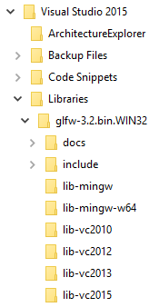

### GLM

与 DirectX 12 不同，Vulkan 不包含用于线性代数运算的库，因此我们必须下载一个。 
[GLM](http://glm.g-truc.net/) 是一个很好的线性代数运算库，旨在与图形 API 一起使用，并且通常与 OpenGL 一起使用。 

GLM 是一个只有头文件的库，所以只需下载 [最新版本](https://github.com/g-truc/glm/releases)
并将其存放在方便的位置。 您现在应该有一个如下图所示的目录结构： 

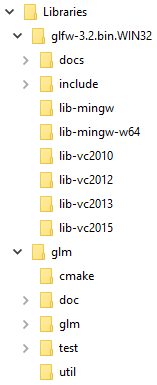

### 设置Visual Studio

现在您已经安装了所有依赖项，我们可以为 Vulkan 设置一个基本的 Visual Studio 项目并编写一些代码以确保一切正常。 

启动 Visual Studio ，选中“Windows 桌面向导”，输入名称按“确定”创建一个新的项目。 

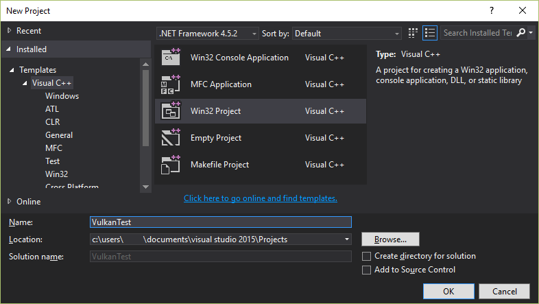

确保选择 `Console Application (.exe)` 作为应用程序类型，以便我们可以打印调试消息，并检查 `Empty Project` 勾选，防止 Visual Studio 添加样板代码。 

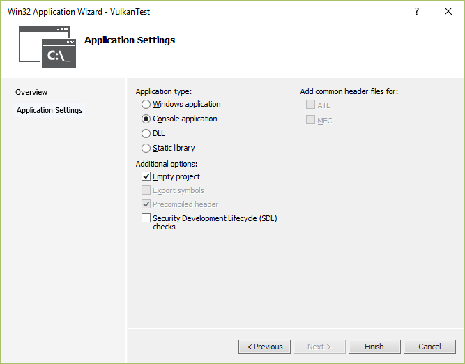

按“确定”创建项目即完成了 C++ 源文件的创建。 你很可能已经这一步操作，但为了完整起见，此处包含了这些步骤的说明。 


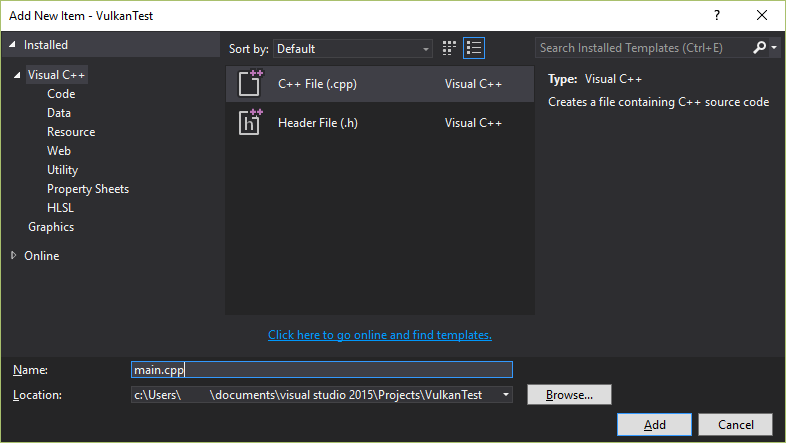

将以下代码添加到创建的项目文件中。 即使现在不理解这些代码也没有关系； 这些代码只是确保您可以编译和运行 Vulkan 应用程序。 我们将在下一章从头开始介绍代码对应的概念和原理。 

```c++
#define GLFW_INCLUDE_VULKAN
#include <GLFW/glfw3.h>

#define GLM_FORCE_RADIANS
#define GLM_FORCE_DEPTH_ZERO_TO_ONE
#include <glm/vec4.hpp>
#include <glm/mat4x4.hpp>

#include <iostream>

int main() {
    glfwInit();

    glfwWindowHint(GLFW_CLIENT_API, GLFW_NO_API);
    GLFWwindow* window = glfwCreateWindow(800, 600, "Vulkan window", nullptr, nullptr);

    uint32_t extensionCount = 0;
    vkEnumerateInstanceExtensionProperties(nullptr, &extensionCount, nullptr);

    std::cout << extensionCount << " extensions supported\n";

    glm::mat4 matrix;
    glm::vec4 vec;
    auto test = matrix * vec;

    while(!glfwWindowShouldClose(window)) {
        glfwPollEvents();
    }

    glfwDestroyWindow(window);

    glfwTerminate();

    return 0;
}
```

现在让我们配置项目以消除编译错误。 打开项目属性对话框并确保选择了“所有配置”，因为这里的设置内容同时适用于“debug”和“release”模式。 


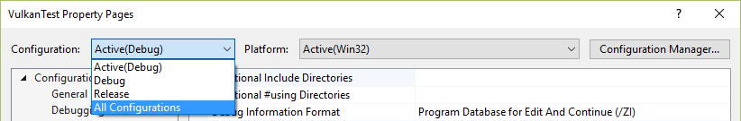

转到`C++ -> General -> Additional Include Directories`，然后在下拉框中按`<Edit...>`。 

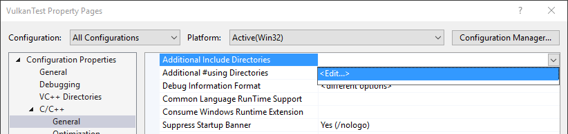

为 Vulkan、GLFW 和 GLM 添加头目录：

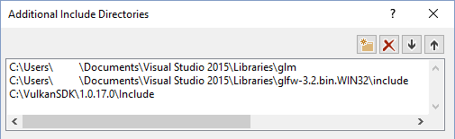

接下来，打开 `Linker -> General` 下的库目录编辑器： 

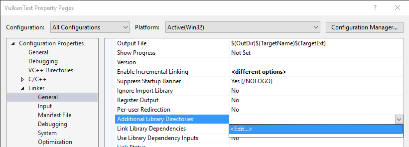

添加 Vulkan 和 GLFW 的目标文件的位置： 

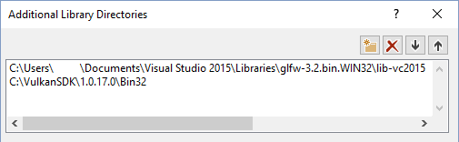

转到 `Linker -> Input` 并在 `Additional Dependencies` 下拉框中按 `<Edit...>`。 

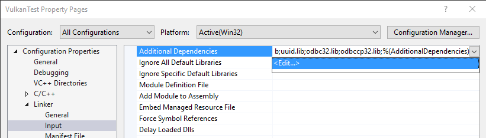

输入 Vulkan 和 GLFW 目标文件的名称： 


最后更改编译器设置使用 C++17 版本： 

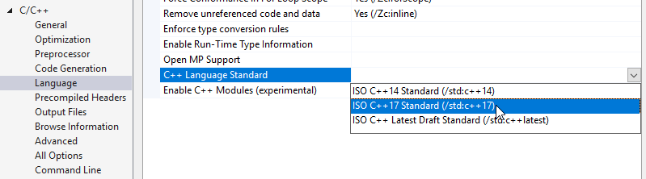

您现在可以关闭项目属性对话框。 如果你做的一切都是正确的，那么你应该不会再看到Visual Studio提示的代码错误。 

最后，确保您实际上是在 64 位模式下编译：


按`F5`编译并运行项目，你应该会看到一个命令提示符和一个像这样的窗口： 

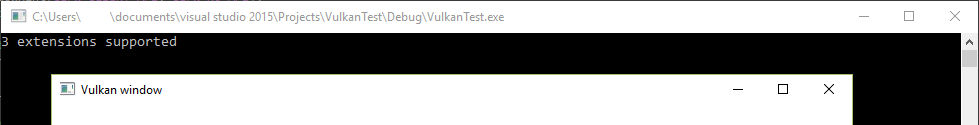

如果扩展特性的数量不为零，恭喜，您已准备好玩[Vulkan](#base-code)了！

## Linux

本节的配置说明适用于 Ubuntu、Fedora 和 Arch Linux 等系统的用户，但您也可以根据
本文的Linux包管理器的安装命令更改为适合您使用的Linux系统的命令。 您应该有一个支持 C++17（GCC 7+ 或 Clang 5+）的编译器。 您还需要`make`编译工具。

### Vulkan 安装

在 Linux 上开发 Vulkan 应用程序所需的最重要组件是 Vulkan 加载程序、验证层和几个命令行实用程序，用于测试您的机器是否支持 Vulkan。安装命令如下： 

* `sudo apt install vulkan-tools` 或 `sudo dnf install vulkan-tools`: 命令行实用程序。安装完毕后可运行`vulkaninfo` 和 `vkcube`以确认您的机器支持 Vulkan。 
* `sudo apt install libvulkan-dev` 或 `sudo dnf install vulkan-loader-devel` : 安装 Vulkan 加载程序。 加载程序在运行时查找驱动程序中的函数，类似于 OpenGL中的GLEW - 如果您熟悉这些的话。
* `sudo apt install vulkan-validationlayers-dev spirv-tools` 或 `sudo dnf install mesa-vulkan-devel vulkan-validation-layers-devel`: 安装标准验证层和所需的 SPIR-V 工具。 这些在调试 Vulkan 应用程序时至关重要，我们将在下一章讨论它们。 

在 Arch Linux 系统上，您可以运行 sudo pacman -S vulkan-devel 来安装上述所有必需的工具。 

如果安装成功，您应该已配置好 Vulkan 部分。 请记住运行 `vkcube` 并确保您在窗口中看到以下弹出窗口： 


如果您收到错误消息，请确保您的驱动程序是最新的，包括 Vulkan 运行时版本与您使用显卡的支持性。 请参阅 [介绍章节](#introduction) 以获取主要供应商的驱动程序链接。 

### GLFW

如前所述，Vulkan 本身是一个与平台无关的 API，它没有用于创建显示渲染结果窗口的方法。 为了使用 Vulkan 跨平台特性，并同时避免调用复杂的 Linux系统 X11 窗口管理接口，我们将使用 [GLFW 库](http://www.glfw.org/) 创建一个窗口，它同时支持 Windows、Linux 和 苹果系统。有其他库可用于此目的，例如 [SDL](https://www.libsdl.org/) ，但 GLFW 的优势在于它除了窗口创建，还抽象了 Vulkan 中的一些其他特定于平台的东西。 

我们将通过以下命令安装 GLFW： 

```bash
sudo apt install libglfw3-dev
```
或
```bash
sudo dnf install glfw-devel
```
或
```bash
sudo pacman -S glfw-wayland # glfw-x11 for X11 users
```

### GLM

与 DirectX 12 不同，Vulkan 不包含用于线性代数运算的库，因此我们必须下载一个。 
[GLM](http://glm.g-truc.net/) 是一个很好的线性代数运算库，旨在与图形 API 一起使用，并且通常与 OpenGL 一起使用。 

它是一个只有头文件的库，可以通过 `libglm-dev` 或`glm-devel` 包安装获取： 

```bash
sudo apt install libglm-dev
```
或
```bash
sudo dnf install glm-devel
```
或
```bash
sudo pacman -S glm
```

### 着色器编译器

着色器编译器[GLSL](https://en.wikipedia.org/wiki/OpenGL_Shading_Language) 负责将人们可读的渲染程序编译为字节码。

两种流行的着色器编译器是 Khronos Group 的 `glslangValidator` 和 Google 的 `glslc`。 后者具有熟悉的 GCC 和 Clang 类用法，因此我们使用后者：在 Ubuntu 上，下载 Google 的 [非官方二进制文件] (https://github.com/google/shaderc/blob/main/downloads.md ) 并将 `glslc` 复制到您的 `/usr/local/bin`。 请注意，根据您的权限，您可能需要 `sudo`。 在 Fedora 上使用`sudo dnf install glslc`，而在 Arch Linux 上运行`sudo pacman -S shaderc`。 运行`glslc`测试，它应该会提示缺少输入文件错误： 

`glslc: error: no input files`

我们将在 [Shader 编译器](#shader-modules) 章节中深入介绍 `glslc`。 

### 配置工程文件

现在您已经安装了所有依赖项，我们可以为 Vulkan 设置一个基本的 makefile 项目并编写一些代码以确保一切正常。 

在方便的位置创建一个名为“VulkanTest”的新目录。 创建一个名为 `main.cpp` 的源文件并插入以下代码。 不要担心现在无法理解这些代码； 我们只是确保您可以编译和运行 Vulkan 应用程序。 我们将在下一章从头开始讲解。 

```c++
#define GLFW_INCLUDE_VULKAN
#include <GLFW/glfw3.h>

#define GLM_FORCE_RADIANS
#define GLM_FORCE_DEPTH_ZERO_TO_ONE
#include <glm/vec4.hpp>
#include <glm/mat4x4.hpp>

#include <iostream>

int main() {
    glfwInit();

    glfwWindowHint(GLFW_CLIENT_API, GLFW_NO_API);
    GLFWwindow* window = glfwCreateWindow(800, 600, "Vulkan window", nullptr, nullptr);

    uint32_t extensionCount = 0;
    vkEnumerateInstanceExtensionProperties(nullptr, &extensionCount, nullptr);

    std::cout << extensionCount << " extensions supported\n";

    glm::mat4 matrix;
    glm::vec4 vec;
    auto test = matrix * vec;

    while(!glfwWindowShouldClose(window)) {
        glfwPollEvents();
    }

    glfwDestroyWindow(window);

    glfwTerminate();

    return 0;
}
```

接下来，我们将编写一个 makefile 来编译和运行这个基本的 Vulkan 代码。 创建一个名为“Makefile”的新空文件。 我假设你已经对 makefile 有一些基本的经验，比如变量和规则是如何工作的。 如果没有，您可以通过 [本教程] (https://makefiletutorial.com/) 快速上手。 

我们将首先定义几个变量来简化文件的其余部分。 定义一个 `CFLAGS` 变量，它将指定基本的编译器标志： 

```make
CFLAGS = -std=c++17 -O2
```

我们将使用现代版本的 C++ 语言 (`-std=c++17`)，并将优化级别设置为 O2。 我们可以删除 -O2 以更快地编译程序，但我们应该记住在构建发布版本应将优化级别设置为 O2 或更高。 

类似的，在 `LDFLAGS` 变量中定义链接器需要使用的库： 

```make
LDFLAGS = -lglfw -lvulkan -ldl -lpthread -lX11 -lXxf86vm -lXrandr -lXi
```

标志 `-lglfw` 对应 GLFW，`-lvulkan` 与 Vulkan 函数加载器链接，其余标志是 GLFW 需要的低级系统库。 这些低级系统库是 GLFW 本身的依赖项：包括线程和窗口管理等。 

指定编译 `VulkanTest` 的规则很简单。 确保使用制表符而不是空格进行缩进。 

```make
VulkanTest: main.cpp
    g++ $(CFLAGS) -o VulkanTest main.cpp $(LDFLAGS)
```

通过保存 makefile 并在包含 `main.cpp` 和 `Makefile` 的目录中运行 `make` 来验证此规则是否有效。 运行后会生成一个 `VulkanTest` 可执行文件。 

我们现在定义另外两个规则，`test` 和 `clean`，前者将运行可执行文件，后者将删除构建的可执行文件： 

```make
.PHONY: test clean

test: VulkanTest
    ./VulkanTest

clean:
    rm -f VulkanTest
```

运行 `make test` 应该会显示程序运行成功，并显示 Vulkan 扩展的数量。 当您关闭空窗口时，应用程序应该以成功返回码 (`0`) 退出。 您现在应该有一个类似于以下内容的完整生成文件： 

```make
CFLAGS = -std=c++17 -O2
LDFLAGS = -lglfw -lvulkan -ldl -lpthread -lX11 -lXxf86vm -lXrandr -lXi

VulkanTest: main.cpp
    g++ $(CFLAGS) -o VulkanTest main.cpp $(LDFLAGS)

.PHONY: test clean

test: VulkanTest
	./VulkanTest

clean:
    rm -f VulkanTest
```

您现在可以将此目录用作 Vulkan 项目的模板。 制作一个副本，将其重命名为 `HelloTriangle` 并删除 `main.cpp` 中的所有代码。

你现在已经准备好 [真正的冒险](#base-code)。 

## MacOS

本节假设您使用 Xcode 系统和 [Homebrew 包管理器](https://brew.sh/)。 另外，请记住，您的 MacOS 系统版本至少为 10.11，并且您的设备需要支持 [Metal API](https://en.wikipedia.org/wiki/Metal_(API)#Supported_GPUs)。

### Vulkan SDK

开发Vulkan应用程序最关键的组件就是Vulkan SDK本身了。它包括头文件、标准验证层、调试工具和Vulkan 函数加载器。函数加载器负责在运行时加载对应驱动程序的功能函数，如果你熟悉OpenGL的话，这就像GLEW（下文将介绍）对于OpenGL的作用。

Vulkan SDK能够在官方网站下载[LunarG](https://vulkan.lunarg.com/) ，只需点击页面底部的下载按钮即可。你不必注册账户，但拥有账户可以让你访问一些额外的文档资料，这也许对你有用。


MacOS 的 SDK 版本内部使用 [MoltenVK](https://moltengl.com/)。 MacOS 上没有对 Vulkan 的原生支持，因此 MoltenVK 所做的实际上是充当将 Vulkan API 调用转换为 Apple 的 Metal 图形框架的层。 有了这个，您可以利用 Apple 的 Metal 框架的调试和性能优势。

下载后，只需将内容解压缩到您选择的文件夹中（注意，在 Xcode 上创建项目时需要引用它）。 在解压后的文件夹中，在“应用程序”文件夹中，您应该有一些可执行文件，这些文件将使用 SDK 运行一些演示。 运行 `vkcube` 可执行文件，您将看到以下内容： 


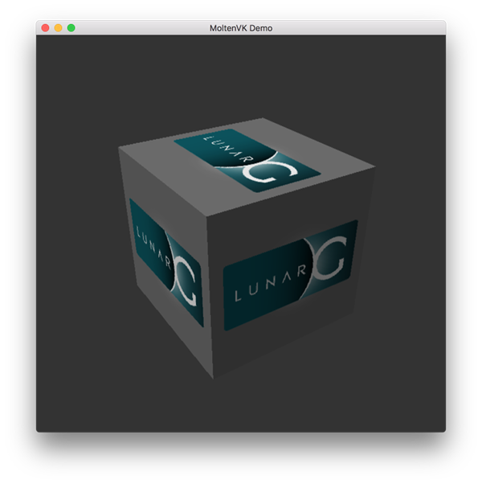

### GLFW

如前所述，Vulkan 本身是一个与平台无关的 API，它没有用于创建显示渲染结果窗口的方法。 为了使用 Vulkan 跨平台特性，并同时避免调用复杂的 Linux系统 X11 窗口管理接口，我们将使用 [GLFW 库](http://www.glfw.org/) 创建一个窗口，它同时支持 Windows、Linux 和 苹果系统。有其他库可用于此目的，例如 [SDL](https://www.libsdl.org/) ，但 GLFW 的优势在于它除了窗口创建，还抽象了 Vulkan 中的一些其他特定于平台的东西。 

在 MacOS 上安装 GLFW，我们需要使用 Homebrew 包管理器来获取 `glfw` 包： 

```bash
brew install glfw
```

### GLM

Vulkan 不包含用于线性代数运算的库，因此我们必须下载一个。 [GLM](http://glm.g-truc.net/) 是一个很好的库，设计用于图形 API，也常用于 OpenGL。

它是一个只有头文件的库，可以从 `glm` 包中安装： 

```bash
brew install glm
```

### 配置 Xcode

现在所有依赖项都已安装，我们可以为 Vulkan 设置一个基本的 Xcode 项目。 如前所述，MacOS系统中的Vulkan实质是原生系统库MoltenVK的二次封装，因此我们可以获得链接到项目的所有依赖项。 另外，请记住，在以下说明中，每当我们提到文件夹 `vulkansdk` 时，我们指的是您提取 Vulkan SDK 的文件夹。

启动 Xcode 并创建一个新的 Xcode 项目。 在将打开的窗口中，选择 Application > Command Line Tool。 


选择`Next`，为项目写一个名称，为`Language` 选择`C++`。


按`Next`，项目应该已经创建。 现在，让我们将生成的 `main.cpp` 文件中的代码更改为以下代码： 

```c++
#define GLFW_INCLUDE_VULKAN
#include <GLFW/glfw3.h>

#define GLM_FORCE_RADIANS
#define GLM_FORCE_DEPTH_ZERO_TO_ONE
#include <glm/vec4.hpp>
#include <glm/mat4x4.hpp>

#include <iostream>

int main() {
    glfwInit();

    glfwWindowHint(GLFW_CLIENT_API, GLFW_NO_API);
    GLFWwindow* window = glfwCreateWindow(800, 600, "Vulkan window", nullptr, nullptr);

    uint32_t extensionCount = 0;
    vkEnumerateInstanceExtensionProperties(nullptr, &extensionCount, nullptr);

    std::cout << extensionCount << " extensions supported\n";

    glm::mat4 matrix;
    glm::vec4 vec;
    auto test = matrix * vec;

    while(!glfwWindowShouldClose(window)) {
        glfwPollEvents();
    }

    glfwDestroyWindow(window);

    glfwTerminate();

    return 0;
}
```

请记住，您还不需要了解这些代码正在做什么，我们只是设置一些 API 调用以确保一切正常。 

Xcode 应该已经显示了一些错误，例如它无法找到库。 我们现在将开始配置项目以消除这些错误。 在 *Project Navigator* 面板上选择您的项目。 打开 *Build Settings* 选项卡，然后： 

* 找到 **Header Search Paths** 字段并添加指向 `/usr/local/include` 的条目（这是 Homebrew 安装头文件的地方，因此 glm 和 glfw3 头文件应该在那里）和指向 `vulkansdk/` 的目录 `macOS/include` 作为 Vulkan 的头文件。
* 找到 **Library Search Paths** 字段并添加指向 `/usr/local/lib` 的条目（同样，这是 Homebrew 安装库的位置，因此 glm 和 glfw3 lib 文件应该在那里）和目录 ` vulkansdk/macOS/lib`。 

它应该看起来像这样（显然，路径会根据您放置在文件上的位置而有所不同）： 

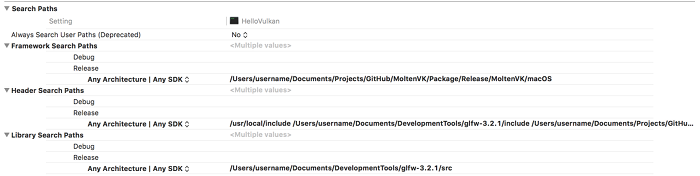

现在，在 *Build Phases* 选项卡的 **Link Binary With Libraries** 上，我们将添加 `glfw3` 和 `vulkan` 框架。 为了使事情更容易，我们将在项目中添加动态库（如果您想使用静态框架，可以查看这些库的文档）。 

* 对于 glfw，打开文件夹 `/usr/local/lib`，在那里你会找到一个类似 `libglfw.3.x.dylib` 的文件名（“x”是库的版本号，它实际值取决于你何时从 Homebrew 下载）。 只需将该文件拖到 Xcode 上的 Linked Frameworks and Libraries 选项卡即可。
* 对于 vulkan，请转到 `vulkansdk/macOS/lib`。 对文件 `libvulkan.1.dylib` 和 `libvulkan.1.x.xx.dylib` 执行相同的拖拽操作（其中“x”将是您下载的 SDK 的版本号）。 

添加这些库后，在 **Copy Files** 上的同一选项卡中，将 `Destination` 更改为“Frameworks”，清除子路径并取消选择“仅在安装时复制”。 单击“+”号并在此处添加所有这三个框架。 

您的 Xcode 配置应该看起来如下图:

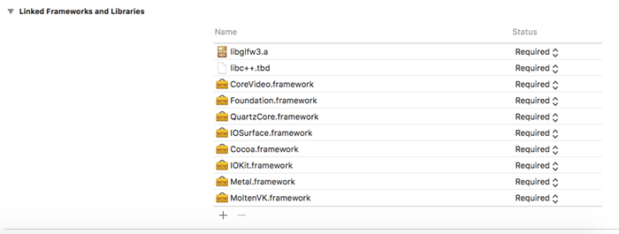

您需要设置的最后一件事是几个环境变量。 在 Xcode 工具栏上转到 `Product` > `Scheme` > `Edit Scheme...`，然后在 `Arguments` 选项卡中添加以下两个环境变量： 

* VK_ICD_FILENAMES = `vulkansdk/macOS/share/vulkan/icd.d/MoltenVK_icd.json`
* VK_LAYER_PATH = `vulkansdk/macOS/share/vulkan/explicit_layer.d`

如下图所示:


最后，你应该准备好了！ 现在，如果您运行项目（请记住根据您选择的配置将构建配置设置为 Debug 或 Release），您应该会看到以下内容： 

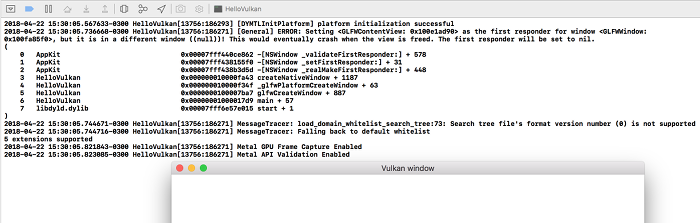

调用Vulkan返回的扩展特性数量应该不为零。 其他日志来自调用的库，您可能会收到不同的消息，具体取决于您的实际配置。

你现在已经为 [后续干货]（！en/Drawing_a_triangle/Setup/Base_code）做好了准备。 


# 基础代码

## 总体结构

在上一章中，您已经创建了一个具有正确配置的 Vulkan 项目，并使用示例代码对其进行了测试。 在本章中，我们从以下代码开始讲解：

```c++
#include <vulkan/vulkan.h>

#include <iostream>
#include <stdexcept>
#include <cstdlib>

class HelloTriangleApplication {
public:
    void run() {
        initVulkan();
        mainLoop();
        cleanup();
    }

private:
    void initVulkan() {

    }

    void mainLoop() {

    }

    void cleanup() {

    }
};

int main() {
    HelloTriangleApplication app;

    try {
        app.run();
    } catch (const std::exception& e) {
        std::cerr << e.what() << std::endl;
        return EXIT_FAILURE;
    }

    return EXIT_SUCCESS;
}
```

我们首先包含来自Lunarg SDK的vulkan头文件，它提供了函数，结构和枚举的定义。为了包括打印日志和抛出错误异常，源码添加了头文件`stdexcept`和`iostream`。 头文件`CSTDLIB`提供了`EXIT_SUCCESS`和`EXIT_FAILURE`的宏定义。

程序主题逻辑封装在类中，我们将 Vulkan 对象存储为类的私有成员变量并通过对应函数对其逐一进行初始化，最后定义函数`initVulkan`实现所有相关初始化函数的总体封装调用。一切准备就绪后，我们进入主循环开始渲染帧。我们将在 `mainLoop` 函数中实现一个循环，该循环会一直重复运行直到窗口立即关闭。一旦窗口关闭函数 `mainLoop`执行返回，我们将调用函数`cleanup`确保释放程序申请使用的资源。

如果程序在执行过程中发生任何类型的运行时错误，那么我们将抛出一个带有描述性消息的`std::runtime_error`异常，该消息将传播回 `main` 函数并打印到命令提示符。为了捕获各种标准异常类型，我们将异常匹配类型设置为`std::exception`。 然而，我们将很快介绍Vulkan的部分异常类型是无法通过这种方式进行捕获的。

从这一章开始之后的每个章节将会介绍并添加一个新函数，该函数将从 `initVulkan` 调用。这些函数负责初始化一个或多个存储在类私有变量中的新的 Vulkan 对象。这些添加的新变量对应的也要在 `cleanup` 函数中添加处理，进行资源释放。

## 资源管理

就像使用 `malloc` 分配的每个内存块都需要调用 `free` 一样，我们创建的每个 Vulkan 对象都需要在程序不再需要时显式销毁。 在 C++ 中，可以使用 [RAII](https://en.wikipedia.org/wiki/Resource_Acquisition_Is_Initialization) 执行自动资源管理或 `<memory>` 标头中提供的智能指针。但是，我选择在本教程中明确说明 Vulkan 对象的分配和解除分配过程。 毕竟，Vulkan 的优势在于明确每个操作以避免错误，因此最好明确对象的生命周期以了解 API 的工作原理。

完成本教程后，您可以通过编写 C++ 类来实现自动资源管理，这些类在其构造函数中获取 Vulkan 对象并在其析构函数中释放它们，或者通过为 `std::unique_ptr` 或 `std::shared_ptr` 提供自定义删除器 ，取决于您自己的程序需要。 RAII 是大型 Vulkan 程序的推荐模型，但出于学习目的，了解幕后发生的事情总是很好的。

Vulkan 对象要么直接使用 `vkCreateXXX` 之类的函数创建，也可以通过其他具有 `vkAllocateXXX` 之类的函数的对象分配。 在确定一个对象不再被程序使用后，您需要使用对应的 `vkDestroyXXX` 和 `vkFreeXXX` 来销毁它。对于不同类型的对象，这些函数的参数功能通常会有所不同，但有一个他们都共享的参数：`pAllocator`。这是一个可选参数，允许您为自定义内存分配器指定回调。 在本教程中我们将忽略此参数，并始终将`nullptr`作为参数传递。

## 使用GLFW

如果您只想用 Vulkan 进行画面渲染而不做屏幕显示，则无需创建窗口即可完美运行，但能够显示渲染结果肯定能让人更加激动！首先将 `#include <vulkan/vulkan.h>` 行进行如下替换

```c++
#define GLFW_INCLUDE_VULKAN
#include <GLFW/glfw3.h>
```

如此，GLFW 将包含自己的头文件并在内部自动加载Vulkan头文件。添加一个`initWindow`函数，并在`run`函数最开始处添加一个调用。我们使用这个函数来初始化GLFW并创建一个窗口。

```c++
void run() {
    initWindow();
    initVulkan();
    mainLoop();
    cleanup();
}

private:
    void initWindow() {

    }
```

`initWindow`函数内部的第一个调用应该是`glfwInit()`，它初始化 GLFW 库。因为GLFW最初是为创建OpenGL上下文而设计的，所以我们需要通过后续调用告诉它不要创建OpenGL上下文：

```c++
glfwWindowHint(GLFW_CLIENT_API, GLFW_NO_API);
```

因为处理窗口大小的调整需要特别处理，我们稍后会提到，所以现在设置禁止使用窗口尺寸调整功能：

```c++
glfwWindowHint(GLFW_RESIZABLE, GLFW_FALSE);
```

剩下的工作就是创建实际的窗口。我们添加一个`GLFWwindow* window;`作为类的私有类成员变量来存储窗口对象的引用并使用以下命令初始化窗口并获得窗口对象的引用：

```c++
window = glfwCreateWindow(800, 600, "Vulkan", nullptr, nullptr);
```

前三个参数分别指定窗口的宽度、高度和标题。第四个参数允许您选择指定打开窗口的监视器，最后一个参数仅与OpenGL相关。

使用常量变量而不是常量数字表示宽度和高度会是个好主意，因为我们在程序中来会多次使用这些值。修改常量变量的数值会更加方便。我在`HelloTriangleApplication`类定义的上方添加了以下几行：

```c++
const uint32_t WIDTH = 800;
const uint32_t HEIGHT = 600;
```

对应的将窗口创建的代码进行如下替换

```c++
window = glfwCreateWindow(WIDTH, HEIGHT, "Vulkan", nullptr, nullptr);
```

你现在应该有一个如下所示的`initWindow`函数：

```c++
void initWindow() {
    glfwInit();

    glfwWindowHint(GLFW_CLIENT_API, GLFW_NO_API);
    glfwWindowHint(GLFW_RESIZABLE, GLFW_FALSE);

    window = glfwCreateWindow(WIDTH, HEIGHT, "Vulkan", nullptr, nullptr);
}
```

为了让应用程序一直运行直到发生错误或窗口关闭，我们需要在 `mainLoop` 函数中添加一个事件循环，如下所示：

```c++
void mainLoop() {
    while (!glfwWindowShouldClose(window)) {
        glfwPollEvents();
    }
}
```

这段代码应该是不言自明的。它循环并检查诸如按下推出按钮之类的事件，又或者用户关闭窗口。稍后我们还会在这个循环中将添加调用函数渲染画面帧。

一旦窗口关闭，我们需要调用函数销毁窗体对象并终止GLFW本身实现资源回收。这将是我们的第一个“清理”代码：

```c++
void cleanup() {
    glfwDestroyWindow(window);

    glfwTerminate();
}
```

此时您运行程序，您应该会看到一个标题为“Vulkan”的窗口，应用程序通过关闭窗口而终止。现在我们已经有了 Vulkan 应用程序的骨架，让我们[创建第一个 Vulkan 对象](#instance)!

[C++ code](https://vulkan-tutorial.com/code/00_base_code.cpp)


# 实例-instance

## 创建实例-instance

您需要做的第一件事是通过创建 *instance* 来初始化 Vulkan 库。实例是您的应用程序和 Vulkan 库之间的连接，创建它涉及向驱动程序指定有关您的应用程序的一些详细信息。

首先添加一个`createInstance`函数并在`initVulkan`函数中调用。

```c++
void initVulkan() {
    createInstance();
}
```

然后，添加一个数据成员来保存实例的句柄：

```c++
private:
VkInstance instance;
```

现在，在创建实例之前，我们首先需要在一个结构体中填写一些关于我们的应用程序的信息。此数据在技术上是可选的，但它可能会为驱动程序提供一些有用的信息，以优化我们的特定应用程序（例如，因为它使用具有某些特殊行为的知名图形引擎）。 这个结构叫做 `VkApplicationInfo`：

```c++
void createInstance() {
    VkApplicationInfo appInfo{};
    appInfo.sType = VK_STRUCTURE_TYPE_APPLICATION_INFO;
    appInfo.pApplicationName = "Hello Triangle";
    appInfo.applicationVersion = VK_MAKE_VERSION(1, 0, 0);
    appInfo.pEngineName = "No Engine";
    appInfo.engineVersion = VK_MAKE_VERSION(1, 0, 0);
    appInfo.apiVersion = VK_API_VERSION_1_0;
}
```

如前所述，Vulkan中的许多结构都要求您在`sType`成员中显式指定类型。和很多其他结构体一样，该结构体也有成员变量`pNext`，该变量可以指向未来的扩展信息。这里我们使用该值默认值`nullptr`，未对其进行更改。

Vulkan中的许多信息是通过结构而不是函数参数传递的。这里我们还需要再填写一个结构体来为创建实例提供足够的信息。这一个结构是必须填写的，它告诉Vulkan 驱动程序我们要使用哪些全局扩展和验证层。这里的全局意味着这些属性适用于整个程序环境而不是指定的设备属性，这些概念在接下来的几章中将变得更加清晰。

```c++
VkInstanceCreateInfo createInfo{};
createInfo.sType = VK_STRUCTURE_TYPE_INSTANCE_CREATE_INFO;
createInfo.pApplicationInfo = &appInfo;
```

前两个参数意思很明晰那。接下来的参数指定所需的全局扩展。正如概述章节中提到的，Vulkan 是一个平台无关的 API，这意味着您需要一个扩展来与平台相关的窗口系统交互。GLFW 有一个方便的内置函数，它能够直接返回所需的扩展配置参数，我们可以直接使用将其传递给结构体：

```c++
uint32_t glfwExtensionCount = 0;
const char** glfwExtensions;

glfwExtensions = glfwGetRequiredInstanceExtensions(&glfwExtensionCount);

createInfo.enabledExtensionCount = glfwExtensionCount;
createInfo.ppEnabledExtensionNames = glfwExtensions;
```

结构的最后两个成员设置确定是否要启用的全局验证层。我们将在下一章更深入地讨论这些内容，现在暂时将它们留空。

```c++
createInfo.enabledLayerCount = 0;
```

现在我们已经指定了Vulkan实例创建所需的一切，我们终于可以调用`vkCreateInstance`了：

```c++
VkResult result = vkCreateInstance(&createInfo, nullptr, &instance);
```

正如您将看到的，创建对象的函数参数的一般模式如下：

* 一个指向创建信息结构体的指针
* 一个指向自定义分配器回调的指针，在本教程中始终为 `nullptr`
* 一个指向存储新对象变量的句柄指针

如果一切顺利，那么实例的句柄就存储在
类型为`VkInstance`的类成员变量。几乎所有 Vulkan 函数都返回一个类型的值
`VkResult` 是 `VK_SUCCESS` 或错误代码。可以使用该变量检查是否
实例创建成功，当实例创建失败时，我们不需要存储结果：

```c++
if (vkCreateInstance(&createInfo, nullptr, &instance) != VK_SUCCESS) {
    throw std::runtime_error("failed to create instance!");
}
```

现在运行程序可验证成功创建实例。

## 扩展支持检查

如果您查看`vkCreateInstance`文档，您会看到可能的错误代码之一是`VK_ERROR_EXTENSION_NOT_PRESENT`。该错误代码表示设备不支持我们
指定的扩展属性。这对于指定属性创建窗口系统界面是有意义的，但是我们如何才能检查设备是否支持扩展属性呢？

在创建Vulkan实例前，可以使用`vkEnumerateInstanceExtensionProperties`函数获取设备支持的扩展属性列表。该函数需要一个整形变量作为参数返回存储可支持扩展属性的数量，还需要一个队列指针存储可扩展属性列表数据。该函数的第一个参数是一个可选参数，设置该参数可以允许我们过滤指定验证层的扩展信息，这里我们不使用该参数。

我们需要知道设备支持的扩展属性的数量才能分配合适的内存大小存储属性列表信息。我们可以设置保存属性列表的指针为空来获取扩展属性的数量。

```c++
uint32_t extensionCount = 0;
vkEnumerateInstanceExtensionProperties(nullptr, &extensionCount, nullptr);
```

现在可以创建队列(`include <vector>`)，分配合适的内存大小属性列表保存数据了:

```c++
std::vector<VkExtensionProperties> extensions(extensionCount);
```

最后，再次调用函数，我们可以查询获取设备扩展属性列表：

```c++
vkEnumerateInstanceExtensionProperties(nullptr, &extensionCount, extensions.data());
```

每个`VkExtensionProperties`结构包含扩展的名称和版本。我们可以用一个简单的for循环列出它们（`\t`是缩进的制表符）：

```c++
std::cout << "available extensions:\n";

for (const auto& extension : extensions) {
    std::cout << '\t' << extension.extensionName << '\n';
}
```

可以将此代码添加到`createInstance`函数中获取Vulkan支持属性的一些详细信息。作为一个挑战，可以创建一个函数获取支持的扩展属性，并检查
`glfwGetRequiredInstanceExtensions`要求的支持是否在扩展列表中。

## 内存回收

`VkInstance`应该在程序退出之前最后被销毁。可以使用`vkDestroyInstance`函数在`cleanup`封装函数中销毁它：

```c++
void cleanup() {
    vkDestroyInstance(instance, nullptr);

    glfwDestroyWindow(window);

    glfwTerminate();
}
```

`vkDestroyInstance`函数的参数很简单。如前一章所述，Vulkan中的分配和释放函数有一个可选的分配器回调，通过传递`nullptr`我们忽略该参数的使用。 我们将在接下来的章节中创建的所有其他 Vulkan 资源都应该在实例被销毁之前进行清理。

创建实例后，在继续执行更复杂的步骤之前，是时候通过[验证层](#02-验证层)来评估我们的调试选项了.

[C++ code](https://vulkan-tutorial.com/code/01_instance_creation.cpp)


# 验证层

## 什么是验证层?

Vulkan API是基于最小化驱动程序开销的想法设计的，正因于此，默认情况下Vulkan API中的错误检查非常有限。 即使像将枚举设置为不正确的值或将空指针传递给所需参数这样简单的错误，通常也不会显式报错，只会导致程序崩溃或未定义的异常程序行为。
因为Vulkan要求您对程序所做的一切非常明确，所以很容易犯许多小错误，例如使用新的扩展GPU功能并忘记在逻辑设备创建时请求开启等。

但是，这并不意味着不能在Vulkan API中使用程序调试功能。Vulkan为此引入了一个优雅的系统，称为*验证层*。验证层是可选的组件，它们与Vulkan函数调用挂钩以并附加额外的调试操作。验证层中的常见操作如下：

* 根据规范检查参数值误用情况
* 跟踪对象的创建和销毁以查找资源泄漏
* 通过调用源跟踪线程来检查线程安全
* 记录每个函数调用及其参数到标准输出
* 跟踪 Vulkan 调用以进行分析和重放

以下是诊断验证层中函数实现的示例：

```c++
VkResult vkCreateInstance(
    const VkInstanceCreateInfo* pCreateInfo,
    const VkAllocationCallbacks* pAllocator,
    VkInstance* instance) {

    if (pCreateInfo == nullptr || instance == nullptr) {
        log("Null pointer passed to required parameter!");
        return VK_ERROR_INITIALIZATION_FAILED;
    }

    return real_vkCreateInstance(pCreateInfo, pAllocator, instance);
}
```

这些验证层可以自由堆叠，以包含您感兴趣的所有调试功能。此外，您可以仅在debug调试时启用验证层，而在构建release版本时完全禁用它们，这为您提供了两全其美的效果！

Vulkan的验证层并不是内置的。LunarG Vulkan SDK提供了一组软件方式的验证层来检查常见错误，它们是完全[开源的](https://github.com/KhronosGroup/Vulkan-ValidationLayers)，
这样您就可以确认他们检查并响应了哪些错误。使用验证层是避免应用程序在不同驱动环境下因未定义依赖导致中断的最佳方法。

只有在系统上安装了验证层后才能使用它们。例如，LunarG验证层仅在安装了Vulkan SDK的PC上可用。

Vulkan以前有两种不同类型的验证层：实例验证层和设备验证层。实例层只会检查与全局 Vulkan 对象（如实例）相关的调用，而设备层只会检查与特定 GPU 相关的调用。 设备层现已弃用，这意味着实例验证层适用于所有Vulkan调用。但官方文档仍然建议您在设备级别启用验证层以确保兼容性，这是某些实现所要求的。 本教程中，我们将简单地在逻辑设备级别指定与实例相同的验证层，我们将在[后续章节](#04-逻辑设备与队列) 中看到。


## 使用验证层

在本节中，我们将了解如何启用 Vulkan SDK 提供的标准诊断层。就像扩展功能一样，验证层需要通过指定它们的名称来启用。所有有用的标准验证都捆绑在SDK 中的一个层中，称为“VK_LAYER_KHRONOS_validation”。

让我们首先在程序中添加两个配置变量来指定要启用的层以及是否启用它们。我选择将该值基于程序是否在调试模式下编译。 `NDEBUG`宏是C++标准的一部分，意思是“不调试”。编译release程序版本时，该宏定义生效时，编译结果最大化程序运行性能。

```c++
const uint32_t WIDTH = 800;
const uint32_t HEIGHT = 600;

const std::vector<const char*> validationLayers = {
    "VK_LAYER_KHRONOS_validation"
};

#ifdef NDEBUG
    const bool enableValidationLayers = false;
#else
    const bool enableValidationLayers = true;
#endif
```

我们将添加一个新函数`checkValidationLayerSupport`来检查是否所有请求的层都可用。首先使用 `vkEnumerateInstanceLayerProperties` 函数列出所有可用层。 它的用法与实例一章中讨论的`vkEnumerateInstanceExtensionProperties`相同。

```c++
bool checkValidationLayerSupport() {
    uint32_t layerCount;
    vkEnumerateInstanceLayerProperties(&layerCount, nullptr);

    std::vector<VkLayerProperties> availableLayers(layerCount);
    vkEnumerateInstanceLayerProperties(&layerCount, availableLayers.data());

    return false;
}
```

接下来，检查`validationLayers`中的所有层是否都存在于
`availableLayers` 列表中。 您需要使用 `strcmp`函数，并需要添加头文件`<cstring>`。

```c++
for (const char* layerName : validationLayers) {
    bool layerFound = false;

    for (const auto& layerProperties : availableLayers) {
        if (strcmp(layerName, layerProperties.layerName) == 0) {
            layerFound = true;
            break;
        }
    }

    if (!layerFound) {
        return false;
    }
}

return true;
```

我们现在可以在`createInstance`中使用这个函数：

```c++
void createInstance() {
    if (enableValidationLayers && !checkValidationLayerSupport()) {
        throw std::runtime_error("validation layers requested, but not available!");
    }

    ...
}
```

现在我们可以在Debug模式下运行程序并确保没有错误发生。如果有错误提示，可以参见本文附录的常见问题解答章节(FAQ)。

最后，如果启用验证层，则修改`VkInstanceCreateInfo`结构对象参数，确保包含验证层名称：

```c++
if (enableValidationLayers) {
    createInfo.enabledLayerCount = static_cast<uint32_t>(validationLayers.size());
    createInfo.ppEnabledLayerNames = validationLayers.data();
} else {
    createInfo.enabledLayerCount = 0;
}
```

如果调试验证成功，则`vkCreateInstance`不应返回`VK_ERROR_LAYER_NOT_PRESENT`错误标签，但您还是亲自运行程序以确保一切正常。
If the check was successful then `vkCreateInstance` should not ever return a
`VK_ERROR_LAYER_NOT_PRESENT` error, but you should run the program to make sure.

## 消息回调（Message callback)

默认情况下，验证层会将调试消息打印到标准输出，但我们也可以通过在程序中提供显式回调函数来自己处理信息提示。 这也将允许您决定您希望看到哪种类型的消息，因为并非所有都必然是（致命的）错误。 如果你现在不想这样做，那么你可以跳到本章的最后一节。

要在程序中设置回调来处理消息和相关细节，我们必须使用带有`VK_EXT_debug_utils`扩展设置的回调调试器。

我们将首先创建一个`getRequiredExtensions`函数。当启用验证层时，该函数将返回列表添加验证层属性，否则将不包含验证层属性。

```c++
std::vector<const char*> getRequiredExtensions() {
    uint32_t glfwExtensionCount = 0;
    const char** glfwExtensions;
    glfwExtensions = glfwGetRequiredInstanceExtensions(&glfwExtensionCount);

    std::vector<const char*> extensions(glfwExtensions, glfwExtensions + glfwExtensionCount);

    if (enableValidationLayers) {
        extensions.push_back(VK_EXT_DEBUG_UTILS_EXTENSION_NAME);
    }

    return extensions;
}
```

创建实例时始终需要由GLFW指定的扩展属性，但调试信息扩展属性则是可选的。 请注意，我在这里使用了 `VK_EXT_DEBUG_UTILS_EXTENSION_NAME`宏，它与字符串"VK_EXT_debug_utils"定义是等价的。使用此宏，而不直接使用字符串可以避免拼写错误。

我们现在可以在`createInstance`中使用这个函数：

```c++
auto extensions = getRequiredExtensions();
createInfo.enabledExtensionCount = static_cast<uint32_t>(extensions.size());
createInfo.ppEnabledExtensionNames = extensions.data();
```

运行程序以确保您没有收到“VK_ERROR_EXTENSION_NOT_PRESENT”错误。 我们不需要检查对应扩展的存在，因为它应该由验证层扩展隐含表示。

现在让我们看看调试回调函数是什么样的。添加一个名为 `debugCallback` 的新静态成员函数，在其内部使用PFN_vkDebugUtilsMessengerCallbackEXT原型显示Vulkan调试信息。其中，`VKAPI_ATTR`和`VKAPI_CALL`确保函数具有正确的签名供 Vulkan 调用它。

```c++
static VKAPI_ATTR VkBool32 VKAPI_CALL debugCallback(
    VkDebugUtilsMessageSeverityFlagBitsEXT messageSeverity,
    VkDebugUtilsMessageTypeFlagsEXT messageType,
    const VkDebugUtilsMessengerCallbackDataEXT* pCallbackData,
    void* pUserData) {

    std::cerr << "validation layer: " << pCallbackData->pMessage << std::endl;

    return VK_FALSE;
}
```

第一个参数指定消息的严重性，该参数可以是以下标志之一：

* `VK_DEBUG_UTILS_MESSAGE_SEVERITY_VERBOSE_BIT_EXT`: 诊断信息
* `VK_DEBUG_UTILS_MESSAGE_SEVERITY_INFO_BIT_EXT`: 信息性消息，例如资源创建
* `VK_DEBUG_UTILS_MESSAGE_SEVERITY_WARNING_BIT_EXT`: 关于行为的消息，不一定会运行错误，但很有可能是应用程序中的非预期错误
* `VK_DEBUG_UTILS_MESSAGE_SEVERITY_ERROR_BIT_EXT`: 关于运行行为的无效信息可能导致崩溃

基于上述枚举值，您还可以使用比较操作来过滤消息与某种严重性级别相比是否相等或更差，例如：

```c++
if (messageSeverity >= VK_DEBUG_UTILS_MESSAGE_SEVERITY_WARNING_BIT_EXT) {
    // Message is important enough to show
}
```

`messageType` 参数可以有以下值：

* `VK_DEBUG_UTILS_MESSAGE_TYPE_GENERAL_BIT_EXT`: 发生了一些与规格或性能无关的事件
* `VK_DEBUG_UTILS_MESSAGE_TYPE_VALIDATION_BIT_EXT`: 发生了违反规范或表明可能存在错误的事情
* `VK_DEBUG_UTILS_MESSAGE_TYPE_PERFORMANCE_BIT_EXT`: 未优化使用Vulkan

`pCallbackData`参数指的是一个`VkDebugUtilsMessengerCallbackDataEXT`结构，其中包含消息本身的详细信息，其中最重要的成员为：

* `pMessage`: 调试消息作为空终止字符串
* `pObjects`: 与消息相关的Vulkan对象句柄数组
* `objectCount`: 对象句柄数组个数

最后，`pUserData`参数包含一个在回调设置期间指定的指针，并允许您将自己的数据传递给它。

回调返回一个布尔值，指示验证层是否应该中止Vulkan调用中的消息触发。如果回调返回 true，则Vulkan调用会因`VK_ERROR_VALIDATION_FAILED_EXT`错误而中止触发验证层消息。该功能
通常只用于测试验证层本身，所以你应该总是返回`VK_FALSE`。

现在剩下的就是告诉Vulkan回调函数。或许有些令人惊讶，即使是Vulkan中用于管理调试回调的句柄也需要显式创建和销毁。
这样的回调设置是*手动调试信息*的一部分，您可以拥有任意数量的回调。在本示例源码中，我们为该句柄添加一个类成员变量并添加`instance`变量后面：

```c++
VkDebugUtilsMessengerEXT debugMessenger;
```

现在添加一个名为`setupDebugMessenger`的函数，在函数初始化函数`initVulkan`内部的创建Vulkan句柄函数`createInstance`后面调用该函数。

```c++
void initVulkan() {
    createInstance();
    setupDebugMessenger();
}

void setupDebugMessenger() {
    if (!enableValidationLayers) return;

}
```

我们还需要往一个结构体中填写回调的详细配置信息，如下所示：

```c++
VkDebugUtilsMessengerCreateInfoEXT createInfo{};
createInfo.sType = VK_STRUCTURE_TYPE_DEBUG_UTILS_MESSENGER_CREATE_INFO_EXT;
createInfo.messageSeverity = VK_DEBUG_UTILS_MESSAGE_SEVERITY_VERBOSE_BIT_EXT | VK_DEBUG_UTILS_MESSAGE_SEVERITY_WARNING_BIT_EXT | VK_DEBUG_UTILS_MESSAGE_SEVERITY_ERROR_BIT_EXT;
createInfo.messageType = VK_DEBUG_UTILS_MESSAGE_TYPE_GENERAL_BIT_EXT | VK_DEBUG_UTILS_MESSAGE_TYPE_VALIDATION_BIT_EXT | VK_DEBUG_UTILS_MESSAGE_TYPE_PERFORMANCE_BIT_EXT;
createInfo.pfnUserCallback = debugCallback;
createInfo.pUserData = nullptr; // Optional
```

其中，`messageSeverity`项允许你设置回调函数的服务类型。本示例中，我设置了除了`VK_DEBUG_UTILS_MESSAGE_SEVERITY_INFO_BIT_EXT`外的全部类型，接收有关可能问题的调试通知，同时省略一般的调试详细信息。

类似的，`messageType`项允许你过滤调试回调的消息类型。本示例中，我开启了所有的调试信息类型。你可以通过禁用调试类型，从而屏蔽对应类型的调试信息。

最后，`pfnUserCallback`项指定回调函数的函数指针。作为一个可选项，你可以为`pUserData`项指定指针参数。该参数会传递给回调函数中的`pUserData`参数。例如，你可以传递一个指向`HelloTriangleApplication`类的指针。

需要注意的是设置验证层和调试回调函数的方法有很多，本教程使用的设置方法只作为一个较好的入门示例。更多详细信息可以[参见资料](https://www.khronos.org/registry/vulkan/specs/1.3-extensions/html/chap50.html#VK_EXT_debug_utils)。

配置信息结构体需要传递给`vkCreateDebugUtilsMessengerEXT`函数用于创建`VkDebugUtilsMessengerEXT`对象。不幸的是，这个函数是一个扩展函数，它不会通过添加头文件自动加载。我们需要使用函数`vkGetInstanceProcAddr`查找对应函数的入口地址。通过调用函数指针对应函数实体即可调用函数功能。我们在类`HelloTriangleApplication`的外部定义整个函数实体。

```c++
VkResult CreateDebugUtilsMessengerEXT(VkInstance instance, const VkDebugUtilsMessengerCreateInfoEXT* pCreateInfo, const VkAllocationCallbacks* pAllocator, VkDebugUtilsMessengerEXT* pDebugMessenger) {
    auto func = (PFN_vkCreateDebugUtilsMessengerEXT) vkGetInstanceProcAddr(instance, "vkCreateDebugUtilsMessengerEXT");
    if (func != nullptr) {
        return func(instance, pCreateInfo, pAllocator, pDebugMessenger);
    } else {
        return VK_ERROR_EXTENSION_NOT_PRESENT;
    }
}
```

如果无法找到对应扩展函数，函数`vkGetInstanceProcAddr`的调用结果将返回`nullptr`。现在，若设备中含有扩展调试功能，我们就可以调用该函数创建扩展调试对象。

```c++
if (CreateDebugUtilsMessengerEXT(instance, &createInfo, nullptr, &debugMessenger) != VK_SUCCESS) {
    throw std::runtime_error("failed to set up debug messenger!");
}
```

倒数第二个参数对应一个可选的分配器回调，本示例我们设置为 `nullptr`，不展开进行讨论。 由于调试信息对象是针对 Vulkan实例及其层，因此需要将其明确指定为第一个参数。 稍后您还将在其他*孩子*对象中看到这种类似模式。

与`vkCreateDebugUtilsMessengerEXT`显示创建函数类似，创建的`VkDebugUtilsMessengerEXT`需要使用`vkDestroyDebugUtilsMessengerEXT`函数进行显示清理。

这里同样需要使用'vkGetInstanceProcAddr'查找"vkDestroyDebugUtilsMessengerEXT"函数对应的函数指针：

```c++
void DestroyDebugUtilsMessengerEXT(VkInstance instance, VkDebugUtilsMessengerEXT debugMessenger, const VkAllocationCallbacks* pAllocator) {
    auto func = (PFN_vkDestroyDebugUtilsMessengerEXT) vkGetInstanceProcAddr(instance, "vkDestroyDebugUtilsMessengerEXT");
    if (func != nullptr) {
        func(instance, debugMessenger, pAllocator);
    }
}
```

需要确保该函数是一个静态类成员函数或是一个类外部定义的函数。我们能够在类的`cleanup`函数中对其进行调用：

```c++
void cleanup() {
    if (enableValidationLayers) {
        DestroyDebugUtilsMessengerEXT(instance, debugMessenger, nullptr);
    }

    vkDestroyInstance(instance, nullptr);

    glfwDestroyWindow(window);

    glfwTerminate();
}
```

## 调试实例创建与销毁

虽然现在我们已经为程序创建了验证层调试对象，但我们还没有完成所有的步骤。函数`vkCreateDebugUtilsMessengerEXT`调用需要一个有效的Vulkan实例，而函数`vkDestroyDebugUtilsMessengerEXT`必须在Vulkan实例销毁前调用。这就导致我们无法调式函数`vkCreateInstance`与函数`vkDestroyInstance` 调用可能导致的问题。首先，将调试信息对象的配置参数复用到独立的函数中：

```c++
void populateDebugMessengerCreateInfo(VkDebugUtilsMessengerCreateInfoEXT& createInfo) {
    createInfo = {};
    createInfo.sType = VK_STRUCTURE_TYPE_DEBUG_UTILS_MESSENGER_CREATE_INFO_EXT;
    createInfo.messageSeverity = VK_DEBUG_UTILS_MESSAGE_SEVERITY_VERBOSE_BIT_EXT | VK_DEBUG_UTILS_MESSAGE_SEVERITY_WARNING_BIT_EXT | VK_DEBUG_UTILS_MESSAGE_SEVERITY_ERROR_BIT_EXT;
    createInfo.messageType = VK_DEBUG_UTILS_MESSAGE_TYPE_GENERAL_BIT_EXT | VK_DEBUG_UTILS_MESSAGE_TYPE_VALIDATION_BIT_EXT | VK_DEBUG_UTILS_MESSAGE_TYPE_PERFORMANCE_BIT_EXT;
    createInfo.pfnUserCallback = debugCallback;
}

...

void setupDebugMessenger() {
    if (!enableValidationLayers) return;

    VkDebugUtilsMessengerCreateInfoEXT createInfo;
    populateDebugMessengerCreateInfo(createInfo);

    if (CreateDebugUtilsMessengerEXT(instance, &createInfo, nullptr, &debugMessenger) != VK_SUCCESS) {
        throw std::runtime_error("failed to set up debug messenger!");
    }
}
```

现在我们可以在`createInstance`函数中复用生成调试对象:

```c++
void createInstance() {
    ...

    VkInstanceCreateInfo createInfo{};
    createInfo.sType = VK_STRUCTURE_TYPE_INSTANCE_CREATE_INFO;
    createInfo.pApplicationInfo = &appInfo;

    ...

    VkDebugUtilsMessengerCreateInfoEXT debugCreateInfo{};
    if (enableValidationLayers) {
        createInfo.enabledLayerCount = static_cast<uint32_t>(validationLayers.size());
        createInfo.ppEnabledLayerNames = validationLayers.data();

        populateDebugMessengerCreateInfo(debugCreateInfo);
        createInfo.pNext = (VkDebugUtilsMessengerCreateInfoEXT*) &debugCreateInfo;
    } else {
        createInfo.enabledLayerCount = 0;

        createInfo.pNext = nullptr;
    }

    if (vkCreateInstance(&createInfo, nullptr, &instance) != VK_SUCCESS) {
        throw std::runtime_error("failed to create instance!");
    }
}
```

`debugCreateInfo`变量被放置在if语句块外，这样可以确保在调用函数`vkCreateInstance` 时该变量不会被自动销毁。通过这种方式创建调试信息对象能够确保调用函数`vkCreateInstance`与`vkDestroyInstance`能够自动生成调试信息，并且能够自动销毁。

## 测试

现在让我们有意制造一个错误来检验验证层的作用。暂时注释掉函数`cleanup`中的函数`DestroyDebugUtilsMessengerEXT`并运行你的程序。等程序执行完毕退出，你会看到类似如下的调试信息：

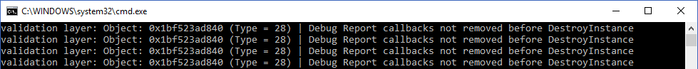

>如果你没有看见任何调试信息，请检查[Vulkan安装](https://vulkan.lunarg.com/doc/view/1.2.131.1/windows/getting_started.html#user-content-verify-the-installation)。

如果你想查看哪一个调用触发了消息，你可以在消息回调函数中田间一个断点并通过IDE查看调用堆栈。

## 配置

除了`VkDebugUtilsMessengerCreateInfoEXT`结构体中的配置变量外，验证层还有很多的配置项。浏览Vulkan SDK安装目录并找到`Config`文件夹。这里你会发现有一个名为`vk_layer_settings.txt`的文件并解释了如何配置层参数。

为了对你的程序配置层参数，你可以将该文件分别拷贝到程序项目的`Debug`和`Release` 目录下，并参照文档说明进行定制修改。然而，在本教程示例中我们使用的是默认配置。

通过本教程我们将故意制造一些错误来向你展示验证层是如何捕获错误信息，并向你说明理解Vulkan调试机制的重要性。下一节我们将介绍[系统中的Vulkan设备](#03-物理设备与队列族)。

[C++ code](https://vulkan-tutorial.com/code/02_validation_layers.cpp)


# 物理设备与队列族

## 选择一个物理设备

通过Vulkan实例对Vulkan库进行初始化后，我们需要查找系统中符合我们程序指定要求的显卡设备。
实际上，我们能够选择任意数量的显卡设备并同时使用她们，但在本教程因篇幅限制我们只讨论符合我们要求的第一个显卡设备。

我们添加一个名为`pickPhysicalDevice`的函数，并在自定义的Vulkan初始化函数`initVulkan`中对其进行调用。

```c++
void initVulkan() {
    createInstance();
    setupDebugMessenger();
    pickPhysicalDevice();
}

void pickPhysicalDevice() {

}
```

最终查找匹配的显卡设备将保存在类型为VkPhysicalDevice的句柄中，示例中该句柄变量是类的成员变量。
该对象将随着Vulkan实例VkInstance销毁而自动销毁，所以我们不必在`cleanup`函数中添加额外的处理。

```c++
VkPhysicalDevice physicalDevice = VK_NULL_HANDLE;
```

陈列显卡设备列表与陈列扩展属性的过程类似，首先需要查询显卡设备的数量。

```c++
uint32_t deviceCount = 0;
vkEnumeratePhysicalDevices(instance, &deviceCount, nullptr);
```

如果只有0个Vulkan支持的设备，那么程序就没有必要继续运行了。

```c++
if (deviceCount == 0) {
    throw std::runtime_error("failed to find GPUs with Vulkan support!");
}
```

如果返回的设备数量大于0，则我们可以自动分配一个合适大小的队列来保存这些VkPhysicalDevice设备句柄。

```c++
std::vector<VkPhysicalDevice> devices(deviceCount);
vkEnumeratePhysicalDevices(instance, &deviceCount, devices.data());
```

考虑到并不是所有显卡设备都具有相同的设备特性，现在我们可以逐一评估这些设备并检查它们是否符合我们的程序要求。
对此，我们介绍一个新的函数:

```c++
bool isDeviceSuitable(VkPhysicalDevice device) {
    return true;
}
```

遍历所有设备，通过该函数我们能够检查是否存在一个符合我们程序设置要求设备。

```c++
for (const auto& device : devices) {
    if (isDeviceSuitable(device)) {
        physicalDevice = device;
        break;
    }
}

if (physicalDevice == VK_NULL_HANDLE) {
    throw std::runtime_error("failed to find a suitable GPU!");
}
```
下一节我们将介绍使用自定义验证函数`isDeviceSuitable`中验证设备要求的第一个条件。
随着我们使用的Vulkan特性越来越多，我们将在该函数中增加越来越多的验证条件。

## 基础设备适配验证

为了验证设备的可适配性，我们需要先获得设备属性。
一定存在基础设备属性如名称、类型、Vulkan支持的版本等信息都能通过函数vkGetPhysicalDeviceProperties查询获得：

```c++
VkPhysicalDeviceProperties deviceProperties;
vkGetPhysicalDeviceProperties(device, &deviceProperties);
```

那些可选的设备属性如纹理压缩、64位浮点数和多视角渲染（VR应用中使用）等能够通过函数vkGetPhysicalDeviceFeatures查询获得：

```c++
VkPhysicalDeviceFeatures deviceFeatures;
vkGetPhysicalDeviceFeatures(device, &deviceFeatures);
```

还有一些关于设备的更多详细信息，我们将在设备内存、队列族等后续章节中进行说明。

在本节示例中，让我们将假定应用程序只能运行在支持几何作色器的专用显卡。于是，`isDeviceSuitable`函数可由如下代码实现：

```c++
bool isDeviceSuitable(VkPhysicalDevice device) {
    VkPhysicalDeviceProperties deviceProperties;
    VkPhysicalDeviceFeatures deviceFeatures;
    vkGetPhysicalDeviceProperties(device, &deviceProperties);
    vkGetPhysicalDeviceFeatures(device, &deviceFeatures);

    return deviceProperties.deviceType == VK_PHYSICAL_DEVICE_TYPE_DISCRETE_GPU &&
           deviceFeatures.geometryShader;
}
```

除了验证设备是否为专用显卡外，你还能获得设备的性能得分并挑选出得分最高的设备。
你可以为独立的专业显卡赋予较高的评分，而集成显卡则赋予较低的评分。如下代码可实现类似功能：

```c++
#include <map>

...

void pickPhysicalDevice() {
    ...

    // Use an ordered map to automatically sort candidates by increasing score
    std::multimap<int, VkPhysicalDevice> candidates;

    for (const auto& device : devices) {
        int score = rateDeviceSuitability(device);
        candidates.insert(std::make_pair(score, device));
    }

    // Check if the best candidate is suitable at all
    if (candidates.rbegin()->first > 0) {
        physicalDevice = candidates.rbegin()->second;
    } else {
        throw std::runtime_error("failed to find a suitable GPU!");
    }
}

int rateDeviceSuitability(VkPhysicalDevice device) {
    ...

    int score = 0;

    // Discrete GPUs have a significant performance advantage
    if (deviceProperties.deviceType == VK_PHYSICAL_DEVICE_TYPE_DISCRETE_GPU) {
        score += 1000;
    }

    // Maximum possible size of textures affects graphics quality
    score += deviceProperties.limits.maxImageDimension2D;

    // Application can't function without geometry shaders
    if (!deviceFeatures.geometryShader) {
        return 0;
    }

    return score;
}
```

在本教程中并不会讲解全部的设备选取方法，仅提供设备选取方法的一般思路。
例如，你可以显示所有的设备列表，并让用户根据设备名称自行选择。

作为入门教程，这里我们只关注支持的Vulkan特性，为此我们可以通过如下代码指定任何可用的GPU设备：

```c++
bool isDeviceSuitable(VkPhysicalDevice device) {
    return true;
}
```

下一节我们将讨论检验第一个程序要求的特性。

## 队列族

在前文的介绍中提到过任何的Vulkan操作，从绘画至上传纹理都需要需要将命令提交到队列中。
命令队列有多种不同的类型对应不同的*队列族*，相同类型或同族的命令队列只允许提交对应类型的命令。
例如，有一种队列族只允许提交计算命令，而另一种队列族允许提交内存传输相关命令。

我们需要验证设备支持哪些队列族以及我们需要使用哪些支持的命令。
为了这一目的我们添加了一个名为`findQueueFamilies`的新函数用以查找我们所需的命令族。

当前，我们仅需要查找支持图形绘制相关命令的队列族接口，对应的函数实现如下所示：

```c++
uint32_t findQueueFamilies(VkPhysicalDevice device) {
    // Logic to find graphics queue family
}
```

考虑到下一章我们将查找不同类型的队列族，为了方便功能扩展，我们将不同的队列族查找索引统一存储在一个结构体中:

```c++
struct QueueFamilyIndices {
    uint32_t graphicsFamily;
};

QueueFamilyIndices findQueueFamilies(VkPhysicalDevice device) {
    QueueFamilyIndices indices;
    // Logic to find queue family indices to populate struct with
    return indices;
}
```

是否存在队列族不存在的情况？答案是肯定的。对此，我们需要在`findQueueFamilies`函数中抛出异常，但这个函数并不是决断设备适配性的合适位置。
例如，我们可能更想要一个支持专门传输队列族的设备，但这一要求可以不是必须的。所以，我们需要一些方法指出是否找到特定的队列族。

不太可能使用一个数值标识队列族不存在的状态，因为理论上任意一个`uint32_t`类型的值都可以是一个合法的队列族类型值，甚至包括`0`。
幸运的是C++ 17标准引入了一个数据结构用于区分特定的值是否存在：

```c++
#include <optional>

...

std::optional<uint32_t> graphicsFamily;

std::cout << std::boolalpha << graphicsFamily.has_value() << std::endl; // false

graphicsFamily = 0;

std::cout << std::boolalpha << graphicsFamily.has_value() << std::endl; // true
```

`std::optional`标识一个初始不含有任何值的封装容器直至你对其进行赋值。
任意时候你都能通过函数`has_value()`查询其是否已经赋值。
这意味着我们能够更改结构体定义：

```c++
#include <optional>

...

struct QueueFamilyIndices {
    std::optional<uint32_t> graphicsFamily;
};

QueueFamilyIndices findQueueFamilies(VkPhysicalDevice device) {
    QueueFamilyIndices indices;
    // Assign index to queue families that could be found
    return indices;
}
```

我们现在能够定义函数`findQueueFamilies`:

```c++
QueueFamilyIndices findQueueFamilies(VkPhysicalDevice device) {
    QueueFamilyIndices indices;

    ...

    return indices;
}
```

获取队列族列表的过程函数可以通过使用函数`vkGetPhysicalDeviceQueueFamilyProperties`实现:

```c++
uint32_t queueFamilyCount = 0;
vkGetPhysicalDeviceQueueFamilyProperties(device, &queueFamilyCount, nullptr);

std::vector<VkQueueFamilyProperties> queueFamilies(queueFamilyCount);
vkGetPhysicalDeviceQueueFamilyProperties(device, &queueFamilyCount, queueFamilies.data());
```

VkQueueFamilyProperties结构含有一些队列族的详细信息，包括操作的类型和对应类型的队列数量。
我们需要查找至少一个支持`VK_QUEUE_GRAPHICS_BIT`标志位的队列族。

```c++
int i = 0;
for (const auto& queueFamily : queueFamilies) {
    if (queueFamily.queueFlags & VK_QUEUE_GRAPHICS_BIT) {
        indices.graphicsFamily = i;
    }

    i++;
}
```

现在我们已经实现了队列族查找函数，我们可以在验证函数`isDeviceSuitable`中使用它，确保设备能够处理我们想要的指令：

```c++
bool isDeviceSuitable(VkPhysicalDevice device) {
    QueueFamilyIndices indices = findQueueFamilies(device);

    return indices.graphicsFamily.has_value();
}
```

To make this a little bit more convenient, we'll also add a generic check to the
struct itself:

```c++
struct QueueFamilyIndices {
    std::optional<uint32_t> graphicsFamily;

    bool isComplete() {
        return graphicsFamily.has_value();
    }
};

...

bool isDeviceSuitable(VkPhysicalDevice device) {
    QueueFamilyIndices indices = findQueueFamilies(device);

    return indices.isComplete();
}
```

现在我们同样可以在早前的队列查找函数`findQueueFamilies`中使用它，判断条件并提前退出：

```c++
for (const auto& queueFamily : queueFamilies) {
    ...

    if (indices.isComplete()) {
        break;
    }

    i++;
}
```

很好，这些就是我们查找合适的物理设备的全部步骤！下一步将创建[逻辑设备](#04-逻辑设备与队列族)与物理设备进行交互。

[C++ code](https://vulkan-tutorial.com/code/03_physical_device_selection.cpp)


# 逻辑设备与队列族

## 介绍

在选择了一个具体物理设备后，我们还需要创建一个*逻辑设备*与物理设备进行交互。
逻辑设备的创建过程与Vulkan实例的创建过程类似，需要描述我们需要使用的特征。
我们同样需要指明我们现在创建的队列对应的队列族是否可用。如果有不同的需求条件，我们可以对同一个物理设备创建多个逻辑设备。

首先，我们需要定义一个类的成员变量来保存逻辑设备的句柄。

```c++
VkDevice device;
```

下一步，添加一个名为`createLogicalDevice`的函数，并在初始化函数`initVulkan`.中调用他。

```c++
void initVulkan() {
    createInstance();
    setupDebugMessenger();
    pickPhysicalDevice();
    createLogicalDevice();
}

void createLogicalDevice() {

}
```

## 指定要创建的队列

逻辑设备的创建涉及到一系列的结构体信息，首先需要创建一个名为`VkDeviceQueueCreateInfo`的结构体。
这个结构体描述了从指定队列族中创建的队列数量。当前，我们只创建一个支持图形能力的队列。

```c++
QueueFamilyIndices indices = findQueueFamilies(physicalDevice);

VkDeviceQueueCreateInfo queueCreateInfo{};
queueCreateInfo.sType = VK_STRUCTURE_TYPE_DEVICE_QUEUE_CREATE_INFO;
queueCreateInfo.queueFamilyIndex = indices.graphicsFamily.value();
queueCreateInfo.queueCount = 1;
```

当前的设备驱动大多只允许你们对指定的队列族只能创建较少数量的队列，而且你们一般不会需要超过1个以上的队列。
这是因为你们可以把所有的命令缓存创建在多个线程中，然后在主线程中进行1次提交，这样只会造成非常低的线程互斥开销。

Vulkan允许你使用[0，1]之间的数对队列进行优先级赋值，来控制命令缓存的时间片划分。即便是单个命令队列的情况也需要对该值进行设置：

```c++
float queuePriority = 1.0f;
queueCreateInfo.pQueuePriorities = &queuePriority;
```

## 指定使用设备特性

指明我们将要使用的设备特性是下一个关键步骤。这里所说的特性也就是之前物理设备与队列族章节中函数
`vkGetPhysicalDeviceFeatures`查询特性的设置，例如几何渲染器。当前我们不需要指定任何信息，所以我们简单的让其保持默认为`VK_FALSE`即可。
随着后续Vulkan内容的展开，我们讲对这一结构体做进一步说明。

```c++
VkPhysicalDeviceFeatures deviceFeatures{};
```

## 创建逻辑设备

介绍了前面两个结构体后，我们可以开始填充逻辑设备创建结构体`VkDeviceCreateInfo`。

```c++
VkDeviceCreateInfo createInfo{};
createInfo.sType = VK_STRUCTURE_TYPE_DEVICE_CREATE_INFO;
```

首先，为队列创建结构体与设备特征结构体添加关联指针：

```c++
createInfo.pQueueCreateInfos = &queueCreateInfo;
createInfo.queueCreateInfoCount = 1;

createInfo.pEnabledFeatures = &deviceFeatures;
```

其余的结构体成员变量设置与`VkInstanceCreateInfo`结构类似，需要你指定扩展和验证层。
不同之处在于这些设置是基于指定硬件设备的。

其中交换区`VK_KHR_swapchain`设置，就是一个关于设备扩展特性的例子，通过该设置，你能将设备渲染的图像结果呈现到窗体中。之所以称为扩展特性，是因为并非所有Vulkan设备都支持这项功能，例如一些设备只支持计算操作。
在后面介绍交换区的章节中我们将进一步回顾展开设备扩展特性。

早前的Vulkan版本实例与设备的验证层是独立，但[目前的版本](https://www.khronos.org/registry/vulkan/specs/1.3-extensions/html/chap40.html#extendingvulkan-layers-devicelayerdeprecation)已将两者进行合并。这意味着对于支持新版本Vulkan的设备，`VkDeviceCreateInfo`结构体中的层数量变量`enabledLayerCount` 和层名称指针`ppEnabledLayerNames`可以忽略不进行设置。不过，为了让程序更好的兼容老版本的Vulkan设备，我们依然建议对这两项进行设置。

```c++
createInfo.enabledExtensionCount = 0;

if (enableValidationLayers) {
    createInfo.enabledLayerCount = static_cast<uint32_t>(validationLayers.size());
    createInfo.ppEnabledLayerNames = validationLayers.data();
} else {
    createInfo.enabledLayerCount = 0;
}
```

当前我们不需要指定任何设备扩展。

至此，我们准备好了创建逻辑设备相关参数变量，我们通过调用Vulkan内置函数`vkCreateDevice`创建获得逻辑设备：

```c++
if (vkCreateDevice(physicalDevice, &createInfo, nullptr, &device) != VK_SUCCESS) {
    throw std::runtime_error("failed to create logical device!");
}
```

该函数的相关输入参数依次为交互的物理设备、含有队列与使用信息的结构体创建参数、可选的分配回调函数和一个可以存储逻辑设备的指针句柄。与实例创建函数类似，该函数调用失败时会返回错误信息，如使用了不存在的扩展特性又或者指明使用了不支持的属性。

创建的逻辑设备需要在`cleanup`函数中由`vkDestroyDevice`函数销毁：

```c++
void cleanup() {
    vkDestroyDevice(device, nullptr);
    ...
}
```

逻辑设备不直接与Vulkan实例进行交互，因此释放函数中并没有将实例作为参数进行传入。

## 检索队列句柄

命令队列将随着逻辑设备一起被自动创建，但我们还没有与其交互的句柄。首先，我们添加一个类成员变量存储图形队列：

```c++
VkQueue graphicsQueue;
```

设备队列将随着逻辑设备一起销毁，所以我们不必为其在`cleanup`函数中添加额外的操作。

我们可以使用函数`vkGetDeviceQueue`指定队列族检索逻辑设备中的命令队列。函数的参数一次为逻辑设备、队列族、队列序号和存储命令队列的句柄。因为之前我们之创建了一个命令队列，所以检索的队列索引号为'0'。

```c++
vkGetDeviceQueue(device, indices.graphicsFamily.value(), 0, &graphicsQueue);
```

有了逻辑设备和命令队列句柄后我们可以开始通过程序使用显卡进行相关渲染或计算操作！
在下一节，我们将设置相关资源并在窗体系统中呈现渲染结果。

[C++ code](https://vulkan-tutorial.com/code/04_logical_device.cpp)


# 窗面

因为Vulkan是一个诊断平台应用程序接口，它无法直接与操作系统显示窗口直接交互。
为了建立Vulkan与操作系统显示窗口之间的联系，将渲染结果在窗口中呈现，我们需要使用窗口系统集成（WIS-Window System Integration）扩展。
这一节我们将先介绍Vulkan的相关扩展部分，即`VK_KHR_surface`。该扩展对应使用名为`VkSurfaceKHR`的对象表示一个可用于渲染画面的抽象窗面。
在我们程序中的Vulkan窗面实际上对应的是由前文介绍的程序中由GLFW库打开的对应操作系统窗口。

`VK_KHR_surface`扩展对应的是一个Vulkan实例层扩展，而我们在之前的程序中已经令该该扩展生效，因为该扩展包含在GLFW库函数`glfwGetRequiredInstanceExtensions`返回的列表中。
该列表中同样含有其他一些WIS扩展，我们将在后面的章节中对其进行使用说明。

窗面最好在实例创建后立即创建，因为这一过程会影响到物理设备的选择。但考虑到窗面是渲染目标这一更大主题的组成部分，
为了避免基本概念的讲解过于庞杂，本示例中我们将窗体创建过程做了延后处理。需要强调的是，窗面是Vulkan中的可选部件，如果你只需要离线渲染，则根本不需要使用它。
Vulkan允许你按一种更纯粹的方式进行渲染操作，无需像OpenGL那样必须创建一个不可见的窗面。

## 窗面创建

首先在调试回调函数下，创建一个名为`surface`类成员变量。

```c++
VkSurfaceKHR surface;
```

虽然`VkSurfaceKHR` 对应的窗体对象及其使用是系统平台关联而不可知的，但窗体的创建却存在共性，都涉及到窗体信息。
例如，它们都需要`HWND`和`HMODULE`存储窗体句柄。因此，Vulkan中还有特定于平台的扩展窗体对象，在Windows系统中称为`VK_KHR_win32_surface` 。
Windows系统下，使用前文提到的获得实例扩展信息列表函数能够获取该特征信息。

下面我将证明如何使用平台关联扩展在Windows系统下创建窗面，但在本教程的示例程序中我们并不会用到它。
因为程序中同时使用GLFW这种跨平台窗体管理库函数与Vulkan平台订制函数是没有任何意义的。
实际上，GLFW内部会调用`glfwCreateWindowSurface`函数自动根据系统平台类型创建句柄。
然而，在开始使用跨平台窗体管理库之前了解下它的工作原理也是很好的。

为了使用系统平台原生韩式，你需要在程序开始添加如下头文件：

```c++
#define VK_USE_PLATFORM_WIN32_KHR
#define GLFW_INCLUDE_VULKAN
#include <GLFW/glfw3.h>
#define GLFW_EXPOSE_NATIVE_WIN32
#include <GLFW/glfw3native.h>
```

因为窗面是一个Vulkan对象，创建该对象需要填充一个名为`VkWin32SurfaceCreateInfoKHR`的结构体信息。
它有两个重要参数：`hwnd` 和 `hinstance`。这两个句柄分别对应窗体本身和窗体处理：

```c++
VkWin32SurfaceCreateInfoKHR createInfo{};
createInfo.sType = VK_STRUCTURE_TYPE_WIN32_SURFACE_CREATE_INFO_KHR;
createInfo.hwnd = glfwGetWin32Window(window);
createInfo.hinstance = GetModuleHandle(nullptr);
```

`glfwGetWin32Window`函数可以从GLFW窗体对象中获得原始的`HWND`句柄，
`GetModuleHandle` 函数能够获得当前窗体处理对应`HINSTANCE`句柄。

之后可以使用函数`vkCreateWin32SurfaceKHR`创建窗面，函数参数依次为Vulkan实例对象，窗面创捷细节信息，
用户自定义分配器，以及存储窗面的句柄。从技术上讲，这是一个窗口系统接口(WSI)扩展函数，但因为经常使用到它，标准的Vulkan加载包括了该函数，所以与其他扩展不同，你不必额外显示加载该函数。

```c++
if (vkCreateWin32SurfaceKHR(instance, &createInfo, nullptr, &surface) != VK_SUCCESS) {
    throw std::runtime_error("failed to create window surface!");
}
```

在其他系统平台如Linux的创建过程类似，Linux系统下`vkCreateXcbSurfaceKHR`函数将XCB连接与窗体作为X11的创建细节。

函数`glfwCreateWindowSurface`在不同的系统平台下，实现了上述所有功能的封装。 
我们现在将它集成到我们的程序中。 添加一个函数 `createSurface`，以便在实例创建和 `setupDebugMessenger` 后立即从 `initVulkan` 调用。

```c++
void initVulkan() {
    createInstance();
    setupDebugMessenger();
    createSurface();
    pickPhysicalDevice();
    createLogicalDevice();
}

void createSurface() {

}
```

GLFW 库函数采用简单的参数而不是结构体，这使得函数的使用非常简单：

```c++
void createSurface() {
    if (glfwCreateWindowSurface(instance, window, nullptr, &surface) != VK_SUCCESS) {
        throw std::runtime_error("failed to create window surface!");
    }
}
```

glfwCreateWindowSurface函数的参数是"VkInstance"、GLFW 窗口指针、自定义分配器和指向“VkSurfaceKHR”变量的指针。该函数针对不同平台实现了相同的窗面创建功能并最终返回"VkResult"。GLFW 不提供用于销毁窗面的特殊功能，但可以通过系统平台原生API 轻松完成：

```c++
void cleanup() {
        ...
        vkDestroySurfaceKHR(instance, surface, nullptr);
        vkDestroyInstance(instance, nullptr);
        ...
    }
```

确保在Vulkan实例销毁之前销毁窗面。

## 查询呈现的支持性

尽管Vulkan针对不同软件系统平台实现了的窗口系统集成，但这并不意味着安装这些系统中的每个具体硬件设备都支持它。 因此我们需要使用自定义函数 `isDeviceSuitable`以确保设备可以将图像呈现到我们创建的窗面。 由于呈现是特定于Vulkan队列的功能，所以问题实际上是找到支持呈现画面到我们创建的窗面的队列族。

实际上，支持绘图命令的队列族和支持呈现的队列族可能是两个独立的队列族。因此，我们应该考虑到通过修改 `QueueFamilyIndices` 结构可能会得到一个单独的呈现队列：

```c++
struct QueueFamilyIndices {
    std::optional<uint32_t> graphicsFamily;
    std::optional<uint32_t> presentFamily;

    bool isComplete() {
        return graphicsFamily.has_value() && presentFamily.has_value();
    }
};
```

接下来，我们将修改 `findQueueFamilies` 函数以查找能够呈现到我们的窗口表面的队列族。 检查的函数是`vkGetPhysicalDeviceSurfaceSupportKHR`，它将物理设备、队列族索引和窗面作为参数。 在与 `VK_QUEUE_GRAPHICS_BIT` 相同的循环中添加对它的调用：

```c++
VkBool32 presentSupport = false;
vkGetPhysicalDeviceSurfaceSupportKHR(device, i, surface, &presentSupport);
```

然后，只需通过简单的布尔值判断即可存储呈现族队列索引：

```c++
if (presentSupport) {
    indices.presentFamily = i;
}
```

请注意，图像绘制与呈现队列族也可能有相同的队列索引，但在整个程序中，我们将把它们视为单独的队列，以实现统一的方法。 不过，您可以添加逻辑以明确优先选中支持在同一队列中进行绘图和演示的物理设备，以提高性能。

## 创建呈现队列

剩下的事是修改逻辑设备创建过程以创建呈现队列并获得对应的"VkQueue"句柄。为呈现队列句柄添加一个类成员变量：

```c++
VkQueue presentQueue;
```

接下来，我们需要用多个 `VkDeviceQueueCreateInfo` 结构体来依次创建两个队列族的命令队列。一种优雅的方法是通过set集合去除同索引号的队列族，最小化数量创建程序命令所需的所有队列族：

```c++
#include <set>

...

QueueFamilyIndices indices = findQueueFamilies(physicalDevice);

std::vector<VkDeviceQueueCreateInfo> queueCreateInfos;
std::set<uint32_t> uniqueQueueFamilies = {indices.graphicsFamily.value(), indices.presentFamily.value()};

float queuePriority = 1.0f;
for (uint32_t queueFamily : uniqueQueueFamilies) {
    VkDeviceQueueCreateInfo queueCreateInfo{};
    queueCreateInfo.sType = VK_STRUCTURE_TYPE_DEVICE_QUEUE_CREATE_INFO;
    queueCreateInfo.queueFamilyIndex = queueFamily;
    queueCreateInfo.queueCount = 1;
    queueCreateInfo.pQueuePriorities = &queuePriority;
    queueCreateInfos.push_back(queueCreateInfo);
}
```

然后修改`VkDeviceCreateInfo`结构体使用指针指向queueCreateInfos队列：

```c++
createInfo.queueCreateInfoCount = static_cast<uint32_t>(queueCreateInfos.size());
createInfo.pQueueCreateInfos = queueCreateInfos.data();
```

如果绘制队列族与呈现队列族的队列索引是相同的，那么我们只需要创建1个该索引的队列即可。
最后，通过函数vkGetDeviceQueue获得队列句柄：

```c++
vkGetDeviceQueue(device, indices.presentFamily.value(), 0, &presentQueue);
```

当队列族相同的时候，使用上述函数将获得两个相同的队列句柄。
下一节，我们将介绍交换链，以及如何使用它将画面呈现到窗面。

[C++ code](https://vulkan-tutorial.com/code/05_window_surface.cpp)


# 交换链

Vulkan中并没有“默认帧缓存”的概念，而它需要类似的缓存机制保存我们的渲染结果，并随后在屏幕上进行显示缓存内容。
在Vulkan中的缓存机制是由*交换链*实现的，而且我们必须显示创建它。交换链实质上是一个等待内容被传输显示到屏幕的图像队列。
我们的应用程序将从队列中获取并在屏幕上绘制画面，随后再将画面内容管理返还给队列。队列如何工作以及从队列呈现画面的条件取决于交换链如何设置，
交换链的一般用途就是同步图像的显示以及屏幕的刷新。

## 验证交换链的支持性

并不是所有的显卡都能够直接将画面显示到屏幕，这方面的原因有很多，例如这些显卡是服务器专用显卡，没有任何画面显示输出接口。
第二，因为画面显示是与操作系统窗体系统紧密相关的，而呈现的窗面是窗体的一部分，这并不是Vulkan的核心内容。
你必须开启定义为`VK_KHR_swapchain`的字符串设备扩展后再查询该功能是否可用。

为了实现验证功能，我们需要扩展`isDeviceSuitable`函数查看此项扩展是否可用。
前面的章节我们已经介绍了如何通过函数`VkPhysicalDevice`打印设备的可用扩展列表，因此通过查询该列表是否含有`VK_KHR_swapchain`对应的扩展项即可。
注意到Vulkan的头文件为交换链扩展字符串定义`VK_KHR_swapchain`提供了良好的宏定义查询项`VK_KHR_SWAPCHAIN_EXTENSION_NAME`。
使用宏定义查询设备功能支持列表可以避免拼写错误。

类似之前章节描述的验证层扩展列表，定义需要的设备扩展属性列表来确认该设备是否可用对应属性。

```c++
const std::vector<const char*> deviceExtensions = {
    VK_KHR_SWAPCHAIN_EXTENSION_NAME
};
```

下一步，创建一个新函数`checkDeviceExtensionSupport` 并从函数`isDeviceSuitable` 内部调用进行验证：

```c++
bool isDeviceSuitable(VkPhysicalDevice device) {
    QueueFamilyIndices indices = findQueueFamilies(device);

    bool extensionsSupported = checkDeviceExtensionSupport(device);

    return indices.isComplete() && extensionsSupported;
}

bool checkDeviceExtensionSupport(VkPhysicalDevice device) {
    return true;
}
```

实现函数"checkDeviceExtensionSupport"功能，枚举自定义列表项，检查需要的扩展属性是否都存在于设备可支持扩展属性列表中。

```c++
bool checkDeviceExtensionSupport(VkPhysicalDevice device) {
    uint32_t extensionCount;
    vkEnumerateDeviceExtensionProperties(device, nullptr, &extensionCount, nullptr);

    std::vector<VkExtensionProperties> availableExtensions(extensionCount);
    vkEnumerateDeviceExtensionProperties(device, nullptr, &extensionCount, availableExtensions.data());

    std::set<std::string> requiredExtensions(deviceExtensions.begin(), deviceExtensions.end());

    for (const auto& extension : availableExtensions) {
        requiredExtensions.erase(extension.extensionName);
    }

    return requiredExtensions.empty();
}
```

在本示例中，我使用了字符串集合来标识程序需要但未经确认的扩展属性。
这样我们就可以在枚举可用扩展的序列时简单的逐一排查。 
当然，您也可以使用嵌套循环，例如像检查验证层扩展属性对应的 `checkValidationLayerSupport`函数那样。
性能差异无关紧要。 现在运行代码并验证您的显卡是否能够创建交换链。 
在此我们需要强调，若设备支持前文介绍的呈现命令队列，那也就意味着设备支持交换链属性。
然而，明确设备是否支持扩展属性更好，而且扩展属性必须明确启用。

## 开启设备扩展属性

使用交换链需要开启`VK_KHR_swapchain`扩展属性。
开启这一属性只需要在创建逻辑设备时添加少许步骤：

```c++
createInfo.enabledExtensionCount = static_cast<uint32_t>(deviceExtensions.size());
createInfo.ppEnabledExtensionNames = deviceExtensions.data();
```

确保原代码`createInfo.enabledExtensionCount = 0;`的修改，明确指定扩展设备属性列表项的个数。

## 交换链支持的详情查询

仅检查交换链是否可用是不够的，因为它可能与我们的系统窗面并不兼容。
创建交换链同样涉及到很多关于实例与设备创建的设置，因此在进行下一步操作前，我们需要做更细致的信息查询。

我们还需要进行三种类型的基础信息查询：

* 基础窗面的容量（交换链中图像数的最小/最大值，图像尺寸的最小/最大值）
* 窗面格式（像素格式，颜色空间类型）
* 可用的呈现模式

与查找队列族函数`findQueueFamilies`类似，我们将向一个结构体中填写信息进行查询。
上述三种类型的属性信息由以下结构体形式：

```c++
struct SwapChainSupportDetails {
    VkSurfaceCapabilitiesKHR capabilities;
    std::vector<VkSurfaceFormatKHR> formats;
    std::vector<VkPresentModeKHR> presentModes;
};
```

我们将创建一个新函数`querySwapChainSupport`来查询并获取上述三种属性。

```c++
SwapChainSupportDetails querySwapChainSupport(VkPhysicalDevice device) {
    SwapChainSupportDetails details;

    return details;
}
```

这一节将介绍如何或许并填写相关信息参数。
这个结构体意义及其成员数据的含义将在下一节中进行介绍。

我们首先从获取基础窗面的容量开始介绍。
该属性查询过程简单，能够直接返回一个`VkSurfaceCapabilitiesKHR`结构体。

```c++
vkGetPhysicalDeviceSurfaceCapabilitiesKHR(device, surface, &details.capabilities);
```

该函数需要指定Vulkan物理设备对象`VkPhysicalDevice` 和Vulkan扩展窗面对象`VkSurfaceKHR`作为输入参数，
查询对应的交换链支持窗面数量信息。所有的交换链相关支持查询函数都会将这两参数作为输入参数，因为这两个参数是交换链的核心元件。

下一步是查询支持的窗面格式。因为这是一个结构列表，所以该查询过程需要调用2次。一次获得窗面格式列表的数量，另一次获得窗面格式列表的内容：

```c++
uint32_t formatCount;
vkGetPhysicalDeviceSurfaceFormatsKHR(device, surface, &formatCount, nullptr);

if (formatCount != 0) {
    details.formats.resize(formatCount);
    vkGetPhysicalDeviceSurfaceFormatsKHR(device, surface, &formatCount, details.formats.data());
}
```

第二次调用该函数前需要确保存储列表队列有足够的长度。最后，查询支持的显示模式也是返回结构列表。
该过程通过函数`vkGetPhysicalDeviceSurfacePresentModesKHR`进行查询，与查询支持的窗面格式类似，需要调用两次函数。一次获得显示模式列表的数量，另一次获得显示模式列表的内容：

```c++
uint32_t presentModeCount;
vkGetPhysicalDeviceSurfacePresentModesKHR(device, surface, &presentModeCount, nullptr);

if (presentModeCount != 0) {
    details.presentModes.resize(presentModeCount);
    vkGetPhysicalDeviceSurfacePresentModesKHR(device, surface, &presentModeCount, details.presentModes.data());
}
```

现在所有细节都在结构中，此时我们可以再次扩展 `isDeviceSuitable` 函数验证确保交换链支持是否可用。 
如果给定我们拥有的窗面数量，至少有一种支持的图像格式和一种支持的显示模式，则确定交换链的可用性对于本教程来说就足够了。

```c++
bool swapChainAdequate = false;
if (extensionsSupported) {
    SwapChainSupportDetails swapChainSupport = querySwapChainSupport(device);
    swapChainAdequate = !swapChainSupport.formats.empty() && !swapChainSupport.presentModes.empty();
}
```

重要的是，我们仅在验证交换链扩展可用后才尝试查询详细的交换链支持。因此函数的最后一行变为：

```c++
return indices.isComplete() && extensionsSupported && swapChainAdequate;
```

## 为交换链选择正确的设置

如果上述代码中的条件 `swapChainAdequate` 为真，则充分表明设备支持交换链功能，但交换链设置任有许多不同的模式和可选项。
我们现在开始写一些函数来实现交换链的最佳设置。需要设置3中类型的设置项：

* 窗面格式(颜色深度)
* 呈现模式(切换画面到屏幕的方式)
* 画面尺寸(交换链中图像画面的像素尺寸)

对于上述这些设置项，在我们的程序中有一个预期的理想设置值。
当这些设置查询为不可用时，我们使用一些逻辑策略选择次优值。

### 窗面格式

关于窗面格式的函数设置是通过函数实现的。我们稍后向`SwapChainSupportDetails`结构体的`formats` 格式成员变量作为参数传入。

```c++
VkSurfaceFormatKHR chooseSwapSurfaceFormat(const std::vector<VkSurfaceFormatKHR>& availableFormats) {

}
```

每一个`VkSurfaceFormatKHR`对象包括一个格式变量`format`和一个颜色空间变量`colorSpace`。
其中，格式`format`变量表示颜色通道数和类型。例如，`VK_FORMAT_B8G8R8A8_SRGB`表示每像素使用8比特无符号整数分别存储蓝、绿、红和透明度通道。
1像素使用32字节存储。颜色空间变量`colorSpace`是否为`VK_COLOR_SPACE_SRGB_NONLINEAR_KHR`可以判断是否支持SRGB颜色空间。需要注意的是，该颜色空间宏标志在旧版Vulkan中名为
`VK_COLORSPACE_SRGB_NONLINEAR_KHR`。

在示例中，对于颜色空间，优先使用SRGB，因为该颜色空间能够表示更[准确的感知颜色](http://stackoverflow.com/questions/12524623/)。它是标准的图像颜色空间，如同我们稍后会介绍的纹理。
因为颜色空间的设置，我们需要使用SRGB的颜色格式，该颜色空间下的常用颜色格式为`VK_FORMAT_B8G8R8A8_SRGB`。

如此，我们在程序中便利支持列表，首先查看满足条件颜色格式与颜色空间的组合：

```c++
for (const auto& availableFormat : availableFormats) {
    if (availableFormat.format == VK_FORMAT_B8G8R8A8_SRGB && availableFormat.colorSpace == VK_COLOR_SPACE_SRGB_NONLINEAR_KHR) {
        return availableFormat;
    }
}
```

如果支持的格式列表中无法找到我们预期的颜色格式与颜色空间，在大多数情况下使用可支持格式列表中的第一个选项能够确保程序正常运行。

```c++
VkSurfaceFormatKHR chooseSwapSurfaceFormat(const std::vector<VkSurfaceFormatKHR>& availableFormats) {
    for (const auto& availableFormat : availableFormats) {
        if (availableFormat.format == VK_FORMAT_B8G8R8A8_SRGB && availableFormat.colorSpace == VK_COLOR_SPACE_SRGB_NONLINEAR_KHR) {
            return availableFormat;
        }
    }

    return availableFormats[0];
}
```

### 呈现模式

呈现模式可以说是交换链中最重要的设置项，因为该设置表示屏幕切换图像的实际触发条件。
在Vulkan中有4种可能的呈现模式：

* `VK_PRESENT_MODE_IMMEDIATE_KHR`: 您的应用程序所提交的图像将立即转移呈现到屏幕上，这可能会导致画面撕裂。
* `VK_PRESENT_MODE_FIFO_KHR`: 交换链是一个先进先出队列，当显示器刷新时，显示器从队列的前面获取图像，程序将渲染的图像插入到队列的后面。 如果队列已满，则程序必须等待。 这与现代游戏中的垂直同步最为相似。刷新显示的那一刻称为“垂直间隔”。
* `VK_PRESENT_MODE_FIFO_RELAXED_KHR`: 此模式与前一种模式稍有不同，如果应用程序延时并且队列在最后一个垂直间隔队列为空，则图像最终到达时立即传输屏幕，而不是等待下一个垂直间隔。 这可能会导致明显的画面撕裂。
* `VK_PRESENT_MODE_MAILBOX_KHR`: 这是第二种模式的另一种变体。队列已满时不会阻塞应用程序，而是将排队中图像简单地替换为更新的图像。该模式可用于
尽可能快地渲染新帧，同时仍然避免撕裂，与标准垂直同步相比，延迟问题更少。 这就是常说的“三重缓冲”，然而三重缓冲并不一定意味着帧率是恒定的。

只有 `VK_PRESENT_MODE_FIFO_KHR` 模式是确保可用的，因此我们将再一次的实现函数查找最合适的呈现模式：

```c++
VkPresentModeKHR chooseSwapPresentMode(const std::vector<VkPresentModeKHR>& availablePresentModes) {
    return VK_PRESENT_MODE_FIFO_KHR;
}
```

我个人认为在不考虑功耗的情况下，`VK_PRESENT_MODE_MAILBOX_KHR`模式是画面流畅性和稳定性的最佳综合方案。它允许我们渲染尽可能新的图像并通过垂直间隔来避免撕裂，同时仍然保持相当低的延迟。对于移动设备，功耗将会是优先考虑的因素，这种情况下应该优先使用`VK_PRESENT_MODE_FIFO_KHR` 模式。现在让我们查询可用模式支持列表，查看模式`VK_PRESENT_MODE_MAILBOX_KHR`是否可用。

```c++
VkPresentModeKHR chooseSwapPresentMode(const std::vector<VkPresentModeKHR>& availablePresentModes) {
    for (const auto& availablePresentMode : availablePresentModes) {
        if (availablePresentMode == VK_PRESENT_MODE_MAILBOX_KHR) {
            return availablePresentMode;
        }
    }

    return VK_PRESENT_MODE_FIFO_KHR;
}
```

### 交换尺寸


交换尺寸是交换链设置的一个重要属性，我们通过一个函数对其进行设置:

```c++
VkExtent2D chooseSwapExtent(const VkSurfaceCapabilitiesKHR& capabilities) {

}
```

交换尺寸是指交换链图像的尺寸大小，它几乎总是与我们正在绘制的窗口的分辨率大小相同，单位是像素(稍后会详细介绍)。
可能的分辨率范围在`VkSurfaceCapabilitiesKHR` 结构体中定义。Vulkan需要我们在`VkSurfaceCapabilitiesKHR`结构体中设置`currentExtent`成员变量，调整宽度和高度来匹配窗口的分辨率。
然而，一些窗口系统允许我们设置一些特殊值，例如将`currentExtent`分量中的宽、高设置为`uint32_t`类型的最大值。
这种情况下我们将自动根据窗体尺寸在`minImageExtent`与`maxImageExtent`之间选择最接近的尺寸大小。
此外，我们必须以正确的单位指定分辨率。


GLFW库使用两种单位衡量尺寸：像素和[屏幕坐标](https://www.glfw.org/docs/latest/intro_guide.html#coordinate_systems)。
例如，前面我们创建窗体时指定的分辨率`{WIDTH, HEIGHT}`是基于屏幕坐标的。然而，Vulkan使用像素进行尺寸度量，因此交换链的尺寸需要基于像素单位进行设置。
不幸的是，如果你使用高清显示设备（如Apple的视网膜显示器），屏幕坐标与像素不再相同。相反，由于更高的像素密度，以像素为单位的窗口分辨率将大于以屏幕坐标为单位的分辨率。
因此，如果Vulkan没有为我们自动转换单位，我们就不能只使用原始的 `{WIDTH, HEIGHT}`分辨率设置。
换而言之，我们必须使用 `glfwGetFramebufferSize` 来查询窗口的分辨率（以像素为单位），然后再将其与最小和最大图像范围进行匹配。

```c++
#include <cstdint> // Necessary for UINT32_MAX
#include <algorithm> // Necessary for std::clamp

...

VkExtent2D chooseSwapExtent(const VkSurfaceCapabilitiesKHR& capabilities) {
    if (capabilities.currentExtent.width != UINT32_MAX) {
        return capabilities.currentExtent;
    } else {
        int width, height;
        glfwGetFramebufferSize(window, &width, &height);

        VkExtent2D actualExtent = {
            static_cast<uint32_t>(width),
            static_cast<uint32_t>(height)
        };

        actualExtent.width = std::clamp(actualExtent.width, capabilities.minImageExtent.width, capabilities.maxImageExtent.width);
        actualExtent.height = std::clamp(actualExtent.height, capabilities.minImageExtent.height, capabilities.maxImageExtent.height);

        return actualExtent;
    }
}
```

其中，`clamp` 函数用来将宽度与高度限制在支持的最小值与最大值范围内。

## 创建交换链
至此，我们实现了多个辅助函数来帮助我们在运行时做出选择，我们有了创建工作交换链所需的所有信息参数。

创建一个名为`createSwapChain`的函数，在该函数内部依次调用辅组函数，并确保在创建逻辑设备后从 `initVulkan` 调用它。

```c++
void initVulkan() {
    createInstance();
    setupDebugMessenger();
    createSurface();
    pickPhysicalDevice();
    createLogicalDevice();
    createSwapChain();
}

void createSwapChain() {
    SwapChainSupportDetails swapChainSupport = querySwapChainSupport(physicalDevice);

    VkSurfaceFormatKHR surfaceFormat = chooseSwapSurfaceFormat(swapChainSupport.formats);
    VkPresentModeKHR presentMode = chooseSwapPresentMode(swapChainSupport.presentModes);
    VkExtent2D extent = chooseSwapExtent(swapChainSupport.capabilities);
}
```

除了上述这些属性之外，我们还必须设置我们期望在交换链中有多少张图像。下面的代码实现指定了它运行所需的最小数量：

```c++
uint32_t imageCount = swapChainSupport.capabilities.minImageCount;
```

然而，简单地使用这个最小值意味着我们有时可能必须等待驱动程序完成内部操作，然后才能获取另一个要渲染的图像。因此，建议至少请求比最小值多1的图像数量：

```c++
uint32_t imageCount = swapChainSupport.capabilities.minImageCount + 1;
```

我们还应该确保在执行此操作时不超过最大图像数量，其中 `0` 是一个特殊值，表示没有最大值：

```c++
if (swapChainSupport.capabilities.maxImageCount > 0 && imageCount > swapChainSupport.capabilities.maxImageCount) {
    imageCount = swapChainSupport.capabilities.maxImageCount;
}
```

遵从Vulkan对象惯用创建方式，创建交换链对象需要填充一个大的结构体参数。它的开头你应该非常熟悉了：

```c++
VkSwapchainCreateInfoKHR createInfo{};
createInfo.sType = VK_STRUCTURE_TYPE_SWAPCHAIN_CREATE_INFO_KHR;
createInfo.surface = surface;
```

在指定交换链应绑定到哪个窗面后，需要指定交换链图像的详细信息参数：

```c++
createInfo.minImageCount = imageCount;
createInfo.imageFormat = surfaceFormat.format;
createInfo.imageColorSpace = surfaceFormat.colorSpace;
createInfo.imageExtent = extent;
createInfo.imageArrayLayers = 1;
createInfo.imageUsage = VK_IMAGE_USAGE_COLOR_ATTACHMENT_BIT;
```
`imageArrayLayers` 指定每个图像包含的层数。除非您正在开发立体 3D 应用程序，否则这始终为“1”。 `imageUsage` 位域指定我们将使用交换链中的图像进行何种操作。 在本教程中，我们将直接对它们进行渲染操作，这意味着它们将被用作颜色附件。 你也可以先将图像渲染为保存为单独的图像，将此结果执行后处理等操作。 在这种情况下，你可以使用类似“VK_IMAGE_USAGE_TRANSFER_DST_BIT”的值，并使用内存操作将渲染图像传输到交换链中的图像。

```c++
QueueFamilyIndices indices = findQueueFamilies(physicalDevice);
uint32_t queueFamilyIndices[] = {indices.graphicsFamily.value(), indices.presentFamily.value()};

if (indices.graphicsFamily != indices.presentFamily) {
    createInfo.imageSharingMode = VK_SHARING_MODE_CONCURRENT;
    createInfo.queueFamilyIndexCount = 2;
    createInfo.pQueueFamilyIndices = queueFamilyIndices;
} else {
    createInfo.imageSharingMode = VK_SHARING_MODE_EXCLUSIVE;
    createInfo.queueFamilyIndexCount = 0; // Optional
    createInfo.pQueueFamilyIndices = nullptr; // Optional
}
```

接下来，我们需要指定如何处理将跨多个队列族使用的交换链图像。 
如果图形渲染队列系列与呈现显示队列不同，我们的应用程序就会出现这种情况。 
我们将从图形渲染队列中的交换链中绘制图像，然后将它们提交到呈现显示队列中。
有两种方法可以处理从多个队列访问的图像：

* `VK_SHARING_MODE_EXCLUSIVE`: 图像一次由一个队列族拥有，所有权必须明确转移，
然后才能在另一个队列家族中使用。 此选项提供最佳性能。
* `VK_SHARING_MODE_CONCURRENT`: 图像可以跨多个队列共同使用没有明确队列族对图像的所有权转让。

如果队列族不同，那么我们将在本教程中使用并发模式以避免必须编写所有权转移的章节，
因为这些涉及一些概念，稍后会更好地解释。 
并发模式要求您使用 `queueFamilyIndexCount` 和 `pQueueFamilyIndices` 参数预先指定将在哪些队列族之间共享所有权。 
如果图形渲染队列族和呈现显示队列族相同，大多数硬件都会出现这种情况，那么我们应该坚持独占模式，因为并发模式要求你的程序中至少有两个不同的队列族。

```c++
createInfo.preTransform = swapChainSupport.capabilities.currentTransform;
```

如果支持旋转特性（`capabilities` 中的`supportedTransforms`变量为真），
我们对交换链中的图像应用某种变换，例如顺时针旋转 90 度或水平翻转。要不需要任何转换，只需为创建参数指定当前转换`currentTransform`。

```c++
createInfo.compositeAlpha = VK_COMPOSITE_ALPHA_OPAQUE_BIT_KHR;
```

`compositeAlpha` 字段指定 Alpha 通道是否应该用于与窗口系统中的其他窗口混合。大多数情况你可能想简单地忽略 alpha 通道，因此可设置为`VK_COMPOSITE_ALPHA_OPAQUE_BIT_KHR`。

```c++
createInfo.presentMode = presentMode;
createInfo.clipped = VK_TRUE;
```

`presentMode` 成员变量表示创建交换链的图像交换模式，前文已经说明。若设备支持VK_PRESENT_MODE_MAILBOX_KHR模式，则采用该模式，否则使用VK_PRESENT_MODE_FIFO_KHR模式。如果 `clipped` 成员设置为 `VK_TRUE` 则意味着我们不关心被遮挡的像素的颜色，例如渲染画面位于显示窗体的外面。除非确实需要能够读取这些像素以获得可预测的结果，否则启用剪辑将获得最佳性能。

```c++
createInfo.oldSwapchain = VK_NULL_HANDLE;
```

最后一个字段为`oldSwapChain`。 使用 Vulkan时，您的交换链可能会在您的应用程序运行时变得无效或未优化。例如窗口大小进行了调整后，需要从头开始重新创建交换链，并且必须在此字段中指定对旧链的引用。 这是一个复杂的主题，我们将在 [未来章节] (!en/Drawing_a_triangle/Swap_chain_recreation) 中了解更多。 现在我们假设我们只会创建一个交换链。

现在添加一个类成员来存储 `VkSwapchainKHR` 交换链对象：

```c++
VkSwapchainKHR swapChain;
```

现在创建交换链只需调用函数`vkCreateSwapchainKHR`即可：

```c++
if (vkCreateSwapchainKHR(device, &createInfo, nullptr, &swapChain) != VK_SUCCESS) {
    throw std::runtime_error("failed to create swap chain!");
}
```

交换链创建函数的参数包括逻辑设备、交换链创建信息、可选的自定义分配器和指向存储交换链句柄指针。程序运行最后，需要在销毁设备前使用 `vkDestroySwapchainKHR` 进行交换链清理：

```c++
void cleanup() {
    vkDestroySwapchainKHR(device, swapChain, nullptr);
    ...
}
```

现在运行应用程序以确保交换链创建成功！ 如果此时您在 vkCreateSwapchainKHR 中收到访问冲突错误或看到类似"未能在 SteamOverlayVulkanLayer.dll 层中找到 'vkGetInstanceProcAddress'"之类的消息，请参阅有关[常见问题解答](#faq) .

尝试在启用验证层的情况下删除 `createInfo.imageExtent = extent;` 行。 您会看到验证层立即捕获了一个错误并打印了一条有用的消息：


## 获取交换链图像

现在已经创建了交换链，所以剩下的就是检索其中的 `VkImage` 的图像句柄。我们将在后面章节介绍的渲染过程中引用这些图像。添加一个类成员来存储交换链中的图像句柄：

```c++
std::vector<VkImage> swapChainImages;
```

图像是由交换链的实现创建的，一旦交换链被销毁，它们将被自动清理，因此我们不需要为交换链中的图像句柄添加任何清理代码。

下面的代码在 `vkCreateSwapchainKHR` 调用之后，在`createSwapChain`函数的末尾，实现了交换链中所有图像的全部检索。检索它们与我们从 Vulkan 检索其他类型对象数组的过程非常相似。请注意，我们仅在交换链中指定了最小数量的图像，为了自动实现创建具有更多图像的交换链。这就是为什么我们首先使用 `vkGetSwapchainImagesKHR` 查询最终的图像数量，然后调整容器大小，最后再次调用它
检索句柄。

```c++
vkGetSwapchainImagesKHR(device, swapChain, &imageCount, nullptr);
swapChainImages.resize(imageCount);
vkGetSwapchainImagesKHR(device, swapChain, &imageCount, swapChainImages.data());
```

最后一件事，将交换链图像选择的格式和大小范围保存在类成员变量中。 我们将在以后的章节中使用它们。

```c++
VkSwapchainKHR swapChain;
std::vector<VkImage> swapChainImages;
VkFormat swapChainImageFormat;
VkExtent2D swapChainExtent;

...

swapChainImageFormat = surfaceFormat.format;
swapChainExtent = extent;
```

我们现在有一组可以渲染绘制并呈现给窗口的图像。下一章将开始介绍如何将图像设置为渲染目标，然后我们开始研究实际的图形管道和
绘图命令！

[C++ code](https://vulkan-tutorial.com/code/06_swap_chain_creation.cpp)


# 图像视图

要在渲染管道中使用任何“VkImage”对象，包括交换链中的那些，我们必须创建一个“VkImageView”对象。 
图像视图实际上是对图像的视图。 它描述了如何访问图像以及访问图像的哪个部分，例如，是否应将其视为没有任何 mipmapping 级别的 2D 纹理深度纹理。

在本章中，我们将编写一个`createImageViews` 函数，它为交换链中的每个图像创建一个基本的图像视图，以便我们以后可以将它们用作颜色目标。

首先添加一个类成员来存储图像视图：

```c++
std::vector<VkImageView> swapChainImageViews;
```

创建 `createImageViews` 函数并在创建交换链后立即调用它。

```c++
void initVulkan() {
    createInstance();
    setupDebugMessenger();
    createSurface();
    pickPhysicalDevice();
    createLogicalDevice();
    createSwapChain();
    createImageViews();
}

void createImageViews() {

}
```

我们需要做的第一件事是调整列表的大小以适应我们将要创建的所有图像视图的数量：

```c++
void createImageViews() {
    swapChainImageViews.resize(swapChainImages.size());

}
```

接下来，设置遍历所有交换链图像的循环。

```c++
for (size_t i = 0; i < swapChainImages.size(); i++) {

}
```

用于创建图像视图的参数在 `VkImageViewCreateInfo` 结构中指定。 前几个参数很简单。

```c++
VkImageViewCreateInfo createInfo{};
createInfo.sType = VK_STRUCTURE_TYPE_IMAGE_VIEW_CREATE_INFO;
createInfo.image = swapChainImages[i];
```

`viewType` 和 `format` 字段指定应该如何解释图像数据。 `viewType` 参数允许您将图像视为 1D 纹理、2D 纹理、3D 纹理和立方体贴图。
`format` 表示图像的数据格式。

```c++
createInfo.viewType = VK_IMAGE_VIEW_TYPE_2D;
createInfo.format = swapChainImageFormat;
```

`components` 字段允许您调整颜色通道。 例如，您可以将所有通道映射到单色纹理的红色通道。 您还可以将“0”和“1”的常量值映射到通道。 在我们的例子中，我们将坚持使用默认映射。

```c++
createInfo.components.r = VK_COMPONENT_SWIZZLE_IDENTITY;
createInfo.components.g = VK_COMPONENT_SWIZZLE_IDENTITY;
createInfo.components.b = VK_COMPONENT_SWIZZLE_IDENTITY;
createInfo.components.a = VK_COMPONENT_SWIZZLE_IDENTITY;
```

`subresourceRange` 字段描述了图像的用途以及应该访问图像的哪一部分。 我们的图像将用作没有 mipmapping 级别或多层的颜色目标。

```c++
createInfo.subresourceRange.aspectMask = VK_IMAGE_ASPECT_COLOR_BIT;
createInfo.subresourceRange.baseMipLevel = 0;
createInfo.subresourceRange.levelCount = 1;
createInfo.subresourceRange.baseArrayLayer = 0;
createInfo.subresourceRange.layerCount = 1;
```

如果您正在开发立体 3D 应用程序，那么您将创建具有多个层的交换链。 然后，您可以通过访问不同的层为每个表示左眼和右眼视图的图像创建多个图像视图。

创建图像视图现在只需调用 `vkCreateImageView`：

```c++
if (vkCreateImageView(device, &createInfo, nullptr, &swapChainImageViews[i]) != VK_SUCCESS) {
    throw std::runtime_error("failed to create image views!");
}
```

与图像不同，图像视图是由我们明确创建的，因此我们需要添加一个类似的循环以在程序结束时再次销毁它们：

```c++
void cleanup() {
    for (auto imageView : swapChainImageViews) {
        vkDestroyImageView(device, imageView, nullptr);
    }

    ...
}
```

通过图像视图足以开始使用图像作为纹理，但还没有完全准备好用作渲染目标。 
这还需要一个间接步骤，称为帧缓冲区。 但首先我们必须设置图形管道。
[C++ code](https://vulkan-tutorial.com/code/07_image_views.cpp)

# 介绍

在接下来的几章中，我们将为绘制一个三角形配置图形管道。
图形管道配置是指一系列操作，将网格的顶点和纹理一直带入到渲染目标中的像素。
下面显示了一个简化的概述：


*输入汇编器(input assembler)*从您指定的缓冲区收集原始顶点数据，也可以使用索引缓冲区重复某些元素，而不必复制顶点数据本身。

*顶点渲染器(vertex shader)* 为每个顶点运行，将顶点位置从模型空间转换到屏幕空间的转换。它还将每个顶点的数据传递到后续管道处理中。

*曲面细分渲染器(tessellation shaders)*允许您根据某些规则细分绘制几何体以提高网格质量。这通常用于使砖墙和楼梯等表面的边界附近使其看起来不那么平坦。

*几何渲染器(geometry shader)*在每个图元（三角形、线、点）上运行，可以放弃该图元渲染或输出比输入更多的图元。
这类似于曲面细分渲染器，但更灵活。但是，它在当今的应用程序中使用得并不多，因为除了 Intel 的集成 GPU 之外，大多数显卡的性能都不是那么好。

*光栅化(rasterization)*阶段将图元离散为*片段(fragments)*。 这些是它们在帧缓冲区中填充的像素元素。 
任何落在屏幕外的片段都会被丢弃，顶点着色器输出的属性会被插值到片段中，如图所示。 
通常其他原始片段深度靠后的片段也会因为深度测试而在这里被丢弃。

*段渲染器(fragment shader)* 被每个过滤后的片段调用，并确定将片段写入哪个帧缓冲区以及使用哪种颜色和深度值。
段渲染器可以使用来自顶点渲染器的插值数据来执行此操作，其中可以包括纹理坐标和光照法线等内容。

*颜色融合(color blending)* 阶段应用操作来融合映射到帧缓冲区中相同像素的不同片段。片段可以简单地相互覆盖、叠加或基于透明度混合。

绿色的阶段称为渲染管线中的*固定功能*阶段。这些阶段允许您使用参数调整它们的操作，但它们的工作方式是预定义的。

另一方面，橙色的阶段是“可编程的”，这意味着您可以将自己的代码上传到图形卡以准确应用您想要的操作。
例如，这允许您使用片段渲染器来实现从纹理和照明到光线追踪器的任何内容。这些程序同时在许多 GPU 内核上运行，以并行处理许多对象，例如顶点和片段。

如果您之前使用过 OpenGL 和 Direct3D 等较旧的 API，那么您将习惯于通过调用 `glBlendFunc` 和 `OMSetBlendState` 随意更改任何管道设置。
Vulkan 中的图形管道几乎是完全不可变的，因此如果要更改着色器、绑定不同的帧缓冲区或更改混合功能，则必须从头开始重新创建管道。
缺点是您必须创建许多管道来代表您要在渲染操作中使用的所有不同状态组合。
但是，由于您将在管道中执行的所有操作都是预先知道的，因此驱动程序可以更好地对其进行优化。

根据您的意图，一些可编程阶段是可选的。例如，如果您只是绘制简单的几何图形，则可以禁用曲面细分和几何渲染阶段。
如果您只对深度值感兴趣，那么您可以禁用片段着色器阶段，这对 [阴影贴图] 很有用（https://en.wikipedia.org/wiki/Shadow_mapping）
一代。

在下一章中，我们将首先创建将三角形放到屏幕上所需的两个可编程阶段：
顶点渲染器和片段渲染器。混合模式、视口、光栅化等固定功能配置将在后面的章节中设置。
在Vulkan中设置图形管道的最后一部分涉及输入和输出帧缓冲区的规范。

创建一个 `createGraphicsPipeline` 函数，该函数在函数
`initVulkan` 中的`createImageViews`函数之后调用。我们将在接下来的章节中使用这个函数。

```c++
void initVulkan() {
    createInstance();
    setupDebugMessenger();
    createSurface();
    pickPhysicalDevice();
    createLogicalDevice();
    createSwapChain();
    createImageViews();
    createGraphicsPipeline();
}

...

void createGraphicsPipeline() {

}
```

[C++ code](https://vulkan-tutorial.com/code/08_graphics_pipeline.cpp)


# 渲染器模块

与早期的 API 不同，Vulkan 中的渲染器程序代码是以字节码形式使用的，而不是像 [GLSL](https://en.wikipedia.org/wiki/OpenGL_Shading_Language)和 [HLSL](https://en.wikipedia.org/wiki/High-Level_Shading_Language)，这样的人类可读语法程序。 这种字节码格式称为 [SPIR-V]https://www.khronos.org/spir)，能同时在Vulkan和 OpenCL(均为 Khronos API) 中使用。它是一种可用于编写图形和计算渲染器的代码形式。在本教程中，我们将重点介绍 Vulkan 图形管道中使用的渲染器。

使用字节码程序代码的优势在于 ，GPU 供应商编写的渲染器编译器将字节码代码转换为本机可运行机器指令的复杂性要低得多。 过去表明，对于像 GLSL 这样的人类可读语法，一些GPU 供应商对标准的解释并不统一。 如果您碰巧使用不同供应商的 GPU，当编写重要的渲染器时，可能会因为供应商的驱动程序差异导致代码语法错误的风险，有可能更糟糕的是，您的渲染器会因为编译器错误而运行得到不同效果。 使用像 SPIR-V 这样的简单字节码格式，有望避免。

然而，这并不意味着我们需要手动编写这个字节码。Khronos 发布了他们自己的独立于供应商的编译器，可将 GLSL 编译为 SPIR-V。此编译器旨在验证您的着色器代码是否完全符合标准，并生成一个可以随程序一起提供的 SPIR-V 二进制文件。您还可以将此编译器作为库包含在运行时生成 SPIR-V，但我们不会在本教程中这样做。 虽然我们可以通过 glslangValidator.exe 直接使用这个编译器，但我们将使用 Google 的 glslc.exe 代替。 `glslc` 的优点是它使用与众所周知的编译器（如 GCC 和 Clang）相同的参数格式，并包含一些额外的功能，如 *includes*。 它们都已包含在 Vulkan SDK 中，因此您无需下载任何额外内容。

GLSL 是一种具有 C 风格语法的渲染语言。用它编写的程序有一个“main”函数被对应管道过程对象调用。GLSL 不使用输入参数和返回值作为输出，而是使用全局变量来处理输入和输出。该语言包括许多有助于图形编程的功能，例如内置向量和矩阵基元。包括叉积、矩阵向量积和向量周围的反射等运算的函数。向量类型称为“vec”，带有一个表示元素数量的数字。例如，3D 位置将存储在 `vec3` 中。可以通过 .x 之类的成员访问单个组件，但也可以同时从多个组件创建一个新向量。例如，表达式 `vec3(1.0, 2.0, 3.0).xy` 将导致 `vec2`。向量的构造函数也可以采用向量对象和标量值的组合。例如，一个 `vec3` 可以用 `vec3(vec2(1.0, 2.0), 3.0)` 构造。

正如上一章所提到的，我们需要编写一个顶点渲染器和一个片段渲染器来获得屏幕上的一个三角形。接下来的两节将分别介绍 GLSL 代码，然后我将向您展示如何生成两个 SPIR-V 二进制文件并将它们加载到程序中。

## 顶点渲染器

顶点渲染器处理每个传入的顶点。它将其属性（如世界位置、颜色、法线和纹理坐标）作为输入。 输出是剪辑坐标中的最终位置以及需要传递给段渲染器的属性，例如颜色和纹理坐标。 然后，这些值将由光栅化器在片段上进行插值，以产生平滑的渐变。

*剪辑坐标*是来自顶点渲染器的四维向量，随后通过将整个向量除以其最后一个分量将其转换为*标准化设备坐标*。这些标准化的设备坐标是 [homogeneous coordinates] (https://en.wikipedia.org/wiki/Homogeneous_coordinates)，将帧缓冲区映射到 [-1, 1] x [-1, 1] 坐标系，如下所示 ：


如果您以前涉足计算机图形学，那么您应该已经熟悉这些。 如果您以前使用过 OpenGL，那么您会注意到
现在翻转 Y 坐标的符号。 Z 坐标现在使用与 Direct3D 中相同的范围，从 0 到 1。

对于我们的第一个三角形，我们不会应用任何形状变换，我们只需将三个顶点的位置直接指定为标准化设备
坐标以创建以下形状：


我们可以直接输出归一化的设备坐标，方法是将它们作为裁剪坐标系坐标从顶点着色器输出，最后一个分量设置为“1”。 这样，将裁剪坐标系坐标转换为标准化设备坐标系坐标的齐次坐标归一化不会改变任何坐标值。

通常这些坐标将存储在顶点缓冲区中，但在 Vulkan 中创建顶点缓冲区并用数据填充它并非易事。 因此，我决定暂不使用顶点缓冲区，仅通过简单方式绘制一个三角形并在屏幕上弹出。 我们使用的简单方法是将坐标直接包含在顶点渲染器中。 代码如下所示：

```glsl
#version 450

vec2 positions[3] = vec2[](
    vec2(0.0, -0.5),
    vec2(0.5, 0.5),
    vec2(-0.5, 0.5)
);

void main() {
    gl_Position = vec4(positions[gl_VertexIndex], 0.0, 1.0);
}
```

每个顶点将调用 `main` 函数。内置的 `gl_VertexIndex` 变量包含当前顶点的索引。这通常是顶点缓冲区的索引，但在我们的例子中，它将是顶点数据硬编码数组的索引。 每个顶点的位置是从渲染器中的常量数组访问的，并与常量“z”和“w”分量组合以产生剪辑坐标系中的位置。内置变量 `gl_Position` 用作输出。

## 段渲染器

由顶点渲染器的位置形成的三角形将用段渲染器填充屏幕上的一个区域。在这些片段上调用段渲染器以生成帧缓冲区的颜色和深度。 为整个三角形输出红色的简单段渲染器如下所示：

```glsl
#version 450

layout(location = 0) out vec4 outColor;

void main() {
    outColor = vec4(1.0, 0.0, 0.0, 1.0);
}
```

`main` 函数将被每个渲染片段调用，就像顶点着色器 `main` 函数被每个顶点调用一样。 GLSL中的颜色是 4 分量向量，其 R、G、B 和 alpha 通道取值都在 [0, 1] 范围内。与顶点着色器中的 `gl_Position` 不同，没有内置变量来输出当前片段的颜色。 您必须为每个帧缓冲区指定自己的输出变量，其中 `layout(location = 0)` 修饰符指定帧缓冲区的索引。 红色被写入此 `outColor` 变量，该变量链接到索引 `0` 处的第一个（也是唯一的）帧缓冲区。

## 为每个顶点赋予颜色

把整个三角形变成红色不是很有趣，下面的彩色三角形会不会更漂亮？

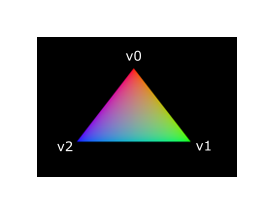

我们必须对两个渲染器进行一些更改才能完成此操作。首先，我们需要为三个顶点中的每一个顶点指定不同的颜色。顶点渲染器现在应该包含一个带有颜色的数组，就像位置对应的数组一样：

```glsl
vec3 colors[3] = vec3[](
    vec3(1.0, 0.0, 0.0),
    vec3(0.0, 1.0, 0.0),
    vec3(0.0, 0.0, 1.0)
);
```

现在我们只需要将这些每个顶点的颜色传递给段渲染器，这样段渲染器就可以将它们的插值结果输出到帧缓冲区。将颜色的输出添加到顶点渲染器并写入 `main` 函数：

```glsl
layout(location = 0) out vec3 fragColor;

void main() {
    gl_Position = vec4(positions[gl_VertexIndex], 0.0, 1.0);
    fragColor = colors[gl_VertexIndex];
}
```

接下来，我们需要在片段着色器中添加匹配的输入：

```glsl
layout(location = 0) in vec3 fragColor;

void main() {
    outColor = vec4(fragColor, 1.0);
}
```

段渲染器的输入变量不一定必须使用与顶点渲染器相同的名称，它们将使用 `location` 指令指定的索引连接在一起。 `main` 函数已修改为输出颜色和 alpha 值。 如上图所示，"fragColor"的值将自动为三个顶点之间的片段进行插值，从而产生平滑的渐变。

## 编译渲染器

在项目的根目录中创建一个名为“shaders”的目录，并将顶点渲染器存储在一个名为“shader.vert”的文件中，并将片段渲染器存储在该目录中的一个名为“shader.frag”的文件中。GLSL渲染器没有官方的扩展名，但这两个通常用来区分它们。

'shader.vert'内容如下：

```glsl
#version 450

layout(location = 0) out vec3 fragColor;

vec2 positions[3] = vec2[](
    vec2(0.0, -0.5),
    vec2(0.5, 0.5),
    vec2(-0.5, 0.5)
);

vec3 colors[3] = vec3[](
    vec3(1.0, 0.0, 0.0),
    vec3(0.0, 1.0, 0.0),
    vec3(0.0, 0.0, 1.0)
);

void main() {
    gl_Position = vec4(positions[gl_VertexIndex], 0.0, 1.0);
    fragColor = colors[gl_VertexIndex];
}
```

'shader.frag'内容如下：

```glsl
#version 450

layout(location = 0) in vec3 fragColor;

layout(location = 0) out vec4 outColor;

void main() {
    outColor = vec4(fragColor, 1.0);
}
```

我们将使用'glslc'程序对上述渲染器程序进行编译。

**Windows**

创建一个包含以下内容的'compile.bat'文件：

```bash
C:/VulkanSDK/x.x.x.x/Bin32/glslc.exe shader.vert -o vert.spv
C:/VulkanSDK/x.x.x.x/Bin32/glslc.exe shader.frag -o frag.spv
pause
```

将"glslc.exe"的路径替换为您安装 Vulkan SDK 的路径。双击该文件以运行它。

**Linux**

创建一个包含以下内容的'compile.sh'文件：

```bash
/home/user/VulkanSDK/x.x.x.x/x86_64/bin/glslc shader.vert -o vert.spv
/home/user/VulkanSDK/x.x.x.x/x86_64/bin/glslc shader.frag -o frag.spv
```

将"glslc"的路径替换为您安装的路径Vulkan SDK。 使用 `chmod +x compile.sh` 更改脚本可执行权限，然后运行它。

**面向不同平台的结束指令**

这两个命令告诉编译器读取 GLSL 源文件并使用 `-o`（输出）标志输出一个 SPIR-V 字节码文件。

如果您的着色器包含语法错误，那么编译器会按照您的预期告诉您错误行号和问题。 例如，尝试省略分号并再次运行编译脚本。您还可以尝试不带任何参数运行编译器，以查看编译器支持哪些类型的参数标志。例如，它还可以将字节码输出为人类可读的格式，这样您就可以准确地看到渲染器正在做什么以及在此阶段使用的任何优化。

在命令行上编译渲染器是最直接的选项之一，也是我们将在本教程中使用方法，但也可以直接从您自己的代码编译渲染器。 Vulkan SDK 包括 [libshaderc] https://github.com/google/shaderc)，它是一个库，用于从您的程序中将 GLSL 代码编译为 SPIR-V。

## 加载渲染器

现在我们有了一种生成 SPIR-V 渲染器的方法，是时候将它们加载到我们的程序中，以便在某个时候将它们插入到图形渲染管道中。 我们将首先编写一个简单的辅助函数来从文件中加载二进制数据。

```c++
#include <fstream>

...

static std::vector<char> readFile(const std::string& filename) {
    std::ifstream file(filename, std::ios::ate | std::ios::binary);

    if (!file.is_open()) {
        throw std::runtime_error("failed to open file!");
    }
}
```

`readFile` 函数将从指定文件中读取所有字节，并将它们返回到由 `std::vector` 管理的字节数组中。 我们首先使用两个参数标记打开件：

* `ate`: 从文件末尾开始阅读
* `binary`: 将文件读取为二进制文件（避免文本转换）

在文件末尾开始读取的好处是我们可以使用读取位置来确定文件的大小并分配缓冲区：

```c++
size_t fileSize = (size_t) file.tellg();
std::vector<char> buffer(fileSize);
```

之后，我们可以回到文件的开头并一次读取所有字节：

```c++
file.seekg(0);
file.read(buffer.data(), fileSize);
```

最后关闭文件并返回字节：

```c++
file.close();

return buffer;
```

我们现在将从函数`createGraphicsPipeline`调用这个文件读取函数来加载两个渲染器的字节码：

```c++
void createGraphicsPipeline() {
    auto vertShaderCode = readFile("shaders/vert.spv");
    auto fragShaderCode = readFile("shaders/frag.spv");
}
```

通过打印缓冲区的大小并检查它们是否与实际文件大小（以字节为单位）匹配，确保正确加载渲染器。 请注意，代码不需要以空值结尾，因为它是二进制代码，我们稍后将明确其大小。

## 创建渲染器模块

在我们可以将代码传递给管道之前，我们必须将它包装在一个`VkShaderModule` 对象。 让我们创建一个辅助函数 createShaderModule` 来做到这一点。

```c++
VkShaderModule createShaderModule(const std::vector<char>& code) {

}
```

该函数将使用字节码缓存作为参数，并从中创建一个`VkShaderModule`。

创建渲染器模块很简单，我们只需要将字节码缓存指针和缓存长度值填入结构体即可。 对应的结构体参数类型为 `VkShaderModuleCreateInfo` 。需要注意的是字节码的大小以字节为单位指定，而字节码缓存指针是 `uint32_t` 指针而不是 `char` 指针。 因此，我们需要使用 `reinterpret_cast` 来转换指针，如下所示。 当您执行这样的转换时，您还需要确保数据满足 `uint32_t` 的对齐要求。 幸运的是，数据存储在“std::vector”中，默认分配器已经确保数据满足最坏情况的对齐要求。

```c++
VkShaderModuleCreateInfo createInfo{};
createInfo.sType = VK_STRUCTURE_TYPE_SHADER_MODULE_CREATE_INFO;
createInfo.codeSize = code.size();
createInfo.pCode = reinterpret_cast<const uint32_t*>(code.data());
```

然后可以通过调用 `vkCreateShaderModule` 来创建 `VkShaderModule`：

```c++
VkShaderModule shaderModule;
if (vkCreateShaderModule(device, &createInfo, nullptr, &shaderModule) != VK_SUCCESS) {
    throw std::runtime_error("failed to create shader module!");
}
```

渲染器模块对象创建输入参数与之前的对象创建函数中的参数相同：逻辑设备、创建信息结构的指针、指向自定义分配器的可选指针和句柄输出变量。 创建渲染器模块后，可以立即释放包含代码的缓冲区。 不要忘记返回创建的渲染器模块：

```c++
return shaderModule;
```

渲染器模块只是我们之前从文件中加载的渲染器字节码和其中定义的函数的一个轻量包装器。 在创建图形管道之前，SPIR-V 字节码没有进行编译和链接，也不会转换为机器代码在GPU中执行。这意味着一旦管道创建完成，我们就可以再次销毁渲染器模块，这就是为什么我们将在 createGraphicsPipeline 函数中将它们设为局部变量而不是类成员：

```c++
void createGraphicsPipeline() {
    auto vertShaderCode = readFile("shaders/vert.spv");
    auto fragShaderCode = readFile("shaders/frag.spv");

    VkShaderModule vertShaderModule = createShaderModule(vertShaderCode);
    VkShaderModule fragShaderModule = createShaderModule(fragShaderCode);
```

然后，清理应该在函数的末尾通过添加两个调用 `vkDestroyShaderModule` 来进行。本章中所有剩余的代码都将插入到这些行之前。

```c++
    ...
    vkDestroyShaderModule(device, fragShaderModule, nullptr);
    vkDestroyShaderModule(device, vertShaderModule, nullptr);
}
```

## 渲染器在图形管道中的使用

要实际使用渲染器，我们需要通过 `VkPipelineShaderStageCreateInfo` 结构将它们分配给特定的管道阶段，作为实际管道创建过程的一部分。

我们将从填充顶点渲染器的结构开始，再次在`createGraphicsPipeline` 函数完善图形渲染管道的信息填充。

```c++
VkPipelineShaderStageCreateInfo vertShaderStageInfo{};
vertShaderStageInfo.sType = VK_STRUCTURE_TYPE_PIPELINE_SHADER_STAGE_CREATE_INFO;
vertShaderStageInfo.stage = VK_SHADER_STAGE_VERTEX_BIT;
```

其中，`sType`确认定义的参数类型，'stage'告诉 Vulkan 渲染器将在哪个管道阶段使用。上一章中描述的每个可编程阶段都有一个枚举值。

```c++
vertShaderStageInfo.module = vertShaderModule;
vertShaderStageInfo.pName = "main";
```

接下来的两个成员参数指定包含代码的渲染器模块，以及要调用的入口函数，称为*入口点*。 这意味着可以将多个片段渲染器组合到一个渲染器模块中，并使用不同的入口点来区分它们的行为。 但是，在一般情况下，我们将坚持使用标准的 `main`函数作为入口点。

还有一个（可选）成员，`pSpecializationInfo`，我们不会在这里使用，但它值得进一步说明。 它允许您指定渲染器常量的值。 您可以使用单个着色器模块，通过为其中使用的常量指定不同的值，可以在创建管道时配置其行为。 这比在渲染时使用变量配置渲染器更有效，因为编译器可以进行优化，例如消除依赖于这些值的“if”语句。 如果您没有任何类似的常量，那么您可以将成员设置为 `nullptr`，我们的结构初始化会自动执行此操作。

修改结构体成员变量以适应片段渲染器很容易，如下所示：

```c++
VkPipelineShaderStageCreateInfo fragShaderStageInfo{};
fragShaderStageInfo.sType = VK_STRUCTURE_TYPE_PIPELINE_SHADER_STAGE_CREATE_INFO;
fragShaderStageInfo.stage = VK_SHADER_STAGE_FRAGMENT_BIT;
fragShaderStageInfo.module = fragShaderModule;
fragShaderStageInfo.pName = "main";
```

最后定义一个包含这两个结构体变量的数组，稍后我们将在实际的管道创建步骤中使用它来引用它们。

```c++
VkPipelineShaderStageCreateInfo shaderStages[] = {vertShaderStageInfo, fragShaderStageInfo};
```

这就是管道中的可编程阶段的全部描述内容。 下一章，我们将讲解管道中的固定功能阶段。

[C++ code](https://vulkan-tutorial.com/code/09_shader_modules.cpp) /
[Vertex shader](https://vulkan-tutorial.com/code/09_shader_base.vert) /
[Fragment shader](https://vulkan-tutorial.com/code/09_shader_base.frag)


# 固定功能

较旧的图形 API 为图形管道的大多数阶段提供了默认状态。 在 Vulkan 中，从视口大小到颜色混合功能，您必须明确说明一切。 在本章中，我们将填写所有结构信息来配置这些固定功能操作。

## 输入顶点

`VkPipelineVertexInputStateCreateInfo` 结构描述了将被传递给顶点着色器的顶点数据的格式。它大致以两种方式描述了这一点：

* 绑定信息：单位数据之间的间距以及单位数据是逐顶点还是逐实例（参见 [实例]（https://en.wikipedia.org/wiki/Geometry_instancing））
* 属性描述：传递给顶点着色器的属性的类型，从哪个绑定加载它们以及在哪个偏移量开始加载。

因为在当前示例中我们直接在顶点着色器中对顶点数据进行硬编码，所以我们将填充这个结构变量以指定没有要加载的顶点数据。我们将在顶点缓冲区一章中进一步描述它。

```c++
VkPipelineVertexInputStateCreateInfo vertexInputInfo{};
vertexInputInfo.sType = VK_STRUCTURE_TYPE_PIPELINE_VERTEX_INPUT_STATE_CREATE_INFO;
vertexInputInfo.vertexBindingDescriptionCount = 0;
vertexInputInfo.pVertexBindingDescriptions = nullptr; // Optional
vertexInputInfo.vertexAttributeDescriptionCount = 0;
vertexInputInfo.pVertexAttributeDescriptions = nullptr; // Optional
```

`pVertexBindingDescriptions` 和 `pVertexAttributeDescriptions` 成员指向一个结构数组，这些结构描述了上述加载顶点数据的细节。`VkPipelineVertexInputStateCreateInfo`结构之后将添加到 `shaderStages` 数组之后的 `createGraphicsPipeline` 函数。

## 组件输入

`VkPipelineInputAssemblyStateCreateInfo` 结构描述了两件事：将从顶点绘制什么样的几何图形，以及是否应该启用图元重新绘制。 前者在 `topology` 成员中指定，并且可以具有以下值：

* `VK_PRIMITIVE_TOPOLOGY_POINT_LIST`：逐一绘制顶点
* `VK_PRIMITIVE_TOPOLOGY_LINE_LIST`：每两个顶点绘制线段，顶点不重复使用。
* `VK_PRIMITIVE_TOPOLOGY_LINE_STRIP`：绘制线段，每个线段的结束顶点用作下一行的开始顶点。
* `VK_PRIMITIVE_TOPOLOGY_TRIANGLE_LIST`：每 3 个顶点的三角形，不重复使用顶点。
* `VK_PRIMITIVE_TOPOLOGY_TRIANGLE_STRIP `：绘制三角形，每个三角形的第二个和第三个顶点用作下一个三角形的前两个顶点

通常，顶点是按顺序从顶点缓冲区按索引加载的，但是使用*元素缓冲区*，您可以指定要自己使用的索引。 这允许您执行优化，例如重用顶点。 如果将 `primitiveRestartEnable` 成员设置为 `VK_TRUE`，则可以使用 `0xFFFF` 或 `0xFFFFFFFF` 的特殊索引来分解 `_STRIP` 拓扑模式中的线和三角形。

当前示例我们只绘制一个三角形，因此我们按照如下方式设置组件输入：

```c++
VkPipelineInputAssemblyStateCreateInfo inputAssembly{};
inputAssembly.sType = VK_STRUCTURE_TYPE_PIPELINE_INPUT_ASSEMBLY_STATE_CREATE_INFO;
inputAssembly.topology = VK_PRIMITIVE_TOPOLOGY_TRIANGLE_LIST;
inputAssembly.primitiveRestartEnable = VK_FALSE;
```

## 视口和裁剪
视口描述了被渲染的帧缓冲区的输出区域。通常这个设置总是 `(0, 0)` 到 `(width, height)`，在本教程中也是如此。

```c++
VkViewport viewport{};
viewport.x = 0.0f;
viewport.y = 0.0f;
viewport.width = (float) swapChainExtent.width;
viewport.height = (float) swapChainExtent.height;
viewport.minDepth = 0.0f;
viewport.maxDepth = 1.0f;
```

请记住，交换链的大小及其图像可能与窗口的“宽度”和“高度”不同。 交换链图像稍后将用作帧缓冲区，因此我们应该坚持使用它们的大小。

`minDepth` 和 `maxDepth` 值指定用于帧缓冲区的深度值范围。 这些值必须在 `[0.0f, 1.0f]` 范围内，但 `minDepth` 可能高于 `maxDepth`。 如果你没有做任何特别的事情，那么你应该坚持 0.0f 和 1.0f 的标准值。

视口定义了从图像到帧缓冲区的转换，而裁剪矩形定义了实际存储像素的区域。 裁剪矩形之外的任何像素都将被光栅化器丢弃。 它们的功能类似于过滤器而不是转换。 区别如下图所示。 请注意，左侧裁剪矩形只是产生该图像的众多方式之一，只要帧缓冲区尺寸大于视口即可。


在本示例中，我们只是想要简单的绘制整个帧缓冲区，所以我们需要裁剪区域完整覆盖帧缓冲区：

```c++
VkRect2D scissor{};
scissor.offset = {0, 0};
scissor.extent = swapChainExtent;
```

现在这个视口和裁剪矩形需要使用 `VkPipelineViewportStateCreateInfo` 结构组合成一个视口状态。可以在某些显卡上使用多个视口和裁剪矩形，因此其成员引用它们的数组。使用多个配置需要启用 GPU特性功能（请参阅逻辑设备创建）。

```c++
VkPipelineViewportStateCreateInfo viewportState{};
viewportState.sType = VK_STRUCTURE_TYPE_PIPELINE_VIEWPORT_STATE_CREATE_INFO;
viewportState.viewportCount = 1;
viewportState.pViewports = &viewport;
viewportState.scissorCount = 1;
viewportState.pScissors = &scissor;
```

## 光栅化器

光栅化器获取由顶点渲染器中的顶点形成的几何图形，并将其转换为片段后由片段渲染器着色。 它还执行 [深度测试](https://en.wikipedia.org/wiki/Z-buffering)、[人脸剔除](https://en.wikipedia.org/wiki/Back-face_culling) 和裁剪测试，它可以配置为输出填充整个多边形或仅边缘的片段（线框渲染）。 所有这些都是使用 `VkPipelineRasterizationStateCreateInfo` 结构配置的。

```c++
VkPipelineRasterizationStateCreateInfo rasterizer{};
rasterizer.sType = VK_STRUCTURE_TYPE_PIPELINE_RASTERIZATION_STATE_CREATE_INFO;
rasterizer.depthClampEnable = VK_FALSE;
```

如果 `depthClampEnable` 设置为 `VK_TRUE`，则超出近平面和远平面的片段将被保留而不是丢弃它们。 这在一些特殊情况下很有用，比如阴影贴图。 使用它需要启用 GPU 特性功能。

```c++
rasterizer.rasterizerDiscardEnable = VK_FALSE;
```

如果 `rasterizerDiscardEnable` 设置为 `VK_TRUE`，则几何图形永远不会通过光栅化阶段。 这会禁用了帧缓冲区的任何输出。

```c++
rasterizer.polygonMode = VK_POLYGON_MODE_FILL;
```

`polygonMode` 决定了如何为几何体生成片段的方式。 可以使用以下模式：

* `VK_POLYGON_MODE_FILL`：填充多边形区域
* `VK_POLYGON_MODE_LINE`：多边形边缘绘制
* `VK_POLYGON_MODE_POINT`：多边形顶点绘制

使用填充以外的任何模式都需要启用 GPU 特性功能。

```c++
rasterizer.lineWidth = 1.0f;
```

`lineWidth` 成员很简单，它根据片段的数量来描述线条的粗细。 支持的最大线宽取决于硬件，任何比 `1.0f` 粗的线都需要您启用 `wideLines` GPU 功能。

```c++
rasterizer.cullMode = VK_CULL_MODE_BACK_BIT;
rasterizer.frontFace = VK_FRONT_FACE_CLOCKWISE;
```

`cullMode` 变量确定要使用的面剔除类型。您可以禁用剔除、剔除正面、剔除背面或两者。`frontFace` 变量指定被视为正面的面的顶点顺序，可以是顺时针或逆时针。

```c++
rasterizer.depthBiasEnable = VK_FALSE;
rasterizer.depthBiasConstantFactor = 0.0f; // Optional
rasterizer.depthBiasClamp = 0.0f; // Optional
rasterizer.depthBiasSlopeFactor = 0.0f; // Optional
```

光栅化器可以通过添加一个常数值或根据片段的斜率对它们进行偏置来改变深度值。这有时用于阴影贴图，但目前的示例中我们不会使用它。只需将 `depthBiasEnable` 设置为 `VK_FALSE`。

## 多重采样

`VkPipelineMultisampleStateCreateInfo` 结构体中可配置多重采样，这是执行反锯齿 [anti-aliasing] 的方法之一（https://en.wikipedia.org/wiki/Multisample_anti-aliasing）。它通过将光栅化到同一像素的多个多边形的片段渲染器结果组合在一起来工作。 这主要发生在边缘，这也是最明显的锯齿伪影发生的地方。 因为如果只有一个多边形映射到一个像素，它不需要多次运行片段渲染器，所以它比简单地渲染到更高分辨率和然后缩小的计算开销要小得多。 启用它需要启用 GPU 特性功能。

```c++
VkPipelineMultisampleStateCreateInfo multisampling{};
multisampling.sType = VK_STRUCTURE_TYPE_PIPELINE_MULTISAMPLE_STATE_CREATE_INFO;
multisampling.sampleShadingEnable = VK_FALSE;
multisampling.rasterizationSamples = VK_SAMPLE_COUNT_1_BIT;
multisampling.minSampleShading = 1.0f; // Optional
multisampling.pSampleMask = nullptr; // Optional
multisampling.alphaToCoverageEnable = VK_FALSE; // Optional
multisampling.alphaToOneEnable = VK_FALSE; // Optional
```

我们将在后面的章节中重新讨论多重采样，现在让我们禁用它。

## 深度和模板测试

如果您使用的是深度和/或模板缓冲区，那么您还需要使用 `VkPipelineDepthStencilStateCreateInfo` 配置深度和模板测试。 我们现在没有，所以我们可以简单地传递一个 `nullptr` 而不是一个指针.对于这样的结构。 我们将在深度缓冲一章中做进一步描述。

## 颜色混合

片段渲染器返回颜色后，需要将其与帧缓冲区中已有的颜色组合。 这种转换称为颜色混合，有两种方法可以做到：

* 混合旧值和新值以产生最终颜色
* 使用按位运算组合旧值和新值

有两种类型的结构来配置颜色混合。 第一个结构“VkPipelineColorBlendAttachmentState”包含每个附加帧缓冲区的配置，第二个结构“VkPipelineColorBlendStateCreateInfo”包含*全局*颜色混合设置。 在我们的例子中，我们只有一个帧缓冲区：

```c++
VkPipelineColorBlendAttachmentState colorBlendAttachment{};
colorBlendAttachment.colorWriteMask = VK_COLOR_COMPONENT_R_BIT | VK_COLOR_COMPONENT_G_BIT | VK_COLOR_COMPONENT_B_BIT | VK_COLOR_COMPONENT_A_BIT;
colorBlendAttachment.blendEnable = VK_FALSE;
colorBlendAttachment.srcColorBlendFactor = VK_BLEND_FACTOR_ONE; // Optional
colorBlendAttachment.dstColorBlendFactor = VK_BLEND_FACTOR_ZERO; // Optional
colorBlendAttachment.colorBlendOp = VK_BLEND_OP_ADD; // Optional
colorBlendAttachment.srcAlphaBlendFactor = VK_BLEND_FACTOR_ONE; // Optional
colorBlendAttachment.dstAlphaBlendFactor = VK_BLEND_FACTOR_ZERO; // Optional
colorBlendAttachment.alphaBlendOp = VK_BLEND_OP_ADD; // Optional
```

这个 per-framebuffer 结构允许您配置第一种颜色混合方式。以下伪代码较好的演示了将要执行的操作：

```c++
if (blendEnable) {
    finalColor.rgb = (srcColorBlendFactor * newColor.rgb) <colorBlendOp> (dstColorBlendFactor * oldColor.rgb);
    finalColor.a = (srcAlphaBlendFactor * newColor.a) <alphaBlendOp> (dstAlphaBlendFactor * oldColor.a);
} else {
    finalColor = newColor;
}

finalColor = finalColor & colorWriteMask;
```

如果 `blendEnable` 设置为 `VK_FALSE`，那么来自片段渲染器的新颜色将不加修改地通过。 否则，执行两个混合操作以计算新颜色。 生成的颜色与“colorWriteMask”进行“与”运算，以确定实际通过哪些通道。

使用颜色混合最常见的方法是实现 alpha 混合，我们希望新颜色根据其不透明度与旧颜色混合。 `finalColor` 应按如下方式计算：

```c++
finalColor.rgb = newAlpha * newColor + (1 - newAlpha) * oldColor;
finalColor.a = newAlpha.a;
```

这可以通过以下参数来完成：

```c++
colorBlendAttachment.blendEnable = VK_TRUE;
colorBlendAttachment.srcColorBlendFactor = VK_BLEND_FACTOR_SRC_ALPHA;
colorBlendAttachment.dstColorBlendFactor = VK_BLEND_FACTOR_ONE_MINUS_SRC_ALPHA;
colorBlendAttachment.colorBlendOp = VK_BLEND_OP_ADD;
colorBlendAttachment.srcAlphaBlendFactor = VK_BLEND_FACTOR_ONE;
colorBlendAttachment.dstAlphaBlendFactor = VK_BLEND_FACTOR_ZERO;
colorBlendAttachment.alphaBlendOp = VK_BLEND_OP_ADD;
```

您可以在Vulkan规范中的“VkBlendFactor”和“VkBlendOp”枚举中找到所有可能的操作。

第二个结构引用所有帧缓冲区的结构数组，并允许您设置混合常量，您可以在上述计算中用作混合因子。

```c++
VkPipelineColorBlendStateCreateInfo colorBlending{};
colorBlending.sType = VK_STRUCTURE_TYPE_PIPELINE_COLOR_BLEND_STATE_CREATE_INFO;
colorBlending.logicOpEnable = VK_FALSE;
colorBlending.logicOp = VK_LOGIC_OP_COPY; // Optional
colorBlending.attachmentCount = 1;
colorBlending.pAttachments = &colorBlendAttachment;
colorBlending.blendConstants[0] = 0.0f; // Optional
colorBlending.blendConstants[1] = 0.0f; // Optional
colorBlending.blendConstants[2] = 0.0f; // Optional
colorBlending.blendConstants[3] = 0.0f; // Optional
```

如果要使用第二种混合方法（按位组合），则应将 `logicOpEnable` 设置为 `VK_TRUE`。 然后可以在“logicOp”字段中指定按位运算。 请注意，这将自动禁用第一种方法，就好像您为每个附加的帧缓冲区设置了 `blendEnable` 为 `VK_FALSE`！ `colorWriteMask` 也将在此模式下用于确定帧缓冲区中的哪些通道实际上会受到影响。也可以禁用这两种模式，就像我们在这里所做的那样，在这种情况下，片段颜色将不加修改地写入帧缓冲区。

## 动态状态

我们在前面的结构中指定了有限的状态数量，实际上我们可以在不重新创建管道的情况下更改状态。例如视口的大小、行宽和混合常量。 如果你想这样做，那么你必须填写一个 如下的VkPipelineDynamicStateCreateInfo` 结构：

```c++
VkDynamicState dynamicStates[] = {
    VK_DYNAMIC_STATE_VIEWPORT,
    VK_DYNAMIC_STATE_LINE_WIDTH
};

VkPipelineDynamicStateCreateInfo dynamicState{};
dynamicState.sType = VK_STRUCTURE_TYPE_PIPELINE_DYNAMIC_STATE_CREATE_INFO;
dynamicState.dynamicStateCount = 2;
dynamicState.pDynamicStates = dynamicStates;
```

设置动态状态将导致这些值的配置被忽略，您将需要在绘图时指定参数数据。我们将在以后的章节中做进一步展开讲解。如果您没有任何动态状态，此结构可以用 `nullptr` 替换。

## 管道布局

您可以在渲染器中使用 `uniform` 值，它们是类似于动态状态变量的全局变量，可以在绘制时更改该值以调整渲染器的行为，而无需重新创建渲染器。 它们通常用于将变换矩阵传递给顶点着色器，或在片段渲染器中创建纹理采样器。

这些统一属性值需要在管道创建期间通过创建一个 `VkPipelineLayout` 对象来指定。即使我们在下一章后才会使用它们，目前的示例我们仍然需要创建一个空的管道布局。

创建一个类成员来保存这个对象，因为我们稍后会从其他函数中引用它：

```c++
VkPipelineLayout pipelineLayout;
```

然后在 createGraphicsPipeline` 函数中创建对象：

```c++
VkPipelineLayoutCreateInfo pipelineLayoutInfo{};
pipelineLayoutInfo.sType = VK_STRUCTURE_TYPE_PIPELINE_LAYOUT_CREATE_INFO;
pipelineLayoutInfo.setLayoutCount = 0; // Optional
pipelineLayoutInfo.pSetLayouts = nullptr; // Optional
pipelineLayoutInfo.pushConstantRangeCount = 0; // Optional
pipelineLayoutInfo.pPushConstantRanges = nullptr; // Optional

if (vkCreatePipelineLayout(device, &pipelineLayoutInfo, nullptr, &pipelineLayout) != VK_SUCCESS) {
    throw std::runtime_error("failed to create pipeline layout!");
}
```

该结构还指定 *push constants*，这是将动态值传递给渲染器的另一种方式，我们可能会在以后的章节中介绍。 管道布局将在程序的整个生命周期中被引用，所以它应该在最后被销毁：

```c++
void cleanup() {
    vkDestroyPipelineLayout(device, pipelineLayout, nullptr);
    ...
}
```

## 结论

这就是所有的固定功能状态！设置所有的固定功能状态工作量很大，这是从头开始的，但优点是我们现在几乎完全了解图形管道中发生的一切！这减少了遇到意外行为的机会，因为某些组件的默认状态可能不是您所期望的。

然而，在我们最终创建图形管道之前，还需要创建一个对象，那就是 [render pass](#渲染通道)。

[C++ code](https://vulkan-tutorial.com/code/10_fixed_functions.cpp) /
[Vertex shader](https://vulkan-tutorial.com/code/09_shader_base.vert) /
[Fragment shader](https://vulkan-tutorial.com/code/09_shader_base.frag)


# 渲染通道

## 设置

在我们完成创建管道之前，我们需要告诉 Vulkan 渲染时将使用的帧缓冲区附件。我们需要指定将有多少颜色和深度缓冲区，为每个缓冲区使用多少样本，以及在整个渲染操作中如何处理它们的内容。所有这些信息都包装在一个 *render pass* 对象中，我们将为此创建一个新的 `createRenderPass` 函数。在 调用`createGraphicsPipeline` 函数之前从 `initVulkan` 调用此函数。

```c++
void initVulkan() {
    createInstance();
    setupDebugMessenger();
    createSurface();
    pickPhysicalDevice();
    createLogicalDevice();
    createSwapChain();
    createImageViews();
    createRenderPass();
    createGraphicsPipeline();
}

...

void createRenderPass() {

}
```

## 附件说明

在当前的例子中，只有一个颜色缓冲区附件，由交换链中的一个图像表示。

```c++
void createRenderPass() {
    VkAttachmentDescription colorAttachment{};
    colorAttachment.format = swapChainImageFormat;
    colorAttachment.samples = VK_SAMPLE_COUNT_1_BIT;
}
```

颜色附件的“格式”应该与交换链图像的格式相匹配，我们没有用到多重采样，所以我们使用1个样本采样。

```c++
colorAttachment.loadOp = VK_ATTACHMENT_LOAD_OP_CLEAR;
colorAttachment.storeOp = VK_ATTACHMENT_STORE_OP_STORE;
```

`loadOp` 和 `storeOp` 分别决定了在渲染前和渲染后如何处理附件中的数据。 `loadOp` 的设置有以下选择：

* `VK_ATTACHMENT_LOAD_OP_LOAD`：保留附件的现有内容
* `VK_ATTACHMENT_LOAD_OP_CLEAR`：在开始时将值清除为常量
* `VK_ATTACHMENT_LOAD_OP_DONT_CARE`：现有内容未定义； 不做任何处理。

在我们的例子中，我们将在绘制新帧之前使用清除操作将帧缓冲区清除为黑色。 `storeOp` 只有两种可能性：

* `VK_ATTACHMENT_STORE_OP_STORE`: 渲染的内容将存储在内存中，以后可以读取。
* `VK_ATTACHMENT_STORE_OP_DONT_CARE`：渲染操作后帧缓冲区的内容将未定义。

我们计划在屏幕上看到渲染的三角形，所以我们在这里进行存储操作。

```c++
colorAttachment.stencilLoadOp = VK_ATTACHMENT_LOAD_OP_DONT_CARE;
colorAttachment.stencilStoreOp = VK_ATTACHMENT_STORE_OP_DONT_CARE;
```

`loadOp` 和 `storeOp` 适用于颜色和深度数据，`stencilLoadOp` / `stencilStoreOp` 适用于模板数据。当前的应用程序不会对模板缓冲区做任何事情，因此加载和存储的结果是无关紧要的。

```c++
colorAttachment.initialLayout = VK_IMAGE_LAYOUT_UNDEFINED;
colorAttachment.finalLayout = VK_IMAGE_LAYOUT_PRESENT_SRC_KHR;
```

Vulkan 中的纹理和帧缓冲区由具有特定像素格式的“VkImage”对象表示。其中，内存中像素的布局可能会根据您尝试对图像执行的操作而改变。

一些最常见的布局是：

* `VK_IMAGE_LAYOUT_COLOR_ATTACHMENT_OPTIMAL`：用作颜色附件的图像
* `VK_IMAGE_LAYOUT_PRESENT_SRC_KHR`：要在交换链中呈现的图像
* `VK_IMAGE_LAYOUT_TRANSFER_DST_OPTIMAL`：用作内存复制操作目标的图像

我们将在后续的纹理章节中更深入地讨论这个主题，但现在重要的是要知道图像需要转换为适合它们后续操作的特定布局。

`initialLayout` 指定在渲染过程开始之前图像将具有的布局。 `finalLayout` 指定渲染过程完成时自动转换到的布局。 为 `initialLayout` 使用 `VK_IMAGE_LAYOUT_UNDEFINED` 意味着我们不关心图像之前的布局。这个特殊值的警告是图像的内容不能保证被保留，但这并不重要，因为我们会清除它。我们希望图像在渲染后使用交换链准备好呈现，这就是我们使用`VK_IMAGE_LAYOUT_PRESENT_SRC_KHR`作为`finalLayout`的原因。

## 子通道和附件参考

单个渲染通道可以包含多个子通道。子通道是后续渲染操作，它依赖于先前通道中帧缓冲区的内容，类似一系列后处理效果，这些效果一个接一个地应用。 如果您将这些渲染操作分组到一个渲染过程中，那么 Vulkan 能够重新排序操作并节省内存带宽以获得更好的性能。 然而，对于我们的第一个三角形，我们使用单个子通道即可。

每个子通道都引用一个或多个前文介绍的结构描述附件。可通过`VkAttachmentReference` 结构实现引用，如下所示：

```c++
VkAttachmentReference colorAttachmentRef{};
colorAttachmentRef.attachment = 0;
colorAttachmentRef.layout = VK_IMAGE_LAYOUT_COLOR_ATTACHMENT_OPTIMAL;
```

`attachment` 参数通过附件描述数组中的索引指定要引用的附件。检索的数组由一个 `VkAttachmentDescription` 组成，所以它的索引是 `0`。 `layout` 指定了我们希望附件在使用此引用的子通道期间具有的布局。当 subpass 启动时，Vulkan 会自动将附件转换到此布局。我们打算将附件用作颜色缓冲区，正如其名称所暗示的那样，“VK_IMAGE_LAYOUT_COLOR_ATTACHMENT_OPTIMAL”布局将为我们提供最佳性能。

渲染子通道使用 `VkSubpassDescription` 结构描述:

```c++
VkSubpassDescription subpass{};
subpass.pipelineBindPoint = VK_PIPELINE_BIND_POINT_GRAPHICS;
```

Vulkan将来也可能支持计算子通道，因此我们必须明确说明这是一个图形子通道。接下来，我们指定对颜色附件的引用：

```c++
subpass.colorAttachmentCount = 1;
subpass.pColorAttachments = &colorAttachmentRef;
```

该数组中附件的索引直接从片段渲染器中引用，使用 `layout(location = 0) out vec4 outColor` 指令！

子通道可以引用以下其他类型的附件：

* `pInputAttachments`：从渲染器中读取的附件
* `pResolveAttachments`：用于多重颜色采样的附件
* `pDepthStencilAttachment`：深度和模板数据的附件
* `pPreserveAttachments`：此子通道不使用的附件，但可用于保留必须的数据。

## 渲染通道

现在已经描述了附件和引用它的渲染子通道，我们可以自己创建渲染通道了。 创建一个新的类成员变量来保存 `pipelineLayout` 变量正上方的 `VkRenderPass` 对象：

```c++
VkRenderPass renderPass;
VkPipelineLayout pipelineLayout;
```

然后可以通过使用附件和子通道数组填充“VkRenderPassCreateInfo”结构来创建渲染通道对象。`VkAttachmentReference` 对象使用此数组的索引引用附件，用以表明各子通道所使用的附件的引用。

```c++
VkRenderPassCreateInfo renderPassInfo{};
renderPassInfo.sType = VK_STRUCTURE_TYPE_RENDER_PASS_CREATE_INFO;
renderPassInfo.attachmentCount = 1;
renderPassInfo.pAttachments = &colorAttachment;
renderPassInfo.subpassCount = 1;
renderPassInfo.pSubpasses = &subpass;

if (vkCreateRenderPass(device, &renderPassInfo, nullptr, &renderPass) != VK_SUCCESS) {
    throw std::runtime_error("failed to create render pass!");
}
```

就像管道布局一样，渲染通道将在整个程序中被引用，所以它应该只在最后被清理：

```c++
void cleanup() {
    vkDestroyPipelineLayout(device, pipelineLayout, nullptr);
    vkDestroyRenderPass(device, renderPass, nullptr);
    ...
}
```

目前已经实现了很多工作，但在下一章我们才对这些步骤汇总创建最终的图形管道对象！

[C++ code](https://vulkan-tutorial.com/code/11_render_passes.cpp) /
[Vertex shader](https://vulkan-tutorial.com/code/09_shader_base.vert) /
[Fragment shader](https://vulkan-tutorial.com/code/09_shader_base.frag)


# 结论

我们现在可以结合前面章节中的所有结构和对象来创建图形管道！以下列表是我们现在拥有的对象类型，可作为快速回顾：

* 渲染器阶段：定义图形管线可编程阶段功能的渲染器模块
* 固定功能阶段：定义管道固定功能阶段的所有结构，如输入组件、光栅化器、视口和颜色混合
* 管道布局阶段：着色器引用的统一和推送值，可以在绘制时更新
* 渲染通道阶段：管道阶段引用的附件及其用法

所有这些阶段的组合完整定义了图形管道的功能，因此我们现在可以在`createGraphicsPipeline`函数的末尾开始填充
`VkGraphicsPipelineCreateInfo`结构。这些步骤需要在调用`vkDestroyShaderModule`之前执行，因为渲染器对象需要在管道创建期间使用。

```c++
VkGraphicsPipelineCreateInfo pipelineInfo{};
pipelineInfo.sType = VK_STRUCTURE_TYPE_GRAPHICS_PIPELINE_CREATE_INFO;
pipelineInfo.stageCount = 2;
pipelineInfo.pStages = shaderStages;
```

我们首先引用`VkPipelineShaderStageCreateInfo`结构体的数组。

```c++
pipelineInfo.pVertexInputState = &vertexInputInfo;
pipelineInfo.pInputAssemblyState = &inputAssembly;
pipelineInfo.pViewportState = &viewportState;
pipelineInfo.pRasterizationState = &rasterizer;
pipelineInfo.pMultisampleState = &multisampling;
pipelineInfo.pDepthStencilState = nullptr; // Optional
pipelineInfo.pColorBlendState = &colorBlending;
pipelineInfo.pDynamicState = nullptr; // Optional
```

然后我们参考固定功能阶段的所有信息对结构体进行填充。
Then we reference all of the structures describing the fixed-function stage.

```c++
pipelineInfo.layout = pipelineLayout;
```

之后是管道布局，`pipelineLayout`是Vulkan句柄而不是结构指针。

```c++
pipelineInfo.renderPass = renderPass;
pipelineInfo.subpass = 0;
```

最后，我们有了渲染通道的引用和将使用此图形管道的子通道的索引。
同样可以在此管道中使用其他类型的通道（如计算通道），而不是特定的渲染通道，但它们必须*兼容*与`renderPass`。
[此处] (https://www.khronos.org/registry/vulkan/specs/1.3-extensions/html/chap8.html#renderpass-compatibility)
描述了兼容性要求，但在本教程我们不会使用其他类型的通道。

```c++
pipelineInfo.basePipelineHandle = VK_NULL_HANDLE; // Optional
pipelineInfo.basePipelineIndex = -1; // Optional
```

实际上还有两个参数：`basePipelineHandle` 和 `basePipelineIndex`。Vulkan 允许您通过从现有管道派生来创建新的图形管道。当管道与现有管道有很多共同的功能时，管道派生建立管道的成本更低，并且来自同一父级的管道之间的切换也可以更快地完成。您可以使用 `basePipelineHandle` 指定现有管道的句柄，也可以使用 `basePipelineIndex` 引用即将由索引创建的另一个管道。现在只有一个管道，所以我们只需指定一个空句柄和一个无效索引。只有在 `VkGraphicsPipelineCreateInfo`的 `flags` 字段中也指定了 `VK_PIPELINE_CREATE_DERIVATIVE_BIT` 标志时，才使用这些值。

现在通过创建一个类成员来保存“VkPipeline”对象，为最后一步做准备：

```c++
VkPipeline graphicsPipeline;
```

最后创建图形管道：

```c++
if (vkCreateGraphicsPipelines(device, VK_NULL_HANDLE, 1, &pipelineInfo, nullptr, &graphicsPipeline) != VK_SUCCESS) {
    throw std::runtime_error("failed to create graphics pipeline!");
}
```

`vkCreateGraphicsPipelines` 函数实际上比 Vulkan 中通常的对象创建函数有更多的参数。 它旨在获取多个 `VkGraphicsPipelineCreateInfo` 对象并在一次调用中创建多个 `VkPipeline` 对象。

第二个参数，我们已经为其传递了 `VK_NULL_HANDLE` 参数，它引用了一个可选的 `VkPipelineCache` 对象。管道缓存可用于跨多次调用“vkCreateGraphicsPipelines”甚至跨程序执行存储和重用与管道创建相关的数据（如果缓存存储到文件）。 这使得以后可以显着加快管道创建速度。 我们将在管道缓存一章中讨论这个问题。

所有常见的绘图操作都需要图形管道，因此它也应该只在程序结束时销毁：

```c++
void cleanup() {
    vkDestroyPipeline(device, graphicsPipeline, nullptr);
    vkDestroyPipelineLayout(device, pipelineLayout, nullptr);
    ...
}
```

经过了这些辛勤的工作，现在运行您的程序，可以确认管道创建成功！现阶段的工作进度，我们已经很快能在屏幕上弹出一些东西了。在接下来的几章中，我们将从交换链图像中设置实际的帧缓冲区并准备绘图命令。

[C++ code](https://vulkan-tutorial.com/code/12_graphics_pipeline_complete.cpp) /
[Vertex shader](https://vulkan-tutorial.com/code/09_shader_base.vert) /
[Fragment shader](https://vulkan-tutorial.com/code/09_shader_base.frag)


# 帧缓存

在过去的几章中，我们已经讨论了很多关于帧缓冲区的内容，并且我们已经设置了渲染通道以期望一个与交换链图像格式相同的帧缓冲区，但我们实际上还没有创建任何帧缓冲区。

在渲染过程创建期间指定的附件通过将它们包装到一个 `VkFramebuffer` 对象中来绑定。帧缓冲区对象引用了所有代表附件的 `VkImageView` 对象。 在我们的例子中，虽然只有一个颜色附件。然而，程序用于显示的附件中使用的图像取决于从交换链中检索返回的图像。这意味着我们必须为交换链中的所有图像创建一个帧缓冲区，并在绘制时使用与检索到的图像相对应的帧缓冲区。

为此，创建另一个 `std::vector` 类成员来保存帧缓冲区：

```c++
std::vector<VkFramebuffer> swapChainFramebuffers;
```

我们将在创建图形管道后立即从 `initVulkan` 调用的新函数 `createFramebuffers` 中为该数组创建对象：

```c++
void initVulkan() {
    createInstance();
    setupDebugMessenger();
    createSurface();
    pickPhysicalDevice();
    createLogicalDevice();
    createSwapChain();
    createImageViews();
    createRenderPass();
    createGraphicsPipeline();
    createFramebuffers();
}

...

void createFramebuffers() {

}
```

首先调整容器的大小以容纳所有帧缓冲区：

```c++
void createFramebuffers() {
    swapChainFramebuffers.resize(swapChainImageViews.size());
}
```

然后我们将遍历图像视图并从中创建帧缓冲区：

```c++
for (size_t i = 0; i < swapChainImageViews.size(); i++) {
    VkImageView attachments[] = {
        swapChainImageViews[i]
    };

    VkFramebufferCreateInfo framebufferInfo{};
    framebufferInfo.sType = VK_STRUCTURE_TYPE_FRAMEBUFFER_CREATE_INFO;
    framebufferInfo.renderPass = renderPass;
    framebufferInfo.attachmentCount = 1;
    framebufferInfo.pAttachments = attachments;
    framebufferInfo.width = swapChainExtent.width;
    framebufferInfo.height = swapChainExtent.height;
    framebufferInfo.layers = 1;

    if (vkCreateFramebuffer(device, &framebufferInfo, nullptr, &swapChainFramebuffers[i]) != VK_SUCCESS) {
        throw std::runtime_error("failed to create framebuffer!");
    }
}
```

如您所见，帧缓冲区的创建非常简单。 我们首先需要指定帧缓冲区需要与哪个 `renderPass` 结合。您只能将帧缓冲区与它集合的渲染通道一起使用，这意味着它们使用相同数量和类型的附件。

`attachmentCount` 和 `pAttachments` 参数指定应绑定到渲染通道 `pAttachment` 数组中的相应附件描述的 `VkImageView` 对象。

`width` 和 `height` 参数分别表示帧缓冲区的宽度与高度。`layers` 是指图像数组中的层数。我们的交换链图像是单张图像，因此层数为“1”：

```c++
void cleanup() {
    for (auto framebuffer : swapChainFramebuffers) {
        vkDestroyFramebuffer(device, framebuffer, nullptr);
    }

    ...
}
```

我们现在已经达到了一个里程碑。我们已经拥有渲染所需的所有对象的。 在下一章中，我们将编写第一个实际的渲染绘图命令。

[C++ code](https://vulkan-tutorial.com/code/13_framebuffers.cpp) /
[Vertex shader](https://vulkan-tutorial.com/code/09_shader_base.vert) /
[Fragment shader](https://vulkan-tutorial.com/code/09_shader_base.frag)


# 命令缓冲区

Vulkan 中的命令，如绘图操作和内存传输，不是直接使用函数调用执行的。您必须在命令缓冲区对象中记录要执行的所有操作。这样做的好处是，所有设置绘图命令的繁重工作都可以提前在多个线程中完成。之后，您只需告诉 Vulkan 执行主循环中的命令。

## 命令池

我们必须先创建一个命令池，然后才能创建命令缓冲区。命令池管理用于存储缓冲区的内存，并从中分配命令缓冲区。添加一个新的类成员来存储一个 `VkCommandPool`：

```c++
VkCommandPool commandPool;
```

然后创建一个新函数 `createCommandPool` 并在创建帧缓冲区后从 `initVulkan` 调用它。

```c++
void initVulkan() {
    createInstance();
    setupDebugMessenger();
    createSurface();
    pickPhysicalDevice();
    createLogicalDevice();
    createSwapChain();
    createImageViews();
    createRenderPass();
    createGraphicsPipeline();
    createFramebuffers();
    createCommandPool();
}

...

void createCommandPool() {

}
```

命令池创建只需要两个参数：

```c++
QueueFamilyIndices queueFamilyIndices = findQueueFamilies(physicalDevice);

VkCommandPoolCreateInfo poolInfo{};
poolInfo.sType = VK_STRUCTURE_TYPE_COMMAND_POOL_CREATE_INFO;
poolInfo.queueFamilyIndex = queueFamilyIndices.graphicsFamily.value();
poolInfo.flags = 0; // Optional
```

命令缓冲区将被提交到特定类型的设备队列来执行命令，例如前文介绍的图形渲染队列和显示队列。每个命令池只能被分配到单一类型的队列上，并从中提交的命令缓冲区。我们将记录绘图命令，这就是我们选择图形渲染队列的原因。

命令池有两个可能的标志：

* `VK_COMMAND_POOL_CREATE_TRANSIENT_BIT`：提示命令缓冲区经常用新命令重新记录（可能会改变内存分配行为）
* `VK_COMMAND_POOL_CREATE_RESET_COMMAND_BUFFER_BIT`：允许单独重新记录命令缓冲区，如果没有此标志，它们都必须一起重置

我们只会在程序开始时记录命令缓冲区，然后在主循环中多次执行它们，因此我们不会使用这些标志中的任何一个。

```c++
if (vkCreateCommandPool(device, &poolInfo, nullptr, &commandPool) != VK_SUCCESS) {
    throw std::runtime_error("failed to create command pool!");
}
```

使用 `vkCreateCommandPool` 函数完成创建命令池。它没有任何特殊参数。命令将在整个程序中用于在屏幕上绘制东西，所以命令池应该只在最后被销毁：

```c++
void cleanup() {
    vkDestroyCommandPool(device, commandPool, nullptr);

    ...
}
```

## 命令缓冲区的分配

我们现在可以开始分配命令缓冲区并在其中记录绘图命令。因为一个绘图命令需要绑定正确的“VkFramebuffer”，类似的，交换链中的每个渲染图像都需要记录在一个命令缓冲区。 为此，创建一个 `VkCommandBuffer` 对象列表作为类成员。 命令缓冲区将在其命令池被销毁时自动释放，因此我们不需要显式清理。

```c++
std::vector<VkCommandBuffer> commandBuffers;
```

我们现在将开始实现并调用一个`createCommandBuffers` 函数，它为每个交换链图像分配并记录命令。

```c++
void initVulkan() {
    createInstance();
    setupDebugMessenger();
    createSurface();
    pickPhysicalDevice();
    createLogicalDevice();
    createSwapChain();
    createImageViews();
    createRenderPass();
    createGraphicsPipeline();
    createFramebuffers();
    createCommandPool();
    createCommandBuffers();
}

...

void createCommandBuffers() {
    commandBuffers.resize(swapChainFramebuffers.size());
}
```

使用 `vkAllocateCommandBuffers` 函数可对命令缓冲区进行分配，该函数将 `VkCommandBufferAllocateInfo` 结构作为参数，指定命令池和要分配的缓冲区数量：

```c++
VkCommandBufferAllocateInfo allocInfo{};
allocInfo.sType = VK_STRUCTURE_TYPE_COMMAND_BUFFER_ALLOCATE_INFO;
allocInfo.commandPool = commandPool;
allocInfo.level = VK_COMMAND_BUFFER_LEVEL_PRIMARY;
allocInfo.commandBufferCount = (uint32_t) commandBuffers.size();

if (vkAllocateCommandBuffers(device, &allocInfo, commandBuffers.data()) != VK_SUCCESS) {
    throw std::runtime_error("failed to allocate command buffers!");
}
```

`level` 参数指定分配的命令缓冲区是主命令缓冲区还是辅助命令缓冲区。

* `VK_COMMAND_BUFFER_LEVEL_PRIMARY`：可以提交到命令队列执行，但不能从其他命令缓冲区调用。
* `VK_COMMAND_BUFFER_LEVEL_SECONDARY`：不能直接提交到命令队列，但可以从主命令缓冲区调用。

在本示例，我们不会使用辅助命令缓冲区功能，但您可以想象重用来自主命令缓冲区的常见操作会很有帮助。

## 开始记录命令缓冲区

我们通过调用 `vkBeginCommandBuffer` 开始记录命令缓冲区，并使用一个小的 `VkCommandBufferBeginInfo` 结构作为参数，指定有关此命令缓冲区使用的一些特定细节。

```c++
for (size_t i = 0; i < commandBuffers.size(); i++) {
    VkCommandBufferBeginInfo beginInfo{};
    beginInfo.sType = VK_STRUCTURE_TYPE_COMMAND_BUFFER_BEGIN_INFO;
    beginInfo.flags = 0; // Optional
    beginInfo.pInheritanceInfo = nullptr; // Optional

    if (vkBeginCommandBuffer(commandBuffers[i], &beginInfo) != VK_SUCCESS) {
        throw std::runtime_error("failed to begin recording command buffer!");
    }
}
```

`flags` 参数指定命令缓冲区将被如何使用。 可以使用以下值：

* `VK_COMMAND_BUFFER_USAGE_ONE_TIME_SUBMIT_BIT`：命令缓冲区将在执行一次后立即重新记录。
* `VK_COMMAND_BUFFER_USAGE_RENDER_PASS_CONTINUE_BIT`：这是一个辅助命令缓冲区，将只存在于单个渲染过程中。
* `VK_COMMAND_BUFFER_USAGE_SIMULTANEOUS_USE_BIT`：命令缓冲区在等待执行时可以重新提交。

这些标志位目前在本示例中都不会使用。

`pInheritanceInfo` 参数仅与辅助命令缓冲区相关。它指定从调用主命令缓冲区继承的状态。

如果命令缓冲区已经记录过一次，那么调用 `vkBeginCommandBuffer` 将隐式重置它。 第二次调用 `vkBeginCommandBuffer`之前的命令将不会被记录附加到缓冲区。

## 开始一个渲染通道

开始绘制需要先使用 `vkCmdBeginRenderPass` 函数标记渲染通道开始。开始渲染通道是使用 `VkRenderPassBeginInfo` 结构中的一些参数配置的。

```c++
VkRenderPassBeginInfo renderPassInfo{};
renderPassInfo.sType = VK_STRUCTURE_TYPE_RENDER_PASS_BEGIN_INFO;
renderPassInfo.renderPass = renderPass;
renderPassInfo.framebuffer = swapChainFramebuffers[i];
```

第一、二个参数分别是渲染通道本身和要绑定的附件。我们为每个交换链图像创建了一个帧缓冲区，将其指定为颜色附件。

```c++
renderPassInfo.renderArea.offset = {0, 0};
renderPassInfo.renderArea.extent = swapChainExtent;
```

接下来的两个参数定义渲染区域的大小。渲染区域定义渲染器加载和存储将改变的位置。 此区域之外的像素将具有未定义的值。它应该与附件的大小相匹配以获得最佳性能。

```c++
VkClearValue clearColor = {{{0.0f, 0.0f, 0.0f, 1.0f}}};
renderPassInfo.clearValueCount = 1;
renderPassInfo.pClearValues = &clearColor;
```

最后两个参数定义了用于“VK_ATTACHMENT_LOAD_OP_CLEAR”的清除值，我们将其用作颜色附件的加载操作。我已将填充颜色定义为具有 100% 不透明度的黑色。

```c++
vkCmdBeginRenderPass(commandBuffers[i], &renderPassInfo, VK_SUBPASS_CONTENTS_INLINE);
```

现在可以开始渲染过程了。所有记录命令的函数都可以通过它们的`vkCmd`前缀来识别。它们都返回 `void`，因此在我们完成录制之前不会进行错误处理。

每个记录命令的第一个参数始终是记录命令的命令缓冲区。 第二个参数指定我们刚刚提供的渲染通道的详细信息。 最后一个参数控制如何提供渲染过程中的绘图命令。它可以具有以下两个值之一：

* `VK_SUBPASS_CONTENTS_INLINE`：渲染通道命令将嵌入主命令缓冲区本身，不会执行辅助命令缓冲区。
* `VK_SUBPASS_CONTENTS_SECONDARY_COMMAND_BUFFERS`：渲染通道命令将从辅助命令缓冲区执行。

我们不会使用辅助命令缓冲区，所以我们将使用第一个选项。

## 基本绘图命令

我们现在可以绑定图形管道：

```c++
vkCmdBindPipeline(commandBuffers[i], VK_PIPELINE_BIND_POINT_GRAPHICS, graphicsPipeline);
```

第二个参数指定管道对象是图形还是计算管道。 我们现在已经告诉 Vulkan 在图形管道中执行哪些操作以及在片段着色器中使用哪个附件，所以剩下的就是告诉它绘制三角形：

```c++
vkCmdDraw(commandBuffers[i], 3, 1, 0, 0);
```

实际的 `vkCmdDraw` 绘制函数非常简单，这是因为我们预先指定了所有信息，所以它已获取了许多额外的配置信息。 该函数除了命令缓冲区之外，它还有以下参数：

* `vertexCount`：即使我们没有顶点缓冲区，但从技术上讲，我们仍然需要绘制 3 个顶点。
* `instanceCount`：用于实例化渲染，如果你不这样做，请使用 `1`。
* `firstVertex`：用作顶点缓冲区的偏移量，定义了渲染器内置变量`gl_VertexIndex`的最小值。
* `firstInstance`：用作实例渲染的偏移量，定义了渲染器内置变量`gl_InstanceIndex`的最小值。

## 整理起来

现在可以调用以下函数结束渲染过程

```c++
vkCmdEndRenderPass(commandBuffers[i]);
```

调用以下函数结束命令缓冲区录制。

```c++
if (vkEndCommandBuffer(commandBuffers[i]) != VK_SUCCESS) {
    throw std::runtime_error("failed to record command buffer!");
}
```

在下一章中，我们将为主循环编写代码，它将从交换链中获取图像，执行正确的命令缓冲区并将绘制完成的图像返回到交换链。

[C++ code](https://vulkan-tutorial.com/code/14_command_buffers.cpp) /
[Vertex shader](https://vulkan-tutorial.com/code/09_shader_base.vert) /
[Fragment shader](https://vulkan-tutorial.com/code/09_shader_base.frag)


# 渲染与显示

## 设置

这一章将对前文所述内容进行汇总并调用，实现三角形绘制。我们将编写 `drawFrame` 函数，该函数将从主循环中调用以将三角形放在屏幕上。创建函数并从 `mainLoop` 调用它：

```c++
void mainLoop() {
    while (!glfwWindowShouldClose(window)) {
        glfwPollEvents();
        drawFrame();
    }
}

...

void drawFrame() {

}
```

## 同步

`drawFrame` 函数将执行以下操作：

* 从交换链中获取图像
* 执行命令缓冲区，将该图像作为帧缓冲区中的附件
* 将图片返回到交换链进行展示

这些操作都有单个函数调用进行设置，但它们是异步执行的。函数调用将在操作实际完成之前返回，执行顺序也未定义。 但事实上程序需要约束操作顺序，因为每个操作都依赖于前一个操作完成。

有两种同步交换链事件的方法：栅栏和信号。它们都是可用于协调同步操作的顺序，方法是让一个操作执行完毕再后发出激活信号，与此同时，另一个依赖操作则等待前处理操作通过栅栏或信号量，从无信号状态变为激活信号状态。

不同之处在于，可以使用诸如 `vkWaitForFences` 之类的调用在程序中等待栅栏激活状态，而不能使用函数访问信号量。栅栏主要用于将应用程序与渲染操作的同步，也就是CPU与GPU之间的同步，而信号量用于在命令队列内或跨命令队列同步操作，也就是GPU内部的操作同步。 本示例需要同步绘制命令和显示命令队列操作，这使得信号量更为适合。

## 信号量

我们需要一个信号量来表示图像已被采集并准备好渲染，另一个信号量表示渲染已经完成并且可以进行演示。创建两个类成员来存储这些信号量对象：

```c++
VkSemaphore imageAvailableSemaphore;
VkSemaphore renderFinishedSemaphore;
```

为了创建信号量，我们将为教程的这一部分添加最后一个 `create` 函数：`createSemaphores`：

```c++
void initVulkan() {
    createInstance();
    setupDebugMessenger();
    createSurface();
    pickPhysicalDevice();
    createLogicalDevice();
    createSwapChain();
    createImageViews();
    createRenderPass();
    createGraphicsPipeline();
    createFramebuffers();
    createCommandPool();
    createCommandBuffers();
    createSemaphores();
}

...

void createSemaphores() {

}
```

创建信号量需要填写 `VkSemaphoreCreateInfo`，但在当前版本的 API 中，它实际上除了 `sType` 之外其他需要填写的字段：

```c++
void createSemaphores() {
    VkSemaphoreCreateInfo semaphoreInfo{};
    semaphoreInfo.sType = VK_STRUCTURE_TYPE_SEMAPHORE_CREATE_INFO;
}
```

Vulkan API 或扩展的未来版本可能会为 `flags` 和 `pNext` 参数添加功能，就像其他对象的创建结构那样。创建信号量 `vkCreateSemaphore`也遵循一贯的模式：

```c++
if (vkCreateSemaphore(device, &semaphoreInfo, nullptr, &imageAvailableSemaphore) != VK_SUCCESS ||
    vkCreateSemaphore(device, &semaphoreInfo, nullptr, &renderFinishedSemaphore) != VK_SUCCESS) {

    throw std::runtime_error("failed to create semaphores!");
}
```

当所有命令都完成并且不再需要同步时，信号量应该在程序结束时清理：

```c++
void cleanup() {
    vkDestroySemaphore(device, renderFinishedSemaphore, nullptr);
    vkDestroySemaphore(device, imageAvailableSemaphore, nullptr);
```

## 从交换链获取图像

如前所述，我们需要在 `drawFrame` 函数中做的第一件事就是从交换链中获取图像。回想一下，交换链是一个扩展功能，所以我们必须使用具有 `vk*KHR` 命名约定的函数：

```c++
void drawFrame() {
    uint32_t imageIndex;
    vkAcquireNextImageKHR(device, swapChain, UINT64_MAX, imageAvailableSemaphore, VK_NULL_HANDLE, &imageIndex);
}
```

`vkAcquireNextImageKHR` 的前两个参数是我们希望从中获取图像的逻辑设备和交换链。 第三个参数指定图像可用的超时时间（以纳秒为单位）。使用 64 位无符号整数的最大值禁用超时。

接下来的两个参数指定在显示引擎使用完图像时要发出信号的同步对象。该激活信号是我们可以开始绘制它的时间点。 该函数可以指定信号量、栅栏或两者同时使用。我们将在这里使用信号量`imageAvailableSemaphore`。

最后一个参数指定一个变量来输出已变为可用的交换链图像的索引。 索引指向我们的 `swapChainImages` 数组中的 `VkImage`。 我们将使用该索引来选择正确的命令缓冲区。

## 提交命令缓冲区

队列提交和同步是通过 `VkSubmitInfo` 结构中的参数配置的。

```c++
VkSubmitInfo submitInfo{};
submitInfo.sType = VK_STRUCTURE_TYPE_SUBMIT_INFO;

VkSemaphore waitSemaphores[] = {imageAvailableSemaphore};
VkPipelineStageFlags waitStages[] = {VK_PIPELINE_STAGE_COLOR_ATTACHMENT_OUTPUT_BIT};
submitInfo.waitSemaphoreCount = 1;
submitInfo.pWaitSemaphores = waitSemaphores;
submitInfo.pWaitDstStageMask = waitStages;
```

前三个参数指定在执行开始之前要等待哪些信号量以及要在管道的哪个阶段等待。我们希望等待将颜色写入图像，直到它可用，因此我们指定了写入颜色附件的图形管道阶段。这意味着理论上当开始执行顶点渲染器时，若图像尚不可用，将触发等待。`waitStages` 数组中的每个条目对应于 `pWaitSemaphores` 中具有相同索引的信号量。

```c++
submitInfo.commandBufferCount = 1;
submitInfo.pCommandBuffers = &commandBuffers[imageIndex];
```

接下来的两个参数指定实际提交执行的命令缓冲区。如前所述，这里提交的命令缓冲区绑定的颜色附件与从交换链中检索获得的图像相同。

```c++
VkSemaphore signalSemaphores[] = {renderFinishedSemaphore};
submitInfo.signalSemaphoreCount = 1;
submitInfo.pSignalSemaphores = signalSemaphores;
```

`signalSemaphoreCount` 和 `pSignalSemaphores` 参数指定命令缓冲区完成执行后要发出信号的信号量。在本示例中，我们使用了`renderFinishedSemaphore`信号量。

```c++
if (vkQueueSubmit(graphicsQueue, 1, &submitInfo, VK_NULL_HANDLE) != VK_SUCCESS) {
    throw std::runtime_error("failed to submit draw command buffer!");
}
```

我们现在可以使用 `vkQueueSubmit` 将命令缓冲区提交到图形渲染命令队列。该函数将一组 `VkSubmitInfo` 结构作为输入参数，当工作负载较大时能够有效提升GPU效率。 最后一个参数引用一个可选的栅栏，该栅栏将在命令缓冲区完成执行时发出信号。 我们使用信号量进行同步，所以我们只需传递一个“VK_NULL_HANDLE”。

## 子渲染通道依赖项

请记住，渲染通道中的子通道会自动处理图像布局转换。 这些转换由*子通道依赖*控制，它指定子通道之间的内存和执行依赖关系。 我们现在只有一个子通道，但是在此子通道之前和之后的操作也算作隐式“子通道”。

有两个内置依赖项负责在渲染通道开始和渲染通道结束时处理过渡，但前者不会在正确的时间发生。它假设过渡发生在管道的开始，但在那个时管道还未获取图像！ 有两种方法可以解决这个问题。 我们可以将 `imageAvailableSemaphore` 的 `waitStages` 更改为 `VK_PIPELINE_STAGE_TOP_OF_PIPE_BIT` 以确保渲染通道在图像可用之前不会开始，或者我们可以让程序定义的渲染通道等待 VK_PIPELINE_STAGE_COLOR_ATTACHMENT_OUTPUT_BIT 阶段。本示例使用第二个选项，因为这是理解子通道依赖关系及其工作方式的实际应用。

子通道依赖项在 `VkSubpassDependency` 结构中指定。转到`createRenderPass`函数并添加一个：

```c++
VkSubpassDependency dependency{};
dependency.srcSubpass = VK_SUBPASS_EXTERNAL;
dependency.dstSubpass = 0;
```

前两个字段指定依赖源和依赖目标子通道的索引。 特殊值 `VK_SUBPASS_EXTERNAL` 指的是渲染通道之前或之后的隐式子通道，具体取决于它是在 `srcSubpass` 还是 `dstSubpass` 中指定的。索引“0”指的是我们的子通道，它是第一个也是唯一一个。`dstSubpass` 必须始终高于 `srcSubpass` 以防止依赖图中的循环（除非子通道之一是 `VK_SUBPASS_EXTERNAL`）。

```c++
dependency.srcStageMask = VK_PIPELINE_STAGE_COLOR_ATTACHMENT_OUTPUT_BIT;
dependency.srcAccessMask = 0;
```

接下来的两个字段指定要等待的操作以及这些操作发生的阶段。我们需要等待交换链完成对图像的读取，然后才能访问它。这可以通过等待颜色附件输出本身来实现。

```c++
dependency.dstStageMask = VK_PIPELINE_STAGE_COLOR_ATTACHMENT_OUTPUT_BIT;
dependency.dstAccessMask = VK_ACCESS_COLOR_ATTACHMENT_WRITE_BIT;
```

应该等待的操作是在颜色附件阶段，涉及到颜色附件的写入。这些设置将阻止渲染结束过渡发生，直到它真正需要（并且允许）：当程序开始写入颜色时。

```c++
renderPassInfo.dependencyCount = 1;
renderPassInfo.pDependencies = &dependency;
```

`VkRenderPassCreateInfo` 结构有两个字段来指定一个依赖数组，一个字段表示数组长度，另一个表示数组指针。

## 显示

绘制帧的最后一步是将绘制结果提交回交换链，使其最终显示在屏幕上。显示操作是通过 `drawFrame` 函数末尾的 `VkPresentInfoKHR` 结构配置的。

```c++
VkPresentInfoKHR presentInfo{};
presentInfo.sType = VK_STRUCTURE_TYPE_PRESENT_INFO_KHR;

presentInfo.waitSemaphoreCount = 1;
presentInfo.pWaitSemaphores = signalSemaphores;
```

前两个参数指定在显示之前要等待哪些信号量，就像提交命令中的`VkSubmitInfo`参数配置。

```c++
VkSwapchainKHR swapChains[] = {swapChain};
presentInfo.swapchainCount = 1;
presentInfo.pSwapchains = swapChains;
presentInfo.pImageIndices = &imageIndex;
```

接下来的两个参数指定将图像呈现到的交换链以及对应的交换链图像索引。 用到的交换链几乎总是一个。.

```c++
presentInfo.pResults = nullptr; // Optional
```

最后一个可选参数称为`pResults`。它允许你指定一个 `VkResult` 值的数组来检查每个单独的交换链是否显示成功。如果您只使用单个交换链，则没有必要，因为您可以简单地使用当前函数的返回值进行判断。

```c++
vkQueuePresentKHR(presentQueue, &presentInfo);
```

`vkQueuePresentKHR` 函数提交请求以从交换链中显示图像。我们将在下一章中为 `vkAcquireNextImageKHR` 和 `vkQueuePresentKHR` 添加错误处理。这两函数的失败并不一定意味着程序应该终止，这与我们目前看到的函数不同。

如果到目前为止您所做的一切都是正确的，那么您现在应该在运行程序时看到类似于以下内容的内容：

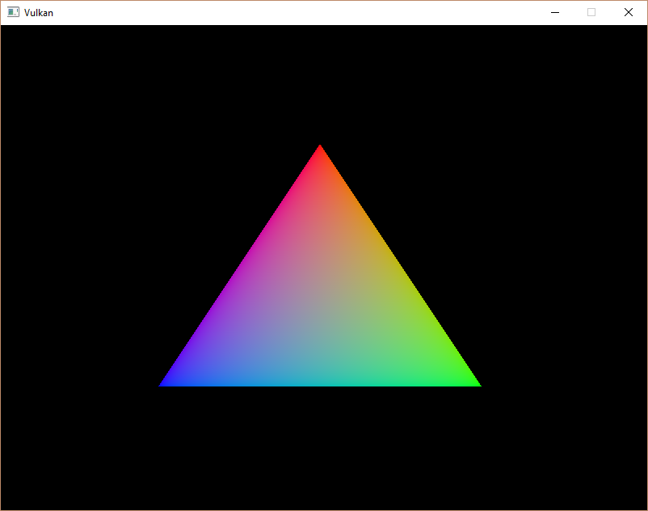

>这个彩色三角形可能看起来与您在图形教程中看到的有点不同。这是因为本教程让渲染器在线性颜色空间中进行插值，然后转换为 sRGB 颜色空间。有关差异的讨论，请参阅 [this blog post](https://medium.com/@heypete/hello-triangle-meet-swift-and-wide-color-6f9e246616d9)。

耶！不幸的是，启用验证层进行运行调试，程序可能会在您关闭时立即崩溃。 从 `debugCallback` 打印到终端的消息告诉我们原因：

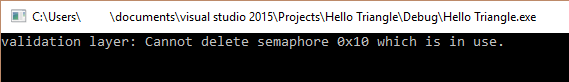

请记住，"drawFrame"中的所有操作都是异步的。 这意味着当我们在 `mainLoop` 中退出循环时，绘图和演示操作可能仍在进行。 在这种情况下清理资源是个坏主意。

为了解决这个问题，我们应该在退出 `mainLoop` 并销毁窗口之前等待逻辑设备完成操作：

```c++
void mainLoop() {
    while (!glfwWindowShouldClose(window)) {
        glfwPollEvents();
        drawFrame();
    }

    vkDeviceWaitIdle(device);
}
```

您还可以使用 `vkQueueWaitIdle` 等待特定命令队列中的操作完成。这些函数可以用作执行同步的非常基本的方法。您会看到程序现在在关闭窗口时退出不再会有问题。

## 运行时的多帧处理

此时启用验证层的情况下调试运行应用程序，您可能会收到错误或注意到内存使用量缓慢增长。出现这种情况的原因是应用程序在 `drawFrame` 函数中快速提交工作，但实际上并没有检查任何工作是否完成。 如果 CPU 提交工作的速度超过了 GPU 可以跟上的速度，那么队列将慢慢填满工作。更糟糕的是，我们同时为多个帧重用了 `imageAvailableSemaphore` 和 `renderFinishedSemaphore` 信号量以及命令缓冲区！

解决这个问题的简单方法是在提交后等待工作完成，例如使用`vkQueueWaitIdle`函数进行等待：

```c++
void drawFrame() {
    ...

    vkQueuePresentKHR(presentQueue, &presentInfo);

    vkQueueWaitIdle(presentQueue);
}
```

但这种方式不会最高效地使用 GPU，因为现在整个图形管道一次只用于一帧。渲染过程中，当前帧已经通过的阶段是空闲的，此时已经可以用于下一帧。 现在，我们将扩展我们的应用程序以允许多个帧渲染同时进行，同时仍然限制堆积的工作量。

首先在程序顶部添加一个常量，该常量定义应同时处理的帧数：

```c++
const int MAX_FRAMES_IN_FLIGHT = 2;
```

每个帧都应该有自己的一组信号量：

```c++
std::vector<VkSemaphore> imageAvailableSemaphores;
std::vector<VkSemaphore> renderFinishedSemaphores;
```

应更改 `createSemaphores` 函数以创建所有这些需要的参数：

```c++
void createSemaphores() {
    imageAvailableSemaphores.resize(MAX_FRAMES_IN_FLIGHT);
    renderFinishedSemaphores.resize(MAX_FRAMES_IN_FLIGHT);

    VkSemaphoreCreateInfo semaphoreInfo{};
    semaphoreInfo.sType = VK_STRUCTURE_TYPE_SEMAPHORE_CREATE_INFO;

    for (size_t i = 0; i < MAX_FRAMES_IN_FLIGHT; i++) {
        if (vkCreateSemaphore(device, &semaphoreInfo, nullptr, &imageAvailableSemaphores[i]) != VK_SUCCESS ||
            vkCreateSemaphore(device, &semaphoreInfo, nullptr, &renderFinishedSemaphores[i]) != VK_SUCCESS) {

            throw std::runtime_error("failed to create semaphores for a frame!");
        }
}
```

同样，它们也应该在最后做全部清理：

```c++
void cleanup() {
    for (size_t i = 0; i < MAX_FRAMES_IN_FLIGHT; i++) {
        vkDestroySemaphore(device, renderFinishedSemaphores[i], nullptr);
        vkDestroySemaphore(device, imageAvailableSemaphores[i], nullptr);
    }

    ...
}
```

为了每次都使用正确的信号量对，我们需要跟踪当前帧。为此，我们将使用帧索引：

```c++
size_t currentFrame = 0;
```

现在可以修改`drawFrame` 函数使用正确的信号量对象：

```c++
void drawFrame() {
    vkAcquireNextImageKHR(device, swapChain, UINT64_MAX, imageAvailableSemaphores[currentFrame], VK_NULL_HANDLE, &imageIndex);

    ...

    VkSemaphore waitSemaphores[] = {imageAvailableSemaphores[currentFrame]};

    ...

    VkSemaphore signalSemaphores[] = {renderFinishedSemaphores[currentFrame]};

    ...
}
```

当然，我们不应该忘记更新帧索引序号：

```c++
void drawFrame() {
    ...

    currentFrame = (currentFrame + 1) % MAX_FRAMES_IN_FLIGHT;
}
```

通过使用模 (%) 运算符，可以确保帧索引在队列长度 `MAX_FRAMES_IN_FLIGHT` 范围内循环。

尽管我们现在已经设置了所需的对象以方便同时处理多个帧，但实际上我们仍然不会阻止提交超过 `MAX_FRAMES_IN_FLIGHT` 的内容。现在只有 GPU-GPU 同步，没有 CPU-GPU 同步来跟踪工作的进展情况。当CPU向GPU提交过多的命令时，我们可能正在使用第 0 帧对象，而第 0 帧仍在进行渲染中！

为了执行 CPU-GPU 同步，Vulkan提供了第二种同步原语，称为 *fences*。栅栏在某种意义上类似于信号量，它们可以发出信号并等待，本示例中我们将使用他们。我们将首先为每一帧创建一个栅栏：

```c++
std::vector<VkSemaphore> imageAvailableSemaphores;
std::vector<VkSemaphore> renderFinishedSemaphores;
std::vector<VkFence> inFlightFences;
size_t currentFrame = 0;
```

将“createSemaphores”函数重命名为“createSyncObjects”，创建信号量时一起创建栅栏：

```c++
void createSyncObjects() {
    imageAvailableSemaphores.resize(MAX_FRAMES_IN_FLIGHT);
    renderFinishedSemaphores.resize(MAX_FRAMES_IN_FLIGHT);
    inFlightFences.resize(MAX_FRAMES_IN_FLIGHT);

    VkSemaphoreCreateInfo semaphoreInfo{};
    semaphoreInfo.sType = VK_STRUCTURE_TYPE_SEMAPHORE_CREATE_INFO;

    VkFenceCreateInfo fenceInfo{};
    fenceInfo.sType = VK_STRUCTURE_TYPE_FENCE_CREATE_INFO;

    for (size_t i = 0; i < MAX_FRAMES_IN_FLIGHT; i++) {
        if (vkCreateSemaphore(device, &semaphoreInfo, nullptr, &imageAvailableSemaphores[i]) != VK_SUCCESS ||
            vkCreateSemaphore(device, &semaphoreInfo, nullptr, &renderFinishedSemaphores[i]) != VK_SUCCESS ||
            vkCreateFence(device, &fenceInfo, nullptr, &inFlightFences[i]) != VK_SUCCESS) {

            throw std::runtime_error("failed to create synchronization objects for a frame!");
        }
    }
}
```

栅栏（`VkFence`）的创建与信号量的创建非常相似。退出程序时也需要确保清理围栏：

```c++
void cleanup() {
    for (size_t i = 0; i < MAX_FRAMES_IN_FLIGHT; i++) {
        vkDestroySemaphore(device, renderFinishedSemaphores[i], nullptr);
        vkDestroySemaphore(device, imageAvailableSemaphores[i], nullptr);
        vkDestroyFence(device, inFlightFences[i], nullptr);
    }

    ...
}
```

我们现在将更改 `drawFrame` 以使用栅栏进行CPU-GPU同步。 `vkQueueSubmit` 调用包含一个可选参数，用于传递在命令缓冲区完成执行时应发出信号的栅栏。 我们可以用它来表示一帧已经完成。

```c++
void drawFrame() {
    ...

    if (vkQueueSubmit(graphicsQueue, 1, &submitInfo, inFlightFences[currentFrame]) != VK_SUCCESS) {
        throw std::runtime_error("failed to submit draw command buffer!");
    }
    ...
}
```

现在唯一剩下的就是改变 `drawFrame` 的开头以等待帧完成：

```c++
void drawFrame() {
    vkWaitForFences(device, 1, &inFlightFences[currentFrame], VK_TRUE, UINT64_MAX);
    vkResetFences(device, 1, &inFlightFences[currentFrame]);

    ...
}
```

`vkWaitForFences` 函数接受一个栅栏数组，并在返回之前等待其中任何一个或所有栅栏发出信号。我们在这里传递的 `VK_TRUE` 表示我们要等待所有的栅栏，但在单个栅栏的情况下，这显然无关紧要。就像 `vkAcquireNextImageKHR` 一样，这个函数也需要超时。与信号量不同，我们需要手动将栅栏恢复到未发出信号的状态，方法是使用`vkResetFences` 调用重置栅栏。

如果你现在运行这个程序，你会发现一些奇怪的东西。该应用程序似乎不再显示任何内容。问题是我们正在等待尚未提交的栅栏。默认情况下，栅栏是在未发出信号的状态下创建的，这意味着如果我们之前没有使用栅栏，`vkWaitForFences` 将永远等待。为了解决这个问题，我们可以更改栅栏创建以将其初始化为信号状态，就好像我们已经渲染了一个已完成的初始帧：

```c++
void createSyncObjects() {
    ...

    VkFenceCreateInfo fenceInfo{};
    fenceInfo.sType = VK_STRUCTURE_TYPE_FENCE_CREATE_INFO;
    fenceInfo.flags = VK_FENCE_CREATE_SIGNALED_BIT;

    ...
}
```

内存泄漏现在已经消失了，但程序还没有完全正常工作。如果 `MAX_FRAMES_IN_FLIGHT` 高于交换链图像的数量或 `vkAcquireNextImageKHR` 返回的图像乱序，那么我们可能会开始渲染已经正在渲染的交换链图像。为避免这种情况，我们需要跟踪每个交换链图像是否有正在运行的帧当前正在使用它。此映射将通过其栅栏引用渲染中的帧，因此在新帧可以使用该图像之前，我们将立即有一个同步对象等待。

首先添加一个新列表 `imagesInFlight` 来跟踪它：

```c++
std::vector<VkFence> inFlightFences;
std::vector<VkFence> imagesInFlight;
size_t currentFrame = 0;
```

在 `createSyncObjects` 中准备它：

```c++
void createSyncObjects() {
    imageAvailableSemaphores.resize(MAX_FRAMES_IN_FLIGHT);
    renderFinishedSemaphores.resize(MAX_FRAMES_IN_FLIGHT);
    inFlightFences.resize(MAX_FRAMES_IN_FLIGHT);
    imagesInFlight.resize(swapChainImages.size(), VK_NULL_HANDLE);

    ...
}
```

最初没有一个帧正在使用图像，因此我们将其显式初始化为无信号量的栅栏。现在我们将修改 `drawFrame` 以等待任何先前使用我们刚刚分配给新帧的图像的帧：

```c++
void drawFrame() {
    ...

    vkAcquireNextImageKHR(device, swapChain, UINT64_MAX, imageAvailableSemaphores[currentFrame], VK_NULL_HANDLE, &imageIndex);

    // Check if a previous frame is using this image (i.e. there is its fence to wait on)
    if (imagesInFlight[imageIndex] != VK_NULL_HANDLE) {
        vkWaitForFences(device, 1, &imagesInFlight[imageIndex], VK_TRUE, UINT64_MAX);
    }
    // Mark the image as now being in use by this frame
    imagesInFlight[imageIndex] = inFlightFences[currentFrame];

    ...
}
```

因为我们现在有更多对 `vkWaitForFences` 的调用，所以 `vkResetFences` 调用应该调整调用位置。 最好在实际使用围栏之前直接调用它：

```c++
void drawFrame() {
    ...

    vkResetFences(device, 1, &inFlightFences[currentFrame]);

    if (vkQueueSubmit(graphicsQueue, 1, &submitInfo, inFlightFences[currentFrame]) != VK_SUCCESS) {
        throw std::runtime_error("failed to submit draw command buffer!");
    }

    ...
}
```

我们现在已经实现了所有需要的同步，以确保排队的工作帧不超过两帧，并且这些帧不会意外使用相同的图像。请注意，对于代码的最终清理，也需要根据使用情况释放，粗略的使用同步操作（如 `vkDeviceWaitIdle`）是可以的。您应该根据性能要求决定使用哪种方法。

要通过示例了解有关同步的更多信息，请查看 Khronos 的 [概述文档](https://github.com/KhronosGroup/Vulkan-Docs/wiki/Synchronization-Examples#swapchain-image-acquire-and-present) 。

## 结论

在 900 多行代码之后，我们终于到了看到屏幕上弹出一些东西的阶段！ 引导 Vulkan 程序绝对是一项繁重的工作，但要传达的信息是 Vulkan 通过其明确性为您提供了巨大的控制权。 我建议您现在花一些时间重新阅读代码，并为程序中所有 Vulkan 对象的用途以及它们之间的关系建立一个逻辑模型。从现在开始，我们将在这些知识的基础上扩展程序的功能。

在下一章中，为了实现一个良好的Vulkan程序，我们将做进一步的优化调整。

[C++ code](https://vulkan-tutorial.com/code/15_hello_triangle.cpp) /
[Vertex shader](https://vulkan-tutorial.com/code/09_shader_base.vert) /
[Fragment shader](https://vulkan-tutorial.com/code/09_shader_base.frag)


# 交换链重建

## 介绍

我们现在的应用程序成功地绘制了一个三角形，但是在某些情况下它还没有正确处理。 窗口表面可能会发生变化，从而使交换链不再与它兼容。窗口大小的变化是导致这种情况发生的原因之一。我们必须捕捉这些事件并重新创建交换链。

## 重新创建交换链

创建一个新的 `recreateSwapChain` 函数，该函数内部调用 `createSwapChain` 以及交换链或窗口大小变化依赖对象的所有创建函数。

```c++
void recreateSwapChain() {
    vkDeviceWaitIdle(device);

    createSwapChain();
    createImageViews();
    createRenderPass();
    createGraphicsPipeline();
    createFramebuffers();
    createCommandBuffers();
}
```

我们首先调用 `vkDeviceWaitIdle`等待设备空闲，上一章曾提到过，我们不应该接触可能仍在使用的资源。显然，我们要做的第一件事就是重新创建交换链本身。图像视图需要重新创建，因为它们是直接基于交换链图像的。渲染通道需要重新创建，因为它取决于交换链图像的格式。在窗口调整大小等操作期间，交换链图像格式很少发生变化，但仍应进行处理。 视口和剪刀矩形大小是在创建图形管线时指定的，因此管线也需要重建。可以通过对视口和剪刀矩形使用动态状态来避免这种情况。最后，帧缓冲区和命令缓冲区也直接依赖于交换链图像。

为了确保这些对象的旧版本在重新创建它们之前被清理，我们应该将一些清理代码移动到一个单独的函数中，我们可以从 `recreateSwapChain` 函数调用该函数。清理函数我们称之为“cleanupSwapChain”：

```c++
void cleanupSwapChain() {

}

void recreateSwapChain() {
    vkDeviceWaitIdle(device);

    cleanupSwapChain();

    createSwapChain();
    createImageViews();
    createRenderPass();
    createGraphicsPipeline();
    createFramebuffers();
    createCommandBuffers();
}
```

我们会将用于交换链刷新创建前的相关对象清理代码的从 `cleanup` 移动到 `cleanupSwapChain`：

```c++
void cleanupSwapChain() {
    for (size_t i = 0; i < swapChainFramebuffers.size(); i++) {
        vkDestroyFramebuffer(device, swapChainFramebuffers[i], nullptr);
    }

    vkFreeCommandBuffers(device, commandPool, static_cast<uint32_t>(commandBuffers.size()), commandBuffers.data());

    vkDestroyPipeline(device, graphicsPipeline, nullptr);
    vkDestroyPipelineLayout(device, pipelineLayout, nullptr);
    vkDestroyRenderPass(device, renderPass, nullptr);

    for (size_t i = 0; i < swapChainImageViews.size(); i++) {
        vkDestroyImageView(device, swapChainImageViews[i], nullptr);
    }

    vkDestroySwapchainKHR(device, swapChain, nullptr);
}

void cleanup() {
    cleanupSwapChain();

    for (size_t i = 0; i < MAX_FRAMES_IN_FLIGHT; i++) {
        vkDestroySemaphore(device, renderFinishedSemaphores[i], nullptr);
        vkDestroySemaphore(device, imageAvailableSemaphores[i], nullptr);
        vkDestroyFence(device, inFlightFences[i], nullptr);
    }

    vkDestroyCommandPool(device, commandPool, nullptr);

    vkDestroyDevice(device, nullptr);

    if (enableValidationLayers) {
        DestroyDebugUtilsMessengerEXT(instance, debugMessenger, nullptr);
    }

    vkDestroySurfaceKHR(instance, surface, nullptr);
    vkDestroyInstance(instance, nullptr);

    glfwDestroyWindow(window);

    glfwTerminate();
}
```

我们可以从头开始重新创建命令池，但这相当浪费。相反，我选择使用 `vkFreeCommandBuffers` 函数清理现有的命令缓冲区。这样我们就可以重用现有的池来分配新的命令缓冲区。

请注意，在 `chooseSwapExtent` 中，我们已经查询了新窗口分辨率以确保交换链图像具有（新的）正确大小，因此无需修改 `chooseSwapExtent`（请记住，我们已经使用 `glfwGetFramebufferSize` 获取创建交换链时窗面的分辨率（以像素为单位）。

这就是重新创建交换链所需的全部内容！ 但是，这种方法的缺点是我们需要在创建新的交换链之前停止所有渲染。另一种更好的方法是当旧交换链的图像上的绘图命令仍在进行中时创建新的交换链。你需要填写创建交换链VkSwapchainCreateInfoKHR 结构中的 `oldSwapChain` 字段，并在您使用完旧交换链后立即销毁它。

## 未充分优化与过时的交换链

现在，如果我们需要重建交换链，只需调用新的“recreateSwapChain”函数即可。幸运的是，Vulkan通常会告诉我们在演示过程中交换链读写异常。“vkAcquireNextImageKHR”和“vkQueuePresentKHR”函数的返回值会表示这些情况。

* `VK_ERROR_OUT_OF_DATE_KHR`：交换链已提交显示面，不能再用于渲染写入。 通常发生在窗口调整大小之后。
* `VK_SUBOPTIMAL_KHR`：交换链仍然可以用来成功呈现到表面，但表面属性不再完全匹配。

```c++
VkResult result = vkAcquireNextImageKHR(device, swapChain, UINT64_MAX, imageAvailableSemaphores[currentFrame], VK_NULL_HANDLE, &imageIndex);

if (result == VK_ERROR_OUT_OF_DATE_KHR) {
    recreateSwapChain();
    return;
} else if (result != VK_SUCCESS && result != VK_SUBOPTIMAL_KHR) {
    throw std::runtime_error("failed to acquire swap chain image!");
}
```

如果在尝试获取交换链中的图像已过期，则无法再向其呈现时间上同步的内容。 因此，我们有必要立即重新创建交换链并在下一次 `drawFrame` 调用中重试。

如果交换链不是最理想的，您也可以决定重建，但上述代码我们选择继续运行，因为我们已经获取了图像。 `VK_SUCCESS` 和 `VK_SUBOPTIMAL_KHR` 都被认为是“成功”返回码。

```c++
result = vkQueuePresentKHR(presentQueue, &presentInfo);

if (result == VK_ERROR_OUT_OF_DATE_KHR || result == VK_SUBOPTIMAL_KHR) {
    recreateSwapChain();
} else if (result != VK_SUCCESS) {
    throw std::runtime_error("failed to present swap chain image!");
}

currentFrame = (currentFrame + 1) % MAX_FRAMES_IN_FLIGHT;
```

`vkQueuePresentKHR` 函数返回具有相同含义的相同值。在这种情况下，如果交换链不是最理想的，我们也会重新创建它，因为我们想要最好的结果。

## 显示处理调整大小

尽管许多驱动程序和平台在调整窗口大小后会自动触发`VK_ERROR_OUT_OF_DATE_KHR`，但不能保证一定会发生。 这就是为什么我们将添加一些额外的代码来显式地处理调整大小。 首先添加一个新的成员变量来标记发生了大小调整：

```c++
std::vector<VkFence> inFlightFences;
size_t currentFrame = 0;

bool framebufferResized = false;
```

然后应该修改 `drawFrame` 函数以检查此标志：

```c++
if (result == VK_ERROR_OUT_OF_DATE_KHR || result == VK_SUBOPTIMAL_KHR || framebufferResized) {
    framebufferResized = false;
    recreateSwapChain();
} else if (result != VK_SUCCESS) {
    ...
}
```

在 `vkQueuePresentKHR` 之后执行此操作很重要，以确保信号量处于一致状态，否则可能永远无法正确等待已发出信号量。 现在要实际检测调整大小，我们可以使用 GLFW 框架中的 `glfwSetFramebufferSizeCallback` 函数来设置回调：

```c++
void initWindow() {
    glfwInit();

    glfwWindowHint(GLFW_CLIENT_API, GLFW_NO_API);

    window = glfwCreateWindow(WIDTH, HEIGHT, "Vulkan", nullptr, nullptr);
    glfwSetFramebufferSizeCallback(window, framebufferResizeCallback);
}

static void framebufferResizeCallback(GLFWwindow* window, int width, int height) {

}
```

我们创建 `static` 函数作为回调的原因是因为 GLFW 不知道如何使用正确的 `this` 指针正确调用成员函数，该指针指向我们的 `HelloTriangleApplication` 实例。

另外，我们在回调中获得了对“GLFWwindow”的引用，并且还有另一个 GLFW 函数“glfwSetWindowUserPointer”允许您在其中存储任意指针：

```c++
window = glfwCreateWindow(WIDTH, HEIGHT, "Vulkan", nullptr, nullptr);
glfwSetWindowUserPointer(window, this);
glfwSetFramebufferSizeCallback(window, framebufferResizeCallback);
```

现在可以使用 `glfwGetWindowUserPointer` 从回调中检索此值，以正确设置标志：

```c++
static void framebufferResizeCallback(GLFWwindow* window, int width, int height) {
    auto app = reinterpret_cast<HelloTriangleApplication*>(glfwGetWindowUserPointer(window));
    app->framebufferResized = true;
}
```

现在尝试运行程序并调整窗口大小，以查看帧缓冲区是否确实与窗口一起正确调整了大小。

## 处理窗体最小化

还有另一种交换链可能会过时的情况，窗口最小化。 这种情况很特殊，因为它会导致帧缓冲区大小为“0”。 在本教程中，我们将通过扩展 `recreateSwapChain` 函数暂停直到窗口再次位于前台来处理这个问题：

```c++
void recreateSwapChain() {
    int width = 0, height = 0;
    glfwGetFramebufferSize(window, &width, &height);
    while (width == 0 || height == 0) {
        glfwGetFramebufferSize(window, &width, &height);
        glfwWaitEvents();
    }

    vkDeviceWaitIdle(device);

    ...
}
```

 `glfwGetFramebufferSize` 的初始调用获得窗口高、宽，若高或宽为零则进入循环持续等待。

恭喜，你现在已经完成了你的第一个Vulkan程序！下一章我们将使用顶点缓存替换顶点渲染器中的硬编码。

[C++ code](https://vulkan-tutorial.com/code/16_swap_chain_recreation.cpp) /
[Vertex shader](https://vulkan-tutorial.com/code/09_shader_base.vert) /
[Fragment shader](https://vulkan-tutorial.com/code/09_shader_base.frag)


# 顶点输入描述

## 介绍

在接下来的几章中，我们将用内存中的顶点缓冲区替换顶点渲染器源码中的硬编码顶点数据。 我们使用 `memcpy` 将顶点数据将从 CPU 可见内存复制到GPU内存的最简单方法开始，然后我们将了解如何使用暂存缓冲区将顶点数据复制到高性能内存 。

## 顶点渲染器

首先更改顶点渲染器，使渲染器代码本身不再包含顶点数据。顶点渲染器使用 `in` 关键字从顶点缓冲区获取输入。

```glsl
#version 450

layout(location = 0) in vec2 inPosition;
layout(location = 1) in vec3 inColor;

layout(location = 0) out vec3 fragColor;

void main() {
    gl_Position = vec4(inPosition, 0.0, 1.0);
    fragColor = inColor;
}
```

`inPosition` 和 `inColor` 变量是*顶点属性*。它们在顶点缓冲区中为每个顶点指定的属性，就像我们使用两个数组手动指定每个顶点的位置和颜色一样。确保重新编译顶点渲染器！

就像 `fragColor` 一样，`layout(location = x)` 将索引分配给我们以后可以用来引用它们的输入。 重要的是要知道某些类型，例如 `dvec3` 64 位3维向量将使用多个 *slots*。 这意味着它之后的索引值至少为 2：

```glsl
layout(location = 0) in dvec3 inPosition;
layout(location = 2) in vec3 inColor;
```

你可以找到分配索引需要的更多信息 [OpenGL wiki](https://www.khronos.org/opengl/wiki/Layout_Qualifier_(GLSL)).

## 顶点数据

我们将顶点数据从渲染器代码移动到程序代码中的数组。首先包括 GLM 库，它为我们提供了与线性代数相关的类型，如向量和矩阵。 我们将使用GLM 库中的类型来指定位置和颜色向量。

```c++
#include <glm/glm.hpp>
```

创建一个名为“Vertex”的新结构，其中包含我们将在顶点渲染器中使用的两个属性：

```c++
struct Vertex {
    glm::vec2 pos;
    glm::vec3 color;
};
```

GLM 库方便地为我们提供了与渲染器语言中使用的向量类型完全匹配的 C++变量类型。

```c++
const std::vector<Vertex> vertices = {
    {{0.0f, -0.5f}, {1.0f, 0.0f, 0.0f}},
    {{0.5f, 0.5f}, {0.0f, 1.0f, 0.0f}},
    {{-0.5f, 0.5f}, {0.0f, 0.0f, 1.0f}}
};
```

现在使用 `Vertex` 结构来指定一个顶点数据数组。我们使用与以前完全相同的位置和颜色值，但现在它们被组合成一个顶点数组。 这称为 *interleaving* 顶点属性。

## 绑定说明

下一步是告诉 Vulkan 在上传到 GPU 内存后如何将此数据格式传递给顶点渲染器。传达此信息需要两种类型的结构。

第一个结构是 `VkVertexInputBindingDescription`，我们将向 `Vertex` 结构添加一个成员函数，以使用正确的数据填充它。

```c++
struct Vertex {
    glm::vec2 pos;
    glm::vec3 color;

    static VkVertexInputBindingDescription getBindingDescription() {
        VkVertexInputBindingDescription bindingDescription{};

        return bindingDescription;
    }
};
```

顶点绑定描述了内存中的整个顶点数据中如何转换加载。它指定顶点数据条目之间的字节数，以及根据每个顶点或是每个实例之后移动到下一个数据条目。

```c++
VkVertexInputBindingDescription bindingDescription{};
bindingDescription.binding = 0;
bindingDescription.stride = sizeof(Vertex);
bindingDescription.inputRate = VK_VERTEX_INPUT_RATE_VERTEX;
```

我们所有的每个顶点数据都打包在一个数组中，所以我们只有一个绑定。 `binding` 参数指定绑定数组中绑定的索引。 `stride` 参数指定从一个条目到下一个条目的字节数，`inputRate` 参数可以使用以下值：

* `VK_VERTEX_INPUT_RATE_VERTEX`：按照每个顶点移动下一个数据条目
* `VK_VERTEX_INPUT_RATE_INSTANCE`: 按照每个实例移动到下一个数据条目

我们不会使用实例化渲染，所以我们会一直按照逐个顶点的方式组织数据。

## 属性说明

描述如何处理顶点输入的第二个结构是 `VkVertexInputAttributeDescription`。 我们将向 `Vertex` 添加另一个辅助函数来填充这些结构。

```c++
#include <array>

...

static std::array<VkVertexInputAttributeDescription, 2> getAttributeDescriptions() {
    std::array<VkVertexInputAttributeDescription, 2> attributeDescriptions{};

    return attributeDescriptions;
}
```

正如函数原型所示，将有两个这样的结构。 属性描述结构描述了如何从源自绑定描述的顶点数据块中提取顶点属性。我们有两个属性，位置和颜色，所以我们需要两个属性描述结构。

```c++
attributeDescriptions[0].binding = 0;
attributeDescriptions[0].location = 0;
attributeDescriptions[0].format = VK_FORMAT_R32G32_SFLOAT;
attributeDescriptions[0].offset = offsetof(Vertex, pos);
```

`binding` 参数告诉 Vulkan 每个顶点数据来自哪个绑定。 `location` 参数引用顶点着色器中输入的 `location` 指令。 位置为“0”的顶点着色器中的输入是位置，它有两个 32 位浮点分量。

`format` 参数描述了属性的数据类型。令人有点困惑的是，格式是使用与颜色格式相同的枚举来指定的。 以下渲染器类型和格式通常一起使用：

* `float`: `VK_FORMAT_R32_SFLOAT`
* `vec2`: `VK_FORMAT_R32G32_SFLOAT`
* `vec3`: `VK_FORMAT_R32G32B32_SFLOAT`
* `vec4`: `VK_FORMAT_R32G32B32A32_SFLOAT`

如您所见，您应该使用与颜色通道数量、渲染器数据类型相匹配的格式。允许使用比渲染器中的组件数量更多的通道，但它们将被静默丢弃。 如果通道数小于组件数，则 BGA 组件将使用默认值 `(0, 0, 1)`。颜色类型（`SFLOAT`、`UINT`、`SINT`）的位宽应该与渲染器输入的类型相匹配。 请参阅以下示例：

* `ivec2`: `VK_FORMAT_R32G32_SINT`，一个有2个32位有符号的整数分量的向量
* `uvec4`: `VK_FORMAT_R32G32B32A32_UINT`，一个有4个32位无符号整数分量的向量
* `double`: `VK_FORMAT_R64_SFLOAT`，双精度（64 位）浮点数

`format` 参数隐式定义了属性数据的字节大小，而 `offset` 参数指定了从每个顶点数据开始读取的字节数。 绑定一次加载一个“Vertex”，并且位置属性（“pos”）位于该结构开头的“0”字节偏移处。 这是使用 `offsetof` 宏自动计算的。

```c++
attributeDescriptions[1].binding = 0;
attributeDescriptions[1].location = 1;
attributeDescriptions[1].format = VK_FORMAT_R32G32B32_SFLOAT;
attributeDescriptions[1].offset = offsetof(Vertex, color);
```

颜色属性的描述方式大致相同。

## 管道顶点输入

我们现在需要通过引用`createGraphicsPipeline`中的结构来设置图形管道以接受这种格式的顶点数据。 找到 `vertexInputInfo` 结构并修改它以引用两个描述：

```c++
auto bindingDescription = Vertex::getBindingDescription();
auto attributeDescriptions = Vertex::getAttributeDescriptions();

vertexInputInfo.vertexBindingDescriptionCount = 1;
vertexInputInfo.vertexAttributeDescriptionCount = static_cast<uint32_t>(attributeDescriptions.size());
vertexInputInfo.pVertexBindingDescriptions = &bindingDescription;
vertexInputInfo.pVertexAttributeDescriptions = attributeDescriptions.data();
```

管道现在已准备好接受 `vertices` 容器格式的顶点数据并将其传递给我们的顶点着色器。 如果您现在在启用验证层的情况下运行程序，您会看到它抱怨没有绑定到顶点缓冲区。 下一步是创建一个顶点缓冲区并将顶点数据移动到其中，以便 GPU 能够访问它。

[C++ code](https://vulkan-tutorial.com/code/17_vertex_input.cpp) /
[Vertex shader](https://vulkan-tutorial.com/code/17_shader_vertexbuffer.vert) /
[Fragment shader](https://vulkan-tutorial.com/code/17_shader_vertexbuffer.frag)


# 创建顶点缓冲区

## 介绍

Vulkan缓冲区所在的内存区域存储的数据是图形卡读取访问的。它们可用于存储顶点数据，我们将在本章中这样做，但它们也可用于我们将在以后的章节中探讨的许多其他目的。与到目前为止我们一直在处理的 Vulkan 对象不同，缓冲区不会自动为自己分配内存。前几章的工作表明，Vulkan API 让程序员可以控制几乎所有事情，内存管理就是其中之一。

## 创建缓冲区

创建一个新函数 `createVertexBuffer` 并在 `createCommandBuffers` 之前从 `initVulkan` 调用它。

```c++
void initVulkan() {
    createInstance();
    setupDebugMessenger();
    createSurface();
    pickPhysicalDevice();
    createLogicalDevice();
    createSwapChain();
    createImageViews();
    createRenderPass();
    createGraphicsPipeline();
    createFramebuffers();
    createCommandPool();
    createVertexBuffer();
    createCommandBuffers();
    createSyncObjects();
}

...

void createVertexBuffer() {

}
```

创建缓冲区需要我们填充 `VkBufferCreateInfo` 结构。

```c++
VkBufferCreateInfo bufferInfo{};
bufferInfo.sType = VK_STRUCTURE_TYPE_BUFFER_CREATE_INFO;
bufferInfo.size = sizeof(vertices[0]) * vertices.size();
```

结构的第一个字段是`size`，它指定缓冲区的大小（以字节为单位）。使用“sizeof”可以直接计算顶点数据的字节大小。

```c++
bufferInfo.usage = VK_BUFFER_USAGE_VERTEX_BUFFER_BIT;
```

第二个字段是“使用”类型，它指示缓冲区中的数据将用于何种目的。 可以使用按位或指定多个用途。 我们的用例将是一个顶点缓冲区，我们将在以后的章节中介绍其他类型的用法。

```c++
bufferInfo.sharingMode = VK_SHARING_MODE_EXCLUSIVE;
```

就像交换链中的图像一样，缓冲区也可以由特定队列族拥有或同时在多个队列之间共享。本例中缓冲区只会从图形队列中使用，所以我们可以坚持独占访问。

`flags` 参数用于配置稀疏缓冲内存，目前不会使用。我们将其保留为默认值“0”。

我们现在可以使用 `vkCreateBuffer` 创建缓冲区。定义一个类成员来保存缓冲区句柄并将其称为 `vertexBuffer`。

```c++
VkBuffer vertexBuffer;

...

void createVertexBuffer() {
    VkBufferCreateInfo bufferInfo{};
    bufferInfo.sType = VK_STRUCTURE_TYPE_BUFFER_CREATE_INFO;
    bufferInfo.size = sizeof(vertices[0]) * vertices.size();
    bufferInfo.usage = VK_BUFFER_USAGE_VERTEX_BUFFER_BIT;
    bufferInfo.sharingMode = VK_SHARING_MODE_EXCLUSIVE;

    if (vkCreateBuffer(device, &bufferInfo, nullptr, &vertexBuffer) != VK_SUCCESS) {
        throw std::runtime_error("failed to create vertex buffer!");
    }
}
```

缓冲区应该可以在程序结束之前用于渲染命令，并且它不依赖于交换链，所以我们将在原始的 `cleanup` 函数中清理它：

```c++
void cleanup() {
    cleanupSwapChain();

    vkDestroyBuffer(device, vertexBuffer, nullptr);

    ...
}
```

## 内存要求

缓冲区已创建，但实际上尚未分配任何内存。为缓冲区分配内存的第一步是使用命为“vkGetBufferMemoryRequirements”的函数查询其内存需求。

```c++
VkMemoryRequirements memRequirements;
vkGetBufferMemoryRequirements(device, vertexBuffer, &memRequirements);
```

`VkMemoryRequirements` 结构体具有三个字段：

* `size`：所需内存量的大小（以字节为单位），可能与 `bufferInfo.size` 不同。
* `alignment`：缓冲区在分配的内存区域中首地址偏移量，取决于 `bufferInfo.usage` 和 `bufferInfo.flags`。
* `memoryTypeBits`：适用于缓冲区的内存类型的位域。

显卡可以提供不同类型的内存进行分配。 每种类型的内存在允许的操作和性能特征方面都有所不同。 我们需要结合缓冲区的需求和我们自己的应用程序需求来找到合适的内存类型来使用。 让我们为此目的创建一个新函数 `findMemoryType`。

```c++
uint32_t findMemoryType(uint32_t typeFilter, VkMemoryPropertyFlags properties) {

}
```

首先，我们需要使用 `vkGetPhysicalDeviceMemoryProperties` 查询有关可用内存类型的信息。

```c++
VkPhysicalDeviceMemoryProperties memProperties;
vkGetPhysicalDeviceMemoryProperties(physicalDevice, &memProperties);
```

`VkPhysicalDeviceMemoryProperties` 结构有两个数组 `memoryTypes` 和 `memoryHeaps`。内存堆是不同的内存资源，例如专用 VRAM 和 RAM 中作为VRAM 用完时的交换空间。 这些堆内存在不同类型的内存。现在我们只关心内存的类型而不是它来自的堆，但是你可以想象堆内存会影响性能。

我们先找一个适合缓冲区本身的内存类型：

```c++
for (uint32_t i = 0; i < memProperties.memoryTypeCount; i++) {
    if (typeFilter & (1 << i)) {
        return i;
    }
}

throw std::runtime_error("failed to find suitable memory type!");
```

`typeFilter` 参数将用于指定适合的内存类型的位字段。这意味着我们可以通过简单地迭代它们并检查相应的位是否设置为“1”来找到合适的内存类型的索引。

但是，我们不仅对适合顶点缓冲区的内存类型感兴趣。 我们还需要能够将顶点数据写入该内存。 `memoryTypes` 数组由 `VkMemoryType` 结构体组成，这些结构体指定了每种内存类型的堆和属性。 这些属性定义了内存的特殊功能，比如能够映射它，以便我们可以从 CPU 写入它。 该属性用 `VK_MEMORY_PROPERTY_HOST_VISIBLE_BIT` 表示，但我们还需要使用 `VK_MEMORY_PROPERTY_HOST_COHERENT_BIT` 属性。当后续介绍映射内存时，我们会明白为什么。

我们现在可以修改循环以检查此属性的支持：

```c++
for (uint32_t i = 0; i < memProperties.memoryTypeCount; i++) {
    if ((typeFilter & (1 << i)) && (memProperties.memoryTypes[i].propertyFlags & properties) == properties) {
        return i;
    }
}
```

我们有不止一个所需的属性，因此我们应该检查按位与的结果是否不仅非零，还需要等于所需的属性位字段。如果有适合缓冲区的内存类型也具有我们需要的所有属性，那么我们返回它的索引，否则我们抛出异常。

## 内存分配

我们现在有了方法可以确定正确的内存类型，因此我们可以通过填写 `VkMemoryAllocateInfo` 结构来分配实际的内存。

```c++
VkMemoryAllocateInfo allocInfo{};
allocInfo.sType = VK_STRUCTURE_TYPE_MEMORY_ALLOCATE_INFO;
allocInfo.allocationSize = memRequirements.size;
allocInfo.memoryTypeIndex = findMemoryType(memRequirements.memoryTypeBits, VK_MEMORY_PROPERTY_HOST_VISIBLE_BIT | VK_MEMORY_PROPERTY_HOST_COHERENT_BIT);
```

现在只需简单的指定内存大小和类型就可以分配内存，这两配置值都来自顶点缓冲区的内存需求和所需的属性。最后，创建一个类成员作为内存句柄存储函数 `vkAllocateMemory` 的内存分配结果。

```c++
VkBuffer vertexBuffer;
VkDeviceMemory vertexBufferMemory;

...

if (vkAllocateMemory(device, &allocInfo, nullptr, &vertexBufferMemory) != VK_SUCCESS) {
    throw std::runtime_error("failed to allocate vertex buffer memory!");
}
```

如果内存分配成功，那么我们现在可以使用 `vkBindBufferMemory` 将此内存与缓冲区绑定关联：

```c++
vkBindBufferMemory(device, vertexBuffer, vertexBufferMemory, 0);
```

前三个参数的含义是显然的，第四个参数表示内存区域内的偏移量。由于该内存是专门为此顶点缓冲区分配的，因此偏移量只是“0”。如果偏移量非零，则它需要被 `memRequirements.alignment` 整除。

当然，就像 C++ 中的动态内存分配一样，内存应该在某个时候被释放。一旦缓冲区不再使用，绑定到缓冲区对象的内存就需要释放，所以让我们在缓冲区被销毁后再释放对应的内存：

```c++
void cleanup() {
    cleanupSwapChain();

    vkDestroyBuffer(device, vertexBuffer, nullptr);
    vkFreeMemory(device, vertexBufferMemory, nullptr);
```

## 填充顶点缓冲区

现在是时候将顶点数据复制到缓冲区了。这是通过使用 `vkMapMemory` [将缓冲内存]（https://en.wikipedia.org/wiki/Memory-mapped_I/O）映射到 CPU 可访问内存来完成的。

```c++
void* data;
vkMapMemory(device, vertexBufferMemory, 0, bufferInfo.size, 0, &data);
```

此函数允许我们访问由偏移量和大小定义的指定内存资源的区域。 这里的偏移量和大小分别是`0`和`bufferInfo.size`。 也可以指定特殊值“VK_WHOLE_SIZE”来映射所有内存。倒数第二个参数可用于指定标志，但当前 API 中还没有任何可用的参数。它必须设置为值“0”。最后一个参数指定指向映射内存的指针的输出。

```c++
void* data;
vkMapMemory(device, vertexBufferMemory, 0, bufferInfo.size, 0, &data);
    memcpy(data, vertices.data(), (size_t) bufferInfo.size);
vkUnmapMemory(device, vertexBufferMemory);
```

您现在可以简单地将顶点数据`memcpy` 到映射的内存并使用`vkUnmapMemory` 再次取消映射。麻烦的是，驱动程序可能因为缓存柱塞不会立即将数据复制到缓冲存储器中。对缓冲区的写入有可能在映射内存中不会立即可见。有两种方法可以解决这个问题：

* 使用主机一致的内存堆，用 `VK_MEMORY_PROPERTY_HOST_COHERENT_BIT` 表示
* 写入映射内存后调用 `vkFlushMappedMemoryRanges`函数，读取映射内存前调用 `vkInvalidateMappedMemoryRanges`函数

我们采用了第一种方法，它确保映射的内存始终与分配的内存的内容相匹配。需要注意的是，这可能会导致比显式刷新稍差的性能，稍后我们将在下一章中解释为什么这个无关紧要。

## 绑定顶点缓存

现在剩下的就是在渲染操作期间绑定顶点缓冲区。我们将扩展 `createCommandBuffers` 函数来做到这一点。

```c++
vkCmdBindPipeline(commandBuffers[i], VK_PIPELINE_BIND_POINT_GRAPHICS, graphicsPipeline);

VkBuffer vertexBuffers[] = {vertexBuffer};
VkDeviceSize offsets[] = {0};
vkCmdBindVertexBuffers(commandBuffers[i], 0, 1, vertexBuffers, offsets);

vkCmdDraw(commandBuffers[i], static_cast<uint32_t>(vertices.size()), 1, 0, 0);
```

`vkCmdBindVertexBuffers` 函数用于将顶点缓冲区绑定到命令绑定点，就像我们在上一章中设置的那样。除了命令缓冲区之外，前两个参数指定了我们将为其指定顶点缓冲区的偏移量和绑定数量。最后两个参数指定要绑定的顶点缓冲区数组和开始读取顶点数据的字节偏移量。您还应该更改对“vkCmdDraw”的调用以传递缓冲区中的顶点数，而不是硬编码的数字“3”。

现在运行程序，你应该会再次看到熟悉的三角形：


尝试通过修改 `vertices` 数组将顶部顶点的颜色更改为白色：

```c++
const std::vector<Vertex> vertices = {
    {{0.0f, -0.5f}, {1.0f, 1.0f, 1.0f}},
    {{0.5f, 0.5f}, {0.0f, 1.0f, 0.0f}},
    {{-0.5f, 0.5f}, {0.0f, 0.0f, 1.0f}}
};
```

再次运行程序，您应该会看到以下内容：

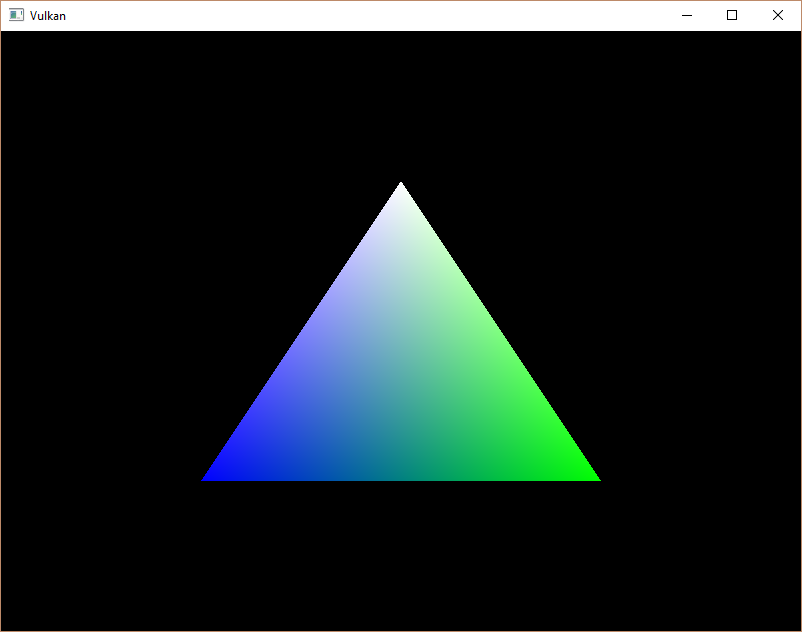

在下一章中，我们将研究另一种将顶点数据复制到顶点缓冲区的方法，这种方法可以提高性能，但需要做更多的工作。

[C++ code](https://vulkan-tutorial.com/code/18_vertex_buffer.cpp) /
[Vertex shader](https://vulkan-tutorial.com/code/17_shader_vertexbuffer.vert) /
[Fragment shader](https://vulkan-tutorial.com/code/17_shader_vertexbuffer.frag)


# 暂存缓冲区

## 介绍

虽然我们现在拥有的顶点缓冲区能够工作正常，但 CPU可访问的内存类型很可能不是显卡设备本身读取数据的最佳内存类型。 最优化内存类型的选项有
`VK_MEMORY_PROPERTY_DEVICE_LOCAL_BIT` 标志，通常不能被配有专用显卡设备上的 CPU 访问。 在本章中，我们将创建两个顶点缓冲区。一个是CPU 可访问内存中的暂存缓冲区 *staging buffer* 用于上传数据，另一个是GPU设备本地内存中的最终顶点缓冲区。 然后我们将使用缓冲区复制命令将数据从暂存缓冲区移动到实际的GPU顶点缓冲区。

## 传输队列

缓冲区复制命令需要一个支持传输操作的队列族，使用 `VK_QUEUE_TRANSFER_BIT` 表示。好消息是任何具有 `VK_QUEUE_GRAPHICS_BIT` 或 `VK_QUEUE_COMPUTE_BIT` 能力的队列族已经隐式支持 `VK_QUEUE_TRANSFER_BIT` 操作。在这些情况下，实现传输命令不需要在 `queueFlags` 中明确列出它。

如果您喜欢挑战，那么您仍然可以尝试使用不同的队列族专门用于传输操作。它将要求您对程序进行以下修改：

* 修改 `QueueFamilyIndices` 和 `findQueueFamilies` 以显式查找具有 `VK_QUEUE_TRANSFER_BIT` 位的队列族，而不是 `VK_QUEUE_GRAPHICS_BIT`。
* 修改`createLogicalDevice` 请求传输队列的句柄
* 为传输队列族上提交的命令缓冲区创建第二个命令池
* 将资源的 `sharingMode` 更改为 `VK_SHARING_MODE_CONCURRENT` 并指定图形和传输队列系列
* 将任何传输命令，如 `vkCmdCopyBuffer`（我们将在本章中使用）提交到传输队列而不是图形队列

这些改动有些工作量，但通过实践你会学到很多关于如何在队列族之间共享资源的知识。

## 抽象缓冲区创建

因为我们将在本章中创建多个缓冲区，所以将缓冲区创建移至辅助函数是一个好主意。 创建一个新函数 `createBuffer` 并将 `createVertexBuffer` 中的代码（映射除外）剪裁到该函数。

```c++
void createBuffer(VkDeviceSize size, VkBufferUsageFlags usage, VkMemoryPropertyFlags properties, VkBuffer& buffer, VkDeviceMemory& bufferMemory) {
    VkBufferCreateInfo bufferInfo{};
    bufferInfo.sType = VK_STRUCTURE_TYPE_BUFFER_CREATE_INFO;
    bufferInfo.size = size;
    bufferInfo.usage = usage;
    bufferInfo.sharingMode = VK_SHARING_MODE_EXCLUSIVE;

    if (vkCreateBuffer(device, &bufferInfo, nullptr, &buffer) != VK_SUCCESS) {
        throw std::runtime_error("failed to create buffer!");
    }

    VkMemoryRequirements memRequirements;
    vkGetBufferMemoryRequirements(device, buffer, &memRequirements);

    VkMemoryAllocateInfo allocInfo{};
    allocInfo.sType = VK_STRUCTURE_TYPE_MEMORY_ALLOCATE_INFO;
    allocInfo.allocationSize = memRequirements.size;
    allocInfo.memoryTypeIndex = findMemoryType(memRequirements.memoryTypeBits, properties);

    if (vkAllocateMemory(device, &allocInfo, nullptr, &bufferMemory) != VK_SUCCESS) {
        throw std::runtime_error("failed to allocate buffer memory!");
    }

    vkBindBufferMemory(device, buffer, bufferMemory, 0);
}
```

确保为缓冲区大小、内存属性和使用添加函数参数，以便我们可以使用此函数创建许多不同类型的缓冲区。最后两个参数是要写入句柄的输出变量。

您现在可以从 `createVertexBuffer` 中删除缓冲区创建和内存分配代码，而只需调用 `createBuffer` 函数代替：

```c++
void createVertexBuffer() {
    VkDeviceSize bufferSize = sizeof(vertices[0]) * vertices.size();
    createBuffer(bufferSize, VK_BUFFER_USAGE_VERTEX_BUFFER_BIT, VK_MEMORY_PROPERTY_HOST_VISIBLE_BIT | VK_MEMORY_PROPERTY_HOST_COHERENT_BIT, vertexBuffer, vertexBufferMemory);

    void* data;
    vkMapMemory(device, vertexBufferMemory, 0, bufferSize, 0, &data);
        memcpy(data, vertices.data(), (size_t) bufferSize);
    vkUnmapMemory(device, vertexBufferMemory);
}
```

运行您的程序以确保顶点缓冲区仍然正常工作。

## 使用暂存缓冲区

我们现在将更改`createVertexBuffer` 函数，使用主机可见缓冲区作为临时缓冲区，并使用GPU设备本地缓冲区作为实际顶点缓冲区。

```c++
void createVertexBuffer() {
    VkDeviceSize bufferSize = sizeof(vertices[0]) * vertices.size();

    VkBuffer stagingBuffer;
    VkDeviceMemory stagingBufferMemory;
    createBuffer(bufferSize, VK_BUFFER_USAGE_TRANSFER_SRC_BIT, VK_MEMORY_PROPERTY_HOST_VISIBLE_BIT | VK_MEMORY_PROPERTY_HOST_COHERENT_BIT, stagingBuffer, stagingBufferMemory);

    void* data;
    vkMapMemory(device, stagingBufferMemory, 0, bufferSize, 0, &data);
        memcpy(data, vertices.data(), (size_t) bufferSize);
    vkUnmapMemory(device, stagingBufferMemory);

    createBuffer(bufferSize, VK_BUFFER_USAGE_TRANSFER_DST_BIT | VK_BUFFER_USAGE_VERTEX_BUFFER_BIT, VK_MEMORY_PROPERTY_DEVICE_LOCAL_BIT, vertexBuffer, vertexBufferMemory);
}
```

我们现在使用新的 `stagingBuffer` 和 `stagingBufferMemory` 来映射和复制顶点数据。在本章中，我们将使用两个新的缓冲区使用标志：

* `VK_BUFFER_USAGE_TRANSFER_SRC_BIT`：缓冲区可以用作内存传输操作中的源。
* `VK_BUFFER_USAGE_TRANSFER_DST_BIT`：缓冲区可以用作内存传输操作中的目标。

`vertexBuffer` 现在是从设备本地的内存类型分配的，这通常意味着我们不能使用 `vkMapMemory`。 但是，我们可以将数据从`stagingBuffer`复制到`vertexBuffer`。我们必须通过指定 `stagingBuffer` 的传输源标志和 `vertexBuffer` 的传输目标标志以及顶点缓冲区使用标志来表明我们打算这样做。

我们现在要编写一个函数来将内容从一个缓冲区复制到另一个缓冲区，称为`copyBuffer`。

```c++
void copyBuffer(VkBuffer srcBuffer, VkBuffer dstBuffer, VkDeviceSize size) {

}
```

内存传输操作使用命令缓冲区执行，就像绘图命令一样。因此我们必须首先分配一个临时命令缓冲区。您可能希望为这些类型的短期缓冲区创建一个单独的命令池，因为此类命令只会运行一次，这类实现能够应用内存分配优化。在这种情况下，您应该在命令池生成期间使用 `VK_COMMAND_POOL_CREATE_TRANSIENT_BIT` 标志。

```c++
void copyBuffer(VkBuffer srcBuffer, VkBuffer dstBuffer, VkDeviceSize size) {
    VkCommandBufferAllocateInfo allocInfo{};
    allocInfo.sType = VK_STRUCTURE_TYPE_COMMAND_BUFFER_ALLOCATE_INFO;
    allocInfo.level = VK_COMMAND_BUFFER_LEVEL_PRIMARY;
    allocInfo.commandPool = commandPool;
    allocInfo.commandBufferCount = 1;

    VkCommandBuffer commandBuffer;
    vkAllocateCommandBuffers(device, &allocInfo, &commandBuffer);
}
```

此后立即开始记录命令缓冲区：

```c++
VkCommandBufferBeginInfo beginInfo{};
beginInfo.sType = VK_STRUCTURE_TYPE_COMMAND_BUFFER_BEGIN_INFO;
beginInfo.flags = VK_COMMAND_BUFFER_USAGE_ONE_TIME_SUBMIT_BIT;

vkBeginCommandBuffer(commandBuffer, &beginInfo);
```

我们只会使用命令缓冲区一次，然后等待从函数返回，直到复制操作完成执行。设置标签VK_COMMAND_BUFFER_USAGE_ONE_TIME_SUBMIT_BIT
可以令驱动理解命令只运行1次。

```c++
VkBufferCopy copyRegion{};
copyRegion.srcOffset = 0; // Optional
copyRegion.dstOffset = 0; // Optional
copyRegion.size = size;
vkCmdCopyBuffer(commandBuffer, srcBuffer, dstBuffer, 1, &copyRegion);
```

缓冲区的内容使用 `vkCmdCopyBuffer` 命令传输。它将源缓冲区和目标缓冲区作为参数，以及要复制的区域数组。这些区域在“VkBufferCopy”结构中定义，由源缓冲区偏移量、目标缓冲区偏移量和大小组成。与 `vkMapMemory` 命令不同，此处无法指定 `VK_WHOLE_SIZE`。

```c++
vkEndCommandBuffer(commandBuffer);
```

该命令缓冲区仅包含复制命令，因此我们可以在此之后立即停止记录。现在执行命令缓冲区以完成传输：

```c++
VkSubmitInfo submitInfo{};
submitInfo.sType = VK_STRUCTURE_TYPE_SUBMIT_INFO;
submitInfo.commandBufferCount = 1;
submitInfo.pCommandBuffers = &commandBuffer;

vkQueueSubmit(graphicsQueue, 1, &submitInfo, VK_NULL_HANDLE);
vkQueueWaitIdle(graphicsQueue);
```

与绘图命令不同，这次没有我们需要等待的事件。我们只想立即在缓冲区上执行传输。有两种可能的方法可以等待此传输完成。我们可以使用栅栏并使用 `vkWaitForFences` 等待，或者使用 `vkQueueWaitIdle` 等待传输队列空闲。栅栏将允许您同时安排多个传输并等待所有传输完成，而不是一次执行一个。这可能会给底层相关驱动程序更多的优化机会。

```c++
vkFreeCommandBuffers(device, commandPool, 1, &commandBuffer);
```

不要忘记清理用于传输操作的命令缓冲区。

我们现在可以从 `createVertexBuffer` 函数中调用 `copyBuffer` 来将顶点数据移动到设备本地缓冲区：

```c++
createBuffer(bufferSize, VK_BUFFER_USAGE_TRANSFER_DST_BIT | VK_BUFFER_USAGE_VERTEX_BUFFER_BIT, VK_MEMORY_PROPERTY_DEVICE_LOCAL_BIT, vertexBuffer, vertexBufferMemory);

copyBuffer(stagingBuffer, vertexBuffer, bufferSize);
```

将数据从暂存缓冲区复制到设备缓冲区后，我们应该清理它：

```c++
    ...

    copyBuffer(stagingBuffer, vertexBuffer, bufferSize);

    vkDestroyBuffer(device, stagingBuffer, nullptr);
    vkFreeMemory(device, stagingBufferMemory, nullptr);
}
```

运行您的程序以验证您是否再次看到熟悉的三角形。现在可能看不到显著的改进，但程序的顶点数据现在是从高性能内存中加载。当我们要开始渲染更复杂的几何图形时，这将很重要。

## 结论

应该注意的是，在实际的应用程序中，您不应该为每个单独的缓冲区实际调用“vkAllocateMemory”。同时内存分配的最大数量受到“maxMemoryAllocationCount”物理设备限制的限制，即使在 NVIDIA GTX 1080 等高端硬件上也可能低至“4096”。为大量对象分配内存的正确方法同时是创建一个自定义分配器，通过使用我们在许多函数中看到的 `offset` 参数在许多不同对象之间拆分单个大内存进行分配绑定。

您可以自己实现这样的分配器，也可以使用
[VulkanMemoryAllocator](https://github.com/GPUOpen-LibrariesAndSDKs/VulkanMemoryAllocator)
GPUOpen 倡议提供的库。然而，对于本教程中，因为逻辑相对简单，这里为每个资源使用单独的内存分配。

[C++ code](https://vulkan-tutorial.com/code/19_staging_buffer.cpp) /
[Vertex shader](https://vulkan-tutorial.com/code/17_shader_vertexbuffer.vert) /
[Fragment shader](https://vulkan-tutorial.com/code/17_shader_vertexbuffer.frag)


# 索引缓冲区

## 介绍

在实际应用程序中渲染的3D网格对应的三角形之间通常会共享顶点。即使只绘制一个矩形这样简单的图形，这种情况也会发生：


绘制一个矩形需要两个三角形，这意味着我们需要一个有 6 个顶点的顶点缓冲区。问题是需要复制两个重复的顶点数据，这会导致 50% 的冗余。更复杂的网格绘制只会让情况变得更糟，其中顶点会在平均数量为 3的三角形中重复使用。这个问题的解决方案是使用*索引缓冲区*。

索引缓冲区本质上是指向顶点缓冲区的指针数组。它允许您重新排序顶点数据，并为多个顶点重用现有数据。上图显示了矩形对应的四个唯一顶点及其顶点缓冲区。 前三个索引定义右上三角形，后三个索引定义左下三角形的顶点。

## 创建索引缓冲区

在本章中，我们将修改顶点数据并添加索引数据以绘制如图所示的矩形。修改顶点数据以重新表示四个角点：

```c++
const std::vector<Vertex> vertices = {
    {{-0.5f, -0.5f}, {1.0f, 0.0f, 0.0f}},
    {{0.5f, -0.5f}, {0.0f, 1.0f, 0.0f}},
    {{0.5f, 0.5f}, {0.0f, 0.0f, 1.0f}},
    {{-0.5f, 0.5f}, {1.0f, 1.0f, 1.0f}}
};
```

左上角是红色，右上角是绿色，右下角是蓝色，左下角是白色。我们将添加一个新数组“indices”来表示索引缓冲区的内容。它应该与插图中的索引匹配以绘制矩形内的右上三角形和左下三角形。

```c++
const std::vector<uint16_t> indices = {
    0, 1, 2, 2, 3, 0
};
```

根据 `vertices` 中的条目数，可以使用 `uint16_t` 或 `uint32_t` 作为索引缓冲区。我们现在可以坚持使用 `uint16_t`，因为我们使用的唯一顶点少于 65535 个。

就像顶点数据一样，索引需要上传到“VkBuffer”中，以便 GPU 能够访问它们。定义两个新的类成员来保存索引缓冲区的资源：

```c++
VkBuffer vertexBuffer;
VkDeviceMemory vertexBufferMemory;
VkBuffer indexBuffer;
VkDeviceMemory indexBufferMemory;
```

现在添加的 `createIndexBuffer` 函数与 `createVertexBuffer` 几乎相同：

```c++
void initVulkan() {
    ...
    createVertexBuffer();
    createIndexBuffer();
    ...
}

void createIndexBuffer() {
    VkDeviceSize bufferSize = sizeof(indices[0]) * indices.size();

    VkBuffer stagingBuffer;
    VkDeviceMemory stagingBufferMemory;
    createBuffer(bufferSize, VK_BUFFER_USAGE_TRANSFER_SRC_BIT, VK_MEMORY_PROPERTY_HOST_VISIBLE_BIT | VK_MEMORY_PROPERTY_HOST_COHERENT_BIT, stagingBuffer, stagingBufferMemory);

    void* data;
    vkMapMemory(device, stagingBufferMemory, 0, bufferSize, 0, &data);
    memcpy(data, indices.data(), (size_t) bufferSize);
    vkUnmapMemory(device, stagingBufferMemory);

    createBuffer(bufferSize, VK_BUFFER_USAGE_TRANSFER_DST_BIT | VK_BUFFER_USAGE_INDEX_BUFFER_BIT, VK_MEMORY_PROPERTY_DEVICE_LOCAL_BIT, indexBuffer, indexBufferMemory);

    copyBuffer(stagingBuffer, indexBuffer, bufferSize);

    vkDestroyBuffer(device, stagingBuffer, nullptr);
    vkFreeMemory(device, stagingBufferMemory, nullptr);
}
```

两者区别在于两点。一个是`bufferSize` 现在等于索引数量乘以索引类型的大小，类型可以是 `uint16_t` 或 `uint32_t`。 另一个是`indexBuffer` 的用法应该是 `VK_BUFFER_USAGE_INDEX_BUFFER_BIT` 而不是 `VK_BUFFER_USAGE_VERTEX_BUFFER_BIT`，这是显然的。除此之外，过程完全相同。 我们创建一个暂存缓冲区来复制“索引”的内容，然后将其复制到最终的设备索引缓冲区。

索引缓冲区应该在程序结束时清理，就像顶点缓冲区一样：

```c++
void cleanup() {
    cleanupSwapChain();

    vkDestroyBuffer(device, indexBuffer, nullptr);
    vkFreeMemory(device, indexBufferMemory, nullptr);

    vkDestroyBuffer(device, vertexBuffer, nullptr);
    vkFreeMemory(device, vertexBufferMemory, nullptr);

    ...
}
```

## 使用索引缓冲区

使用索引缓冲区进行绘图涉及对“createCommandBuffers”的两个更改。我们首先需要绑定索引缓冲区，就像我们为顶点缓冲区所做的那样。 不同之处在于您只能有一个索引缓冲区。不幸的是，不可能为每个顶点属性使用不同的索引，因此即使只有一个顶点属性发生变化，我们仍然必须完整复制整个顶点数据。

```c++
vkCmdBindVertexBuffers(commandBuffers[i], 0, 1, vertexBuffers, offsets);

vkCmdBindIndexBuffer(commandBuffers[i], indexBuffer, 0, VK_INDEX_TYPE_UINT16);
```

索引缓冲区与“vkCmdBindIndexBuffer”绑定，该缓冲区具有索引缓冲区、其中的字节偏移量以及索引数据的类型作为参数。如前所述，可能的类型是 `VK_INDEX_TYPE_UINT16` 和 `VK_INDEX_TYPE_UINT32`。

只是绑定一个索引缓冲区还没有改变任何绘图结果，我们还需要更改绘图命令以告诉 Vulkan 使用索引缓冲区。删除 `vkCmdDraw` 行并将其替换为 `vkCmdDrawIndexed`：

```c++
vkCmdDrawIndexed(commandBuffers[i], static_cast<uint32_t>(indices.size()), 1, 0, 0, 0);
```

该函数的调用与 `vkCmdDraw` 非常相似。前两个参数指定索引的数量和实例的数量。我们没有使用实例化，所以只需指定 `1` 实例。 索引数表示将传递给顶点缓冲区的顶点数。下一个参数指定索引缓冲区的偏移量，值为`0`表示第一个索引，使用值 `1` 将导致显卡从第二个索引处开始读取。倒数第二个参数指定要添加到索引缓冲区中的索引的偏移量。最后一个参数指定实例化的偏移量，我们没有使用它。

现在运行您的程序，您应该会看到以下内容：

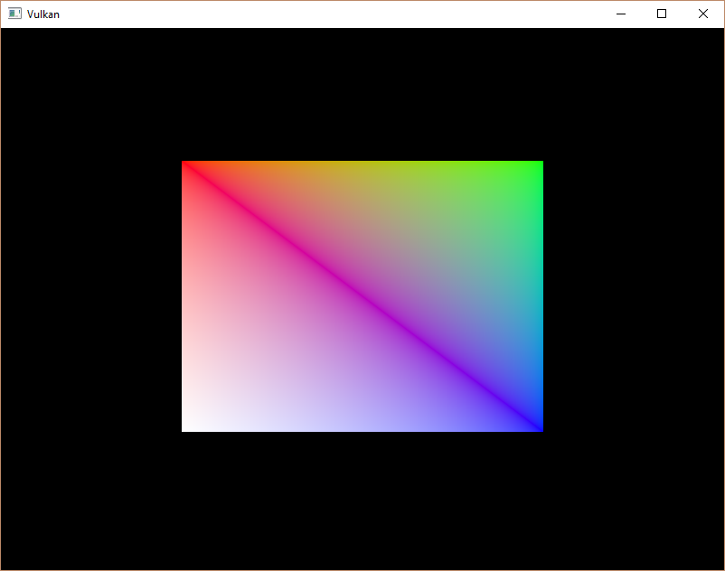

您现在知道如何通过使用索引缓冲区重用顶点来节省内存。加载复杂的 3D 模型时，这将变得尤为重要。

上一章已经提到你应该从一个内存分配中分配多个资源，比如缓冲区，但实际上你应该更进一步。 [驱动开发者推荐](https://developer.nvidia.com/vulkan-memory-management)
您还可以将多个缓冲区（例如顶点和索引缓冲区）存储到单个“VkBuffer”中，并在“vkCmdBindVertexBuffers”等命令中使用偏移量。优点是在这种情况下您的数据对缓存更友好，因为它们更接近。如果在相同的渲染操作期间没有使用它们，甚至可以为多个资源重用相同的内存块，当然前提是它们的数据被刷新。这被称为 *aliasing*并且某些 Vulkan 函数具有明确的标志来指定您要执行此操作。

[C++ code](https://vulkan-tutorial.com/code/20_index_buffer.cpp) /
[Vertex shader](https://vulkan-tutorial.com/code/17_shader_vertexbuffer.vert) /
[Fragment shader](https://vulkan-tutorial.com/code/17_shader_vertexbuffer.frag)


# 描述符布局和缓冲区

## 介绍

我们现在可以将任意属性传递给每个顶点的顶点渲染器，但是全局变量呢？ 从本章开始，我们将继续讨论 3D 图形，这需要一个模型-视图-投影矩阵（ model view projection-MVP）。我们可以将矩阵作为顶点数据包含在内，但这会浪费内存，并且每当转换发生变化时，我们都需要更新顶点缓冲区。转换可以很容易地改变每一帧。

在 Vulkan 中解决这个问题的正确方法是使用*资源描述符*。 描述符是渲染器自由访问缓冲区和图像等资源的一种方式。我们将设置一个包含变换矩阵的缓冲区，并让顶点渲染器通过描述符访问它们。描述符的使用由三部分组成：

* 在管道创建期间指定描述符布局
* 从描述符池中分配一个描述符集
* 渲染时绑定描述符集

*descriptor layout* 指定了管道将要访问的资源类型，就像渲染通道指定要访问的附件类型一样。*descriptor set* 指定将绑定到描述符的实际缓冲区或图像资源，就像帧缓冲区指定要绑定到渲染通道附件的实际图像视图一样。然后描述符集被绑定到绘图命令，就像顶点缓冲区和帧缓冲区一样。

有许多类型的描述符，但在本章中，我们将使用统一缓冲区对象（uniform
buffer objects-UBO）。我们将在以后的章节中介绍其他类型的描述符，但基本过程是相同的。 假设我们有我们希望顶点着色器在 C 结构中拥有的数据，如下所示：

```c++
struct UniformBufferObject {
    glm::mat4 model;
    glm::mat4 view;
    glm::mat4 proj;
};
```

然后我们可以将数据复制到“VkBuffer”并通过顶点渲染器中的统一缓冲区对象描述符访问它，如下所示：

```glsl
layout(binding = 0) uniform UniformBufferObject {
    mat4 model;
    mat4 view;
    mat4 proj;
} ubo;

void main() {
    gl_Position = ubo.proj * ubo.view * ubo.model * vec4(inPosition, 0.0, 1.0);
    fragColor = inColor;
}
```

我们将每帧更新模型、视图和投影矩阵，以使上一章中的矩形在 3D 中旋转。

## 顶点渲染器

修改顶点渲染器以包括上面指定的统一缓冲区对象。本教程假设您熟悉模型-视图-投影矩阵(MVP)转换。如果不是，请参阅第一章中提到的 [资源](https://www.opengl-tutorial.org/beginners-tutorials/tutorial-3-matrices/)。

```glsl
#version 450

layout(binding = 0) uniform UniformBufferObject {
    mat4 model;
    mat4 view;
    mat4 proj;
} ubo;

layout(location = 0) in vec2 inPosition;
layout(location = 1) in vec3 inColor;

layout(location = 0) out vec3 fragColor;

void main() {
    gl_Position = ubo.proj * ubo.view * ubo.model * vec4(inPosition, 0.0, 1.0);
    fragColor = inColor;
}
```

请注意，`uniform`、`in` 和 `out` 声明的顺序无关紧要。 `binding` 指令类似于属性的 `location` 指令。 我们将在描述符布局中引用此绑定。 带有 `gl_Position` 的行已更改为使用转换来计算剪辑坐标中的最终位置。 与 2D 三角形不同，剪辑坐标的最后一个分量可能不是“1”，当转换为屏幕上的最终标准化设备坐标时，这将导致除法。 这是使用在透视投影中作为*透视分割*，对于使更近的物体看起来比更远的物体更大是必不可少的。

## 描述符集合布局

下一步是在 C++ 端定义 UBO，并在顶点着色器中告诉 Vulkan 这个描述符。

```c++
struct UniformBufferObject {
    glm::mat4 model;
    glm::mat4 view;
    glm::mat4 proj;
};
```

我们可以使用 GLM 中的数据类型精确匹配着色器中的定义。矩阵中的数据与渲染器期望的方式是二进制兼容的，因此我们稍后可以将使用 `memcpy` 和 `UniformBufferObject` 转换为 `VkBuffer`。

我们需要提供有关渲染器中用于创建管道的每个描述符绑定的详细信息，就像我们必须为每个顶点属性及其“位置”索引所做的那样。 我们将设置一个新函数来定义所有这些信息，称为`createDescriptorSetLayout`。 它应该在创建管道之前立即调用，因为我们将在那里需要它。

```c++
void initVulkan() {
    ...
    createDescriptorSetLayout();
    createGraphicsPipeline();
    ...
}

...

void createDescriptorSetLayout() {

}
```

每个绑定都需要通过 `VkDescriptorSetLayoutBinding` 结构来描述。

```c++
void createDescriptorSetLayout() {
    VkDescriptorSetLayoutBinding uboLayoutBinding{};
    uboLayoutBinding.binding = 0;
    uboLayoutBinding.descriptorType = VK_DESCRIPTOR_TYPE_UNIFORM_BUFFER;
    uboLayoutBinding.descriptorCount = 1;
}
```

前两个字段指定渲染器中使用的“绑定”和描述符的类型，它是一个统一的缓冲区对象。 渲染器变量可以表示统一缓冲区对象的数组，而 `descriptorCount` 指定数组中值的数量。 例如，这可用于为骨架动画中的每个骨骼指定变换。 我们的 MVP 转换在单个统一缓冲区对象中，因此我们使用 `1` 的`descriptorCount`。

```c++
uboLayoutBinding.stageFlags = VK_SHADER_STAGE_VERTEX_BIT;
```

我们还需要指定描述符将在哪些渲染器阶段被引用。`stageFlags` 字段可以是 `VkShaderStageFlagBits` 值或值 `VK_SHADER_STAGE_ALL_GRAPHICS` 的组合。 在我们的例子中，我们只是从顶点渲染器中引用描述符。

```c++
uboLayoutBinding.pImmutableSamplers = nullptr; // Optional
```

`pImmutableSamplers` 字段仅与图像采样相关的描述符相关，我们稍后会看到。您可以将其保留为默认值。

所有的描述符绑定都组合成一个单独的 `VkDescriptorSetLayout` 对象。 在 `pipelineLayout` 上方定义一个新的类成员：

```c++
VkDescriptorSetLayout descriptorSetLayout;
VkPipelineLayout pipelineLayout;
```

然后我们可以使用 `vkCreateDescriptorSetLayout` 创建它。 这个函数接受一个简单的 `VkDescriptorSetLayoutCreateInfo` 和绑定数组：

```c++
VkDescriptorSetLayoutCreateInfo layoutInfo{};
layoutInfo.sType = VK_STRUCTURE_TYPE_DESCRIPTOR_SET_LAYOUT_CREATE_INFO;
layoutInfo.bindingCount = 1;
layoutInfo.pBindings = &uboLayoutBinding;

if (vkCreateDescriptorSetLayout(device, &layoutInfo, nullptr, &descriptorSetLayout) != VK_SUCCESS) {
    throw std::runtime_error("failed to create descriptor set layout!");
}
```

我们需要在管道创建期间指定描述符集布局，以告诉 Vulkan 渲染器将使用哪些描述符。描述符集布局在管道布局对象中指定。修改 `VkPipelineLayoutCreateInfo` 以引用布局对象：

```c++
VkPipelineLayoutCreateInfo pipelineLayoutInfo{};
pipelineLayoutInfo.sType = VK_STRUCTURE_TYPE_PIPELINE_LAYOUT_CREATE_INFO;
pipelineLayoutInfo.setLayoutCount = 1;
pipelineLayoutInfo.pSetLayouts = &descriptorSetLayout;
```

您可能会好奇，为什么可以在这里指定多个描述符集布局，因为一个已经包含所有绑定。我们将在下一章回到这个话题，在那里我们将研究描述符池和描述符集。

当我们可以创建新的图形管道时，描述符布局应该一直存在，即直到程序结束：

```c++
void cleanup() {
    cleanupSwapChain();

    vkDestroyDescriptorSetLayout(device, descriptorSetLayout, nullptr);

    ...
}
```

## 统一缓冲区

在下一章中，我们将为渲染器指定包含 UBO 数据的缓冲区，但我们需要先创建此缓冲区。处理每帧时，我们都会将新数据复制到统一缓冲区，因此拥有暂存缓冲区没有任何意义。在这种情况下，它只会增加额外的开销，并且可能会降低性能而不是提高性能。

我们应该有多个缓冲区，因为多个帧可能同时在处理中，我们不想更新缓冲区以准备下一帧的同时前一帧仍在读取它！我们可以每帧或每个交换链图像都有一个统一的缓冲区。但是，由于我们需要从每个交换链映像拥有的命令缓冲区中引用统一缓冲区，因此每个交换链映像对应一个统一缓冲区才是最有意义的。

为此，为 `uniformBuffers` 和 `uniformBuffersMemory` 添加新的类成员：

```c++
VkBuffer indexBuffer;
VkDeviceMemory indexBufferMemory;

std::vector<VkBuffer> uniformBuffers;
std::vector<VkDeviceMemory> uniformBuffersMemory;
```

类似地，创建一个在 `createIndexBuffer` 之后调用的新函数 `createUniformBuffers` 并分配缓冲区：

```c++
void initVulkan() {
    ...
    createVertexBuffer();
    createIndexBuffer();
    createUniformBuffers();
    ...
}

...

void createUniformBuffers() {
    VkDeviceSize bufferSize = sizeof(UniformBufferObject);

    uniformBuffers.resize(swapChainImages.size());
    uniformBuffersMemory.resize(swapChainImages.size());

    for (size_t i = 0; i < swapChainImages.size(); i++) {
        createBuffer(bufferSize, VK_BUFFER_USAGE_UNIFORM_BUFFER_BIT, VK_MEMORY_PROPERTY_HOST_VISIBLE_BIT | VK_MEMORY_PROPERTY_HOST_COHERENT_BIT, uniformBuffers[i], uniformBuffersMemory[i]);
    }
}
```

我们将编写一个单独的函数，每帧用一个新的转换更新统一缓冲区，所以这里不会有`vkMapMemory`。 统一缓冲区数据将用于所有绘制调用，因此只有在我们停止渲染时才应销毁包含它的缓冲区。 由于它还取决于交换链图像的数量，在重新创建后可能会发生变化，我们将在 `cleanupSwapChain` 中对其进行清理：

```c++
void cleanupSwapChain() {
    ...

    for (size_t i = 0; i < swapChainImages.size(); i++) {
        vkDestroyBuffer(device, uniformBuffers[i], nullptr);
        vkFreeMemory(device, uniformBuffersMemory[i], nullptr);
    }
}
```

这意味着我们还需要在 `recreateSwapChain` 中重新创建它：

```c++
void recreateSwapChain() {
    ...

    createFramebuffers();
    createUniformBuffers();
    createCommandBuffers();
}
```:

## 更新统一数据

创建一个新函数 `updateUniformBuffer` 并在我们获取交换链图像后立即从 `drawFrame` 函数中调用它：

```c++
void drawFrame() {
    ...

    uint32_t imageIndex;
    VkResult result = vkAcquireNextImageKHR(device, swapChain, UINT64_MAX, imageAvailableSemaphores[currentFrame], VK_NULL_HANDLE, &imageIndex);

    ...

    updateUniformBuffer(imageIndex);

    VkSubmitInfo submitInfo{};
    submitInfo.sType = VK_STRUCTURE_TYPE_SUBMIT_INFO;

    ...
}

...

void updateUniformBuffer(uint32_t currentImage) {

}
```

此函数将每帧生成一个新的变换，以使几何图形旋转。我们需要包含两个新的头文件来实现这个功能：

```c++
#define GLM_FORCE_RADIANS
#include <glm/glm.hpp>
#include <glm/gtc/matrix_transform.hpp>

#include <chrono>
```

`glm/gtc/matrix_transform.hpp` 头文件公开了可用于生成模型转换（如 `glm::rotate`）、视图转换（如 `glm::lookAt`）和投影转换（如 `glm::perspective`）的函数。 `GLM_FORCE_RADIANS` 定义是必要的，以确保像 `glm::rotate` 这样的函数使用弧度作为参数，以避免任何可能的混淆。

`chrono` 标准库头文件公开了进行精确计时的函数。我们将使用它来确保几何图形每秒旋转 90 度，而不管帧速率如何。

```c++
void updateUniformBuffer(uint32_t currentImage) {
    static auto startTime = std::chrono::high_resolution_clock::now();

    auto currentTime = std::chrono::high_resolution_clock::now();
    float time = std::chrono::duration<float, std::chrono::seconds::period>(currentTime - startTime).count();
}
```

`updateUniformBuffer` 函数将从一些逻辑开始，以计算自以浮点精度开始渲染以来的时间（以秒为单位）。

我们现在将在统一缓冲区对象中定义模型、视图和投影变换。模型旋转将是使用 `time` 变量围绕 Z 轴进行的简单旋转：

```c++
UniformBufferObject ubo{};
ubo.model = glm::rotate(glm::mat4(1.0f), time * glm::radians(90.0f), glm::vec3(0.0f, 0.0f, 1.0f));
```

`glm::rotate` 函数将现有的变换、旋转角度和旋转轴作为参数。`glm::mat4(1.0f)` 构造函数返回一个单位矩阵。 使用 `time * glm::radians(90.0f)` 的旋转角度可以达到每秒旋转 90 度的目的。

```c++
ubo.view = glm::lookAt(glm::vec3(2.0f, 2.0f, 2.0f), glm::vec3(0.0f, 0.0f, 0.0f), glm::vec3(0.0f, 0.0f, 1.0f));
```

对于视图转换，我决定以 45 度角从上方查看几何图形。 `glm::lookAt` 函数将眼睛位置、中心位置和上轴作为参数。

```c++
ubo.proj = glm::perspective(glm::radians(45.0f), swapChainExtent.width / (float) swapChainExtent.height, 0.1f, 10.0f);
```

我选择使用具有 45 度垂直视野的透视投影。其他参数是纵横比、近视平面和远视平面。 重要的是使用当前交换链范围来计算纵横比，以考虑调整大小后窗口的新宽度和高度。

```c++
ubo.proj[1][1] *= -1;
```

GLM 最初是为 OpenGL 设计的，其中剪辑坐标的 Y 坐标是倒置的。 最简单的补偿方法是翻转投影矩阵中 Y 轴比例因子上的符号。 如果你不这样做，那么图像将被颠倒渲染。

现在所有的转换都定义好了，所以我们可以将统一缓冲区对象中的数据复制到当前统一缓冲区中。 这与我们对顶点缓冲区所做的方式完全相同，只是没有暂存缓冲区：

```c++
void* data;
vkMapMemory(device, uniformBuffersMemory[currentImage], 0, sizeof(ubo), 0, &data);
    memcpy(data, &ubo, sizeof(ubo));
vkUnmapMemory(device, uniformBuffersMemory[currentImage]);
```

以这种方式使用 UBO 并不是将频繁更改的值传递给渲染器的最有效方式。将少量数据缓冲区传递给着色器的更有效方法是 *push constants*。 我们可能会在以后的章节中讨论这些内容。

在下一章中，我们将了解描述符集，它实际上将 `VkBuffer` 绑定到统一缓冲区描述符，以便渲染器可以访问此转换数据。

[C++ code](https://vulkan-tutorial.com/code/21_descriptor_layout.cpp) /
[Vertex shader](https://vulkan-tutorial.com/code/21_shader_ubo.vert) /
[Fragment shader](https://vulkan-tutorial.com/code/21_shader_ubo.frag)


# 描述符池和集合

## 介绍

上一章的描述符布局描述了可以绑定的描述符类型。 在本章中，我们将为每个 `VkBuffer` 资源创建一个描述符集，以将其绑定到统一缓冲区描述符。

## 描述符池

描述符集不能直接创建，它们必须从像命令缓冲区这样的池中分配。毫无疑问，描述符集的等价物称为*描述符池*。 我们将编写一个新函数 `createDescriptorPool` 来设置它。

```c++
void initVulkan() {
    ...
    createUniformBuffers();
    createDescriptorPool();
    ...
}

...

void createDescriptorPool() {

}
```

我们首先需要使用 `VkDescriptorPoolSize` 结构来描述我们的描述符集将包含哪些描述符类型以及它们的数量。

```c++
VkDescriptorPoolSize poolSize{};
poolSize.type = VK_DESCRIPTOR_TYPE_UNIFORM_BUFFER;
poolSize.descriptorCount = static_cast<uint32_t>(swapChainImages.size());
```

我们将为每一帧分配一个描述符。池大小结构在函数VkDescriptorPoolCreateInfo` 中引用：

```c++
VkDescriptorPoolCreateInfo poolInfo{};
poolInfo.sType = VK_STRUCTURE_TYPE_DESCRIPTOR_POOL_CREATE_INFO;
poolInfo.poolSizeCount = 1;
poolInfo.pPoolSizes = &poolSize;
```

除了可用的单个描述符的最大数量之外，我们还需要指定可以分配的描述符集的最大数量：

```c++
poolInfo.maxSets = static_cast<uint32_t>(swapChainImages.size());
```

该结构有一个类似于命令池的可选标志，用于确定是否可以释放单个描述符集：
`VK_DESCRIPTOR_POOL_CREATE_FREE_DESCRIPTOR_SET_BIT`。 我们不会在创建描述符集后触及它，所以我们不需要这个标志。您可以将 `flags` 保留为其默认值 `0`。

```c++
VkDescriptorPool descriptorPool;

...

if (vkCreateDescriptorPool(device, &poolInfo, nullptr, &descriptorPool) != VK_SUCCESS) {
    throw std::runtime_error("failed to create descriptor pool!");
}
```

添加一个新的类成员来存储描述符池的句柄并调用 `vkCreateDescriptorPool` 来创建它。重新创建交换链时应该销毁描述符池，因为它取决于图像的数量：

```c++
void cleanupSwapChain() {
    ...

    for (size_t i = 0; i < swapChainImages.size(); i++) {
        vkDestroyBuffer(device, uniformBuffers[i], nullptr);
        vkFreeMemory(device, uniformBuffersMemory[i], nullptr);
    }

    vkDestroyDescriptorPool(device, descriptorPool, nullptr);
}
```

并在 `recreateSwapChain` 中重新创建：

```c++
void recreateSwapChain() {
    ...

    createUniformBuffers();
    createDescriptorPool();
    createCommandBuffers();
}
```

## 描述符集

我们现在可以自己分配描述符集。为此目的添加一个 `createDescriptorSets` 函数：

```c++
void initVulkan() {
    ...
    createDescriptorPool();
    createDescriptorSets();
    ...
}

void recreateSwapChain() {
    ...
    createDescriptorPool();
    createDescriptorSets();
    ...
}

...

void createDescriptorSets() {

}
```

描述符集分配使用 `VkDescriptorSetAllocateInfo` 结构来描述。 您需要指定要分配的描述符池、要分配的描述符集的数量以及它们所基于的描述符布局：

```c++
std::vector<VkDescriptorSetLayout> layouts(swapChainImages.size(), descriptorSetLayout);
VkDescriptorSetAllocateInfo allocInfo{};
allocInfo.sType = VK_STRUCTURE_TYPE_DESCRIPTOR_SET_ALLOCATE_INFO;
allocInfo.descriptorPool = descriptorPool;
allocInfo.descriptorSetCount = static_cast<uint32_t>(swapChainImages.size());
allocInfo.pSetLayouts = layouts.data();
```

在我们的例子中，我们将为每个交换链图像创建一个描述符集，所有这些都具有相同的布局。不幸的是，我们确实需要布局的所有副本，因为下一个函数需要一个与集合数匹配的数组。

添加一个类成员来保存描述符集句柄并使用 `vkAllocateDescriptorSets` 分配它们：

```c++
VkDescriptorPool descriptorPool;
std::vector<VkDescriptorSet> descriptorSets;

...

descriptorSets.resize(swapChainImages.size());
if (vkAllocateDescriptorSets(device, &allocInfo, descriptorSets.data()) != VK_SUCCESS) {
    throw std::runtime_error("failed to allocate descriptor sets!");
}
```

您不需要显式清理描述符集，因为它们会在描述符池被销毁时自动释放。对 `vkAllocateDescriptorSets` 的调用将分配描述符集，每个描述符集都有一个统一缓冲区描述符。

现在已经分配了描述符集，但是其中的描述符仍然需要配置。我们现在将添加一个循环来填充每个描述符：

```c++
for (size_t i = 0; i < swapChainImages.size(); i++) {

}
```

引用缓冲区的描述符，如统一缓冲区描述符，配置有一个 `VkDescriptorBufferInfo` 结构。 此结构指定缓冲区和其中包含描述符数据的区域。

```c++
for (size_t i = 0; i < swapChainImages.size(); i++) {
    VkDescriptorBufferInfo bufferInfo{};
    bufferInfo.buffer = uniformBuffers[i];
    bufferInfo.offset = 0;
    bufferInfo.range = sizeof(UniformBufferObject);
}
```

如果您要覆盖整个缓冲区，就像我们在这种情况下一样，那么也可以使用 `VK_WHOLE_SIZE` 值作为范围。 描述符的配置是使用 `vkUpdateDescriptorSets` 函数更新的，该函数将 `VkWriteDescriptorSet` 结构数组作为参数。

```c++
VkWriteDescriptorSet descriptorWrite{};
descriptorWrite.sType = VK_STRUCTURE_TYPE_WRITE_DESCRIPTOR_SET;
descriptorWrite.dstSet = descriptorSets[i];
descriptorWrite.dstBinding = 0;
descriptorWrite.dstArrayElement = 0;
```

前两个字段指定要更新的描述符集和绑定。我们给了统一的缓冲区绑定索引“0”。请记住，描述符可以是数组，因此我们还需要指定要更新的数组中的第一个索引。我们没有使用数组，所以索引只是“0”。

```c++
descriptorWrite.descriptorType = VK_DESCRIPTOR_TYPE_UNIFORM_BUFFER;
descriptorWrite.descriptorCount = 1;
```

我们需要再次指定描述符的类型。可以一次更新数组中的多个描述符，从索引 `dstArrayElement` 开始。 `descriptorCount` 字段指定要更新的数组元素的数量。

```c++
descriptorWrite.pBufferInfo = &bufferInfo;
descriptorWrite.pImageInfo = nullptr; // Optional
descriptorWrite.pTexelBufferView = nullptr; // Optional
```

最后一个字段引用了一个具有实际配置描述符的 `descriptorCount` 结构的数组。这取决于您实际需要使用的三个描述符之一的类型。`pBufferInfo` 字段用于引用缓冲区数据的描述符，`pImageInfo` 用于引用图像数据的描述符，而`pTexelBufferView` 用于引用缓冲区视图的描述符。 我们的描述符是基于缓冲区的，所以我们使用了`pBufferInfo`。

```c++
vkUpdateDescriptorSets(device, 1, &descriptorWrite, 0, nullptr);
```

使用 `vkUpdateDescriptorSets` 应用更新。 它接受两种数组作为参数：`VkWriteDescriptorSet` 数组和`VkCopyDescriptorSet` 数组。 顾名思义，后者可用于将描述符相互复制。

## 使用描述符集

我们现在需要更新 `createCommandBuffers` 函数，以便使用 `vkCmdBindDescriptorSets` 将每个交换链图像的正确描述符集实际绑定到着色器中的描述符。这需要在调用 `vkCmdDrawIndexed` 之前完成：

```c++
vkCmdBindDescriptorSets(commandBuffers[i], VK_PIPELINE_BIND_POINT_GRAPHICS, pipelineLayout, 0, 1, &descriptorSets[i], 0, nullptr);
vkCmdDrawIndexed(commandBuffers[i], static_cast<uint32_t>(indices.size()), 1, 0, 0, 0);
```

与顶点和索引缓冲区不同，描述符集不是图形管道独有的。 因此，我们需要指定是否要将描述符集绑定到图形或计算管道。下一个参数是描述符对应的管道布局。 接下来的三个参数指定第一个描述符集的索引、要绑定的集数和要绑定的集数组。我们稍后再谈。 最后两个参数指定用于动态描述符的偏移量数组。 我们将在以后的章节中讨论这些内容。

如果你现在运行你的程序，那么你会发现什么也不会显示。问题在于，由于我们在投影矩阵中进行了 Y 翻转，顶点现在以逆时针顺序而不是顺时针顺序绘制。这会导致背面剔除并阻止绘制任何几何图形。 转到 `createGraphicsPipeline` 函数并修改 `VkPipelineRasterizationStateCreateInfo` 中的 `frontFace` 以更正此问题：

```c++
rasterizer.cullMode = VK_CULL_MODE_BACK_BIT;
rasterizer.frontFace = VK_FRONT_FACE_COUNTER_CLOCKWISE;
```

再次运行您的程序，您现在应该看到以下内容：

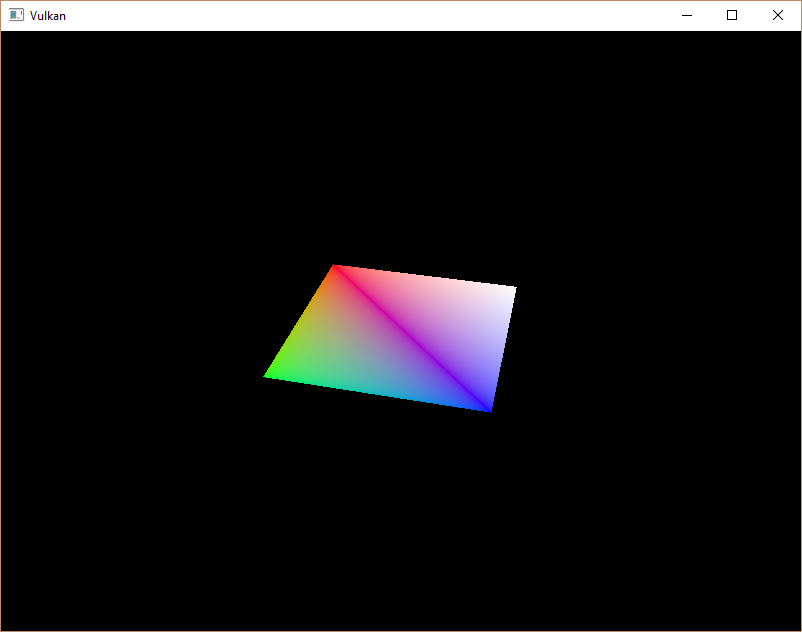

矩形已变为正方形，因为投影矩阵现在校正了纵横比。 `updateUniformBuffer` 负责调整屏幕大小，因此我们不需要重新创建 `recreateSwapChain` 中设置的描述符。

## 对齐要求

到目前为止，我们忽略的一件事是 C++ 结构中的数据应该如何与渲染器中的统一定义匹配。很明显，两者使用相同的类型：

```c++
struct UniformBufferObject {
    glm::mat4 model;
    glm::mat4 view;
    glm::mat4 proj;
};

layout(binding = 0) uniform UniformBufferObject {
    mat4 model;
    mat4 view;
    mat4 proj;
} ubo;
```

然而，这不能反映问题。 例如，尝试将结构和渲染器修改为如下所示：

```c++
struct UniformBufferObject {
    glm::vec2 foo;
    glm::mat4 model;
    glm::mat4 view;
    glm::mat4 proj;
};

layout(binding = 0) uniform UniformBufferObject {
    vec2 foo;
    mat4 model;
    mat4 view;
    mat4 proj;
} ubo;
```

重新编译你的渲染器和你的程序并运行它，你会发现你之前工作的彩色方块已经消失了！这就是我们强调的*对齐要求*。

Vulkan 期望结构中的数据以特定方式在内存中对齐，例如：

* 标量必须按 N 对齐（= 4 字节，给定 32 位浮点数）。
* `vec2` 必须对齐 2N（= 8 字节）
* `vec3` 或 `vec4` 必须对齐 4N（= 16 字节）
* 嵌套结构必须通过其成员的基本对齐方式进行对齐，四舍五入到 16 的倍数。
* `mat4` 矩阵必须与 `vec4` 具有相同的对齐方式。

您可以在 [规范](https://www.khronos.org/registry/vulkan/specs/1.3-extensions/html/chap15.html#interfaces-resources-layout) 中找到对齐要求的完整列表。

我们最初只有三个“mat4”字段的渲染器已经满足对齐要求。 由于每个 `mat4` 的大小为 4 x 4 x 4 = 64 字节，`model` 的偏移量为 `0`，`view` 的偏移量为 64，`proj` 的偏移量为 128。所有这些都是 16 的倍数，这就是它运行良好的原因。

改动后的新结构以 `vec2` 开头，它的大小只有 8 个字节，因此会丢弃所有偏移量。 现在`model`的偏移量是`8`，`view`的偏移量是`72`，`proj`的偏移量是`136`，它们都不是16的倍数。为了解决这个问题，我们可以使用[C++11 中引入的 alignas](https://en.cppreference.com/w/cpp/language/alignas) 说明符：

```c++
struct UniformBufferObject {
    glm::vec2 foo;
    alignas(16) glm::mat4 model;
    glm::mat4 view;
    glm::mat4 proj;
};
```

如果您现在再次编译并运行您的程序，您应该会看到渲染器再次正确接收其矩阵值。

幸运的是，有一种方法可以不必花*大多数*时间考虑这些对齐要求。 我们可以在包含 GLM 之前定义“GLM_FORCE_DEFAULT_ALIGNED_GENTYPES”：

```c++
#define GLM_FORCE_RADIANS
#define GLM_FORCE_DEFAULT_ALIGNED_GENTYPES
#include <glm/glm.hpp>
```

这将迫使 GLM 使用已经为我们指定对齐要求的 `vec2` 和 `mat4` 版本。 如果添加此定义，则可以删除 `alignas` 说明符，您的程序应该仍然可以工作。

不幸的是，如果您开始使用嵌套结构，这种方法可能会失效。 考虑 C++ 代码中的以下定义：

```c++
struct Foo {
    glm::vec2 v;
};

struct UniformBufferObject {
    Foo f1;
    Foo f2;
};
```

And the following shader definition:

```c++
struct Foo {
    vec2 v;
};

layout(binding = 0) uniform UniformBufferObject {
    Foo f1;
    Foo f2;
} ubo;
```

在这种情况下，`f2` 将具有 `8` 的偏移量，而它应该具有 `16` 的偏移量，因为它是一个嵌套结构。 在这种情况下，您必须自己指定对齐方式：

```c++
struct UniformBufferObject {
    Foo f1;
    alignas(16) Foo f2;
};
```

这些陷阱说明始终明确对齐是非常有必要的。这样您就不会因对齐错误的奇怪症状而措手不及。

```c++
struct UniformBufferObject {
    alignas(16) glm::mat4 model;
    alignas(16) glm::mat4 view;
    alignas(16) glm::mat4 proj;
};
```

不要忘记在删除 `foo` 字段后重新编译你的渲染器。

## 多个描述符集

正如一些结构和函数调用所暗示的那样，实际上可以同时绑定多个描述符集。 创建管道布局时，您需要为每个描述符集指定一个描述符布局。 然后渲染器可以像这样引用特定的描述符集：

```c++
layout(set = 0, binding = 0) uniform UniformBufferObject { ... }
```

您可以使用此功能将每个对象的不同描述符和共享的描述符放入单独的描述符集中。 在这种情况下，您可以避免在绘图调用中重新绑定大多数描述符，这可能更有效。

[C++ code](https://vulkan-tutorial.com/code/22_descriptor_sets.cpp) /
[Vertex shader](https://vulkan-tutorial.com/code/21_shader_ubo.vert) /
[Fragment shader](https://vulkan-tutorial.com/code/21_shader_ubo.frag)


# 图片

## 介绍

到目前为止，几何图形已使用每个顶点颜色进行着色，这是一种功能有限的涂色方法。在本教程的这一部分中，我们将实现纹理映射以使几何图形看起来更有趣。 这也将允许我们在以后的章节中加载和绘制基本的 3D 模型。

向我们的应用程序添加纹理渲染将涉及以下步骤：

* 创建设备内存支持的图像对象
* 用图像文件中的像素填充它
* 创建图像采样器
* 添加组合图像采样器描述符以从纹理中采样颜色

我们之前已经使用过图像对象，但它们是由交换链扩展自动创建的。 这一次，我们将不得不自己创建一个。 创建图像并用数据填充它类似于顶点缓冲区的创建。 我们将首先创建一个暂存资源并用像素数据填充它，然后将其复制到我们将用于渲染的最终图像对象。 尽管可以为此目的创建暂存图像，但 Vulkan 还允许您将像素从 `VkBuffer` 复制到图像，并且此类 API 实际上 [在某些硬件上更快] (https://developer.nvidia. com/vulkan-内存管理）。 我们将首先创建这个缓冲区并用像素值填充它，然后我们将创建一个图像来复制像素。 创建图像与创建缓冲区没有太大区别。 它涉及查询内存需求、分配设备内存并绑定它，就像我们之前看到的那样。

但是，在处理图像时，我们还需要注意一些额外的事情。 图像可以有不同的*布局*，这些布局会影响像素在内存中的组织方式。 例如，由于图形硬件的工作方式，简单地逐行存储像素可能不会带来最佳性能。在对图像执行任何操作时，您必须确保它们具有最适合在该操作中使用的布局。当我们指定渲染通道时，我们实际上已经看到了其中一些布局：

* `VK_IMAGE_LAYOUT_PRESENT_SRC_KHR`：最适合演示显示
* `VK_IMAGE_LAYOUT_COLOR_ATTACHMENT_OPTIMAL`：最适合作为画图附件片段渲染器的颜色纹理
* `VK_IMAGE_LAYOUT_TRANSFER_SRC_OPTIMAL`：最适合作为传输源操作，例如 `vkCmdCopyImageToBuffer`
* `VK_IMAGE_LAYOUT_TRANSFER_DST_OPTIMAL`：最适合作为转移的目的地操作，例如 `vkCmdCopyBufferToImage`
* `VK_IMAGE_LAYOUT_SHADER_READ_ONLY_OPTIMAL`：最适合从渲染器采样

转换图像布局的最常见方法之一是*管道屏障*。管道屏障主要用于同步对资源的访问，例如确保在读取图像之前写入图像，但它们也可用于转换布局。 在本章中，我们将看到管道屏障如何用于此目的。使用 `VK_SHARING_MODE_EXCLUSIVE` 时，屏障还可用于转移队列家族的所有权。

## 图像库

有许多图像库可用于加载图像，您甚至可以编写自己的代码来加载 BMP 和 PPM 等简单格式。 在本教程中，我们将使用 [stb 集合](https://github.com/nothings/stb) 中的 stb_image 库。它的优点是所有代码都在一个文件中，因此不需要任何棘手的构建配置。下载 `stb_image.h` 并将其存储在方便的位置，例如您保存 GLFW 和 GLM 的目录。 将位置添加到包含路径。

**Visual Studio**

将包含 `stb_image.h` 文件的目录添加到 `Additional Include` 目录的路径。

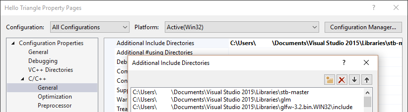

**Makefile**

将带有 `stb_image.h` 文件的目录添加到 GCC 的包含目录中：

```text
VULKAN_SDK_PATH = /home/user/VulkanSDK/x.x.x.x/x86_64
STB_INCLUDE_PATH = /home/user/libraries/stb

...

CFLAGS = -std=c++17 -I$(VULKAN_SDK_PATH)/include -I$(STB_INCLUDE_PATH)
```

## 加载图像

像如下这样包含图像库：

```c++
#define STB_IMAGE_IMPLEMENTATION
#include <stb_image.h>
```

默认情况下，标头仅定义函数的原型。 一个代码文件需要包含带有 `STB_IMAGE_IMPLEMENTATION` 定义的标头以包含函数体，否则我们会得到链接错误。

```c++
void initVulkan() {
    ...
    createCommandPool();
    createTextureImage();
    createVertexBuffer();
    ...
}

...

void createTextureImage() {

}
```

创建一个新函数“createTextureImage”，我们将在其中加载图像并将其上传到 Vulkan 图像对象中。我们将使用命令缓冲区，所以它应该在`createCommandPool`之后调用。

在 `shaders` 目录旁边创建一个新目录 `textures` 来存储纹理图像。我们将从该目录加载一个名为 `texture.jpg` 的图像。 我选择使用以下
[CC0 许可的图像](https://pixabay.com/en/statue-sculpture-fig-historically-1275469/) 调整为 512 x 512 像素，但您可以随意选择任何您想要的图像。 该库支持最常见的图像文件格式，如 JPEG、PNG、BMP 和 GIF。


使用这个库加载图像非常简单：

```c++
void createTextureImage() {
    int texWidth, texHeight, texChannels;
    stbi_uc* pixels = stbi_load("textures/texture.jpg", &texWidth, &texHeight, &texChannels, STBI_rgb_alpha);
    VkDeviceSize imageSize = texWidth * texHeight * 4;

    if (!pixels) {
        throw std::runtime_error("failed to load texture image!");
    }
}
```

`stbi_load` 函数将文件路径和要加载的通道数作为参数。 `STBI_rgb_alpha` 值强制使用 alpha 通道加载图像，即使它没有，这对于将来与其他纹理的一致性很有好处。 中间三个参数是图像中宽度、高度和实际通道数的输出。 返回的指针是像素值数组中的第一个元素。 在 `STBI_rgb_alpha` 的情况下，像素逐行排列，每个像素 4 个字节，总共有 `texWidth * texHeight * 4` 个字节。

## 暂存缓冲区

我们现在要在主机可见内存中创建一个缓冲区，以便我们可以使用 `vkMapMemory` 并将像素复制到它。将此临时缓冲区的变量添加到 `createTextureImage` 函数：

```c++
VkBuffer stagingBuffer;
VkDeviceMemory stagingBufferMemory;
```

缓冲区应该在主机可见内存中，以便我们可以映射它，它应该可以用作传输源，以便我们稍后可以将其复制到图像对象中：

```c++
createBuffer(imageSize, VK_BUFFER_USAGE_TRANSFER_SRC_BIT, VK_MEMORY_PROPERTY_HOST_VISIBLE_BIT | VK_MEMORY_PROPERTY_HOST_COHERENT_BIT, stagingBuffer, stagingBufferMemory);
```

然后我们可以直接将我们从图像加载库中获得的像素值复制到缓冲区中：

```c++
void* data;
vkMapMemory(device, stagingBufferMemory, 0, imageSize, 0, &data);
    memcpy(data, pixels, static_cast<size_t>(imageSize));
vkUnmapMemory(device, stagingBufferMemory);
```

此刻不要忘记清理原始像素数组。

```c++
stbi_image_free(pixels);
```

## 纹理图像

尽管我们可以设置渲染器来访问缓冲区中的像素值，但最好使用 Vulkan 中的图像对象来实现此目的。图像对象允许我们使用 2D 坐标，这将使检索颜色变得更容易和更快。 图像对象中的像素称为纹理，从现在开始我们将使用该名称。添加以下新类成员：

```c++
VkImage textureImage;
VkDeviceMemory textureImageMemory;
```

图像对象的参数在 `VkImageCreateInfo` 结构体中指定：

```c++
VkImageCreateInfo imageInfo{};
imageInfo.sType = VK_STRUCTURE_TYPE_IMAGE_CREATE_INFO;
imageInfo.imageType = VK_IMAGE_TYPE_2D;
imageInfo.extent.width = static_cast<uint32_t>(texWidth);
imageInfo.extent.height = static_cast<uint32_t>(texHeight);
imageInfo.extent.depth = 1;
imageInfo.mipLevels = 1;
imageInfo.arrayLayers = 1;
```

`imageType` 字段中指定的图像类型告诉 Vulkan，图像中的纹理将使用哪种坐标系来处理。 可以创建 1D、2D 和 3D 图像。 例如，一维图像可用于存储数据数组或梯度，二维图像主要用于纹理，而三维图像可用于存储体素体积。 `extent` 字段指定图像的尺寸，基本上是每个轴上有多少像素。 这就是为什么 `depth` 必须是 `1` 而不是 `0`。 我们的纹理不会是一个数组，我们暂时也不会使用 mipmapping。

```c++
imageInfo.format = VK_FORMAT_R8G8B8A8_SRGB;
```

Vulkan 支持许多可能的图像格式，但我们应该对纹理使用与缓冲区中的像素相同的格式，否则复制操作将失败。

```c++
imageInfo.tiling = VK_IMAGE_TILING_OPTIMAL;
```

`tiling` 字段可以具有以下两个值之一：

* `VK_IMAGE_TILING_LINEAR`：Texels 像我们的 `pixels` 数组一样以行优先顺序排列
* `VK_IMAGE_TILING_OPTIMAL`：Texels 以实现定义的顺序排列以实现最佳访问

与图像的布局不同，平铺模式不能在以后更改。 如果你希望能够直接访问图像内存中的纹理，那么你必须使用`VK_IMAGE_TILING_LINEAR`。 我们将使用暂存缓冲区而不是暂存图像对象，因此这不是必需的。 我们将使用 `VK_IMAGE_TILING_OPTIMAL` 从渲染器进行有效访问。

```c++
imageInfo.initialLayout = VK_IMAGE_LAYOUT_UNDEFINED;
```

图像的 `initialLayout` 只有两个可能的值：

* `VK_IMAGE_LAYOUT_UNDEFINED`：GPU 不可用，第一个转换将丢弃纹理。
* `VK_IMAGE_LAYOUT_PREINITIALIZED`：GPU 不可用，但第一个转换将保留纹理。

很少有情况需要在第一次转换期间保留纹理。有这样一个特殊示例，如果您想将图像用作临时图像并结合 `VK_IMAGE_TILING_LINEAR` 布局。 在这种情况下，您需要将纹理数据上传到它，然后将图像转换为传输源，而不会丢失数据。 然而，在我们的例子中，我们首先将图像转换为传输目标，然后将 texel 数据从缓冲区对象复制到它，所以我们不需要这个属性并且可以安全地使用 `VK_IMAGE_LAYOUT_UNDEFINED`。

```c++
imageInfo.usage = VK_IMAGE_USAGE_TRANSFER_DST_BIT | VK_IMAGE_USAGE_SAMPLED_BIT;
```

`usage` 字段与缓冲区创建期间的语义相同。该图像将用作缓冲区副本的传输目标。我们还希望能够从渲染器访问图像以对我们的网格进行涂色，因此用法应包括 `VK_IMAGE_USAGE_SAMPLED_BIT`。

```c++
imageInfo.sharingMode = VK_SHARING_MODE_EXCLUSIVE;
```

该图像将仅由一个命令队列家族使用：支持图形（因此也支持）传输操作的队列家族。

```c++
imageInfo.samples = VK_SAMPLE_COUNT_1_BIT;
imageInfo.flags = 0; // Optional
```

`samples` 标志与多重采样有关。这仅与将用作附件的图像相关，因此请坚持使用一个比特设置。与稀疏图像相关的图像有一些可选标志。 稀疏图像是只有某些区域实际上由内存支持的图像。 例如，如果您对立体地形使用 3D 纹理，则可以使用它来避免分配内存来存储大量“空气”值。 我们不会在本教程中使用它，所以将其保留为默认值“0”。

```c++
if (vkCreateImage(device, &imageInfo, nullptr, &textureImage) != VK_SUCCESS) {
    throw std::runtime_error("failed to create image!");
}
```

图像是使用 `vkCreateImage` 创建的，它没有任何特别值得注意的参数。 图形硬件可能不支持“VK_FORMAT_R8G8B8A8_SRGB”格式。 您应该有一个可接受的替代方案列表，并选择受支持的最佳替代方案。 但是，对这种特定格式的支持非常广泛，我们将跳过这一步。 使用不同的格式也需要烦人的转换。 我们将在深度缓冲区一章中回到这一点，在那里我们将实现这样一个系统。

```c++
VkMemoryRequirements memRequirements;
vkGetImageMemoryRequirements(device, textureImage, &memRequirements);

VkMemoryAllocateInfo allocInfo{};
allocInfo.sType = VK_STRUCTURE_TYPE_MEMORY_ALLOCATE_INFO;
allocInfo.allocationSize = memRequirements.size;
allocInfo.memoryTypeIndex = findMemoryType(memRequirements.memoryTypeBits, VK_MEMORY_PROPERTY_DEVICE_LOCAL_BIT);

if (vkAllocateMemory(device, &allocInfo, nullptr, &textureImageMemory) != VK_SUCCESS) {
    throw std::runtime_error("failed to allocate image memory!");
}

vkBindImageMemory(device, textureImage, textureImageMemory, 0);
```

为图像分配内存的工作方式与为缓冲区分配内存的方式完全相同。 使用 `vkGetImageMemoryRequirements` 代替 `vkGetBufferMemoryRequirements`，并使用 `vkBindImageMemory` 代替 `vkBindBufferMemory`。

这个函数已经变得相当大了，在后面的章节中需要创建更多的图像，所以我们应该将图像创建抽象到一个`createImage`函数中，就像我们对缓冲区所做的那样。 创建函数并将图像对象的创建和内存分配移至它：

```c++
void createImage(uint32_t width, uint32_t height, VkFormat format, VkImageTiling tiling, VkImageUsageFlags usage, VkMemoryPropertyFlags properties, VkImage& image, VkDeviceMemory& imageMemory) {
    VkImageCreateInfo imageInfo{};
    imageInfo.sType = VK_STRUCTURE_TYPE_IMAGE_CREATE_INFO;
    imageInfo.imageType = VK_IMAGE_TYPE_2D;
    imageInfo.extent.width = width;
    imageInfo.extent.height = height;
    imageInfo.extent.depth = 1;
    imageInfo.mipLevels = 1;
    imageInfo.arrayLayers = 1;
    imageInfo.format = format;
    imageInfo.tiling = tiling;
    imageInfo.initialLayout = VK_IMAGE_LAYOUT_UNDEFINED;
    imageInfo.usage = usage;
    imageInfo.samples = VK_SAMPLE_COUNT_1_BIT;
    imageInfo.sharingMode = VK_SHARING_MODE_EXCLUSIVE;

    if (vkCreateImage(device, &imageInfo, nullptr, &image) != VK_SUCCESS) {
        throw std::runtime_error("failed to create image!");
    }

    VkMemoryRequirements memRequirements;
    vkGetImageMemoryRequirements(device, image, &memRequirements);

    VkMemoryAllocateInfo allocInfo{};
    allocInfo.sType = VK_STRUCTURE_TYPE_MEMORY_ALLOCATE_INFO;
    allocInfo.allocationSize = memRequirements.size;
    allocInfo.memoryTypeIndex = findMemoryType(memRequirements.memoryTypeBits, properties);

    if (vkAllocateMemory(device, &allocInfo, nullptr, &imageMemory) != VK_SUCCESS) {
        throw std::runtime_error("failed to allocate image memory!");
    }

    vkBindImageMemory(device, image, imageMemory, 0);
}
```

我已经设置了宽度、高度、格式、平铺模式、使用情况和内存属性参数，通过传入不同的参数我们可在本教程中创建不同的图像。

`createTextureImage` 函数现在可以简化为：

```c++
void createTextureImage() {
    int texWidth, texHeight, texChannels;
    stbi_uc* pixels = stbi_load("textures/texture.jpg", &texWidth, &texHeight, &texChannels, STBI_rgb_alpha);
    VkDeviceSize imageSize = texWidth * texHeight * 4;

    if (!pixels) {
        throw std::runtime_error("failed to load texture image!");
    }

    VkBuffer stagingBuffer;
    VkDeviceMemory stagingBufferMemory;
    createBuffer(imageSize, VK_BUFFER_USAGE_TRANSFER_SRC_BIT, VK_MEMORY_PROPERTY_HOST_VISIBLE_BIT | VK_MEMORY_PROPERTY_HOST_COHERENT_BIT, stagingBuffer, stagingBufferMemory);

    void* data;
    vkMapMemory(device, stagingBufferMemory, 0, imageSize, 0, &data);
        memcpy(data, pixels, static_cast<size_t>(imageSize));
    vkUnmapMemory(device, stagingBufferMemory);

    stbi_image_free(pixels);

    createImage(texWidth, texHeight, VK_FORMAT_R8G8B8A8_SRGB, VK_IMAGE_TILING_OPTIMAL, VK_IMAGE_USAGE_TRANSFER_DST_BIT | VK_IMAGE_USAGE_SAMPLED_BIT, VK_MEMORY_PROPERTY_DEVICE_LOCAL_BIT, textureImage, textureImageMemory);
}
```

## 布局过度

我们现在要编写的函数涉及再次记录和执行命令缓冲区，所以有必要将该逻辑移动到一个或两个辅助函数中：

```c++
VkCommandBuffer beginSingleTimeCommands() {
    VkCommandBufferAllocateInfo allocInfo{};
    allocInfo.sType = VK_STRUCTURE_TYPE_COMMAND_BUFFER_ALLOCATE_INFO;
    allocInfo.level = VK_COMMAND_BUFFER_LEVEL_PRIMARY;
    allocInfo.commandPool = commandPool;
    allocInfo.commandBufferCount = 1;

    VkCommandBuffer commandBuffer;
    vkAllocateCommandBuffers(device, &allocInfo, &commandBuffer);

    VkCommandBufferBeginInfo beginInfo{};
    beginInfo.sType = VK_STRUCTURE_TYPE_COMMAND_BUFFER_BEGIN_INFO;
    beginInfo.flags = VK_COMMAND_BUFFER_USAGE_ONE_TIME_SUBMIT_BIT;

    vkBeginCommandBuffer(commandBuffer, &beginInfo);

    return commandBuffer;
}

void endSingleTimeCommands(VkCommandBuffer commandBuffer) {
    vkEndCommandBuffer(commandBuffer);

    VkSubmitInfo submitInfo{};
    submitInfo.sType = VK_STRUCTURE_TYPE_SUBMIT_INFO;
    submitInfo.commandBufferCount = 1;
    submitInfo.pCommandBuffers = &commandBuffer;

    vkQueueSubmit(graphicsQueue, 1, &submitInfo, VK_NULL_HANDLE);
    vkQueueWaitIdle(graphicsQueue);

    vkFreeCommandBuffers(device, commandPool, 1, &commandBuffer);
}
```

这些函数的代码基于 `copyBuffer` 中的现有代码。 您现在可以将该功能简化为：

```c++
void copyBuffer(VkBuffer srcBuffer, VkBuffer dstBuffer, VkDeviceSize size) {
    VkCommandBuffer commandBuffer = beginSingleTimeCommands();

    VkBufferCopy copyRegion{};
    copyRegion.size = size;
    vkCmdCopyBuffer(commandBuffer, srcBuffer, dstBuffer, 1, &copyRegion);

    endSingleTimeCommands(commandBuffer);
}
```

如果我们仍然使用缓冲区，那么我们现在可以编写一个函数来记录并执行 `vkCmdCopyBufferToImage` 来完成这项工作，但是这个命令首先要求图像处于正确的布局中。 创建一个新函数来处理布局转换：

```c++
void transitionImageLayout(VkImage image, VkFormat format, VkImageLayout oldLayout, VkImageLayout newLayout) {
    VkCommandBuffer commandBuffer = beginSingleTimeCommands();

    endSingleTimeCommands(commandBuffer);
}
```

执行布局转换的最常见方法之一是使用*图像内存屏障*。 像这样的管道屏障通常用于同步对资源的访问，例如确保在读取缓冲区之前完成对缓冲区的写入，但当使用“VK_SHARING_MODE_EXCLUSIVE”时，它也可用于转换图像布局和转移队列家族所有权。有一个等效的 *buffer memory barrier* 可以为缓冲区执行此操作。

```c++
VkImageMemoryBarrier barrier{};
barrier.sType = VK_STRUCTURE_TYPE_IMAGE_MEMORY_BARRIER;
barrier.oldLayout = oldLayout;
barrier.newLayout = newLayout;
```

前两个字段指定布局转换。如果您不关心图像的现有内容，可以使用 `VK_IMAGE_LAYOUT_UNDEFINED` 作为 `oldLayout`。

```c++
barrier.srcQueueFamilyIndex = VK_QUEUE_FAMILY_IGNORED;
barrier.dstQueueFamilyIndex = VK_QUEUE_FAMILY_IGNORED;
```

如果您使用屏障来转移队列族所有权，那么这两个字段应该是命令队列族的索引。如果您不想这样做（不是默认值！），它们必须设置为 `VK_QUEUE_FAMILY_IGNORED`。

```c++
barrier.image = image;
barrier.subresourceRange.aspectMask = VK_IMAGE_ASPECT_COLOR_BIT;
barrier.subresourceRange.baseMipLevel = 0;
barrier.subresourceRange.levelCount = 1;
barrier.subresourceRange.baseArrayLayer = 0;
barrier.subresourceRange.layerCount = 1;
```

`image` 和 `subresourceRange` 指定受影响的图像和图像的特定部分。我们的图像不是数组，也没有 mipmapping 级别，因此只指定了一个级别和层。

```c++
barrier.srcAccessMask = 0; // TODO
barrier.dstAccessMask = 0; // TODO
```

屏障主要用于同步目的，因此您必须指定哪些类型的涉及资源的操作必须在屏障之前发生，以及哪些涉及资源的操作必须在屏障上等待后执行。 尽管已经使用 `vkQueueWaitIdle` 来手动同步，我们还是需要这样做。 正确的值取决于旧布局和新布局，所以一旦我们弄清楚要使用哪些转换，我们就会回到这一点。

```c++
vkCmdPipelineBarrier(
    commandBuffer,
    0 /* TODO */, 0 /* TODO */,
    0,
    0, nullptr,
    0, nullptr,
    1, &barrier
);
```

所有类型的管道屏障都使用相同的函数提交。命令缓冲区之后的第一个参数指定应该在屏障之前发生的操作发生在哪个管道阶段。第二个参数指定操作将在屏障上等待的管道阶段。您可以在屏障之前和之后指定的管道阶段取决于您在屏障之前和之后使用资源的方式。允许的
值列在规范的 [此表] (https://www.khronos.org/registry/vulkan/specs/1.3-extensions/html/chap7.html#synchronization-access-types-supported) 中。例如，如果您要在屏障之后从统一属性中读取，您将指定使用“VK_ACCESS_UNIFORM_READ_BIT”以及将从统一属性中读取的渲染器作为之前的屏障管道阶段，例如“VK_PIPELINE_STAGE_FRAGMENT_SHADER_BIT”。为这种使用类型指定非渲染器管道阶段是没有意义的，当您指定与使用类型不匹配的管道阶段时，验证层会警告您。

第三个参数是“0”或“VK_DEPENDENCY_BY_REGION_BIT”。 后者将障碍变成了操作类型局部区域的条件。 例如，这意味着允许实现操作资源对应局部的读取屏障操作。

最后三对参数引用了三种可用类型的管道屏障数组：内存屏障、缓冲内存屏障和图像内存屏障，就像我们在这里使用的那样。 请注意，我们还没有使用 `VkFormat` 参数，但我们将在深度缓冲区一章中将其用于特殊转换。

## 将缓冲区复制到图像

在我们回到`createTextureImage`之前，我们要再写一个辅助函数：`copyBufferToImage`：

```c++
void copyBufferToImage(VkBuffer buffer, VkImage image, uint32_t width, uint32_t height) {
    VkCommandBuffer commandBuffer = beginSingleTimeCommands();

    endSingleTimeCommands(commandBuffer);
}
```

就像缓冲区副本一样，您需要指定缓冲区的哪一部分将被复制到图像的哪一部分。 这通过 `VkBufferImageCopy` 结构发生：

```c++
VkBufferImageCopy region{};
region.bufferOffset = 0;
region.bufferRowLength = 0;
region.bufferImageHeight = 0;

region.imageSubresource.aspectMask = VK_IMAGE_ASPECT_COLOR_BIT;
region.imageSubresource.mipLevel = 0;
region.imageSubresource.baseArrayLayer = 0;
region.imageSubresource.layerCount = 1;

region.imageOffset = {0, 0, 0};
region.imageExtent = {
    width,
    height,
    1
};
```

这些字段的含义大多数都是不言自明的。 `bufferOffset` 指定缓冲区中像素值开始的字节偏移量。 `bufferRowLength` 和 `bufferImageHeight` 字段指定像素在内存中的布局方式。 例如，您可以在图像的行之间有一些填充字节。为两者指定 `0` 表示像素只是像我们的例子中一样紧密排列。 `imageSubresource`、`imageOffset` 和 `imageExtent` 字段指示我们要将像素复制到图像的哪个部分。

使用 `vkCmdCopyBufferToImage` 函数将缓冲区到图像复制操作排入队列：

```c++
vkCmdCopyBufferToImage(
    commandBuffer,
    buffer,
    image,
    VK_IMAGE_LAYOUT_TRANSFER_DST_OPTIMAL,
    1,
    &region
);
```

第四个参数表示图像当前使用的布局。我在这里假设图像已经转换到最适合复制像素的布局。现在我们只是将一块缓存中的数据复制到整个图像，但是可以指定一个 `VkBufferImageCopy` 数组来在一个操作中从这个缓冲区执行多个不同区域的数据复制到图像。

## 准备图像纹理

我们现在拥有完成设置图像纹理所需的所有工具，所以我们将返回到 `createTextureImage` 函数。 我们在那里做的最后一件事是创建纹理图像。下一步是将暂存缓冲区数据复制到纹理图像。这包括两个步骤：

* 将纹理图像转换为 `VK_IMAGE_LAYOUT_TRANSFER_DST_OPTIMAL`
* 执行缓冲区到图像的复制操作

使用我们刚刚创建的函数很容易做到这一点：

```c++
transitionImageLayout(textureImage, VK_FORMAT_R8G8B8A8_SRGB, VK_IMAGE_LAYOUT_UNDEFINED, VK_IMAGE_LAYOUT_TRANSFER_DST_OPTIMAL);
copyBufferToImage(stagingBuffer, textureImage, static_cast<uint32_t>(texWidth), static_cast<uint32_t>(texHeight));
```

该图像是使用 `VK_IMAGE_LAYOUT_UNDEFINED` 布局创建的，因此在转换 `textureImage` 时应将其指定为旧布局。请记住，我们可以这样做，因为在执行复制操作之前我们不关心它的内容。

为了能够从渲染器中的纹理图像开始采样，我们需要最后一个过渡来为渲染器访问做准备：

```c++
transitionImageLayout(textureImage, VK_FORMAT_R8G8B8A8_SRGB, VK_IMAGE_LAYOUT_TRANSFER_DST_OPTIMAL, VK_IMAGE_LAYOUT_SHADER_READ_ONLY_OPTIMAL);
```

## 转换屏障掩膜

如果您在启用验证层的情况下运行应用程序，那么您会看到它抱怨 `transitionImageLayout` 中的访问掩码和管道阶段无效。我们仍然需要根据转换中的布局进行设置。

我们需要处理两个转换：

* 未定义→传输目的地：传输不需要等待任何东西的写入
* 传输目的地→渲染器读取：渲染器读取应该等待传输写入，特别是渲染器在段渲染器中的读取，因为那是我们将使用纹理的地方

这些规则使用以下访问掩膜和管道阶段指定：

```c++
VkPipelineStageFlags sourceStage;
VkPipelineStageFlags destinationStage;

if (oldLayout == VK_IMAGE_LAYOUT_UNDEFINED && newLayout == VK_IMAGE_LAYOUT_TRANSFER_DST_OPTIMAL) {
    barrier.srcAccessMask = 0;
    barrier.dstAccessMask = VK_ACCESS_TRANSFER_WRITE_BIT;

    sourceStage = VK_PIPELINE_STAGE_TOP_OF_PIPE_BIT;
    destinationStage = VK_PIPELINE_STAGE_TRANSFER_BIT;
} else if (oldLayout == VK_IMAGE_LAYOUT_TRANSFER_DST_OPTIMAL && newLayout == VK_IMAGE_LAYOUT_SHADER_READ_ONLY_OPTIMAL) {
    barrier.srcAccessMask = VK_ACCESS_TRANSFER_WRITE_BIT;
    barrier.dstAccessMask = VK_ACCESS_SHADER_READ_BIT;

    sourceStage = VK_PIPELINE_STAGE_TRANSFER_BIT;
    destinationStage = VK_PIPELINE_STAGE_FRAGMENT_SHADER_BIT;
} else {
    throw std::invalid_argument("unsupported layout transition!");
}

vkCmdPipelineBarrier(
    commandBuffer,
    sourceStage, destinationStage,
    0,
    0, nullptr,
    0, nullptr,
    1, &barrier
);
```

如上代码所示，传输写入必须发生在流水线传输阶段。由于写入不必等待任何内容，您可以为预屏障操作指定一个空的访问掩码和最早可能的管道阶段“VK_PIPELINE_STAGE_TOP_OF_PIPE_BIT”。 应该注意的是，`VK_PIPELINE_STAGE_TRANSFER_BIT` 不是图形和计算管道中的*真实*阶段。 这更像是一个发生转换的伪阶段。有关更多信息和其他伪阶段示例，请参阅[文档](https://www.khronos.org/registry/vulkan/specs/1.3-extensions/html/chap7.html#VkPipelineStageFlagBits)。

图像将在同一管道阶段写入，随后由片段渲染器读取，这就是我们在片段渲染器管道阶段指定着色器读取访问权限的原因。

如果将来我们需要做更多的转换，那么我们将扩展该功能。应用程序现在应该可以成功运行了，当然还没有视觉上的变化。

需要注意的一点是，命令缓冲区提交会在开始时导致隐式 `VK_ACCESS_HOST_WRITE_BIT` 同步。 由于 `transitionImageLayout` 函数仅使用单个命令执行命令缓冲区，因此如果您在布局转换中需要 `VK_ACCESS_HOST_WRITE_BIT` 依赖项，则可以使用此隐式同步并将 `srcAccessMask` 设置为 `0`。 是否要明确说明取决于您，但我个人不喜欢依赖这些类似 OpenGL 的“隐藏”操作。

实际上有一种特殊类型的图像布局支持所有操作，`VK_IMAGE_LAYOUT_GENERAL`。 当然，它的问题在于它不一定能为任何操作提供最佳性能。 在某些特殊情况下需要它，例如将图像用作输入和输出，或者在图像离开预初始化布局后读取图像。

到目前为止，所有提交命令的辅助函数都已设置为通过等待队列变为空闲来同步执行。对于实际应用，建议将这些操作组合在一个命令缓冲区中并异步执行它们以获得更高的吞吐量，尤其是 `createTextureImage` 函数中的转换和复制。 尝试通过创建一个帮助函数将命令记录到其中的“setupCommandBuffer”来进行试验，并添加一个“flushSetupCommands”来执行到目前为止已记录的命令。最好在纹理映射工作后执行此操作，以检查纹理资源是否仍设置正确。


## 清理

最后通过清理暂存缓冲区及其内存来完成 `createTextureImage` 函数：

```c++
    transitionImageLayout(textureImage, VK_FORMAT_R8G8B8A8_SRGB, VK_IMAGE_LAYOUT_TRANSFER_DST_OPTIMAL, VK_IMAGE_LAYOUT_SHADER_READ_ONLY_OPTIMAL);

    vkDestroyBuffer(device, stagingBuffer, nullptr);
    vkFreeMemory(device, stagingBufferMemory, nullptr);
}
```

主纹理图像将一直使用到程序结束：

```c++
void cleanup() {
    cleanupSwapChain();

    vkDestroyImage(device, textureImage, nullptr);
    vkFreeMemory(device, textureImageMemory, nullptr);

    ...
}
```

图像现在包含了纹理，但我们仍然需要一种方法从图形管道访问它。 我们将在下一章中对此进行说明。

[C++ code](https://vulkan-tutorial.com/code/23_texture_image.cpp) /
[Vertex shader](https://vulkan-tutorial.com/code/21_shader_ubo.vert) /
[Fragment shader](https://vulkan-tutorial.com/code/21_shader_ubo.frag)


# 图像视图和采样器

在本章中，我们将创建图形管道对图像进行采样所需的另外两个资源。 第一个资源是我们之前在处理交换链图像时已经看到的资源。第二个资源是一个新概念——它与渲染器如何从图像中读取纹素有关。

## 纹理图像视图

之前的章节介绍使用交换链图像和帧缓冲区，图像是通过图像视图访问而不是直接通过图像对象访问的。我们还需要为纹理图像创建这样的图像视图。

添加一个类成员来保存纹理图像的视图“VkImageView”并创建一个新函数“createTextureImageView”，我们将通过该函数创建图像视图：

```c++
VkImageView textureImageView;

...

void initVulkan() {
    ...
    createTextureImage();
    createTextureImageView();
    createVertexBuffer();
    ...
}

...

void createTextureImageView() {

}
```

这个函数的代码可以直接基于`createImageViews`函数创建。两个需要注意的更改属性是“格式”和“图像”：

```c++
VkImageViewCreateInfo viewInfo{};
viewInfo.sType = VK_STRUCTURE_TYPE_IMAGE_VIEW_CREATE_INFO;
viewInfo.image = textureImage;
viewInfo.viewType = VK_IMAGE_VIEW_TYPE_2D;
viewInfo.format = VK_FORMAT_R8G8B8A8_SRGB;
viewInfo.subresourceRange.aspectMask = VK_IMAGE_ASPECT_COLOR_BIT;
viewInfo.subresourceRange.baseMipLevel = 0;
viewInfo.subresourceRange.levelCount = 1;
viewInfo.subresourceRange.baseArrayLayer = 0;
viewInfo.subresourceRange.layerCount = 1;
```

这里省略了显式的 `viewInfo.components` 初始化，因为 `VK_COMPONENT_SWIZZLE_IDENTITY` 被定义为 `0`。 通过调用 `vkCreateImageView` 即可完成创建图像视图：

```c++
if (vkCreateImageView(device, &viewInfo, nullptr, &textureImageView) != VK_SUCCESS) {
    throw std::runtime_error("failed to create texture image view!");
}
```

因为很多逻辑是可以从`createImageViews`复制的，你可能希望将它抽象成一个新的`createImageView`函数：

```c++
VkImageView createImageView(VkImage image, VkFormat format) {
    VkImageViewCreateInfo viewInfo{};
    viewInfo.sType = VK_STRUCTURE_TYPE_IMAGE_VIEW_CREATE_INFO;
    viewInfo.image = image;
    viewInfo.viewType = VK_IMAGE_VIEW_TYPE_2D;
    viewInfo.format = format;
    viewInfo.subresourceRange.aspectMask = VK_IMAGE_ASPECT_COLOR_BIT;
    viewInfo.subresourceRange.baseMipLevel = 0;
    viewInfo.subresourceRange.levelCount = 1;
    viewInfo.subresourceRange.baseArrayLayer = 0;
    viewInfo.subresourceRange.layerCount = 1;

    VkImageView imageView;
    if (vkCreateImageView(device, &viewInfo, nullptr, &imageView) != VK_SUCCESS) {
        throw std::runtime_error("failed to create texture image view!");
    }

    return imageView;
}
```

`createTextureImageView` 函数现在可以简化为：

```c++
void createTextureImageView() {
    textureImageView = createImageView(textureImage, VK_FORMAT_R8G8B8A8_SRGB);
}
```

`createImageViews` 可以简化为：

```c++
void createImageViews() {
    swapChainImageViews.resize(swapChainImages.size());

    for (uint32_t i = 0; i < swapChainImages.size(); i++) {
        swapChainImageViews[i] = createImageView(swapChainImages[i], swapChainImageFormat);
    }
}
```

确保在程序结束时销毁图像视图，这需要在销毁图像本身之前：

```c++
void cleanup() {
    cleanupSwapChain();

    vkDestroyImageView(device, textureImageView, nullptr);

    vkDestroyImage(device, textureImage, nullptr);
    vkFreeMemory(device, textureImageMemory, nullptr);
```

## 采样器

渲染器可以直接从图像中读取颜色值，但这在用作纹理时并不常见。 纹理通常通过采样器访问，采样器将应用过滤和转换来计算检索到的最终颜色值。

这些过滤器有助于处理过采样等问题。考虑一个映射到几何体的纹理，其片段比像素多。 如果你只是简单地为每个片段中的纹理坐标取最近的纹素，那么你会得到像第一张图像一样的结果：


如果你通过线性插值组合最接近的 4 个纹素，那么你会得到一个更平滑的结果，就像右边的那个一样。 当然，您的应用程序可能有更适合左侧风格的艺术风格要求（想想 Minecraft），但在传统的图形应用程序中，右侧是首选。 从纹理中读取颜色时，采样器对象会自动为您应用此过滤。

欠采样是相反的问题，你的像素比片段多。在一些锐角边缘处采样诸如棋盘纹理之类的高频模式时，这将导致伪影：


如左图所示，远处的纹理变得模糊不清。对此的解决方案是 [各向异性过滤] (https://en.wikipedia.org/wiki/Anisotropic_filtering)，它也可以由采样器自动应用。

除了这些过滤器，采样器还可以处理转换。它决定了当您尝试通过其*寻址模式*读取图像外部的像素时会发生什么。下图显示了一些可能性：

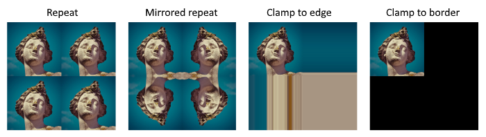

我们现在将创建一个函数 `createTextureSampler` 来设置这样一个采样器对象。稍后我们将使用该采样器从渲染器中的纹理读取颜色。

```c++
void initVulkan() {
    ...
    createTextureImage();
    createTextureImageView();
    createTextureSampler();
    ...
}

...

void createTextureSampler() {

}
```

采样器是通过“VkSamplerCreateInfo”结构配置的，这里指定了它应该应用的所有过滤器和转换。

```c++
VkSamplerCreateInfo samplerInfo{};
samplerInfo.sType = VK_STRUCTURE_TYPE_SAMPLER_CREATE_INFO;
samplerInfo.magFilter = VK_FILTER_LINEAR;
samplerInfo.minFilter = VK_FILTER_LINEAR;
```

`magFilter` 和 `minFilter` 字段指定如何插入放大或缩小的像素。放大涉及上面描述的过采样问题，而缩小涉及欠采样。选项是 `VK_FILTER_NEAREST` 和 `VK_FILTER_LINEAR`，对应于上图中展示的模式。

```c++
samplerInfo.addressModeU = VK_SAMPLER_ADDRESS_MODE_REPEAT;
samplerInfo.addressModeV = VK_SAMPLER_ADDRESS_MODE_REPEAT;
samplerInfo.addressModeW = VK_SAMPLER_ADDRESS_MODE_REPEAT;
```

可以使用“addressMode”字段为每个轴指定寻址模式。下面列出了可用的值。其中大部分都在上图中进行了演示。请注意，轴被称为 U、V 和 W 而不是 X、Y 和 Z。这是纹理空间坐标的约定。

* `VK_SAMPLER_ADDRESS_MODE_REPEAT`：超出图像尺寸时重复纹理。
* `VK_SAMPLER_ADDRESS_MODE_MIRRORED_REPEAT`：与重复类似，但在超出维度时会反转坐标以镜像图像。
* `VK_SAMPLER_ADDRESS_MODE_CLAMP_TO_EDGE`：取最接近图像尺寸坐标的边缘颜色。
* `VK_SAMPLER_ADDRESS_MODE_MIRROR_CLAMP_TO_EDGE`：类似于钳到边缘，但使用与最近边缘相对的边缘。
* `VK_SAMPLER_ADDRESS_MODE_CLAMP_TO_BORDER`：采样超出图像尺寸时返回纯色。

我们在这里使用哪种寻址模式并不重要，因为在本教程中我们不会在图像之外进行采样。然而，重复模式可能是最常见的模式，因为它可以用来平铺地板和墙壁等纹理。

```c++
samplerInfo.anisotropyEnable = VK_TRUE;
samplerInfo.maxAnisotropy = ???;
```

这两个字段指定是否应使用各向异性过滤。除非性能是一个问题，否则没有理由不使用它。 `maxAnisotropy` 字段限制了可用于计算最终颜色的纹素样本数量。值越低，性能越好，但质量越低。 为了弄清楚我们可以使用哪个值，我们需要像这样检索物理设备的属性：

```c++
VkPhysicalDeviceProperties properties{};
vkGetPhysicalDeviceProperties(physicalDevice, &properties);
```

如果你查看 `VkPhysicalDeviceProperties` 结构的文档，你会看到它包含一个名为 `limits` 的 `VkPhysicalDeviceLimits` 成员。 该结构又具有一个名为“maxSamplerAnisotropy”的成员，这是我们可以为“maxAnisotropy”指定的最大值。如果我们想追求最高质量，我们可以直接使用该值：

```c++
samplerInfo.maxAnisotropy = properties.limits.maxSamplerAnisotropy;
```

您可以在程序开始时查询属性并将它们传递给需要它们的函数，或者在 `createTextureSampler` 函数本身中查询它们。

```c++
samplerInfo.borderColor = VK_BORDER_COLOR_INT_OPAQUE_BLACK;
```

`borderColor` 字段指定在使用边界寻址模式采样超出图像时返回的颜色。可以以 float 或 int 格式返回黑色、白色或透明。您不能指定任意颜色。

```c++
samplerInfo.unnormalizedCoordinates = VK_FALSE;
```

`unnormalizedCoordinates` 字段指定您想使用哪个坐标系来处理图像中的纹理。如果此字段为 `VK_TRUE`，那么您可以简单地使用 `[0, texWidth)` 和 `[0, texHeight)` 范围内的坐标。 如果它是 `VK_FALSE`，则使用所有轴上的 `[0, 1)` 范围来寻址纹素。现实世界的应用程序几乎总是使用归一化坐标，因为这样就可以使用具有完全相同坐标的不同分辨率的纹理。

```c++
samplerInfo.compareEnable = VK_FALSE;
samplerInfo.compareOp = VK_COMPARE_OP_ALWAYS;
```

如果启用了比较功能，则首先将像素与一个值进行比较，并将比较的结果用于过滤操作。这主要用于阴影贴图上的[percentage-closer filtering]https://developer.nvidia.com/gpugems/GPUGems/gpugems_ch11.html)。 我们将在以后的章节中讨论这一点。

```c++
samplerInfo.mipmapMode = VK_SAMPLER_MIPMAP_MODE_LINEAR;
samplerInfo.mipLodBias = 0.0f;
samplerInfo.minLod = 0.0f;
samplerInfo.maxLod = 0.0f;
```

所有这些字段都适用于 mipmapping。我们将在 [后面的章节](https://vulkan-tutorial.com/Generating_Mipmaps) 中介绍 mipmapping，但基本上它是另一种可以应用的过滤器。

采样器的功能现已完全定义。添加一个类成员来保存采样器对象的句柄并使用 `vkCreateSampler` 创建采样器：

`vkCreateSampler`:

```c++
VkImageView textureImageView;
VkSampler textureSampler;

...

void createTextureSampler() {
    ...

    if (vkCreateSampler(device, &samplerInfo, nullptr, &textureSampler) != VK_SUCCESS) {
        throw std::runtime_error("failed to create texture sampler!");
    }
}
```

请注意，采样器不会在任何地方引用“VkImage”。 采样器是一个独特的对象，它提供了从纹理中提取颜色的接口。 它可以应用于您想要的任何图像，无论是 1D、2D 还是 3D。 这与许多旧 API 不同，后者将纹理图像和过滤组合成一个状态。

当我们不再访问图像时，在程序结束时销毁采样器：

```c++
void cleanup() {
    cleanupSwapChain();

    vkDestroySampler(device, textureSampler, nullptr);
    vkDestroyImageView(device, textureImageView, nullptr);

    ...
}
```

## 设备各项异性滤波器特征

如果你现在运行你的程序，你会看到这样的验证层消息：

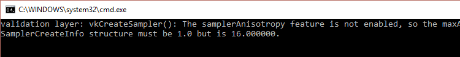

这是因为各向异性滤波器实际上是一个可选的设备功能。我们需要更新 `createLogicalDevice` 函数来请求该功能：

```c++
VkPhysicalDeviceFeatures deviceFeatures{};
deviceFeatures.samplerAnisotropy = VK_TRUE;
```

即使现代显卡基本都支持它，我们也应该更新 `isDeviceSuitable` 以检查它是否可用：

```c++
bool isDeviceSuitable(VkPhysicalDevice device) {
    ...

    VkPhysicalDeviceFeatures supportedFeatures;
    vkGetPhysicalDeviceFeatures(device, &supportedFeatures);

    return indices.isComplete() && extensionsSupported && swapChainAdequate && supportedFeatures.samplerAnisotropy;
}
```

`vkGetPhysicalDeviceFeatures` 重新调整了 `VkPhysicalDeviceFeatures` 结构的用途，以指示支持哪些功能，而不是通过设置布尔值来请求。

除了申请各向异性滤波器的可用性之外，还可以通过有条件地设置来简单地不使用它：

```c++
samplerInfo.anisotropyEnable = VK_FALSE;
samplerInfo.maxAnisotropy = 1.0f;
```

在下一章中，我们会将图像和采样器对象暴露给渲染器以将纹理绘制到正方形上。

[C++ code](https://vulkan-tutorial.com/code/24_sampler.cpp) /
[Vertex shader](https://vulkan-tutorial.com/code/21_shader_ubo.vert) /
[Fragment shader](https://vulkan-tutorial.com/code/21_shader_ubo.frag)


# 组合的图像采样器

## 介绍

我们在本教程的统一缓冲区部分第一次查看了描述符。在本章中，我们将研究一种新型描述符：*组合的图像采样器*。 这个描述符使得渲染器可以通过一个采样器对象访问图像资源，就像我们在上一章中创建的那样。

我们将从修改描述符布局、描述符池和描述符集开始，以包含这样一个组合的图像采样器描述符。 之后，我们将向“顶点”添加纹理坐标，并修改片段渲染器以从纹理中读取颜色，而不是仅仅插入顶点颜色。

## 更新描述符

浏览到 `createDescriptorSetLayout` 函数并为组合图像采样器描述符添加 `VkDescriptorSetLayoutBinding`。 我们将简单地将它放在统一缓冲区之后的绑定中：

```c++
VkDescriptorSetLayoutBinding samplerLayoutBinding{};
samplerLayoutBinding.binding = 1;
samplerLayoutBinding.descriptorCount = 1;
samplerLayoutBinding.descriptorType = VK_DESCRIPTOR_TYPE_COMBINED_IMAGE_SAMPLER;
samplerLayoutBinding.pImmutableSamplers = nullptr;
samplerLayoutBinding.stageFlags = VK_SHADER_STAGE_FRAGMENT_BIT;

std::array<VkDescriptorSetLayoutBinding, 2> bindings = {uboLayoutBinding, samplerLayoutBinding};
VkDescriptorSetLayoutCreateInfo layoutInfo{};
layoutInfo.sType = VK_STRUCTURE_TYPE_DESCRIPTOR_SET_LAYOUT_CREATE_INFO;
layoutInfo.bindingCount = static_cast<uint32_t>(bindings.size());
layoutInfo.pBindings = bindings.data();
```

确保设置 `stageFlags` 以指明我们打算在片段渲染器中使用组合图像采样器描述符。这就是要确定片段颜色的地方。可以在顶点渲染器中使用纹理采样，例如通过 [heightmap](https://en.wikipedia.org/wiki/Heightmap) 动态变形顶点网格。

我们还必须通过向 `VkDescriptorPoolCreateInfo` 添加另一个 `VK_DESCRIPTOR_TYPE_COMBINED_IMAGE_SAMPLER` 类型的 `VkPoolSize` 来创建更大的描述符池，以便为组合图像采样器的分配腾出空间。 转到 `createDescriptorPool` 函数并修改它以包含此描述符的 `VkDescriptorPoolSize`：

```c++
std::array<VkDescriptorPoolSize, 2> poolSizes{};
poolSizes[0].type = VK_DESCRIPTOR_TYPE_UNIFORM_BUFFER;
poolSizes[0].descriptorCount = static_cast<uint32_t>(swapChainImages.size());
poolSizes[1].type = VK_DESCRIPTOR_TYPE_COMBINED_IMAGE_SAMPLER;
poolSizes[1].descriptorCount = static_cast<uint32_t>(swapChainImages.size());

VkDescriptorPoolCreateInfo poolInfo{};
poolInfo.sType = VK_STRUCTURE_TYPE_DESCRIPTOR_POOL_CREATE_INFO;
poolInfo.poolSizeCount = static_cast<uint32_t>(poolSizes.size());
poolInfo.pPoolSizes = poolSizes.data();
poolInfo.maxSets = static_cast<uint32_t>(swapChainImages.size());
```

验证层无法捕获描述符池空间不足的问题：从 Vulkan 1.1 开始，如果池不够大，`vkAllocateDescriptorSets` 可能会失败并返回错误代码 `VK_ERROR_POOL_OUT_OF_MEMORY`，但驱动程序也可能会尝试 内部解决问题。 这意味着有时（取决于硬件、池大小和分配大小）驱动程序会让我们摆脱超出描述符池限制的分配。 其他时候，`vkAllocateDescriptorSets` 将失败并返回 `VK_ERROR_POOL_OUT_OF_MEMORY`。 如果分配在某些机器上成功，但在其他机器上失败，这可能会特别令人困惑。

由于 Vulkan 将分配的责任转移给了驱动程序，因此不再严格要求只分配由相应的 `descriptorCount` 成员指定的特定类型的描述符（`VK_DESCRIPTOR_TYPE_COMBINED_IMAGE_SAMPLER` 等），以创建描述符池。 但是，这样做仍然是最佳实践，并且将来，如果您启用 [最佳实践验证]，`VK_LAYER_KHRONOS_validation` 将警告此类问题（https://vulkan.lunarg.com/doc/view/1.1. 126.0/windows/best_practices.html）。

最后一步是将实际图像和采样器资源绑定到描述符集中的描述符。转到`createDescriptorSets` 函数。

```c++
for (size_t i = 0; i < swapChainImages.size(); i++) {
    VkDescriptorBufferInfo bufferInfo{};
    bufferInfo.buffer = uniformBuffers[i];
    bufferInfo.offset = 0;
    bufferInfo.range = sizeof(UniformBufferObject);

    VkDescriptorImageInfo imageInfo{};
    imageInfo.imageLayout = VK_IMAGE_LAYOUT_SHADER_READ_ONLY_OPTIMAL;
    imageInfo.imageView = textureImageView;
    imageInfo.sampler = textureSampler;

    ...
}
```

组合图像采样器结构的资源必须在“VkDescriptorImageInfo”结构中指定，就像统一缓冲区描述符的缓冲区资源在“VkDescriptorBufferInfo”结构中指定一样。 这是上一章中的对象聚集在一起的地方。

```c++
std::array<VkWriteDescriptorSet, 2> descriptorWrites{};

descriptorWrites[0].sType = VK_STRUCTURE_TYPE_WRITE_DESCRIPTOR_SET;
descriptorWrites[0].dstSet = descriptorSets[i];
descriptorWrites[0].dstBinding = 0;
descriptorWrites[0].dstArrayElement = 0;
descriptorWrites[0].descriptorType = VK_DESCRIPTOR_TYPE_UNIFORM_BUFFER;
descriptorWrites[0].descriptorCount = 1;
descriptorWrites[0].pBufferInfo = &bufferInfo;

descriptorWrites[1].sType = VK_STRUCTURE_TYPE_WRITE_DESCRIPTOR_SET;
descriptorWrites[1].dstSet = descriptorSets[i];
descriptorWrites[1].dstBinding = 1;
descriptorWrites[1].dstArrayElement = 0;
descriptorWrites[1].descriptorType = VK_DESCRIPTOR_TYPE_COMBINED_IMAGE_SAMPLER;
descriptorWrites[1].descriptorCount = 1;
descriptorWrites[1].pImageInfo = &imageInfo;

vkUpdateDescriptorSets(device, static_cast<uint32_t>(descriptorWrites.size()), descriptorWrites.data(), 0, nullptr);
```

描述符必须使用此图像信息更新，就像缓冲区一样。 这次我们使用 `pImageInfo` 数组而不是 `pBufferInfo`。 描述符现在可以被渲染器使用了！

## 纹理坐标

目前还缺少纹理映射的一个重要成分，那就是每个顶点的实际坐标。纹理坐标确定图像如何映射到几何体。

```c++
struct Vertex {
    glm::vec2 pos;
    glm::vec3 color;
    glm::vec2 texCoord;

    static VkVertexInputBindingDescription getBindingDescription() {
        VkVertexInputBindingDescription bindingDescription{};
        bindingDescription.binding = 0;
        bindingDescription.stride = sizeof(Vertex);
        bindingDescription.inputRate = VK_VERTEX_INPUT_RATE_VERTEX;

        return bindingDescription;
    }

    static std::array<VkVertexInputAttributeDescription, 3> getAttributeDescriptions() {
        std::array<VkVertexInputAttributeDescription, 3> attributeDescriptions{};

        attributeDescriptions[0].binding = 0;
        attributeDescriptions[0].location = 0;
        attributeDescriptions[0].format = VK_FORMAT_R32G32_SFLOAT;
        attributeDescriptions[0].offset = offsetof(Vertex, pos);

        attributeDescriptions[1].binding = 0;
        attributeDescriptions[1].location = 1;
        attributeDescriptions[1].format = VK_FORMAT_R32G32B32_SFLOAT;
        attributeDescriptions[1].offset = offsetof(Vertex, color);

        attributeDescriptions[2].binding = 0;
        attributeDescriptions[2].location = 2;
        attributeDescriptions[2].format = VK_FORMAT_R32G32_SFLOAT;
        attributeDescriptions[2].offset = offsetof(Vertex, texCoord);

        return attributeDescriptions;
    }
};
```

修改 `Vertex` 结构以包含纹理坐标的 `vec2`。 确保还添加一个 `VkVertexInputAttributeDescription`，以便我们可以使用访问纹理坐标作为顶点着色器中的输入。这对于能够将它们传递给片段渲染器以在正方形表面进行插值是必要的。

```c++
const std::vector<Vertex> vertices = {
    {{-0.5f, -0.5f}, {1.0f, 0.0f, 0.0f}, {1.0f, 0.0f}},
    {{0.5f, -0.5f}, {0.0f, 1.0f, 0.0f}, {0.0f, 0.0f}},
    {{0.5f, 0.5f}, {0.0f, 0.0f, 1.0f}, {0.0f, 1.0f}},
    {{-0.5f, 0.5f}, {1.0f, 1.0f, 1.0f}, {1.0f, 1.0f}}
};
```

在本教程中，我将使用从左上角的 0, 0 到右下角的 1, 1 的坐标简单地用纹理填充正方形。 随意尝试不同的坐标。 您可以尝试使用低于 `0` 或高于 `1` 的坐标来查看实际的寻址模式对应的显示结果！

## 渲染器

最后一步是修改渲染器以从纹理中采样颜色。我们首先需要修改顶点渲染器，将纹理坐标传递给片段渲染器：

```glsl
layout(location = 0) in vec2 inPosition;
layout(location = 1) in vec3 inColor;
layout(location = 2) in vec2 inTexCoord;

layout(location = 0) out vec3 fragColor;
layout(location = 1) out vec2 fragTexCoord;

void main() {
    gl_Position = ubo.proj * ubo.view * ubo.model * vec4(inPosition, 0.0, 1.0);
    fragColor = inColor;
    fragTexCoord = inTexCoord;
}
```

就像每个顶点的颜色一样，`fragTexCoord` 值将被光栅化器平滑地插入到正方形区域中。我们可以通过让片段渲染器将纹理坐标输出对应的插值颜色：

```glsl
#version 450

layout(location = 0) in vec3 fragColor;
layout(location = 1) in vec2 fragTexCoord;

layout(location = 0) out vec4 outColor;

void main() {
    outColor = vec4(fragTexCoord, 0.0, 1.0);
}
```

您应该看到类似于下图的内容。 不要忘记重新编译渲染器！


绿色通道代表水平坐标，红色通道代表垂直坐标。上图正方形中的黑色和黄色两个角对应纹理坐标在正方形上从 `0, 0` 逐渐插值到 `1, 1`。 使用颜色可视化数据是 `printf` 调试的渲染器编程等价物，因为没有更好的选择！

一个组合的图像采样器描述符在 GLSL 渲染程序中由一个采样器统一属性表示。可在片段渲染器中添加对它的引用：

```glsl
layout(binding = 1) uniform sampler2D texSampler;
```

对于其他类型的图像，有等效的 `sampler1D` 和 `sampler3D` 类型。 确保在此处使用正确的绑定。

```glsl
void main() {
    outColor = texture(texSampler, fragTexCoord);
}
```

GLSL 渲染程序中，使用内置的 `texture` 函数对纹理进行采样。它需要一个“采样器”和坐标作为参数。 采样器会自动在后台处理过滤和转换。 现在，当您运行应用程序时，您应该会看到正方形上的纹理：

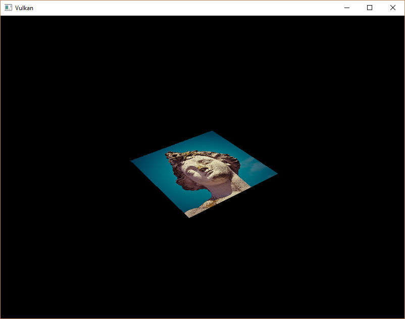

尝试通过将纹理坐标缩放到高于“1”的值来实验寻址模式。 例如，以下片段渲染器在使用 `VK_SAMPLER_ADDRESS_MODE_REPEAT` 时会产生下图中的结果：

```glsl
void main() {
    outColor = texture(texSampler, fragTexCoord * 2.0);
}
```

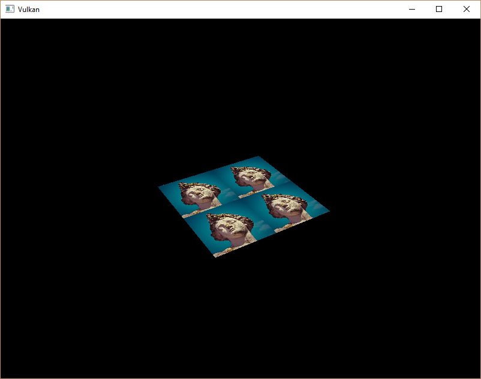

您还可以使用顶点颜色操作纹理颜色：

```glsl
void main() {
    outColor = vec4(fragColor * texture(texSampler, fragTexCoord).rgb, 1.0);
}
```

我在这里分离了 RGB 和 alpha 通道以不缩放 alpha 通道。

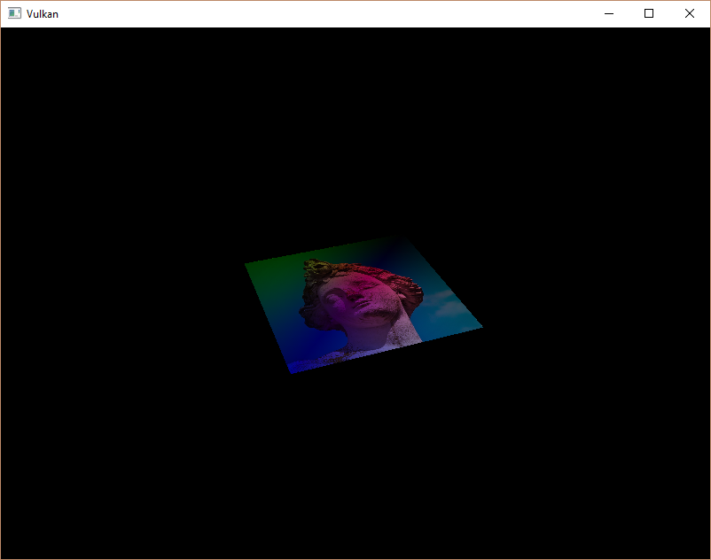

您现在知道如何在渲染器中访问图像了！结合纹理写入帧缓冲区的图像对象是一种非常强大的技术。 您可以使用这些图像作为输入来实现酷炫的效果，例如在 3D 世界中进行后期处理和相机显示。

[C++ code](https://vulkan-tutorial.com/code/25_texture_mapping.cpp) /
[Vertex shader](https://vulkan-tutorial.com/code/25_shader_textures.vert) /
[Fragment shader](https://vulkan-tutorial.com/code/25_shader_textures.frag)


# 深度缓冲区

## 介绍

到目前为止，我们使用的几何图形被投影到 3D 中，但它仍然是完全平坦的。 在本章中，我们将在该位置添加一个 Z 坐标，为 3D 网格做准备。 我们将使用这第三个坐标在当前正方形上放置一个正方形，以查看几何未按深度排序时出现的问题。

## 三维几何

更改 `Vertex` 结构以使用 3D 向量作为位置，并更新相应 `VkVertexInputAttributeDescription` 中的 `format`：

```c++
struct Vertex {
    glm::vec3 pos;
    glm::vec3 color;
    glm::vec2 texCoord;

    ...

    static std::array<VkVertexInputAttributeDescription, 3> getAttributeDescriptions() {
        std::array<VkVertexInputAttributeDescription, 3> attributeDescriptions{};

        attributeDescriptions[0].binding = 0;
        attributeDescriptions[0].location = 0;
        attributeDescriptions[0].format = VK_FORMAT_R32G32B32_SFLOAT;
        attributeDescriptions[0].offset = offsetof(Vertex, pos);

        ...
    }
};
```

接下来，更新顶点渲染器以接受和转换 3D 坐标作为输入。不要忘记之后重新编译它！


```glsl
layout(location = 0) in vec3 inPosition;

...

void main() {
    gl_Position = ubo.proj * ubo.view * ubo.model * vec4(inPosition, 1.0);
    fragColor = inColor;
    fragTexCoord = inTexCoord;
}
```

最后，更新 `vertices` 容器以包含 Z 坐标：

```c++
const std::vector<Vertex> vertices = {
    {{-0.5f, -0.5f, 0.0f}, {1.0f, 0.0f, 0.0f}, {0.0f, 0.0f}},
    {{0.5f, -0.5f, 0.0f}, {0.0f, 1.0f, 0.0f}, {1.0f, 0.0f}},
    {{0.5f, 0.5f, 0.0f}, {0.0f, 0.0f, 1.0f}, {1.0f, 1.0f}},
    {{-0.5f, 0.5f, 0.0f}, {1.0f, 1.0f, 1.0f}, {0.0f, 1.0f}}
};
```

如果您现在运行您的应用程序，那么您应该会看到与以前完全相同的结果。是时候添加一些额外的几何图形来让场景更有趣了，并演示我们将在本章中解决的问题。复制顶点以定义当前正方形正下方的正方形的位置，如下所示：


使用 `-0.5f` 的 Z 坐标并为额外的正方形添加适当的索引：

```c++
const std::vector<Vertex> vertices = {
    {{-0.5f, -0.5f, 0.0f}, {1.0f, 0.0f, 0.0f}, {0.0f, 0.0f}},
    {{0.5f, -0.5f, 0.0f}, {0.0f, 1.0f, 0.0f}, {1.0f, 0.0f}},
    {{0.5f, 0.5f, 0.0f}, {0.0f, 0.0f, 1.0f}, {1.0f, 1.0f}},
    {{-0.5f, 0.5f, 0.0f}, {1.0f, 1.0f, 1.0f}, {0.0f, 1.0f}},

    {{-0.5f, -0.5f, -0.5f}, {1.0f, 0.0f, 0.0f}, {0.0f, 0.0f}},
    {{0.5f, -0.5f, -0.5f}, {0.0f, 1.0f, 0.0f}, {1.0f, 0.0f}},
    {{0.5f, 0.5f, -0.5f}, {0.0f, 0.0f, 1.0f}, {1.0f, 1.0f}},
    {{-0.5f, 0.5f, -0.5f}, {1.0f, 1.0f, 1.0f}, {0.0f, 1.0f}}
};

const std::vector<uint16_t> indices = {
    0, 1, 2, 2, 3, 0,
    4, 5, 6, 6, 7, 4
};
```

现在运行你的程序，你会看到类似叠加插图的内容：

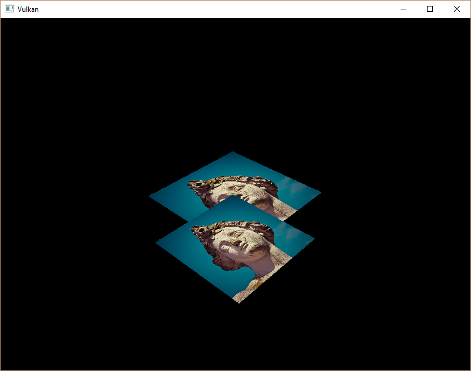

问题是下部正方形的片段被绘制在上部正方形的片段之上，仅仅是因为它在索引数组中出现得较晚。 有两种方法可以解决这个问题：

* 按深度从后到前对所有绘图调用进行排序
* 使用深度缓冲区进行深度测试

第一种方法绘制非透明对象时，人工指定对象的前后顺序是一个难以解决的挑战。第二种按深度排序，使用*深度缓冲区*来解决是一种更通用的解决方案。 深度缓冲区是存储每个位置深度的附加附件，就像颜色附件存储每个位置的颜色一样。每次光栅器生成一个片段时，深度测试都会检查新片段是否比前一个片段更接近。 如果不是，则丢弃新片段。通过深度测试的片段将自己的深度写入深度缓冲区。可以从片段渲染器中操作此值，就像操作颜色输出一样。

```c++
#define GLM_FORCE_RADIANS
#define GLM_FORCE_DEPTH_ZERO_TO_ONE
#include <glm/glm.hpp>
#include <glm/gtc/matrix_transform.hpp>
```

GLM 生成的透视投影矩阵将默认使用 OpenGL 深度范围 `-1.0` 到 `1.0`。 我们需要使用 `GLM_FORCE_DEPTH_ZERO_TO_ONE` 定义将其配置为使用 `0.0` 到 `1.0` 的 Vulkan 范围。

## 深度图像和视图

深度附件是基于图像的，就像颜色附件一样。不同之处在于交换链不会自动为我们创建深度图像。我们只需要一个深度图像，因为一次只运行一个绘制操作。深度图像也需要三个资源对象：图像对象、内存对象和图像视图对象。

```c++
VkImage depthImage;
VkDeviceMemory depthImageMemory;
VkImageView depthImageView;
```

创建一个新函数 `createDepthResources` 来设置这些资源：

```c++
void initVulkan() {
    ...
    createCommandPool();
    createDepthResources();
    createTextureImage();
    ...
}

...

void createDepthResources() {

}
```

创建深度图像相当简单。 它应该具有与颜色附件相同的分辨率，由交换链尺寸、最佳平铺方法、设备内存类型综合定义。需要注意的是深度图像的正确格式是什么？ 格式必须包含一个深度组件，由 `VK_FORMAT_` 中的 `_D??_` 指示。

与纹理图像不同，我们不一定需要特定的格式，因为我们不会直接从程序中访问纹素。 它只需要具有合理的精度，至少 24 位在实际应用中很常见。 有几种格式可以满足此要求：

* `VK_FORMAT_D32_SFLOAT`: 用于深度的 32 位浮点数
* `VK_FORMAT_D32_SFLOAT_S8_UINT`: 32 位有符号浮点数用于深度和 8 位用于模板组件
* `VK_FORMAT_D24_UNORM_S8_UINT`: 24 位浮点数和 8 位模板零件

模板组件用于[模板测试](https://en.wikipedia.org/wiki/Stencil_buffer)，这是一个可以与深度测试相结合的附加测试。我们将在以后的章节中讨论这一点。

我们可以简单地选择 `VK_FORMAT_D32_SFLOAT` 格式，因为对它的支持非常普遍（参见硬件数据库），但是如果可以，为我们的应用程序增加额外的灵活性总是好的。我们将编写一个函数 `findSupportedFormat`，它按照从最理想到最不理想的顺序获取候选格式列表，并检查哪个是第一个受支持的格式：

```c++
VkFormat findSupportedFormat(const std::vector<VkFormat>& candidates, VkImageTiling tiling, VkFormatFeatureFlags features) {

}
```

格式的支持取决于平铺模式和用法，因此我们还必须将这些作为参数包含在内。 可以使用 `vkGetPhysicalDeviceFormatProperties` 函数查询对格式的支持：

```c++
for (VkFormat format : candidates) {
    VkFormatProperties props;
    vkGetPhysicalDeviceFormatProperties(physicalDevice, format, &props);
}
```

`VkFormatProperties` 结构包含三个字段：

* `linearTilingFeatures`：线性平铺支持的用例
* `optimalTilingFeatures`：优化平铺支持的用例
* `bufferFeatures`：缓冲区支持的用例

这里只有前两个是相关的，我们检查的一个取决于函数的 `tiling` 参数：

```c++
if (tiling == VK_IMAGE_TILING_LINEAR && (props.linearTilingFeatures & features) == features) {
    return format;
} else if (tiling == VK_IMAGE_TILING_OPTIMAL && (props.optimalTilingFeatures & features) == features) {
    return format;
}
```

如果没有一个候选格式支持所需的用法，那么我们可以返回一个特殊值或简单地抛出一个异常：

```c++
VkFormat findSupportedFormat(const std::vector<VkFormat>& candidates, VkImageTiling tiling, VkFormatFeatureFlags features) {
    for (VkFormat format : candidates) {
        VkFormatProperties props;
        vkGetPhysicalDeviceFormatProperties(physicalDevice, format, &props);

        if (tiling == VK_IMAGE_TILING_LINEAR && (props.linearTilingFeatures & features) == features) {
            return format;
        } else if (tiling == VK_IMAGE_TILING_OPTIMAL && (props.optimalTilingFeatures & features) == features) {
            return format;
        }
    }

    throw std::runtime_error("failed to find supported format!");
}
```

我们现在将使用这个函数来创建一个 `findDepthFormat` 辅助函数来选择一个具有深度组件的格式，该组件支持用作深度附件：

```c++
VkFormat findDepthFormat() {
    return findSupportedFormat(
        {VK_FORMAT_D32_SFLOAT, VK_FORMAT_D32_SFLOAT_S8_UINT, VK_FORMAT_D24_UNORM_S8_UINT},
        VK_IMAGE_TILING_OPTIMAL,
        VK_FORMAT_FEATURE_DEPTH_STENCIL_ATTACHMENT_BIT
    );
}
```

在这种情况下，请确保使用 `VK_FORMAT_FEATURE_` 标志而不是 `VK_IMAGE_USAGE_`。 所有这些候选格式都包含一个深度组件，但后两者也包含一个模板组件。 目前还未介绍模板组件，只需注意在对具有这些格式的图像执行布局转换时，需要考虑到它。 添加一个简单的辅助函数，告诉我们选择的深度格式是否包含模板组件：

```c++
bool hasStencilComponent(VkFormat format) {
    return format == VK_FORMAT_D32_SFLOAT_S8_UINT || format == VK_FORMAT_D24_UNORM_S8_UINT;
}
```

调用该函数以从 `createDepthResources` 中查找深度格式：

```c++
VkFormat depthFormat = findDepthFormat();
```

我们现在拥有调用我们的`createImage`和`createImageView`辅助函数所需的所有信息：

```c++
createImage(swapChainExtent.width, swapChainExtent.height, depthFormat, VK_IMAGE_TILING_OPTIMAL, VK_IMAGE_USAGE_DEPTH_STENCIL_ATTACHMENT_BIT, VK_MEMORY_PROPERTY_DEVICE_LOCAL_BIT, depthImage, depthImageMemory);
depthImageView = createImageView(depthImage, depthFormat);
```

但是，`createImageView` 函数当前假定子资源始终是 `VK_IMAGE_ASPECT_COLOR_BIT`，因此我们需要将该字段转换为输入参数：

```c++
VkImageView createImageView(VkImage image, VkFormat format, VkImageAspectFlags aspectFlags) {
    ...
    viewInfo.subresourceRange.aspectMask = aspectFlags;
    ...
}
```

更新对此函数的所有调用以使用正确的参数：

```c++
swapChainImageViews[i] = createImageView(swapChainImages[i], swapChainImageFormat, VK_IMAGE_ASPECT_COLOR_BIT);
...
depthImageView = createImageView(depthImage, depthFormat, VK_IMAGE_ASPECT_DEPTH_BIT);
...
textureImageView = createImageView(textureImage, VK_FORMAT_R8G8B8A8_SRGB, VK_IMAGE_ASPECT_COLOR_BIT);
```

这就是创建深度图像的过程。我们不需要映射它或将另一个图像复制到它，因为我们将在渲染通道开始时清除它，就像颜色附件一样。

### 显式过渡深度图像

我们不需要将图像的布局显式转换为深度附件，因为我们将在渲染过程中处理这一点。 但是，为了完整起见，我仍将在本节中描述该过程。 这部分内容与图像布局转换类似，如果你已经了解该过程，你可以跳过它。

在 `createDepthResources` 函数的末尾调用 `transitionImageLayout`函数，如下所示：

```c++
transitionImageLayout(depthImage, depthFormat, VK_IMAGE_LAYOUT_UNDEFINED, VK_IMAGE_LAYOUT_DEPTH_STENCIL_ATTACHMENT_OPTIMAL);
```

未定义的布局可以用作初始布局，因为没有重要的现有深度图像内容。 我们需要更新 `transitionImageLayout` 函数中的一些逻辑以使用正确的参数配置：

```c++
if (newLayout == VK_IMAGE_LAYOUT_DEPTH_STENCIL_ATTACHMENT_OPTIMAL) {
    barrier.subresourceRange.aspectMask = VK_IMAGE_ASPECT_DEPTH_BIT;

    if (hasStencilComponent(format)) {
        barrier.subresourceRange.aspectMask |= VK_IMAGE_ASPECT_STENCIL_BIT;
    }
} else {
    barrier.subresourceRange.aspectMask = VK_IMAGE_ASPECT_COLOR_BIT;
}
```

虽然我们没有使用模板组件，但我们需要确认它是否包含在深度图像的布局转换中。

最后，添加正确的访问掩码和流水线流程：

```c++
if (oldLayout == VK_IMAGE_LAYOUT_UNDEFINED && newLayout == VK_IMAGE_LAYOUT_TRANSFER_DST_OPTIMAL) {
    barrier.srcAccessMask = 0;
    barrier.dstAccessMask = VK_ACCESS_TRANSFER_WRITE_BIT;

    sourceStage = VK_PIPELINE_STAGE_TOP_OF_PIPE_BIT;
    destinationStage = VK_PIPELINE_STAGE_TRANSFER_BIT;
} else if (oldLayout == VK_IMAGE_LAYOUT_TRANSFER_DST_OPTIMAL && newLayout == VK_IMAGE_LAYOUT_SHADER_READ_ONLY_OPTIMAL) {
    barrier.srcAccessMask = VK_ACCESS_TRANSFER_WRITE_BIT;
    barrier.dstAccessMask = VK_ACCESS_SHADER_READ_BIT;

    sourceStage = VK_PIPELINE_STAGE_TRANSFER_BIT;
    destinationStage = VK_PIPELINE_STAGE_FRAGMENT_SHADER_BIT;
} else if (oldLayout == VK_IMAGE_LAYOUT_UNDEFINED && newLayout == VK_IMAGE_LAYOUT_DEPTH_STENCIL_ATTACHMENT_OPTIMAL) {
    barrier.srcAccessMask = 0;
    barrier.dstAccessMask = VK_ACCESS_DEPTH_STENCIL_ATTACHMENT_READ_BIT | VK_ACCESS_DEPTH_STENCIL_ATTACHMENT_WRITE_BIT;

    sourceStage = VK_PIPELINE_STAGE_TOP_OF_PIPE_BIT;
    destinationStage = VK_PIPELINE_STAGE_EARLY_FRAGMENT_TESTS_BIT;
} else {
    throw std::invalid_argument("unsupported layout transition!");
}
```

将读取深度缓冲区以执行深度测试以查看片段是否可见，并在绘制新片段时写入。 读取发生在“VK_PIPELINE_STAGE_EARLY_FRAGMENT_TESTS_BIT”阶段，写入发生在“VK_PIPELINE_STAGE_LATE_FRAGMENT_TESTS_BIT”阶段。 您应该选择与指定操作匹配的最早管道阶段，以便在需要时将其用作深度附件。

## 渲染通道

我们现在要修改 `createRenderPass` 函数以包含深度附件。首先添加 `VkAttachmentDescription`：

```c++
VkAttachmentDescription depthAttachment{};
depthAttachment.format = findDepthFormat();
depthAttachment.samples = VK_SAMPLE_COUNT_1_BIT;
depthAttachment.loadOp = VK_ATTACHMENT_LOAD_OP_CLEAR;
depthAttachment.storeOp = VK_ATTACHMENT_STORE_OP_DONT_CARE;
depthAttachment.stencilLoadOp = VK_ATTACHMENT_LOAD_OP_DONT_CARE;
depthAttachment.stencilStoreOp = VK_ATTACHMENT_STORE_OP_DONT_CARE;
depthAttachment.initialLayout = VK_IMAGE_LAYOUT_UNDEFINED;
depthAttachment.finalLayout = VK_IMAGE_LAYOUT_DEPTH_STENCIL_ATTACHMENT_OPTIMAL;
```

`format` 应该与深度图像本身相同。这次我们不关心存储深度数据（`storeOp`），因为绘制完成后它不会被使用。 这可以允许硬件执行额外的优化。 另外，就像颜色缓冲区一样，我们不关心之前的深度内容，所以我们可以使用 `VK_IMAGE_LAYOUT_UNDEFINED` 作为 `initialLayout`。

```c++
VkAttachmentReference depthAttachmentRef{};
depthAttachmentRef.attachment = 1;
depthAttachmentRef.layout = VK_IMAGE_LAYOUT_DEPTH_STENCIL_ATTACHMENT_OPTIMAL;
```

为第一个（也是唯一一个）渲染子通道添加对附件的引用：

```c++
VkSubpassDescription subpass{};
subpass.pipelineBindPoint = VK_PIPELINE_BIND_POINT_GRAPHICS;
subpass.colorAttachmentCount = 1;
subpass.pColorAttachments = &colorAttachmentRef;
subpass.pDepthStencilAttachment = &depthAttachmentRef;
```

与颜色附件不同，子通道只能使用单个深度（+模板）附件。对多个缓冲区进行深度测试没有任何意义。

```c++
std::array<VkAttachmentDescription, 2> attachments = {colorAttachment, depthAttachment};
VkRenderPassCreateInfo renderPassInfo{};
renderPassInfo.sType = VK_STRUCTURE_TYPE_RENDER_PASS_CREATE_INFO;
renderPassInfo.attachmentCount = static_cast<uint32_t>(attachments.size());
renderPassInfo.pAttachments = attachments.data();
renderPassInfo.subpassCount = 1;
renderPassInfo.pSubpasses = &subpass;
renderPassInfo.dependencyCount = 1;
renderPassInfo.pDependencies = &dependency;
```

接下来，更新 `VkRenderPassCreateInfo` 结构以引用两者附件。

```c++
dependency.srcStageMask = VK_PIPELINE_STAGE_COLOR_ATTACHMENT_OUTPUT_BIT | VK_PIPELINE_STAGE_EARLY_FRAGMENT_TESTS_BIT;
dependency.dstStageMask = VK_PIPELINE_STAGE_COLOR_ATTACHMENT_OUTPUT_BIT | VK_PIPELINE_STAGE_EARLY_FRAGMENT_TESTS_BIT;
dependency.dstAccessMask = VK_ACCESS_COLOR_ATTACHMENT_WRITE_BIT | VK_ACCESS_DEPTH_STENCIL_ATTACHMENT_WRITE_BIT;
```

最后，我们需要扩展我们的子通道依赖关系，以确保深度图像的转换和它作为加载操作的一部分被清除之间没有冲突。深度图像在早期片段测试管道阶段首先被访问，因为我们有一个 *clears* 的加载操作，我们应该指定写入的访问掩码。

## 帧缓冲区

下一步是修改帧缓冲区创建以将深度图像绑定到深度附件。转到`createFramebuffers`并将深度图像视图指定为第二个附件：

```c++
std::array<VkImageView, 2> attachments = {
    swapChainImageViews[i],
    depthImageView
};

VkFramebufferCreateInfo framebufferInfo{};
framebufferInfo.sType = VK_STRUCTURE_TYPE_FRAMEBUFFER_CREATE_INFO;
framebufferInfo.renderPass = renderPass;
framebufferInfo.attachmentCount = static_cast<uint32_t>(attachments.size());
framebufferInfo.pAttachments = attachments.data();
framebufferInfo.width = swapChainExtent.width;
framebufferInfo.height = swapChainExtent.height;
framebufferInfo.layers = 1;
```

每个交换链图像的颜色附件都不同，但它们都可以使用相同的深度图像，因为由于我们的信号量，只有一个渲染子通道在运行。

您还需要将调用移动到 `createFramebuffers` 以确保在实际创建深度图像视图之后调用它：

```c++
void initVulkan() {
    ...
    createDepthResources();
    createFramebuffers();
    ...
}
```

## 清除操作填充值

因为我们现在有多个带有 `VK_ATTACHMENT_LOAD_OP_CLEAR` 的附件，我们还需要指定多个清除值。转到`createCommandBuffers`并创建一个`VkClearValue`结构数组：

```c++
std::array<VkClearValue, 2> clearValues{};
clearValues[0].color = {{0.0f, 0.0f, 0.0f, 1.0f}};
clearValues[1].depthStencil = {1.0f, 0};

renderPassInfo.clearValueCount = static_cast<uint32_t>(clearValues.size());
renderPassInfo.pClearValues = clearValues.data();
```

在 Vulkan 中，深度缓冲区中的深度范围是“0.0”到“1.0”，其中“1.0”位于远视平面，“0.0”位于近视平面。深度缓冲区中每个点的初始值应该是最远的深度，即“1.0”。

请注意，“clearValues”的顺序应与附件的顺序相同。

## 深度和模板状态配置

深度附件现在可以使用了，但是仍然需要在图形管道中启用深度测试。它通过 `VkPipelineDepthStencilStateCreateInfo` 结构体进行配置：

```c++
VkPipelineDepthStencilStateCreateInfo depthStencil{};
depthStencil.sType = VK_STRUCTURE_TYPE_PIPELINE_DEPTH_STENCIL_STATE_CREATE_INFO;
depthStencil.depthTestEnable = VK_TRUE;
depthStencil.depthWriteEnable = VK_TRUE;
```

`depthTestEnable` 字段指定是否应将新片段的深度与深度缓冲区进行比较以查看是否应丢弃它们。 `depthWriteEnable` 字段指定是否应该将通过深度测试的片段的新深度实际写入深度缓冲区。

```c++
depthStencil.depthCompareOp = VK_COMPARE_OP_LESS;
```

`depthCompareOp` 字段指定操作选择保留或丢弃片段。本例中较小的深度表示距离较近，因此新的保留片段的深度应该*更小*。

```c++
depthStencil.depthBoundsTestEnable = VK_FALSE;
depthStencil.minDepthBounds = 0.0f; // Optional
depthStencil.maxDepthBounds = 1.0f; // Optional
```

`depthBoundsTestEnable`、`minDepthBounds` 和 `maxDepthBounds` 字段用于指定可选的深度边界测试。 这允许您只保留落在指定深度范围内的片段。本例中我们不会使用此功能。

```c++
depthStencil.stencilTestEnable = VK_FALSE;
depthStencil.front = {}; // Optional
depthStencil.back = {}; // Optional
```

最后三个字段配置模板缓冲区操作，我们也不会在本例中使用。如果要使用这些操作，则必须确保深度/模板图像的格式包含模板组件。

```c++
pipelineInfo.pDepthStencilState = &depthStencil;
```

更新 `VkGraphicsPipelineCreateInfo` 结构以引用我们刚刚填充的深度模板状态。如果渲染通道包含深度模板附件，则必须始终指定深度模板状态。

如果你现在运行你的程序，那么你应该看到几何的片段现在是正确排序的：

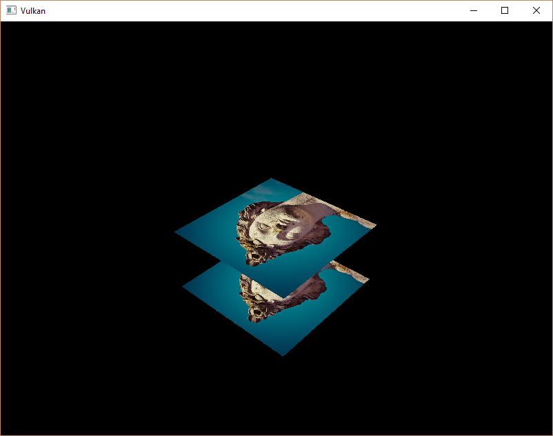

## 处理窗口大小调整

调整窗口大小以匹配新的颜色附件分辨率时，深度缓冲区的分辨率应更改。在这种情况下，扩展 `recreateSwapChain` 函数以重新创建深度资源：

```c++
void recreateSwapChain() {
    int width = 0, height = 0;
    while (width == 0 || height == 0) {
        glfwGetFramebufferSize(window, &width, &height);
        glfwWaitEvents();
    }

    vkDeviceWaitIdle(device);

    cleanupSwapChain();

    createSwapChain();
    createImageViews();
    createRenderPass();
    createGraphicsPipeline();
    createDepthResources();
    createFramebuffers();
    createUniformBuffers();
    createDescriptorPool();
    createDescriptorSets();
    createCommandBuffers();
}
```

清理操作应该发生在交换链清理函数中：

```c++
void cleanupSwapChain() {
    vkDestroyImageView(device, depthImageView, nullptr);
    vkDestroyImage(device, depthImage, nullptr);
    vkFreeMemory(device, depthImageMemory, nullptr);

    ...
}
```

恭喜，您的应用程序现在终于准备好正确渲染任意 3D 几何图形并。我们将在下一章中通过绘制3D纹理模型来尝试这一点！

[C++ code](https://vulkan-tutorial.com/code/26_depth_buffering.cpp) /
[Vertex shader](https://vulkan-tutorial.com/code/26_shader_depth.vert) /
[Fragment shader](https://vulkan-tutorial.com/code/26_shader_depth.frag)


# 加载3D模型

## 介绍

您的程序现在已准备好渲染带纹理的 3D 网格，但当前 `vertices` 和 `indices` 数组对应的几何图形还不是很有趣。在本章中，我们将扩展程序以从实际3D模型文件中加载顶点和索引，使显卡执行实际的3D渲染工作。

许多图形 API 教程让读者在这样的章节中编写自己的对象(OBJ)加载器。 这样做的问题是，网络上的一些有趣的3D应用程序可能很快就会不支持自定义的文件格式，例如骨骼动画。在本章中，我们*将*从 OBJ 模型加载网格数据，但我们将更多地关注将网格数据与程序本身集成，而不是从文件加载它的细节。

## 库

我们将使用 [tinyobjloader](https://github.com/syoyo/tinyobjloader) 库从 OBJ 文件中加载顶点和面。该库速度快且易于集成，因为它是像 stb_image 一样的单个文件库。转到上面链接的存储库并将 `tiny_obj_loader.h` 文件下载到库目录中的文件夹中。确保使用 `master` 分支中的文件版本，因为最新的官方release版本已过时。

**Visual Studio**

将包含 `tiny_obj_loader.h` 的目录添加到 `Additional Include Directories` 路径中。

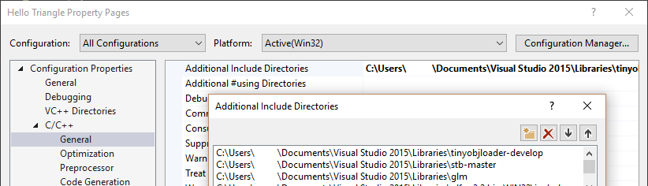

**Makefile**

将带有 `tiny_obj_loader.h` 的目录添加到 GCC 的包含目录中：

```text
VULKAN_SDK_PATH = /home/user/VulkanSDK/x.x.x.x/x86_64
STB_INCLUDE_PATH = /home/user/libraries/stb
TINYOBJ_INCLUDE_PATH = /home/user/libraries/tinyobjloader

...

CFLAGS = -std=c++17 -I$(VULKAN_SDK_PATH)/include -I$(STB_INCLUDE_PATH) -I$(TINYOBJ_INCLUDE_PATH)
```

## 网格样本

在本章中，我们还不会启用渲染光照，因此使用将光照烘焙到纹理中的示例模型会有所帮助。找到此类模型的一种简单方法是在 [Sketchfab](https://sketchfab.com/) 上查找 3D 扫描。该站点上的许多模型都以 OBJ 格式提供，并具有使用许可证。

对于本教程，我决定使用 [nigelgoh](https://sketchfab.com/nigelgoh) 的 [Viking room](https://sketchfab.com/3d-models/viking-room-a49f1b8e4f5c4ecf9e1fe7d81915ad38) 模型 （[CC BY 4.0]（https://web.archive.org/web/20200428202538/https://sketchfab.com/3d-models/viking-room-a49f1b8e4f5c4ecf9e1fe7d81915ad38））。 我调整了模型的大小和方向，将其用作当前几何图形的替代品：

* [viking_room.obj](https://vulkan-tutorial.com/resources/viking_room.obj)
* [viking_room.png](https://vulkan-tutorial.com/resources/viking_room.png)

随意使用您自己的模型，但请确保它仅由一种材料组成，并且尺寸约为 1.5 x 1.5 x 1.5 单位。 如果它大于该值，那么你将不得不改变视图矩阵。将模型文件放在 `shaders` 和 `textures` 旁边的新 `models` 目录中，并将纹理图像放在 `textures` 目录中。

在您的程序中添加两个新的配置变量来定义顶点模型和纹理路径：

```c++
const uint32_t WIDTH = 800;
const uint32_t HEIGHT = 600;

const std::string MODEL_PATH = "models/viking_room.obj";
const std::string TEXTURE_PATH = "textures/viking_room.png";
```

并更新 `createTextureImage` 函数以创建并使用此路径变量：

```c++
stbi_uc* pixels = stbi_load(TEXTURE_PATH.c_str(), &texWidth, &texHeight, &texChannels, STBI_rgb_alpha);
```

## 加载顶点与索引

我们现在要从模型文件中加载顶点和索引，所以你现在应该删除全局 `vertices` 和 `indices` 常量数组。 将它们替换为非常量的容器作为类成员：

```c++
std::vector<Vertex> vertices;
std::vector<uint32_t> indices;
VkBuffer vertexBuffer;
VkDeviceMemory vertexBufferMemory;
```

您应该将索引的类型从 `uint16_t` 更改为 `uint32_t`，因为将会有比 65535 多得多的顶点。请记住还要更改 `vkCmdBindIndexBuffer` 参数：

```c++
vkCmdBindIndexBuffer(commandBuffers[i], indexBuffer, 0, VK_INDEX_TYPE_UINT32);
```

tinyobjloader 库的包含方式与 STB 库相同。 包含 `tiny_obj_loader.h` 文件后，需要确保在一个源文件中定义 `TINYOBJLOADER_IMPLEMENTATION` 宏，以包含函数体并避免链接器错误：

```c++
#define TINYOBJLOADER_IMPLEMENTATION
#include <tiny_obj_loader.h>
```

我们现在要编写一个 `loadModel` 函数，该函数使用tinyobjloader库来读取文件中的顶点数据填充 `vertices` 和 `indices` 容器。它应该在创建顶点和索引缓冲区之前的某个地方调用：

```c++
void initVulkan() {
    ...
    loadModel();
    createVertexBuffer();
    createIndexBuffer();
    ...
}

...

void loadModel() {

}
```

通过调用 `tinyobj::LoadObj` 函数将模型加载到库的数据结构中：

```c++
void loadModel() {
    tinyobj::attrib_t attrib;
    std::vector<tinyobj::shape_t> shapes;
    std::vector<tinyobj::material_t> materials;
    std::string warn, err;

    if (!tinyobj::LoadObj(&attrib, &shapes, &materials, &warn, &err, MODEL_PATH.c_str())) {
        throw std::runtime_error(warn + err);
    }
}
```

OBJ 文件由位置、法线、纹理坐标和面组成。面由任意数量的顶点组成，其中每个顶点通过索引可引用获取位置、法线和纹理坐标信息。这使得使用索引不仅可以重用整个顶点，还可以重用单个属性。

`attrib` 容器在其 `attrib.vertices`、`attrib.normals` 和 `attrib.texcoords` 成员变量中依次保存了位置、法线和纹理坐标信息。`shapes` 容器包含所有单独的对象及其面。 每个面由一个顶点数组组成，每个顶点包含位置、法线和纹理坐标属性的索引。 OBJ 模型还可以为每个面定义材质和纹理，但我们将忽略这些。

`err` 字符串包含错误，而 `warn` 字符串包含加载文件时发生的警告，例如缺少材质定义。只有在 `LoadObj` 函数返回 `false` 时才真正加载失败。 如上所述，OBJ 文件中的面实际上可以包含任意数量的顶点，而我们的应用程序只能渲染三角形。 幸运的是，`LoadObj` 有一个可选参数来自动对这些面进行三角测量，默认情况下是启用的。

我们要将文件中的所有面组合成一个模型，因此只需遍历所有形状：

```c++
for (const auto& shape : shapes) {

}
```

三角绘制功能已经确保每个面有三个顶点，所以我们现在可以直接迭代顶点并将它们直接转储到我们的“顶点”向量中：

```c++
for (const auto& shape : shapes) {
    for (const auto& index : shape.mesh.indices) {
        Vertex vertex{};

        vertices.push_back(vertex);
        indices.push_back(indices.size());
    }
}
```

为简单起见，我们将假设每个顶点现在都是唯一的，因此使用简单的自动增量索引。`index` 变量是`tinyobj::index_t` 类型，它包含`vertex_index`、`normal_index` 和`texcoord_index` 成员。 我们需要使用这些索引在 `attrib` 数组中查找实际的顶点属性：

```c++
vertex.pos = {
    attrib.vertices[3 * index.vertex_index + 0],
    attrib.vertices[3 * index.vertex_index + 1],
    attrib.vertices[3 * index.vertex_index + 2]
};

vertex.texCoord = {
    attrib.texcoords[2 * index.texcoord_index + 0],
    attrib.texcoords[2 * index.texcoord_index + 1]
};

vertex.color = {1.0f, 1.0f, 1.0f};
```

不幸的是，`attrib.vertices` 数组是 `float` 值的数组，而不是 `glm::vec3` 之类的数组，因此您需要将索引乘以 `3`。同样，每个条目有两个纹理坐标分量。 `0`、`1` 和 `2` 的偏移量用于访问 X、Y 和 Z 分量，或者在纹理坐标的情况下访问 U 和 V 分量。

现在启用编译器优化的情况下运行您的程序（例如，Visual Studio 中的“发布”模式和 GCC 的“-O3”编译器标志）。开启编译优化是必要的，否则加载模型会很慢。您应该会看到如下内容：

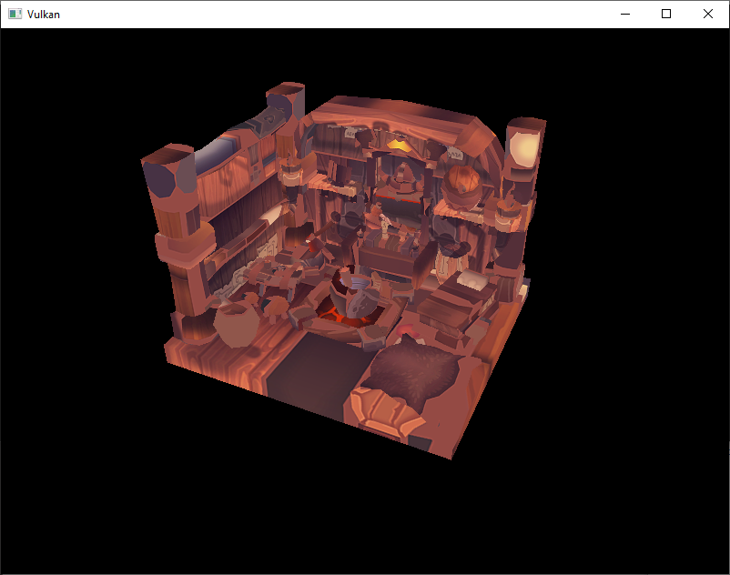

很好，几何模型看起来是正确的，但是纹理看上去有些异常。OBJ 格式假定一个坐标系，其中“0”的垂直坐标表示图像的底部，但是我们已经以从上到下的方向将图像上传到 Vulkan，其中“0”表示图像的顶部。可以通过以下代码翻转纹理坐标的垂直分量来解决这个问题：

```c++
vertex.texCoord = {
    attrib.texcoords[2 * index.texcoord_index + 0],
    1.0f - attrib.texcoords[2 * index.texcoord_index + 1]
};
```

当您再次运行程序时，您现在应该会看到正确的结果：

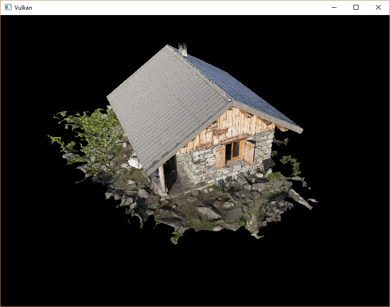

通过漫长的学习，至此终于完整呈现了3D模型的显示！

## 删除重复顶点数据

不幸的是，我们还没有真正利用索引缓冲区。 `vertices` 向量包含大量重复的顶点数据，因为许多顶点重复包含在多个三角形中。我们应该只保留唯一的顶点，并在它们出现时使用索引缓冲区来重用它们。 实现这一点的一种直接方法是使用 `map` 或 `unordered_map` 来跟踪唯一顶点和相应的索引：

```c++
#include <unordered_map>

...

std::unordered_map<Vertex, uint32_t> uniqueVertices{};

for (const auto& shape : shapes) {
    for (const auto& index : shape.mesh.indices) {
        Vertex vertex{};

        ...

        if (uniqueVertices.count(vertex) == 0) {
            uniqueVertices[vertex] = static_cast<uint32_t>(vertices.size());
            vertices.push_back(vertex);
        }

        indices.push_back(uniqueVertices[vertex]);
    }
}
```

每次我们从 OBJ 文件中读取一个顶点时，我们都会检查我们之前是否已经看到过具有完全相同位置和纹理坐标的顶点。如果没有，我们将其添加到 `vertices` 并将其索引存储在 `uniqueVertices` 容器中。之后，我们将新顶点的索引添加到 `indices` 中。如果我们之前见过完全相同的顶点，那么我们在 `uniqueVertices` 中查找它的索引并将该索引存储在 `indices` 中。

该程序现在将无法编译，因为使用像我们的 `Vertex` 结构这样的用户定义类型作为哈希表中的键需要我们实现两个函数：相等性测试和哈希计算。前者很容易通过覆盖 `Vertex` 结构中的 `==` 运算符来实现：

```c++
bool operator==(const Vertex& other) const {
    return pos == other.pos && color == other.color && texCoord == other.texCoord;
}
```

`Vertex` 的哈希函数是通过为`std::hash<T>` 指定模板特化来实现的。哈希函数是一个复杂的话题，但是 [cppreference.com 推荐](http://en.cppreference.com/w/cpp/utility/hash) 以下方法结合结构的字段来创建质量不错的哈希函数：

```c++
namespace std {
    template<> struct hash<Vertex> {
        size_t operator()(Vertex const& vertex) const {
            return ((hash<glm::vec3>()(vertex.pos) ^
                   (hash<glm::vec3>()(vertex.color) << 1)) >> 1) ^
                   (hash<glm::vec2>()(vertex.texCoord) << 1);
        }
    };
}
```

这段代码应该放在 `Vertex` 结构之外。 需要使用以下标头包含 GLM 类型的哈希函数：

```c++
#define GLM_ENABLE_EXPERIMENTAL
#include <glm/gtx/hash.hpp>
```

哈希函数在 `gtx` 文件夹中定义，这意味着它在技术上仍然是 GLM 的实验性扩展。 因此，您需要定义 `GLM_ENABLE_EXPERIMENTAL` 才能使用它。 这意味着 API 可能会随着未来 GLM 的新版本而改变，但实际上 API 非常稳定。

您现在应该能够成功编译和运行您的程序。 如果你检查 `vertices` 的大小，你会发现它已经从 1,500,000 缩小到 265,645！ 这意味着每个顶点在平均约 6 个三角形中被重用。 这无疑为我们节省了大量的 GPU 内存。

[C++ code](https://vulkan-tutorial.com/code/27_model_loading.cpp) /
[Vertex shader](https://vulkan-tutorial.com/code/26_shader_depth.vert) /
[Fragment shader](https://vulkan-tutorial.com/code/26_shader_depth.frag)


# 生成多层贴图

## 介绍
我们的程序现在可以加载和渲染 3D 模型。 在本章中，我们将添加另一个特性，mipmap(多层贴图)生成。 Mipmap 广泛用于游戏和渲染软件，Vulkan 让我们可以完全控制它们的创建方式。

Mipmap 是图像的缩小版本。 每层新图像的宽度和高度都是前一层图像的一半。 Mipmap 用作 *Level of Detail* 或 *LOD。* 远离相机的对象将从较小尺寸的 mip 图像中对其纹理进行采样。使用较小尺寸的图像可以提高渲染速度并避免 [Moiré patterns]（https://en.wikipedia.org/wiki/Moir%C3%A9_pattern）等伪影。 mipmap 的示例：


## 图像创建

在 Vulkan 中，每个 mip 图像存储在 `VkImage` 的不同 *mip 级别* 中。 Mip level 0 是原始图像，level 0 之后的 mip 层级通常称为*mip 链。*

创建 `VkImage` 时指定 mip 级别的数量。到目前为止，我们一直将此值设置为 1。我们需要根据图像的尺寸计算 mip 级别的数量。 首先，添加一个类成员来存储这个数字：

```c++
...
uint32_t mipLevels;
VkImage textureImage;
...
```

一旦我们在 `createTextureImage` 中加载了纹理，就可以计算 `mipLevels` 的值：

```c++
int texWidth, texHeight, texChannels;
stbi_uc* pixels = stbi_load(TEXTURE_PATH.c_str(), &texWidth, &texHeight, &texChannels, STBI_rgb_alpha);
...
mipLevels = static_cast<uint32_t>(std::floor(std::log2(std::max(texWidth, texHeight)))) + 1;

```

这将计算 mip 链中的级别数。 `max` 函数选择最大的尺寸分量。 `log2` 函数计算该维度可以除以 2 的次数。 `floor` 函数处理最大维度不是 2 的幂的情况。 添加 `1` 以使原始图像具有 mip 级别。

要使用此值，我们需要更改 `createImage`、`createImageView` 和 `transitionImageLayout` 函数以允许我们指定 mip 级别的数量。 在函数中添加一个 `mipLevels` 参数：

```c++
void createImage(uint32_t width, uint32_t height, uint32_t mipLevels, VkFormat format, VkImageTiling tiling, VkImageUsageFlags usage, VkMemoryPropertyFlags properties, VkImage& image, VkDeviceMemory& imageMemory) {
    ...
    imageInfo.mipLevels = mipLevels;
    ...
}
```
```c++
VkImageView createImageView(VkImage image, VkFormat format, VkImageAspectFlags aspectFlags, uint32_t mipLevels) {
    ...
    viewInfo.subresourceRange.levelCount = mipLevels;
    ...
```
```c++
void transitionImageLayout(VkImage image, VkFormat format, VkImageLayout oldLayout, VkImageLayout newLayout, uint32_t mipLevels) {
    ...
    barrier.subresourceRange.levelCount = mipLevels;
    ...
```

更新对这些函数的所有调用以使用正确的值：

```c++
createImage(swapChainExtent.width, swapChainExtent.height, 1, depthFormat, VK_IMAGE_TILING_OPTIMAL, VK_IMAGE_USAGE_DEPTH_STENCIL_ATTACHMENT_BIT, VK_MEMORY_PROPERTY_DEVICE_LOCAL_BIT, depthImage, depthImageMemory);
...
createImage(texWidth, texHeight, mipLevels, VK_FORMAT_R8G8B8A8_SRGB, VK_IMAGE_TILING_OPTIMAL, VK_IMAGE_USAGE_TRANSFER_DST_BIT | VK_IMAGE_USAGE_SAMPLED_BIT, VK_MEMORY_PROPERTY_DEVICE_LOCAL_BIT, textureImage, textureImageMemory);
```
```c++
swapChainImageViews[i] = createImageView(swapChainImages[i], swapChainImageFormat, VK_IMAGE_ASPECT_COLOR_BIT, 1);
...
depthImageView = createImageView(depthImage, depthFormat, VK_IMAGE_ASPECT_DEPTH_BIT, 1);
...
textureImageView = createImageView(textureImage, VK_FORMAT_R8G8B8A8_SRGB, VK_IMAGE_ASPECT_COLOR_BIT, mipLevels);
```
```c++
transitionImageLayout(depthImage, depthFormat, VK_IMAGE_LAYOUT_UNDEFINED, VK_IMAGE_LAYOUT_DEPTH_STENCIL_ATTACHMENT_OPTIMAL, 1);
...
transitionImageLayout(textureImage, VK_FORMAT_R8G8B8A8_SRGB, VK_IMAGE_LAYOUT_UNDEFINED, VK_IMAGE_LAYOUT_TRANSFER_DST_OPTIMAL, mipLevels);
```


## 生成多层贴图

我们的纹理图像现在有多个层次贴图，但暂存缓冲区只能用于填充 mip 级别 0。其他级别仍未定义。 为了填充这些级别，我们需要从我们拥有的单个级别生成数据。 我们将使用 `vkCmdBlitImage` 命令。此命令执行复制、缩放和过滤操作。我们将多次调用它来 *blit* 数据到我们的纹理图像的每个级别。

`vkCmdBlitImage` 被认为是传输操作，因此我们必须通知 Vulkan 我们打算将纹理图像用作传输的源和目标。 在 `createTextureImage` 中将 `VK_IMAGE_USAGE_TRANSFER_SRC_BIT` 添加到纹理图像的使用标志：

```c++
...
createImage(texWidth, texHeight, mipLevels, VK_FORMAT_R8G8B8A8_SRGB, VK_IMAGE_TILING_OPTIMAL, VK_IMAGE_USAGE_TRANSFER_SRC_BIT | VK_IMAGE_USAGE_TRANSFER_DST_BIT | VK_IMAGE_USAGE_SAMPLED_BIT, VK_MEMORY_PROPERTY_DEVICE_LOCAL_BIT, textureImage, textureImageMemory);
...
```

像其他图像操作一样，`vkCmdBlitImage` 操作执行结果依赖于它所操作的图像的布局。 我们可以将整个图像转换为“VK_IMAGE_LAYOUT_GENERAL”，但这很可能会很慢。 为获得最佳性能，源图像应位于“VK_IMAGE_LAYOUT_TRANSFER_SRC_OPTIMAL”中，目标图像应位于“VK_IMAGE_LAYOUT_TRANSFER_DST_OPTIMAL”中。 Vulkan 允许我们独立地转换图像的每个 mip 级别。 每个 blit 一次只能处理两个 mip 级别，因此我们可以将每个级别转换为 blits 命令之间的最佳布局。

`transitionImageLayout` 只对整个图像执行布局转换，因此我们需要修改管道屏障命令。在`createTextureImage` 中移除到 `VK_IMAGE_LAYOUT_SHADER_READ_ONLY_OPTIMAL` 的过渡转换：

```c++
...
transitionImageLayout(textureImage, VK_FORMAT_R8G8B8A8_SRGB, VK_IMAGE_LAYOUT_UNDEFINED, VK_IMAGE_LAYOUT_TRANSFER_DST_OPTIMAL, mipLevels);
    copyBufferToImage(stagingBuffer, textureImage, static_cast<uint32_t>(texWidth), static_cast<uint32_t>(texHeight));
//transitioned to VK_IMAGE_LAYOUT_SHADER_READ_ONLY_OPTIMAL while generating mipmaps
...
```

这会将纹理图像的每一层保留在 `VK_IMAGE_LAYOUT_TRANSFER_DST_OPTIMAL` 中。在从它读取的 blit 命令完成后，每个级别都将转换为 `VK_IMAGE_LAYOUT_SHADER_READ_ONLY_OPTIMAL`。

我们现在要编写生成 mipmap 的函数：

```c++
void generateMipmaps(VkImage image, int32_t texWidth, int32_t texHeight, uint32_t mipLevels) {
    VkCommandBuffer commandBuffer = beginSingleTimeCommands();

    VkImageMemoryBarrier barrier{};
    barrier.sType = VK_STRUCTURE_TYPE_IMAGE_MEMORY_BARRIER;
    barrier.image = image;
    barrier.srcQueueFamilyIndex = VK_QUEUE_FAMILY_IGNORED;
    barrier.dstQueueFamilyIndex = VK_QUEUE_FAMILY_IGNORED;
    barrier.subresourceRange.aspectMask = VK_IMAGE_ASPECT_COLOR_BIT;
    barrier.subresourceRange.baseArrayLayer = 0;
    barrier.subresourceRange.layerCount = 1;
    barrier.subresourceRange.levelCount = 1;

    endSingleTimeCommands(commandBuffer);
}
```

我们将进行几次转换，因此我们将重用这个 `VkImageMemoryBarrier`。对于所有障碍，上面设置的字段将保持不变。而`subresourceRange.miplevel`, `oldLayout`, `newLayout`, `srcAccessMask`, 和 `dstAccessMask` 字段将针对每层贴图转换进行更改。

```c++
int32_t mipWidth = texWidth;
int32_t mipHeight = texHeight;

for (uint32_t i = 1; i < mipLevels; i++) {

}
```

这个循环将记录每个 `VkCmdBlitImage` 命令。请注意，循环变量从 1 开始，而不是 0。

```c++
barrier.subresourceRange.baseMipLevel = i - 1;
barrier.oldLayout = VK_IMAGE_LAYOUT_TRANSFER_DST_OPTIMAL;
barrier.newLayout = VK_IMAGE_LAYOUT_TRANSFER_SRC_OPTIMAL;
barrier.srcAccessMask = VK_ACCESS_TRANSFER_WRITE_BIT;
barrier.dstAccessMask = VK_ACCESS_TRANSFER_READ_BIT;

vkCmdPipelineBarrier(commandBuffer,
    VK_PIPELINE_STAGE_TRANSFER_BIT, VK_PIPELINE_STAGE_TRANSFER_BIT, 0,
    0, nullptr,
    0, nullptr,
    1, &barrier);
```

首先，我们将级别“i - 1”转换为“VK_IMAGE_LAYOUT_TRANSFER_SRC_OPTIMAL”。 此转换将等待从上一个 blit 命令或从 `vkCmdCopyBufferToImage` 填充级别 `i - 1`。 当前的 blit 命令将等待此转换。

```c++
VkImageBlit blit{};
blit.srcOffsets[0] = { 0, 0, 0 };
blit.srcOffsets[1] = { mipWidth, mipHeight, 1 };
blit.srcSubresource.aspectMask = VK_IMAGE_ASPECT_COLOR_BIT;
blit.srcSubresource.mipLevel = i - 1;
blit.srcSubresource.baseArrayLayer = 0;
blit.srcSubresource.layerCount = 1;
blit.dstOffsets[0] = { 0, 0, 0 };
blit.dstOffsets[1] = { mipWidth > 1 ? mipWidth / 2 : 1, mipHeight > 1 ? mipHeight / 2 : 1, 1 };
blit.dstSubresource.aspectMask = VK_IMAGE_ASPECT_COLOR_BIT;
blit.dstSubresource.mipLevel = i;
blit.dstSubresource.baseArrayLayer = 0;
blit.dstSubresource.layerCount = 1;
```

接下来，我们指定将在 blit 操作中使用的区域。 源 mip(缩略图) 级别为"i - 1"，目标 mip 级别为"i"。`srcOffsets`数组的两个元素决定了数据将从哪个 3D 区域中传输。`dstOffsets`确定数据将被传输到的区域。`dstOffsets[1]`的 X 和 Y 维度除以 2，因为每个mip 级别是前一个级别的一半大小。`srcOffsets[1]`和`dstOffsets[1]`的 Z 维度必须为 1，因为 2D 图像的深度为 1。

```c++
vkCmdBlitImage(commandBuffer,
    image, VK_IMAGE_LAYOUT_TRANSFER_SRC_OPTIMAL,
    image, VK_IMAGE_LAYOUT_TRANSFER_DST_OPTIMAL,
    1, &blit,
    VK_FILTER_LINEAR);
```

现在，我们记录 blit 命令。 请注意，`textureImage`用于`srcImage`和`dstImage`参数。 这是因为我们在同一图像的不同级别之间进行了 blitting。源 mip 级别刚刚转换到`VK_IMAGE_LAYOUT_TRANSFER_SRC_OPTIMAL`并且目标级别仍在 `createTextureImage`中的`VK_IMAGE_LAYOUT_TRANSFER_DST_OPTIMAL`中。

请注意，如果您使用的是专用传输队列（如 [Vertex buffers](#staging-buffer) 中建议的那样）：必须将 `vkCmdBlitImage` 提交到具有图形功能的队列。

最后一个参数允许我们指定要在 blit 中使用的 `VkFilter`。 我们在这里有与制作 "VkSampler" 时相同的过滤选项。 我们使用 `VK_FILTER_LINEAR` 来进行插值。

```c++
barrier.oldLayout = VK_IMAGE_LAYOUT_TRANSFER_SRC_OPTIMAL;
barrier.newLayout = VK_IMAGE_LAYOUT_SHADER_READ_ONLY_OPTIMAL;
barrier.srcAccessMask = VK_ACCESS_TRANSFER_READ_BIT;
barrier.dstAccessMask = VK_ACCESS_SHADER_READ_BIT;

vkCmdPipelineBarrier(commandBuffer,
    VK_PIPELINE_STAGE_TRANSFER_BIT, VK_PIPELINE_STAGE_FRAGMENT_SHADER_BIT, 0,
    0, nullptr,
    0, nullptr,
    1, &barrier);
```

此屏障将 mip 级别“i - 1”转换为“VK_IMAGE_LAYOUT_SHADER_READ_ONLY_OPTIMAL”。 此转换等待当前 blit 命令完成。 所有采样操作都将等待此转换完成。

```c++
    ...
    if (mipWidth > 1) mipWidth /= 2;
    if (mipHeight > 1) mipHeight /= 2;
}
```

在循环结束时，我们将当前 mip 尺寸除以 2。 我们在划分之前检查每个维度，以确保该维度永远不会变为 0。这可以处理图像不是正方形的情况，因为其中一个 mip 维度会在另一个维度之前达到 1。 发生这种情况时，对于所有剩余级别，该维度应保持为 1。

```c++
    barrier.subresourceRange.baseMipLevel = mipLevels - 1;
    barrier.oldLayout = VK_IMAGE_LAYOUT_TRANSFER_DST_OPTIMAL;
    barrier.newLayout = VK_IMAGE_LAYOUT_SHADER_READ_ONLY_OPTIMAL;
    barrier.srcAccessMask = VK_ACCESS_TRANSFER_WRITE_BIT;
    barrier.dstAccessMask = VK_ACCESS_SHADER_READ_BIT;

    vkCmdPipelineBarrier(commandBuffer,
        VK_PIPELINE_STAGE_TRANSFER_BIT, VK_PIPELINE_STAGE_FRAGMENT_SHADER_BIT, 0,
        0, nullptr,
        0, nullptr,
        1, &barrier);

    endSingleTimeCommands(commandBuffer);
}
```

在结束命令缓冲区之前，我们再插入一个管道屏障。 此屏障将最后一个 mip 级别从 `VK_IMAGE_LAYOUT_TRANSFER_DST_OPTIMAL` 转换为 `VK_IMAGE_LAYOUT_SHADER_READ_ONLY_OPTIMAL`。 这不是由循环处理的，因为最后一个 mip 级别永远不会被删除。

最后，在 `createTextureImage` 中添加对 `generateMipmaps` 的调用：

```c++
transitionImageLayout(textureImage, VK_FORMAT_R8G8B8A8_SRGB, VK_IMAGE_LAYOUT_UNDEFINED, VK_IMAGE_LAYOUT_TRANSFER_DST_OPTIMAL, mipLevels);
    copyBufferToImage(stagingBuffer, textureImage, static_cast<uint32_t>(texWidth), static_cast<uint32_t>(texHeight));
//transitioned to VK_IMAGE_LAYOUT_SHADER_READ_ONLY_OPTIMAL while generating mipmaps
...
generateMipmaps(textureImage, texWidth, texHeight, mipLevels);
```

我们的纹理图像的多层贴图 (mipmap) 现在已完全填充。

## 线性过滤插值支持

使用像 `vkCmdBlitImage` 这样的内置函数来生成所有的 mip 级别非常方便，但不幸的是，它不能保证在所有平台上都支持。 它需要我们根据使用的纹理图像格式来确认线性过滤的支持性，可以通过 `vkGetPhysicalDeviceFormatProperties` 函数进行检查。 为此，我们将在 `generateMipmaps` 函数中添加一个检查。

首先添加一个指定图像格式的附加参数：

```c++
void createTextureImage() {
    ...

    generateMipmaps(textureImage, VK_FORMAT_R8G8B8A8_SRGB, texWidth, texHeight, mipLevels);
}

void generateMipmaps(VkImage image, VkFormat imageFormat, int32_t texWidth, int32_t texHeight, uint32_t mipLevels) {

    ...
}
```

在 `generateMipmaps` 函数中，使用 `vkGetPhysicalDeviceFormatProperties` 请求纹理图像格式的属性：

```c++
void generateMipmaps(VkImage image, VkFormat imageFormat, int32_t texWidth, int32_t texHeight, uint32_t mipLevels) {

    // Check if image format supports linear blitting
    VkFormatProperties formatProperties;
    vkGetPhysicalDeviceFormatProperties(physicalDevice, imageFormat, &formatProperties);

    ...
```

`VkFormatProperties` 结构具有三个字段，名为 `linearTilingFeatures`、`optimalTilingFeatures` 和 `bufferFeatures`，每个字段都描述了对应格式的相关使用方法。 我们创建了具有最佳平铺格式的纹理图像，因此我们需要检查 `optimalTilingFeatures`属性。 可以使用 `VK_FORMAT_FEATURE_SAMPLED_IMAGE_FILTER_LINEAR_BIT` 检查对线性过滤功能的支持：

```c++
if (!(formatProperties.optimalTilingFeatures & VK_FORMAT_FEATURE_SAMPLED_IMAGE_FILTER_LINEAR_BIT)) {
    throw std::runtime_error("texture image format does not support linear blitting!");
}
```

在这种情况下有两种选择。您可以实现一个函数来搜索常见的纹理图像格式，以寻找*确实*支持线性 blitting 的格式，或者您可以使用类似 [stb_image_resize](https://github.com/nothings/stb/) 之类的库在软件中实现 mipmap 生成 blob/master/stb_image_resize.h)。 然后可以以与加载原始图像相同的方式将每个 mip 级别加载到图像中。

应该注意的是，实际上在运行时生成多层贴图 mipmap 并不常见。 通常它们会预先生成并存储在基础级别旁边的纹理文件中，以提高加载速度。 在软件中实现大小调整和从文件加载多层贴图等操作，读者可参照之前章节自行练习。

## 采样

`VkImage` 保存 mipmap 数据，`VkSampler` 控制在渲染时如何读取该数据。 Vulkan 允许我们指定 `minLod`、`maxLod`、`mipLodBias` 和 `mipmapMode`（“Lod”表示“细节级别”）。 对纹理进行采样时，采样器根据以下伪代码选择 mip 级别：

```c++
lod = getLodLevelFromScreenSize(); //smaller when the object is close, may be negative
lod = clamp(lod + mipLodBias, minLod, maxLod);

level = clamp(floor(lod), 0, texture.mipLevels - 1);  //clamped to the number of mip levels in the texture

if (mipmapMode == VK_SAMPLER_MIPMAP_MODE_NEAREST) {
    color = sample(level);
} else {
    color = blend(sample(level), sample(level + 1));
}
```

如果 `samplerInfo.mipmapMode` 是 `VK_SAMPLER_MIPMAP_MODE_NEAREST`，则 `lod` 标记的多层贴图序号为最尺寸接近的贴图 (mip) 级别进行采样。 如果贴图映射(mipmap)模式为`VK_SAMPLER_MIPMAP_MODE_LINEAR`，`lod`用于选择目标尺寸最接近的两个mip级别进行采样。采样分别对两个级别进行采样，并将结果线性混合。

采样操作同样受到贴图标记序号变量`lod`的影响：

```c++
if (lod <= 0) {
    color = readTexture(uv, magFilter);
} else {
    color = readTexture(uv, minFilter);
}
```

如果物体靠近相机，则使用 `magFilter` 作为过滤器。 如果对象离相机较远，则使用`minFilter`。 通常，`lod` 是非负数，关闭相机时只有 0。 `mipLodBias` 让我们强制 Vulkan 使用比正常使用更低的 `lod` 和 `level`。

要查看本章的结果，我们需要为我们的 `textureSampler` 选择值。 我们已经将 `minFilter` 和 `magFilter` 设置为使用 `VK_FILTER_LINEAR`。 我们只需要为 `minLod`、`maxLod`、`mipLodBias` 和 `mipmapMode` 选择值。

```c++
void createTextureSampler() {
    ...
    samplerInfo.mipmapMode = VK_SAMPLER_MIPMAP_MODE_LINEAR;
    samplerInfo.minLod = 0.0f; // Optional
    samplerInfo.maxLod = static_cast<float>(mipLevels);
    samplerInfo.mipLodBias = 0.0f; // Optional
    ...
}
```

为了允许使用完整范围的 mip 级别，我们将 `minLod` 设置为 0.0f，将 `maxLod` 设置为 mip 级别的数量。 我们没有理由改变 `lod` 插值结果，所以我们将 `mipLodBias` 设置为 0.0f。

现在运行您的程序，您应该会看到以下内容：

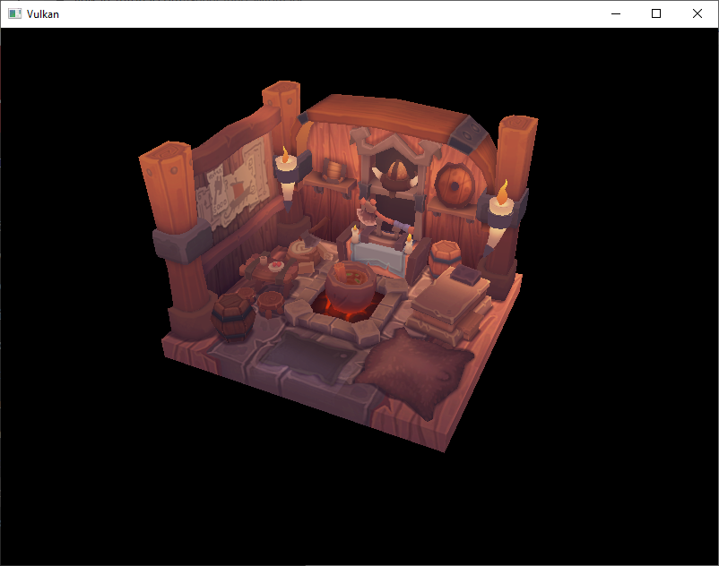

这看上去并没有太大的区别，因为我们的场景比较简单。但如果仔细观察，会察觉有细微的差别。

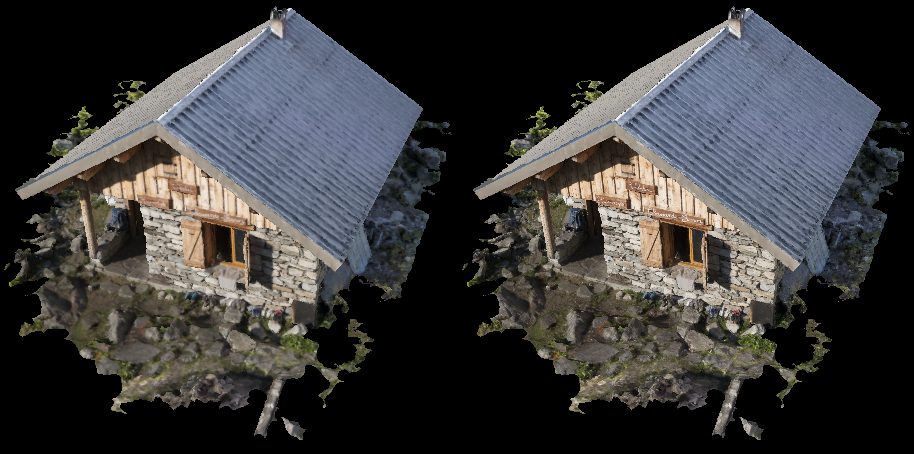

最明显的区别是论文上的文字。 使用 mipmaps，字体变得平滑。 如果没有 mipmap，文字会出现来自莫尔伪影导致的粗糙边缘和间隙。

您可以使用采样器设置来查看它们如何影响 mipmapping。 例如，通过更改 `minLod`，您可以强制采样器不使用最低 mip 级别：

```c++
samplerInfo.minLod = static_cast<float>(mipLevels / 2);
```

这些设置将生成此图像：


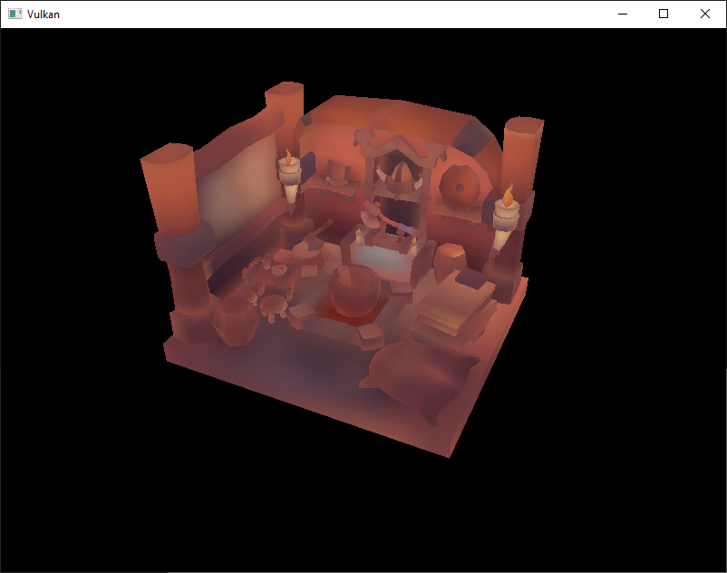

这就是当物体远离相机时将使用更高层次贴图 mip 级别的方式。


[C++ code](https://vulkan-tutorial.com/code/28_mipmapping.cpp) /
[Vertex shader](https://vulkan-tutorial.com/code/26_shader_depth.vert) /
[Fragment shader](https://vulkan-tutorial.com/code/26_shader_depth.frag)


# 多重采样

## 介绍

我们的程序现在可以加载纹理的多层次细节，当渲染结果远离观察者时能够修复物体的伪影。图像现在更加平滑，但仔细观察，您会发现沿绘制的几何形状边缘出现锯齿状的锯齿状图案。 当我们渲染一个四边形时，这在我们早期的一个程序中尤其明显：


这种不受欢迎的效果称为“锯齿”，它是可用于渲染的像素数量有限的结果。由于没有无限分辨率的显示器，因此在某种程度上它总是可见的。有很多方法可以解决这个问题，在本章中，我们将重点介绍一种常用的方法：[Multisample anti-aliasing](https://en.wikipedia.org/wiki/Multisample_anti-aliasing) (MSAA) .

在普通渲染中，像素颜色是基于单个采样点确定的，该采样点在大多数情况下是屏幕上目标像素的中心。 如果绘制的线的一部分穿过某个像素但没有覆盖采样点，则该像素将留空，从而导致锯齿状的“阶梯”效果。


MSAA 所做的是它使用每个像素的多个采样点（因此得名）来确定其最终颜色。 正如人们所预料的那样，更多的样本会带来更好的结果，但是它的计算成本也更高。

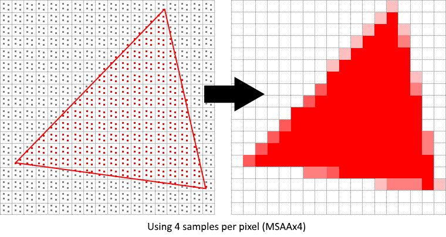

在我们的实现中，我们将专注于使用最大可用样本数。 根据您的应用，这可能并不总是最好的方法，如果最终结果满足您的质量要求，最好使用更少的样本以获得更高的性能。

## 获取可用采样样本数

让我们从确定我们的硬件可以使用多少样本开始。大多数现代 GPU 至少支持 8 个样本，但不能保证这个数字在所有地方都相同。我们将通过添加一个新的类成员来跟踪它：

```c++
...
VkSampleCountFlagBits msaaSamples = VK_SAMPLE_COUNT_1_BIT;
...
```

默认情况下，我们每个像素只使用一个样本，这相当于没有多重采样，在这种情况下，最终图像将保持不变。 可以从与我们选择的物理设备关联的“VkPhysicalDeviceProperties”中提取准确的最大样本数。 我们正在使用深度缓冲区，因此我们必须考虑颜色和深度的样本数。两者都支持的最高样本数将是我们可以支持的最大值。 添加一个将为我们获取此信息的函数：

```c++
VkSampleCountFlagBits getMaxUsableSampleCount() {
    VkPhysicalDeviceProperties physicalDeviceProperties;
    vkGetPhysicalDeviceProperties(physicalDevice, &physicalDeviceProperties);

    VkSampleCountFlags counts = physicalDeviceProperties.limits.framebufferColorSampleCounts & physicalDeviceProperties.limits.framebufferDepthSampleCounts;
    if (counts & VK_SAMPLE_COUNT_64_BIT) { return VK_SAMPLE_COUNT_64_BIT; }
    if (counts & VK_SAMPLE_COUNT_32_BIT) { return VK_SAMPLE_COUNT_32_BIT; }
    if (counts & VK_SAMPLE_COUNT_16_BIT) { return VK_SAMPLE_COUNT_16_BIT; }
    if (counts & VK_SAMPLE_COUNT_8_BIT) { return VK_SAMPLE_COUNT_8_BIT; }
    if (counts & VK_SAMPLE_COUNT_4_BIT) { return VK_SAMPLE_COUNT_4_BIT; }
    if (counts & VK_SAMPLE_COUNT_2_BIT) { return VK_SAMPLE_COUNT_2_BIT; }

    return VK_SAMPLE_COUNT_1_BIT;
}
```

我们现在将使用此函数在物理设备选择过程中设置“msaaSamples”变量。 为此，我们必须稍微修改 `pickPhysicalDevice` 函数：

```c++
void pickPhysicalDevice() {
    ...
    for (const auto& device : devices) {
        if (isDeviceSuitable(device)) {
            physicalDevice = device;
            msaaSamples = getMaxUsableSampleCount();
            break;
        }
    }
    ...
}
```

## 设置渲染目标

在 MSAA 中，每个像素都在屏幕外缓冲区中进行采样，然后将其渲染到屏幕上。 这里的缓冲区与我们渲染的常规图像略有不同——它们必须能够在每个像素中存储多个样本。创建多采样缓冲区后，必须将其解析为默认帧缓冲区（每个像素仅存储一个样本）。这就是为什么我们必须创建一个额外的渲染目标并修改我们当前的绘图过程。我们只需要一个渲染目标，因为一次只有一个绘图操作处于活动状态，就像深度缓冲区一样。添加以下类成员：

```c++
...
VkImage colorImage;
VkDeviceMemory colorImageMemory;
VkImageView colorImageView;
...
```

这个新图像必须存储每个像素所需的样本数量，因此我们需要在图像创建过程中将此数字传递给“VkImageCreateInfo”。 通过添加 `numSamples` 参数来修改 `createImage` 函数：

```c++
void createImage(uint32_t width, uint32_t height, uint32_t mipLevels, VkSampleCountFlagBits numSamples, VkFormat format, VkImageTiling tiling, VkImageUsageFlags usage, VkMemoryPropertyFlags properties, VkImage& image, VkDeviceMemory& imageMemory) {
    ...
    imageInfo.samples = numSamples;
    ...
```

现在，使用 `VK_SAMPLE_COUNT_1_BIT` 更新对这个函数的所有调用 - 随着我们的实施，我们将用适当的值替换它：

```c++
createImage(swapChainExtent.width, swapChainExtent.height, 1, VK_SAMPLE_COUNT_1_BIT, depthFormat, VK_IMAGE_TILING_OPTIMAL, VK_IMAGE_USAGE_DEPTH_STENCIL_ATTACHMENT_BIT, VK_MEMORY_PROPERTY_DEVICE_LOCAL_BIT, depthImage, depthImageMemory);
...
createImage(texWidth, texHeight, mipLevels, VK_SAMPLE_COUNT_1_BIT, VK_FORMAT_R8G8B8A8_SRGB, VK_IMAGE_TILING_OPTIMAL, VK_IMAGE_USAGE_TRANSFER_SRC_BIT | VK_IMAGE_USAGE_TRANSFER_DST_BIT | VK_IMAGE_USAGE_SAMPLED_BIT, VK_MEMORY_PROPERTY_DEVICE_LOCAL_BIT, textureImage, textureImageMemory);
```

我们现在将创建一个多重采样颜色缓冲区。添加一个`createColorResources`函数并注意我们在这里使用`msaaSamples`作为`createImage`的函数参数。我们也只使用了一个 mip 级别，因为这是由 Vulkan 规范强制执行的，以防每个像素具有多个样本的图像。 此外，此颜色缓冲区不需要 mipmap，因为它不会用作纹理：

```c++
void createColorResources() {
    VkFormat colorFormat = swapChainImageFormat;

    createImage(swapChainExtent.width, swapChainExtent.height, 1, msaaSamples, colorFormat, VK_IMAGE_TILING_OPTIMAL, VK_IMAGE_USAGE_TRANSIENT_ATTACHMENT_BIT | VK_IMAGE_USAGE_COLOR_ATTACHMENT_BIT, VK_MEMORY_PROPERTY_DEVICE_LOCAL_BIT, colorImage, colorImageMemory);
    colorImageView = createImageView(colorImage, colorFormat, VK_IMAGE_ASPECT_COLOR_BIT, 1);
}
```

为了保持一致性，请在 `createDepthResources` 之前调用该函数：

```c++
void initVulkan() {
    ...
    createColorResources();
    createDepthResources();
    ...
}
```

现在我们已经有了一个多重采样颜色缓冲区，是时候处理深度了。 修改 `createDepthResources` 并更新深度缓冲区使用的样本数：

```c++
void createDepthResources() {
    ...
    createImage(swapChainExtent.width, swapChainExtent.height, 1, msaaSamples, depthFormat, VK_IMAGE_TILING_OPTIMAL, VK_IMAGE_USAGE_DEPTH_STENCIL_ATTACHMENT_BIT, VK_MEMORY_PROPERTY_DEVICE_LOCAL_BIT, depthImage, depthImageMemory);
    ...
}
```

我们现在已经创建了几个新的 Vulkan 资源，所以我们不要忘记在必要时释放它们：

```c++
void cleanupSwapChain() {
    vkDestroyImageView(device, colorImageView, nullptr);
    vkDestroyImage(device, colorImage, nullptr);
    vkFreeMemory(device, colorImageMemory, nullptr);
    ...
}
```

更新 `recreateSwapChain` 以便在调整窗口大小时可以以正确的分辨率重新创建新的彩色图像：

```c++
void recreateSwapChain() {
    ...
    createGraphicsPipeline();
    createColorResources();
    createDepthResources();
    ...
}
```

我们已经完成了最初的 MSAA 设置，现在我们需要开始在我们的图形管道、帧缓冲区、渲染通道中使用这个新资源并查看结果！

## 添加新附件

让我们先处理渲染通道。 修改`createRenderPass`并更新颜色和深度附件创建信息结构：

```c++
void createRenderPass() {
    ...
    colorAttachment.samples = msaaSamples;
    colorAttachment.finalLayout = VK_IMAGE_LAYOUT_COLOR_ATTACHMENT_OPTIMAL;
    ...
    depthAttachment.samples = msaaSamples;
    ...
```

您会注意到我们已将 finalLayout 从 `VK_IMAGE_LAYOUT_PRESENT_SRC_KHR` 更改为 `VK_IMAGE_LAYOUT_COLOR_ATTACHMENT_OPTIMAL`。 那是因为多重采样的图像不能直接呈现。 我们首先需要将它们解析为常规图像。 此要求不适用于深度缓冲区，因为它不会在任何时候出现。 因此，我们只需要添加一个新的颜色附件，即所谓的解析附件：

```c++
    ...
    VkAttachmentDescription colorAttachmentResolve{};
    colorAttachmentResolve.format = swapChainImageFormat;
    colorAttachmentResolve.samples = VK_SAMPLE_COUNT_1_BIT;
    colorAttachmentResolve.loadOp = VK_ATTACHMENT_LOAD_OP_DONT_CARE;
    colorAttachmentResolve.storeOp = VK_ATTACHMENT_STORE_OP_STORE;
    colorAttachmentResolve.stencilLoadOp = VK_ATTACHMENT_LOAD_OP_DONT_CARE;
    colorAttachmentResolve.stencilStoreOp = VK_ATTACHMENT_STORE_OP_DONT_CARE;
    colorAttachmentResolve.initialLayout = VK_IMAGE_LAYOUT_UNDEFINED;
    colorAttachmentResolve.finalLayout = VK_IMAGE_LAYOUT_PRESENT_SRC_KHR;
    ...
```

现在必须指示渲染通道将多采样彩色图像解析为常规附件。 创建一个新的附件引用，它将指向将用作解析目标的颜色缓冲区：

```c++
    ...
    VkAttachmentReference colorAttachmentResolveRef{};
    colorAttachmentResolveRef.attachment = 2;
    colorAttachmentResolveRef.layout = VK_IMAGE_LAYOUT_COLOR_ATTACHMENT_OPTIMAL;
    ...
```

将 `pResolveAttachments` 子通道结构成员设置为指向新创建的附件引用。 这足以让渲染过程定义一个多样本解析操作，让我们将图像渲染到屏幕：

```
    ...
    subpass.pResolveAttachments = &colorAttachmentResolveRef;
    ...
```

现在使用新的颜色附件更新渲染通道信息结构：

```c++
    ...
    std::array<VkAttachmentDescription, 3> attachments = {colorAttachment, depthAttachment, colorAttachmentResolve};
    ...
```

修改渲染通道，修改 `createFramebuffers` 并将新的图像视图添加到列表中：

```c++
void createFramebuffers() {
        ...
        std::array<VkImageView, 3> attachments = {
            colorImageView,
            depthImageView,
            swapChainImageViews[i]
        };
        ...
}
```

最后，通过修改`createGraphicsPipeline`告诉新创建的管道使用多个样本：

```c++
void createGraphicsPipeline() {
    ...
    multisampling.rasterizationSamples = msaaSamples;
    ...
}
```

现在运行您的程序，您应该会看到以下内容：

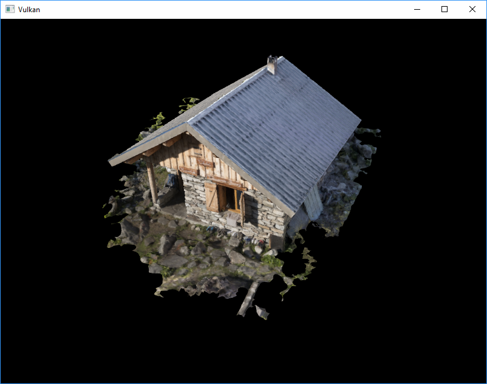

就像 mipmapping 一样，差异可能不会立即显现出来。 仔细观察，您会发现边缘不再像锯齿状，而且与原始图像相比，整个图像看起来更平滑一些。

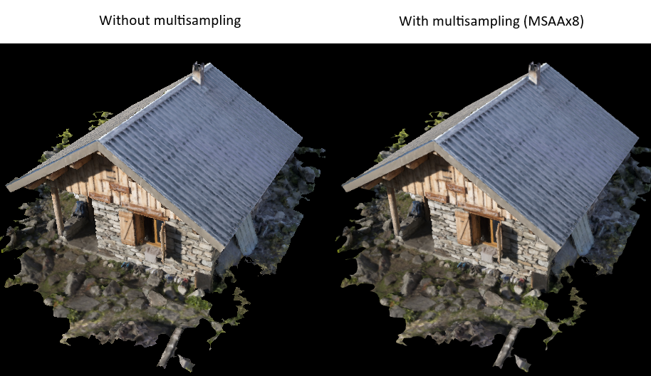

当近距离观察其中一个边缘时，差异会更加明显：

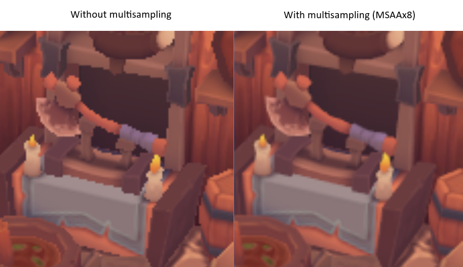

## 质量改进

我们当前的 MSAA 实现存在某些限制，这可能会影响更详细场景中输出图像的质量。 例如，我们目前没有解决由渲染器锯齿引起的潜在问题，即 MSAA 仅平滑几何体的边缘而不平滑内部填充。 这可能会导致您在屏幕上渲染一个平滑的多边形，但如果应用的纹理包含高对比度的颜色，它仍然看起来有锯齿。 解决此问题的一种方法是启用 [采样渲染(Sample Shading)](https://www.khronos.org/registry/vulkan/specs/1.3-extensions/html/chap27.html#primsrast-sampleshading)，这将提高图像质量更进一步，虽然需要额外的性能成本：

```c++

void createLogicalDevice() {
    ...
    deviceFeatures.sampleRateShading = VK_TRUE; // enable sample shading feature for the device
    ...
}

void createGraphicsPipeline() {
    ...
    multisampling.sampleShadingEnable = VK_TRUE; // enable sample shading in the pipeline
    multisampling.minSampleShading = .2f; // min fraction for sample shading; closer to one is smoother
    ...
}
```

在此示例中，我们将禁用采样渲染，但在某些情况下，质量改进可能会很明显：


## 结论

目前我们已经解释了很多概念，现在您终于为 Vulkan 程序奠定了良好的基础。 您现在掌握的 Vulkan 基本原理知识应该足以开始探索更多功能，例如：

* 设置常量
* 实例化渲染
* 动态属性
* 分离图像和采样器描述符
* 管道缓存
* 多线程命令缓冲区生成
* 多个子通道
* 计算渲染器

当前程序可以通过多种方式进行扩展，例如添加 Blinn-Phong 光照、后处理效果和阴影贴图。 您应该能够从其他GPU API 的教程中了解这些效果如何工作，虽然 Vulkan 的使用很明确，但许多概念仍然适用。

[C++ code](https://vulkan-tutorial.com/code/29_multisampling.cpp) /
[Vertex shader](https://vulkan-tutorial.com/code/26_shader_depth.vert) /
[Fragment shader](https://vulkan-tutorial.com/code/26_shader_depth.frag)


# 常见问题

此页面列出了您在开发 Vulkan 应用程序时可能遇到的常见问题的解决方案。

* **我在核心验证层遇到访问冲突错误**：
确保 MSI Afterburner / RivaTuner Statistics Server 没有运行，因为它与 Vulkan 存在一些兼容性问题。

* **我没有看到来自验证层的任何消息/验证层不可用**：
首先通过在程序退出后保持终端打开来确保验证层有机会打印错误。您可以从 Visual Studio 执行此操作，方法是运行您的使用 Ctrl-F5 而不是按 F5 运行程序，在 Linux 上通过从终端窗口执行程序。如果仍然没有消息并且您确定验证层已打开，那么您应该按照“验证安装”说明 [on this page] https://vulkan.lunarg.com/doc/view/1.2.135.0/windows/getting_started.html）确保您的 Vulkan SDK 已正确安装。还要确保您的 SDK 版本至少为 1.1.106.0 以支持 `VK_LAYER_KHRONOS_validation` 层。

* **vkCreateSwapchainKHR 在 SteamOverlayVulkanLayer64.dll 中触发错误**：
这似乎是 Steam 客户端测试版中的兼容性问题。有几种可能的解决方法：
     * 退出 Steam 测试计划。
     * 将 `DISABLE_VK_LAYER_VALVE_steam_overlay_1` 环境变量设置为 `1`
     * 删除注册表中"HKEY_LOCAL_MACHINE\\SOFTWARE\\Khronos\\Vulkan\\ImplicitLayers"下的 Steam 覆盖 Vulkan 层条目

例子：


# 隐私政策

## 一般性

本隐私政策适用于您在使用 vulkan-tutorial.com 或其任何子域时收集的信息。它描述了本网站的所有者 Alexander Overvoorde 如何收集、使用和共享有关您的信息。

## 分析

本网站使用以前称为 Piwik 的自托管实例 Matomo ([https://matomo.org/](https://matomo.org/)) 收集有关访问者的数据信息。它记录您访问的页面、您使用的设备和浏览器类型、查看给定页面的时间以及您来自哪里。 通过仅记录您的 IP 地址的前两个字节（例如“123.123.xxx.xxx”）来匿名化此信息。这些匿名日志会无限期地存储。

这些分析用于跟踪网站上的内容是如何被阅读的、一般有多少人访问该网站以及哪些其他网站链接到这里。 这样可以更轻松地与社区互动并确定应该改进网站的哪些区域，例如是否应该花费额外的时间来促进移动阅读。

此数据不与第三方共享。

## 广告

本网站使用第三方广告服务器，该服务器可能使用 cookie 来跟踪网站上的活动，以衡量广告的参与度。

## 注释

每章末尾都有一个评论部分，由第三方 Disqus 服务提供。 该服务收集身份数据以方便评论的阅读和提交，并汇总使用信息以改进其服务。

此第三方服务的完整隐私政策可查阅 [https://help.disqus.com/terms-and-policies/disqus-privacy-policy](https://help.disqus.com/terms-and-policies/disqus-privacy-policy）。

